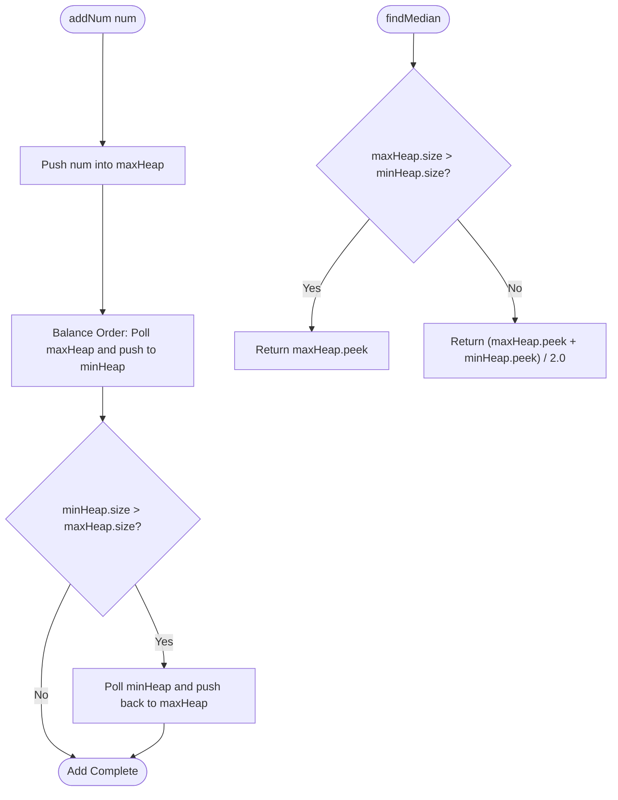

# 03. The Two-Heap Architecture & Real-Time Streaming Systems

[← Back to Top-K Paradigms](./02-top-k-and-selection-paradigms.md) | [Track Hub](./README.md) | [Next: K-Way Merge & Intervals →](./04-k-way-merge-and-interval-scheduling.md)

---

## 1. Problem 1: Find Median from Data Stream (The Two-Heap Pattern)

### 1.1 Problem Statement & Constraints

The **median** is the middle value in an ordered integer list. If the size of the list is even, there is no middle value, and the median is the mean of the two middle values.

Design a data structure that supports the following two operations:
- `void addNum(int num)`: Add an integer `num` from the data stream.
- `double findMedian()`: Return the median of all elements so far.

```
Example:
MedianFinder medianFinder = new MedianFinder();
medianFinder.addNum(1);    // arr = [1]
medianFinder.addNum(2);    // arr = [1, 2]
medianFinder.findMedian(); // return 1.5
medianFinder.addNum(3);    // arr = [1, 2, 3]
medianFinder.findMedian(); // return 2.0
```

#### Constraints:
- $-10^5 \le \text{num} \le 10^5$.
- There will be up to $5 \times 10^4$ calls to `addNum` and `findMedian`.

---

### 1.2 Thought Process & Intuition

```
  Naive Approach 1: Insert into List + Arrays.sort()
  Every addNum takes O(1). Every findMedian takes O(N log N).
  Total for N calls: O(N^2 log N) -> TLE!
                         ↓
  Naive Approach 2: Binary Search Insertion (List.add(idx, num))
  Finding position takes O(log N). Shifting array elements takes O(N).
  Total for N calls: O(N^2) -> TLE!
                         ↓
  The "Aha!" Insight: The Two-Heap Architecture
  Partition the active number stream into TWO EQUAL HALVES:
  1. Max-Heap (stores smaller 50% of numbers).
  2. Min-Heap (stores larger 50% of numbers).

               Max-Heap (Lower 50%)       Min-Heap (Upper 50%)
               [ 1, 2, 3, 4, 5 ]    <=    [ 6, 7, 8, 9, 10 ]
                      ▲                         ▲
                  maxHeap.peek()            minHeap.peek()
                       (5)                       (6)

  • Max-Heap root is the MAXIMUM of the smaller half.
  • Min-Heap root is the MINIMUM of the larger half.
  • If sizes are equal: median = (maxHeap.peek() + minHeap.peek()) / 2.0!
  • If odd count: median = maxHeap.peek()!
  Time: O(log N) addNum, O(1) findMedian!
```

---

### 1.3 Mathematical Invariants of the Two-Heap Pattern

```
╭───────────────────────────────────────────────────────────────────────────────────────────╮
│                                THE TWO-HEAP INVARIANTS                                    │
├───────────────────────────────────────────────────────────────────────────────────────────┤
│ 1. Size Balancing Invariant:                                                              │
│    • Either: maxHeap.size() == minHeap.size() (Even total elements)                       │
│    • Or:     maxHeap.size() == minHeap.size() + 1 (Odd total elements, maxHeap has extra) │
│                                                                                           │
│ 2. Order Boundary Invariant:                                                              │
│    • Every element in maxHeap <= Every element in minHeap.                                │
│    • In particular: maxHeap.peek() <= minHeap.peek().                                     │
╰───────────────────────────────────────────────────────────────────────────────────────────╯
```

---

### 1.4 Procedural Blueprint (How to Proceed)



---

### 1.5 Production Java 17/21 Implementation

```java
package com.structures.heaps;

import java.util.Collections;
import java.util.PriorityQueue;

/**
 * Real-time streaming median calculator backed by balanced dual priority queues.
 * Supports O(log N) insertion and O(1) median retrieval.
 */
public final class MedianFinder {

    // maxHeap stores the smaller half of the numbers
    private final PriorityQueue<Integer> maxHeap;
    // minHeap stores the larger half of the numbers
    private final PriorityQueue<Integer> minHeap;

    public MedianFinder() {
        this.maxHeap = new PriorityQueue<>(Collections.reverseOrder());
        this.minHeap = new PriorityQueue<>();
    }

    /**
     * Inserts an incoming number into the stream in O(log N) time.
     */
    public void addNum(int num) {
        // Step 1: Always route through maxHeap first
        maxHeap.offer(num);

        // Step 2: Ensure order invariant: maxHeap.peek() <= minHeap.peek()
        minHeap.offer(maxHeap.poll());

        // Step 3: Maintain size invariant: maxHeap size is either equal or 1 greater
        if (minHeap.size() > maxHeap.size()) {
            maxHeap.offer(minHeap.poll());
        }
    }

    /**
     * Returns the current median in O(1) time.
     */
    public double findMedian() {
        if (maxHeap.isEmpty()) {
            throw new IllegalStateException("Stream is empty");
        }

        if (maxHeap.size() > minHeap.size()) {
            return maxHeap.peek();
        } else {
            return ((long) maxHeap.peek() + minHeap.peek()) / 2.0;
        }
    }
}
```

---

## 2. Problem 2: Sliding Window Median (Two Heaps with Lazy Deletion)

### 2.1 Problem Statement & Constraints

The median is the middle value in an ordered integer list. If the size of the list is even, there is no middle value. So the median is the mean of the two middle values.

You are given an integer array `nums` and an integer `k`. There is a sliding window of size `k` which is moving from the very left of the array to the very right. You can only see the `k` numbers in the window. Each time the sliding window moves right by one position, return the median array for each window in the original array.

```
Input: nums = [1,3,-1,-3,5,3,6,7], k = 3
Output: [1.00000,-1.00000,-1.00000,3.00000,5.00000,6.00000]
```

#### Constraints:
- $1 \le k \le \text{nums.length} \le 10^5$.
- $-2^{31} \le \text{nums}[i] \le 2^{31} - 1$.

---

### 2.2 The Bottleneck of Standard Heaps: $\mathcal{O}(K)$ Removals

In standard sliding window median implementations, as the window slides, the outgoing element `nums[i - k]` must be removed from whichever heap contains it.
- Calling `priorityQueue.remove(outgoingVal)` performs an $\mathcal{O}(K)$ linear array search.
- For $N = 10^5$ and $K = 5 \times 10^4$, total operations:
  $$\mathcal{O}(N \cdot K) = 10^5 \times 50,000 \approx 5 \times 10^9 \gg 10^8 \implies \text{Massive TLE!}$$

---

### 2.3 The "Aha!" Insight: Lazy Deletion with Hash Map

```
  "Aha!" Insight:
  DO NOT remove elements immediately from the inside of the heap!
  Instead, record delayed removals in a Hash Map: Map<Integer, Integer> delayedRemoval!
  Track "virtual" active sizes: maxHeapSize and minHeapSize.
  Only physically poll elements from heap tops when heap.peek() has a pending removal in the map!
  
  Each number is inserted once and physically polled at most once:
  Total Runtime: Strictly O(N log K) time! Fits effortlessly in < 150ms!
```

---

### 2.4 Production Java 17/21 Implementation

```java
package com.structures.heaps;

import java.util.Collections;
import java.util.HashMap;
import java.util.Map;
import java.util.PriorityQueue;

/**
 * High-performance Sliding Window Median solver utilizing dual heaps
 * with Lazy Deletion to achieve strictly O(N log K) time.
 */
public final class SlidingWindowMedian {

    private final PriorityQueue<Integer> maxHeap = new PriorityQueue<>(Collections.reverseOrder());
    private final PriorityQueue<Integer> minHeap = new PriorityQueue<>();
    private final Map<Integer, Integer> delayed = new HashMap<>();

    private int maxHeapSize = 0;
    private int minHeapSize = 0;

    public double[] medianSlidingWindow(int[] nums, int k) {
        if (nums == null || nums.length == 0 || k <= 0) {
            return new double[0];
        }

        double[] result = new double[nums.length - k + 1];

        // 1. Initialize first window
        for (int i = 0; i < k; i++) {
            addNum(nums[i]);
        }
        result[0] = getMedian(k);

        // 2. Slide window across remaining array
        for (int i = k; i < nums.length; i++) {
            int outgoing = nums[i - k];
            int incoming = nums[i];

            // Mark outgoing for lazy removal
            removeNum(outgoing);

            // Add incoming
            addNum(incoming);

            result[i - k + 1] = getMedian(k);
        }

        return result;
    }

    private void addNum(int num) {
        if (maxHeap.isEmpty() || num <= maxHeap.peek()) {
            maxHeap.offer(num);
            maxHeapSize++;
        } else {
            minHeap.offer(num);
            minHeapSize++;
        }
        rebalance();
    }

    private void removeNum(int num) {
        delayed.merge(num, 1, Integer::sum);

        if (num <= maxHeap.peek()) {
            maxHeapSize--;
            if (num == maxHeap.peek()) {
                prune(maxHeap);
            }
        } else {
            minHeapSize--;
            if (!minHeap.isEmpty() && num == minHeap.peek()) {
                prune(minHeap);
            }
        }
        rebalance();
    }

    private void rebalance() {
        // Maintain: maxHeapSize == minHeapSize OR maxHeapSize == minHeapSize + 1
        if (maxHeapSize > minHeapSize + 1) {
            minHeap.offer(maxHeap.poll());
            maxHeapSize--;
            minHeapSize++;
            prune(maxHeap);
        } else if (maxHeapSize < minHeapSize) {
            maxHeap.offer(minHeap.poll());
            maxHeapSize++;
            minHeapSize--;
            prune(minHeap);
        }
    }

    private void prune(PriorityQueue<Integer> heap) {
        while (!heap.isEmpty() && delayed.containsKey(heap.peek())) {
            int top = heap.peek();
            int count = delayed.get(top);
            if (count == 1) {
                delayed.remove(top);
            } else {
                delayed.put(top, count - 1);
            }
            heap.poll();
        }
    }

    private double getMedian(int k) {
        if ((k & 1) == 1) {
            return (double) maxHeap.peek();
        } else {
            return ((double) maxHeap.peek() + (double) minHeap.peek()) / 2.0;
        }
    }
}
```

---

## 3. Problem 3: IPO (Two-Heap Greedy Project Selection)

### 3.1 Problem Statement & Constraints

Suppose an organization has an initial capital `w` and wants to maximize its capital by selecting at most `k` distinct projects from `n` available projects.

You are given integers `k` and `w`, an integer array `profits` where $\text{profits}[i]$ is the net profit of the $i^{\text{th}}$ project, and an integer array `capital` where $\text{capital}[i]$ is the minimum capital needed to start the $i^{\text{th}}$ project.

Initially, you have `w` capital. When you finish a project, you obtain its pure profit and the profit will be added to your total capital.

Pick a list of at most `k` distinct projects to maximize your final capital.

```
Input: k = 2, w = 0, profits = [1,2,3], capital = [0,1,1]
Output: 4
Explanation: Since your initial capital is 0, you can only start project 0.
After finishing it, capital becomes 0 + 1 = 1.
With capital 1, you can start either project 1 or project 2.
Choose project 2 (profit 3) to maximize capital to 1 + 3 = 4.
```

#### Constraints:
- $1 \le k \le 10^5$.
- $0 \le w \le 10^9$.
- $n == \text{profits.length} == \text{capital.length}$.
- $1 \le n \le 10^5$.
- $0 \le \text{profits}[i] \le 10^4$.
- $0 \le \text{capital}[i] \le 10^9$.

---

### 3.2 Thought Process: Two-Heap Greedy Sequencing

```
  At any step with capital W:
  1. Which projects CAN we afford?
     All projects where capital[i] <= W.
  2. Among all affordable projects, which one SHOULD we pick?
     Greedy Choice: The project with the MAXIMUM PROFIT!
                         ↓
  Two-Heap Architectural Coordination:
  • Min-Heap (Sorted by Capital): Stores all projects not yet affordable.
  • Max-Heap (Sorted by Profit):  Stores all currently affordable projects.

  Loop K times:
  Step 1: While minCapitalHeap.peek().capital <= W:
          Move project to maxProfitHeap!
  Step 2: If maxProfitHeap is empty -> Cannot afford any more projects! Terminate early!
  Step 3: W += maxProfitHeap.poll().profit!
  
  Total Complexity: O(N log N) time, O(N) space!
```

---

### 3.3 Production Java 17/21 Implementation

```java
package com.structures.heaps;

import java.util.Arrays;
import java.util.Collections;
import java.util.PriorityQueue;

/**
 * Solves the IPO project capital maximization problem using dual priority queues.
 */
public final class IpoProjectSelector {

    private record Project(int capital, int profit) {}

    public int findMaximizedCapital(int k, int w, int[] profits, int[] capital) {
        int n = profits.length;
        Project[] projects = new Project[n];
        for (int i = 0; i < n; i++) {
            projects[i] = new Project(capital[i], profits[i]);
        }

        // Sort projects primarily by capital requirement: O(N log N)
        Arrays.sort(projects, (a, b) -> Integer.compare(a.capital, b.capital));

        // Max-Heap to hold profits of all projects we can currently afford
        PriorityQueue<Integer> maxProfitHeap = new PriorityQueue<>(Collections.reverseOrder());

        int projectIdx = 0;

        // Perform at most K project investments
        for (int round = 0; round < k; round++) {
            // Unlock all projects whose capital requirements are satisfied by current capital w
            while (projectIdx < n && projects[projectIdx].capital <= w) {
                maxProfitHeap.offer(projects[projectIdx].profit);
                projectIdx++;
            }

            // If no projects are affordable, we cannot grow capital further
            if (maxProfitHeap.isEmpty()) {
                break;
            }

            // Greedily invest in the project yielding maximum profit
            w += maxProfitHeap.poll();
        }

        return w;
    }
}
```

---

<table width="100%">
  <tr>
    <td width="33%" align="left">
      <a href="./02-top-k-and-selection-paradigms.md">
        <strong>← Previous Module</strong><br>
        02. Top-K & Selection Paradigms
      </a>
    </td>
    <td width="33%" align="center">
      <a href="./README.md">
        <strong>Track Hub</strong><br>
        Heaps & Greedy Track Hub
      </a>
    </td>
    <td width="33%" align="right">
      <a href="./04-k-way-merge-and-interval-scheduling.md">
        <strong>Next Module →</strong><br>
        04. K-Way Merge & Interval Scheduling
      </a>
    </td>
  </tr>
</table>
