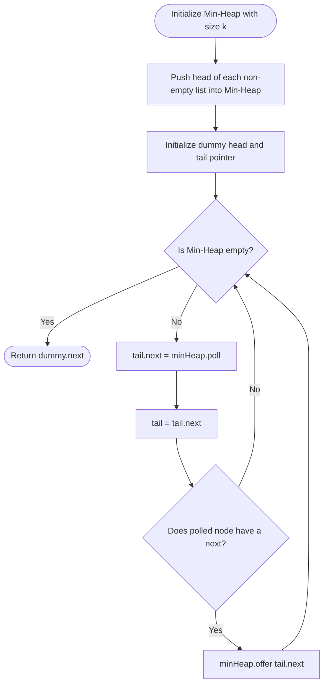

# 04. K-Way Merge & Interval Scheduling Architectures

[← Back to Two-Heap Architecture](./03-the-two-heap-architecture-and-streaming.md) | [Track Hub](./README.md) | [Next: Greedy Choice & Exchange →](./05-greedy-choice-and-exchange-arguments.md)

---

## 1. Problem 1: Merge K Sorted Lists (Multi-Way Stream Merging)

### 1.1 Problem Statement & Constraints

You are given an array of `k` linked-lists `lists`, each linked-list is sorted in ascending order.

*Merge all the linked-lists into one sorted linked-list and return it.*

```
Example:
Input: lists = [[1,4,5],[1,3,4],[2,6]]
Output: [1,1,2,3,4,4,5,6]
Explanation: The linked-lists are:
[
  1->4->5,
  1->3->4,
  2->6
]
merging them into one sorted list:
1->1->2->3->4->4->5->6
```

#### Constraints:
- $k == \text{lists.length}$.
- $0 \le k \le 10^4$.
- $0 \le \text{lists}[i]\text{.length} \le 500$.
- $-10^4 \le \text{lists}[i][j] \le 10^4$.
- `lists[i]` is sorted in ascending order.
- The sum of `lists[i].length` will not exceed $2 \times 10^4$.

---

### 1.2 Thought Process & Intuition

```
  Naive Approach: Flatten & Sort
  Add all N elements to an array and call Arrays.sort().
  Time: O(N log N), Space: O(N) auxiliary memory.
  Bottleneck: Completely discards the fact that each of the K lists is ALREADY SORTED!
                         ↓
  The "Aha!" Insight: K-Way Min-Heap Merge
  At any point in time, the globally smallest remaining element MUST be one of the HEADS of the K lists!
  
  Initialize a Min-Heap of capacity K containing the head of each non-empty list.
  Loop until heap is empty:
  1. Poll the minimum node from the heap (O(log K) operations).
  2. Append it to our merged list.
  3. If that polled node has a next pointer, push node.next into the heap!
  
  Total Nodes Processed: N.
  Heap Size: At most K at all times!
  Time: O(N log K), Space: O(K) heap memory!
```

---

### 1.3 Procedural Blueprint (How to Proceed)



---

### 1.4 Production Java 17/21 Implementation

```java
package com.structures.heaps;

import java.util.Comparator;
import java.util.PriorityQueue;

/**
 * Solves Merge K Sorted Lists using a K-way Min-Heap in O(N log K) time.
 */
public final class MergeKSortedLists {

    public static final class ListNode {
        public int val;
        public ListNode next;

        public ListNode(int val) {
            this.val = val;
        }
    }

    public ListNode mergeKLists(ListNode[] lists) {
        if (lists == null || lists.length == 0) {
            return null;
        }

        // Min-Heap bounded by K elements, comparing node values
        PriorityQueue<ListNode> minHeap = new PriorityQueue<>(
            lists.length,
            Comparator.comparingInt(node -> node.val)
        );

        // 1. Enqueue the head of each non-empty linked list
        for (ListNode head : lists) {
            if (head != null) {
                minHeap.offer(head);
            }
        }

        ListNode dummy = new ListNode(0);
        ListNode current = dummy;

        // 2. Continually extract the minimum head and advance its list
        while (!minHeap.isEmpty()) {
            ListNode smallestNode = minHeap.poll();
            current.next = smallestNode;
            current = current.next;

            if (smallestNode.next != null) {
                minHeap.offer(smallestNode.next);
            }
        }

        return dummy.next;
    }
}
```

---

## 2. Problem 2: Smallest Range Covering Elements from K Lists (Hard)

### 2.1 Problem Statement & Constraints

You have `k` lists of sorted integers in non-decreasing order. Find the **smallest range** that includes at least one number from each of the `k` lists.

We define the range $[a, b]$ is smaller than range $[c, d]$ if $b - a < d - c$, or $a < c$ if $b - a == d - c$.

```
Input: nums = [[4,10,15,24,26],[0,9,12,20],[5,18,22,30]]
Output: [20,24]
Explanation: 
List 1: [4, 10, 15, 24, 26], 24 is in range [20,24].
List 2: [0, 9, 12, 20], 20 is in range [20,24].
List 3: [5, 18, 22, 30], 22 is in range [20,24].
```

#### Constraints:
- `nums.length == k`.
- $1 \le k \le 3500$.
- $1 \le \text{nums}[i]\text{.length} \le 50$.
- $-10^5 \le \text{nums}[i][j] \le 10^5$.
- `nums[i]` is sorted in **non-decreasing** order.

---

### 2.2 Thought Process: The Min-Heap with Running Maximum

```
  What defines a valid range covering all K lists?
  If we hold one element from each of the K lists simultaneously:
  Let the minimum element be 'minVal'.
  Let the maximum element be 'maxVal'.
  Then [minVal, maxVal] is GUARANTEED to cover all K lists!
  
  Range Width = maxVal - minVal.
                         ↓
  How do we make the range SMALLER?
  We cannot reduce maxVal without removing it.
  The ONLY way to shrink the range is to INCREASE minVal!
                         ↓
  "Aha!" Architecture:
  1. Push the first element of each of the K lists into a Min-Heap.
     Track the running maximum: 'currentMax'.
  2. The current range is [minHeap.peek().val, currentMax].
  3. Extract minHeap.peek(). To attempt shrinking the range, advance that specific list
     to its next element and push to heap! Update currentMax = max(currentMax, nextElem).
  4. Repeat until ANY list is exhausted!
     (Once a list is exhausted, we cannot pick any further elements from it, so no subsequent
      range can cover all K lists!).
```

---

### 2.3 Visual State Transition

```
Lists:
L0: [ 4, 10, 15, 24, 26 ]
L1: [ 0,  9, 12, 20 ]
L2: [ 5, 18, 22, 30 ]

Initial Heap: { 4 (L0), 0 (L1), 5 (L2) }. currentMax = 5.
Current Range: [ 0, 5 ] (width = 5).

Pop 0 (L1), push 9 (L1). currentMax = max(5, 9) = 9.
Heap: { 4 (L0), 9 (L1), 5 (L2) }. minVal = 4.
Current Range: [ 4, 9 ] (width = 5).

Pop 4 (L0), push 10 (L0). currentMax = max(9, 10) = 10.
Heap: { 5 (L2), 9 (L1), 10 (L0) }. minVal = 5.
Current Range: [ 5, 10 ] (width = 5).
...
Advancing step by step reaches [ 20, 24 ] (width = 4).
Optimal range found!
```

---

### 2.4 Production Java 17/21 Implementation

```java
package com.structures.heaps;

import java.util.Comparator;
import java.util.List;
import java.util.PriorityQueue;

/**
 * Solves Smallest Range Covering Elements from K Lists using a Min-Heap
 * with tracking running maximum in O(N log K) time.
 */
public final class SmallestRangeInKLists {

    private record Element(int val, int listIdx, int elemIdx) {}

    public int[] smallestRange(List<List<Integer>> nums) {
        if (nums == null || nums.isEmpty()) {
            return new int[0];
        }

        int k = nums.size();
        PriorityQueue<Element> minHeap = new PriorityQueue<>(k, Comparator.comparingInt(e -> e.val));

        int currentMax = Integer.MIN_VALUE;

        // 1. Initialize heap with the first element of each list
        for (int i = 0; i < k; i++) {
            int val = nums.get(i).get(0);
            minHeap.offer(new Element(val, i, 0));
            currentMax = Math.max(currentMax, val);
        }

        int rangeStart = 0;
        int rangeEnd = Integer.MAX_VALUE;

        // 2. Continuously pop minimum and contract range
        while (minHeap.size() == k) {
            Element minElement = minHeap.poll();
            int currentMin = minElement.val;

            // Check if current range [currentMin, currentMax] is strictly smaller
            if ((long) currentMax - currentMin < (long) rangeEnd - rangeStart) {
                rangeStart = currentMin;
                rangeEnd = currentMax;
            }

            // Advance the list from which minElement was drawn
            int nextElemIdx = minElement.elemIdx + 1;
            if (nextElemIdx < nums.get(minElement.listIdx).size()) {
                int nextVal = nums.get(minElement.listIdx).get(nextElemIdx);
                minHeap.offer(new Element(nextVal, minElement.listIdx, nextElemIdx));
                currentMax = Math.max(currentMax, nextVal);
            } else {
                // One list is completely exhausted; cannot form any more valid ranges
                break;
            }
        }

        return new int[]{rangeStart, rangeEnd};
    }
}
```

---

## 3. Problem 3: Meeting Rooms II (Minimum Conference Rooms)

### 3.1 Problem Statement & Constraints

Given an array of meeting time intervals `intervals` where $\text{intervals}[i] = [\text{start}_i, \text{end}_i]$, return the **minimum number of conference rooms required**.

```
Example 1:
Input: intervals = [[0,30],[5,10],[15,20]]
Output: 2

Example 2:
Input: intervals = [[7,10],[2,4]]
Output: 1
```

#### Constraints:
- $1 \le \text{intervals.length} \le 10^4$.
- $0 \le \text{start}_i < \text{end}_i \le 10^6$.

---

### 3.2 Thought Process: Min-Heap of Active End Times

```
  Sort meetings by START TIME.
  As we process meeting i:
  Which existing room can it reuse?
  Any room whose meeting finishes BEFORE intervals[i].start!
                         ↓
  Min-Heap of End Times:
  Root of Min-Heap represents the EARLIEST FINISHING active meeting.
  • If intervals[i].start >= minHeap.peek():
    The earliest finishing room is now FREE! We can reuse it!
    minHeap.poll() (Room reused).
  • Push intervals[i].end into the heap (Room is now booked until this meeting ends).
  
  Result: minHeap.size() at the end is the maximum concurrent rooms needed!
  Time: O(N log N) sorting + O(N log N) heap = O(N log N). Space: O(N).
```

---

### 3.3 Production Java 17/21 Implementation

```java
package com.structures.heaps;

import java.util.Arrays;
import java.util.Comparator;
import java.util.PriorityQueue;

/**
 * Solves Meeting Rooms II using a Min-Heap of active meeting end times in O(N log N).
 */
public final class MeetingRoomsII {

    public int minMeetingRooms(int[][] intervals) {
        if (intervals == null || intervals.length == 0) {
            return 0;
        }

        // 1. Sort intervals chronologically by start time: O(N log N)
        Arrays.sort(intervals, Comparator.comparingInt(a -> a[0]));

        // 2. Min-Heap storing end times of active meetings
        PriorityQueue<Integer> endTimesMinHeap = new PriorityQueue<>(intervals.length);

        for (int[] meeting : intervals) {
            int start = meeting[0];
            int end = meeting[1];

            // If the earliest meeting has concluded before current meeting starts, reuse room
            if (!endTimesMinHeap.isEmpty() && start >= endTimesMinHeap.peek()) {
                endTimesMinHeap.poll();
            }

            // Allocate room (either reused or newly opened)
            endTimesMinHeap.offer(end);
        }

        return endTimesMinHeap.size();
    }
}
```

---

<table width="100%">
  <tr>
    <td width="33%" align="left">
      <a href="./03-the-two-heap-architecture-and-streaming.md">
        <strong>← Previous Module</strong><br>
        03. Two-Heap Architecture & Streaming
      </a>
    </td>
    <td width="33%" align="center">
      <a href="./README.md">
        <strong>Track Hub</strong><br>
        Heaps & Greedy Track Hub
      </a>
    </td>
    <td width="33%" align="right">
      <a href="./05-greedy-choice-and-exchange-arguments.md">
        <strong>Next Module →</strong><br>
        05. Greedy Choice & Exchange Arguments
      </a>
    </td>
  </tr>
</table>
