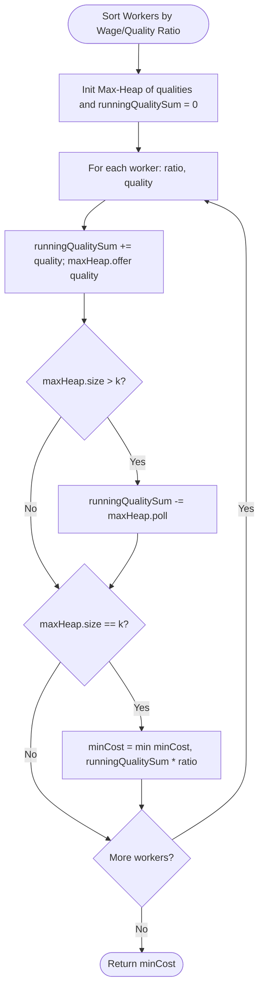

# 06. Advanced Hard-Tier Heap & Greedy Problems

[← Back to Greedy Choice](./05-greedy-choice-and-exchange-arguments.md) | [Track Hub](./README.md) | [Java Track Home](../README.md)

---

## 1. Problem 1: Minimum Cost to Hire K Workers (Wage-to-Quality Ratio)

### 1.1 Problem Statement & Constraints

There are `n` workers. You are given two integer arrays `quality` and `wage` where $\text{quality}[i]$ is the quality of the $i^{\text{th}}$ worker and $\text{wage}[i]$ is the minimum wage expectation for the $i^{\text{th}}$ worker.

We want to hire exactly `k` workers to form a paid group. To hire a group of `k` workers, we must pay them following these rules:
1. Every worker in the paid group must be paid in ratio to their quality compared to other workers in the paid group.
2. Every worker in the paid group must be paid at least their minimum wage expectation.

Given the integer `k`, return *the least amount of money needed to form a paid group satisfying the above conditions.* Answers within $10^{-5}$ of the actual answer will be accepted.

```
Input: quality = [10,20,5], wage = [70,50,30], k = 2
Output: 105.00000
Explanation: We pay 70 to 0-th worker and 35 to 2-nd worker.
```

#### Constraints:
- $n == \text{quality.length} == \text{wage.length}$.
- $1 \le k \le n \le 10^4$.
- $1 \le \text{quality}[i], \text{wage}[i] \le 10^4$.

---

### 1.2 Thought Process: The Mathematical Invariant

```
  Rule 1 Analysis:
  For any two hired workers i and j:
  Payment(i) / Quality(i) == Payment(j) / Quality(j) == R (a uniform wage-to-quality rate!).
  
  Rule 2 Analysis:
  Payment(i) = R * Quality(i) >= Wage(i)  ===>  R >= Wage(i) / Quality(i).
  
  Therefore:
  The uniform group rate R MUST be:
  R = max( Wage(i) / Quality(i) ) across all k hired workers!
                         ↓
  Total Cost Equation:
  Total Cost = R * Sum(Quality(i)) across all k hired workers.
                         ↓
  "Aha!" Architecture:
  1. Calculate ratio = wage[i] / quality[i] for every worker.
  2. Sort workers in ascending order of ratio!
  3. When iterating through workers, the current worker's ratio is guaranteed to be
     the MAXIMUM ratio among all workers seen so far!
  4. Now R is fixed to worker[i].ratio.
     To minimize Total Cost = R * Sum(Quality), we must choose the K workers
     that have the MINIMUM SUM OF QUALITIES!
  5. Maintain a MAX-HEAP of qualities of size K.
     If heap size > K, drop the worker with the LARGEST quality!
  
  Time: O(N log N) sorting + O(N log K) heap operations. Space: O(N).
```

---

### 1.3 Procedural Blueprint (How to Proceed)



---

### 1.4 Production Java 17/21 Implementation

```java
package com.structures.heaps;

import java.util.Arrays;
import java.util.Collections;
import java.util.PriorityQueue;

/**
 * Solves Minimum Cost to Hire K Workers in O(N log N) time using ratio sorting and quality Max-Heap.
 */
public final class HireKWorkers {

    private record Worker(double ratio, int quality) {}

    public double mincostToHireWorkers(int[] quality, int[] wage, int k) {
        int n = quality.length;
        Worker[] workers = new Worker[n];
        for (int i = 0; i < n; i++) {
            workers[i] = new Worker((double) wage[i] / quality[i], quality[i]);
        }

        // 1. Sort workers in ascending order of wage/quality ratio: O(N log N)
        Arrays.sort(workers, (a, b) -> Double.compare(a.ratio, b.ratio));

        // 2. Max-Heap of qualities to track and evict largest qualities: O(N log K)
        PriorityQueue<Integer> maxQualityHeap = new PriorityQueue<>(k, Collections.reverseOrder());

        double minTotalCost = Double.MAX_VALUE;
        long qualitySum = 0;

        for (Worker worker : workers) {
            qualitySum += worker.quality;
            maxQualityHeap.offer(worker.quality);

            // Evict worker with largest quality to minimize sum
            if (maxQualityHeap.size() > k) {
                qualitySum -= maxQualityHeap.poll();
            }

            // Exactly K workers recruited
            if (maxQualityHeap.size() == k) {
                double currentCost = qualitySum * worker.ratio;
                minTotalCost = Math.min(minTotalCost, currentCost);
            }
        }

        return minTotalCost;
    }
}
```

---

## 2. Problem 2: Course Schedule III (Greedy Duration Swapping)

### 2.1 Problem Statement & Constraints

There are `n` different online courses numbered from `1` to `n`. You are given an array `courses` where $\text{courses}[i] = [\text{duration}_i, \text{lastDay}_i]$ indicate that the $i^{\text{th}}$ course should be taken continuously for $\text{duration}_i$ days and must be finished before or on $\text{lastDay}_i$.

You start on the $1^{\text{st}}$ day and you cannot take two or more courses simultaneously.

*Return the maximum number of courses that you can take.*

```
Input: courses = [[100,200],[200,1300],[1000,1250],[2000,3200]]
Output: 3
Explanation:
Take 1st course (100 days): finished on day 100 <= 200.
Take 3rd course (1000 days): finished on day 1100 <= 1250.
Take 2nd course (200 days): finished on day 1300 <= 1300.
(4th course takes 2000 days -> finishes on 3300 > 3200 -> cannot take).
Total courses: 3.
```

#### Constraints:
- $1 \le \text{courses.length} \le 10^4$.
- $1 \le \text{duration}_i, \text{lastDay}_i \le 10^4$.

---

### 2.2 Thought Process: The Deadline Breach Exchange

```
  Step 1: Sort courses by lastDay (earliest deadline first)
  If course A must finish before course B, taking A before B is always optimal or equivalent.
                         ↓
  Step 2: Maintain a running currentTime and a Max-Heap of taken course durations.
  For course [d, lastDay]:
  Add course: currentTime += d; maxHeap.offer(d);
                         ↓
  Step 3: What if currentTime > lastDay? (Deadline Breached!)
  We cannot take all courses currently in the heap. We MUST DROP ONE COURSE!
  Which course should we drop?
  Greedy Choice: DROP THE COURSE WITH THE MAXIMUM DURATION!
  currentTime -= maxHeap.poll();
  
  Why is this optimal?
  1. The total count of completed courses remains unchanged.
  2. By dropping the longest duration course, currentTime decreases by the MAXIMUM possible amount,
     giving all future courses the greatest probability of meeting their deadlines!
  
  Total Complexity: O(N log N) time, O(N) space.
```

---

### 2.3 Production Java 17/21 Implementation

```java
package com.structures.heaps;

import java.util.Arrays;
import java.util.Collections;
import java.util.Comparator;
import java.util.PriorityQueue;

/**
 * Solves Course Schedule III using greedy deadline sorting and duration Max-Heap.
 */
public final class CourseScheduleIII {

    public int scheduleCourse(int[][] courses) {
        if (courses == null || courses.length == 0) {
            return 0;
        }

        // 1. Sort courses chronologically by deadline (lastDay): O(N log N)
        Arrays.sort(courses, Comparator.comparingInt(a -> a[1]));

        // 2. Max-Heap of durations of courses currently taken
        PriorityQueue<Integer> maxDurationHeap = new PriorityQueue<>(Collections.reverseOrder());

        int currentTime = 0;

        for (int[] course : courses) {
            int duration = course[0];
            int lastDay = course[1];

            currentTime += duration;
            maxDurationHeap.offer(duration);

            // If current schedule exceeds deadline, drop the course with the longest duration
            if (currentTime > lastDay) {
                currentTime -= maxDurationHeap.poll();
            }
        }

        return maxDurationHeap.size();
    }
}
```

---

## 3. Problem 3: Candy (Single-Pass $\mathcal{O}(1)$ Space Slope Optimization)

### 3.1 Problem Statement & Constraints

There are `n` children standing in a line. Each child is assigned a rating value given in the integer array `ratings`.

You are giving candies to these children subjected to the following requirements:
- Each child must have at least one candy.
- Children with a higher rating get more candies than their neighbors.

*Return the minimum number of candies you need to have to distribute the candies to the children.*

Can you solve it in $\mathcal{O}(N)$ time and **$\mathcal{O}(1)$ auxiliary space**?

```
Input: ratings = [1,0,2]
Output: 5
Explanation: You can allocate to the first, second and third child with 2, 1, 2 candies respectively.
```

#### Constraints:
- $n == \text{ratings.length}$.
- $1 \le n \le 2 \times 10^4$.
- $0 \le \text{ratings}[i] \le 2 \times 10^4$.

---

### 3.2 Thought Process: Single-Pass Peak-Valley Slope Geometry

```
  Traditional Two-Pass Greedy:
  Pass 1 (Left-to-Right): if ratings[i] > ratings[i-1], left[i] = left[i-1] + 1.
  Pass 2 (Right-to-Left): if ratings[i] > ratings[i+1], right[i] = right[i+1] + 1.
  candies = sum(max(left[i], right[i])).
  Time: O(N), Space: O(N) auxiliary memory.
                         ↓
  The "Aha!" Staff-Level Optimization: Slope Geometry in O(1) Space!
  Think of the ratings as a terrain of Hills (Up-slopes), Valleys (Down-slopes), and Flats.
  
         Peak (Candies = 4)
          /\
         /  \
        /    \
       /      \  Valley (Candies = 1)
  
  • As we ascend an up-slope: count of candies increases by 1 each step (1 + 2 + 3 + ...).
  • As we descend a down-slope: each new down-step increases total candies by the down-length,
    plus 1 for the new bottom!
  • If down-slope length exceeds peak height, the peak must be elevated by 1 to maintain superiority!
  Time: O(N) single pass, Space: Strictly O(1) auxiliary memory!
```

---

### 3.3 Production Java 17/21 Implementation

```java
package com.structures.heaps;

/**
 * Solves Candy distribution problem in strictly O(N) time and O(1) auxiliary space
 * using single-pass slope geometry.
 */
public final class CandyDistributor {

    public int candy(int[] ratings) {
        if (ratings == null || ratings.length == 0) {
            return 0;
        }

        int n = ratings.length;
        int totalCandies = 1; // First child always gets 1 candy initially
        int upSlope = 0;
        int downSlope = 0;
        int peakCount = 0;

        for (int i = 1; i < n; i++) {
            if (ratings[i] > ratings[i - 1]) {
                // Ascending slope
                upSlope++;
                downSlope = 0;
                peakCount = upSlope + 1;
                totalCandies += peakCount;
            } else if (ratings[i] == ratings[i - 1]) {
                // Flat terrain
                upSlope = 0;
                downSlope = 0;
                peakCount = 0;
                totalCandies += 1;
            } else {
                // Descending slope
                downSlope++;
                upSlope = 0;
                // If down-slope matches or exceeds peak height, the peak must be raised by 1
                totalCandies += downSlope + (downSlope >= peakCount ? 1 : 0);
            }
        }

        return totalCandies;
    }
}
```

---

## 4. Problem 4: Huffman Coding & Optimal Prefix Trees

### 4.1 Architectural Foundations: Optimal Lossless Compression

In standard ASCII, every character requires 8 bits. In high-volume systems (e.g. gzip, protocol buffers), characters occur with wildly different frequencies.
- **Huffman's Rule**: Assign shorter bit codes to more frequent characters and longer bit codes to rarer characters, ensuring **no code is a prefix of another** (Prefix Property).
- **Min-Heap Construction**: Continually pair the two least frequent subtrees until a single binary tree remains.

---

### 4.2 Production Java 17/21 Implementation

```java
package com.structures.heaps;

import java.util.HashMap;
import java.util.Map;
import java.util.PriorityQueue;

/**
 * Builds an optimal Huffman Prefix Code Tree using a Min-Heap in O(N log N).
 */
public final class HuffmanEncodingEngine {

    public static final class HuffmanNode implements Comparable<HuffmanNode> {
        public final char ch;
        public final int frequency;
        public final HuffmanNode left;
        public final HuffmanNode right;

        public HuffmanNode(char ch, int frequency, HuffmanNode left, HuffmanNode right) {
            this.ch = ch;
            this.frequency = frequency;
            this.left = left;
            this.right = right;
        }

        public boolean isLeaf() {
            return left == null && right == null;
        }

        @Override
        public int compareTo(HuffmanNode other) {
            return Integer.compare(this.frequency, other.frequency);
        }
    }

    public Map<Character, String> buildPrefixCodes(Map<Character, Integer> frequencies) {
        if (frequencies == null || frequencies.isEmpty()) {
            return Map.of();
        }

        PriorityQueue<HuffmanNode> minHeap = new PriorityQueue<>(frequencies.size());

        for (Map.Entry<Character, Integer> entry : frequencies.entrySet()) {
            minHeap.offer(new HuffmanNode(entry.getKey(), entry.getValue(), null, null));
        }

        // Repeatedly merge the two lowest-frequency trees
        while (minHeap.size() > 1) {
            HuffmanNode left = minHeap.poll();
            HuffmanNode right = minHeap.poll();

            HuffmanNode merged = new HuffmanNode('\0', left.frequency + right.frequency, left, right);
            minHeap.offer(merged);
        }

        HuffmanNode root = minHeap.poll();
        Map<Character, String> prefixCodes = new HashMap<>();
        generateCodes(root, "", prefixCodes);

        return prefixCodes;
    }

    private void generateCodes(HuffmanNode node, String path, Map<Character, String> prefixCodes) {
        if (node == null) {
            return;
        }

        if (node.isLeaf()) {
            prefixCodes.put(node.ch, path.isEmpty() ? "0" : path);
            return;
        }

        generateCodes(node.left, path + "0", prefixCodes);
        generateCodes(node.right, path + "1", prefixCodes);
    }
}
```

---

<table width="100%">
  <tr>
    <td width="33%" align="left">
      <a href="./05-greedy-choice-and-exchange-arguments.md">
        <strong>← Previous Module</strong><br>
        05. Greedy Choice & Exchange Arguments
      </a>
    </td>
    <td width="33%" align="center">
      <a href="./README.md">
        <strong>Track Hub</strong><br>
        Heaps & Greedy Track Hub
      </a>
    </td>
    <td width="33%" align="right">
      <a href="../README.md">
        <strong>Java Track Home →</strong><br>
        Java DSA Master Track
      </a>
    </td>
  </tr>
</table>
