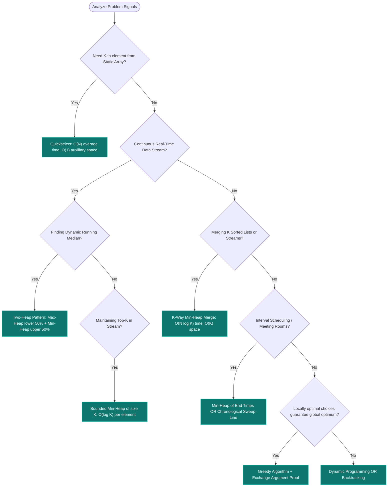

# 🌋 Heaps, Priority Queues & Greedy Algorithms Mastery

[Java Track Home](../README.md) | [Strategies Hub](../../dsa-strategies/README.md) | [Next: Binary Heap Fundamentals →](./01-binary-heap-fundamentals-and-priority-queues.md)

---

## 🧭 Executive Overview: The Priority & Selection Universe

In high-throughput distributed systems and technical algorithm design, we frequently encounter scenarios where maintaining a fully sorted collection ($\mathcal{O}(N \log N)$) is unnecessary and wasteful. When a system only requires access to the **extreme element** (minimum, maximum, or dynamic median) or demands immediate local decisions that guarantee global optimality, **Binary Heaps** and **Greedy Algorithms** provide optimal runtime bounds.

```
                      ╭────────────────────────────────────────╮
                      │        DATA STREAM OR ARRAY INPUT      │
                      ╰───────────────────┬────────────────────╯
                                          │
                        Is total sorted order required?
                                          │
                         ┌────────────────┴────────────────┐
                         ▼                                 ▼
                 YES: Full Sort                   NO: Partial / Extreme
              O(N log N) Quicksort                Is stream static or dynamic?
              O(N log N) Mergesort                         │
                                           ┌───────────────┴───────────────┐
                                           ▼                               ▼
                                  STATIC: Quickselect             DYNAMIC: Binary Heap
                                 O(N) avg for K-th item           O(1) peek, O(log N) push/pop
```

---

## 🌲 1. The Binary Heap Invariant & Array Mathematics

A **Binary Heap** is a complete binary tree stored inside a contiguous 1D array. It satisfies two fundamental invariants:

```
╭───────────────────────────────────────────────────────────────────────────────────────────╮
│                                 THE TWO HEAP INVARIANTS                                   │
├───────────────────────────────────────────────────────────────────────────────────────────┤
│ 1. Structural Invariant: The tree is completely filled on all levels except possibly the  │
│    last, where all leaf nodes are packed as far left as possible. Zero pointer overhead!  │
│ 2. Heap-Order Invariant:                                                                  │
│    • Min-Heap: For every node i other than root, Value(Parent(i)) <= Value(i).            │
│    • Max-Heap: For every node i other than root, Value(Parent(i)) >= Value(i).            │
╰───────────────────────────────────────────────────────────────────────────────────────────╯
```

### Zero-Pointer Index Arithmetic (0-Indexed)

Because the binary tree is strictly complete, child and parent relationships are computed algebraically via bit shifts and additions with **zero object pointers**:

```
                       Index 0 (Root)
                      /              \
             Index 1                    Index 2
            /       \                  /       \
       Index 3     Index 4        Index 5     Index 6
```

$$\text{Left Child}(i) = 2i + 1 = (i \ll 1) + 1$$
$$\text{Right Child}(i) = 2i + 2 = (i \ll 1) + 2$$
$$\text{Parent}(i) = \left\lfloor \frac{i - 1}{2} \right\rfloor = (i - 1) \gg 1$$

---

## 🧮 2. Mathematical Proof of $O(N)$ Build-Heap (Heapify)

A common misconception is that building a binary heap from an unsorted array of size $N$ takes $\mathcal{O}(N \log N)$ time (like inserting $N$ elements into an empty heap). 

In reality, **bottom-up heapify** (`buildHeap()`) runs in strictly **$\mathcal{O}(N)$ linear time**.

### The Mathematical Derivation:
In a complete binary tree of height $H = \lfloor \log_2 N \rfloor$:
- Level $0$ (Root) has $1$ node and can sink at most $H$ levels.
- Level $1$ has $2$ nodes and can sink at most $H - 1$ levels.
- Level $h$ (counting from bottom up: leaves are height $0$) has at most $\lceil N / 2^{h+1} \rceil$ nodes, each capable of sinking down at most $h$ edges.

The total work $W(N)$ performed by `buildHeap()` is the sum of operations across all height levels:

$$W(N) = \sum_{h=0}^{\lfloor \log_2 N \rfloor} \left\lceil \frac{N}{2^{h+1}} \right\rceil \mathcal{O}(h) \le \frac{N}{2} \sum_{h=0}^{\infty} \frac{h}{2^h}$$

Consider the standard geometric power series:
$$\sum_{h=0}^{\infty} x^h = \frac{1}{1 - x} \quad (|x| < 1)$$

Differentiating both sides with respect to $x$:
$$\sum_{h=1}^{\infty} h x^{h-1} = \frac{1}{(1 - x)^2}$$

Multiplying both sides by $x$:
$$\sum_{h=0}^{\infty} \frac{h}{2^h} = \sum_{h=0}^{\infty} h \left(\frac{1}{2}\right)^h = \frac{1/2}{(1 - 1/2)^2} = \frac{1/2}{1/4} = 2$$

Substituting back into our work summation:
$$W(N) \le \frac{N}{2} \times 2 = \mathcal{O}(N) \quad \blacksquare$$

> [!NOTE]
> **Intuition**: Over $50\%$ of the nodes in a binary tree are **leaves** (height $0$), which require **0 swaps**. Another $25\%$ are at height $1$, requiring at most 1 swap. The nodes requiring the maximum number of swaps ($\log N$) represent less than $0.001\%$ of the tree!

---

## ⚡ 3. The Global Decision Engine



---

## 📊 4. Complexity & Architecture Reference Matrix

| Structure / Algorithm | Peek / Top | Push / Insert | Pop / Extract | Arbitrary Delete | Search | Build from Array | Primary Production Use Case |
| :--- | :---: | :---: | :---: | :---: | :---: | :---: | :--- |
| **Binary Min/Max Heap** | $\mathcal{O}(1)$ | $\mathcal{O}(\log N)$ | $\mathcal{O}(\log N)$ | $\mathcal{O}(N)$ scan | $\mathcal{O}(N)$ | $\mathcal{O}(N)$ | Priority scheduling, top-$K$ streams, event queues |
| **Indexed Priority Queue (IPQ)**| $\mathcal{O}(1)$ | $\mathcal{O}(\log N)$ | $\mathcal{O}(\log N)$ | $\mathcal{O}(\log N)$* | $\mathcal{O}(1)$* | $\mathcal{O}(N)$ | Dijkstra's algorithm (`decreaseKey`), network routing |
| **Quickselect (Hoare)** | — | — | — | — | $\mathcal{O}(N)$ avg | — | In-place $K$-th selection without memory overhead |
| **Two Heaps (Median)** | $\mathcal{O}(1)$ | $\mathcal{O}(\log N)$ | $\mathcal{O}(\log N)$ | $\mathcal{O}(N)$ (lazy: $O(\log K)$) | — | $\mathcal{O}(N)$ | Real-time financial tick median, sliding window stats |
| **Fibonacci Heap (Theoretical)**| $\mathcal{O}(1)$ | $\mathcal{O}(1)$ amortized | $\mathcal{O}(\log N)$ | $\mathcal{O}(\log N)$ | $\mathcal{O}(N)$ | $\mathcal{O}(N)$ | Theoretical minimum spanning trees (high constant factor) |

*\*Indexed Priority Queue achieves $\mathcal{O}(1)$ key lookup and $\mathcal{O}(\log N)$ arbitrary deletion/update via an internal position map.*

---

## 📚 5. Track Curriculum

| Module | Core Topics & Focus | Problems Solved | Architectural & Mathematical Highlights |
| :--- | :--- | :--- | :--- |
| **[01. Binary Heap Fundamentals & Priority Queues](./01-binary-heap-fundamentals-and-priority-queues.md)** | Sift-Up, Sift-Down, Custom `ArrayMinHeap<T>` from Scratch, JCF `PriorityQueue` Internals, Indexed PQ | • Custom Generic Binary Heap<br>• Indexed Priority Queue with `decreaseKey` | Pointerless array arithmetic, 11-element JCF initial capacity, inverted index position map |
| **[02. Top-K & Selection Paradigms](./02-top-k-and-selection-paradigms.md)** | Quickselect vs. Heap trade-offs, Frequency Bucket Sorting, Euclidean Distances | • Kth Largest Element in an Array<br>• Top K Frequent Elements<br>• K Closest Points to Origin | 3-Way Dutch National Flag partitioning, $\mathcal{O}(N)$ bucket sort, avoiding floating-point `sqrt` |
| **[03. The Two-Heap Architecture & Streaming](./03-the-two-heap-architecture-and-streaming.md)** | Running Median, Sliding Window Median with Lazy Deletion, Capital Allocation | • Find Median from Data Stream<br>• Sliding Window Median (Hard)<br>• IPO (Capital Maximization) | Dynamic balance invariants, Hash Map delayed deletion eliminating $O(K)$ removal penalty |
| **[04. K-Way Merge & Interval Scheduling](./04-k-way-merge-and-interval-scheduling.md)** | Multi-Way Queue Coordination, Running Extremes, End-Time Tracking | • Merge K Sorted Lists<br>• Smallest Range Covering K Lists<br>• Meeting Rooms II | Min-heap tracking active heads, dynamic window contraction, sweep-line equivalence |
| **[05. Greedy Choice & Exchange Arguments](./05-greedy-choice-and-exchange-arguments.md)** | Greedy Choice Property, Optimal Substructure, Exchange Argument Proofs | • Task Scheduler<br>• Gas Station (Circular Tour)<br>• Reorganize String | Cooling period math formula, total gas vs cost invariant, max-heap character pairing |
| **[06. Advanced Hard Heap & Greedy Problems](./06-advanced-hard-heap-and-greedy-problems.md)** | Wage-to-Quality Ratio Sorting, Course Deadline Swaps, Slope Optimization, Prefix Trees | • Minimum Cost to Hire K Workers<br>• Course Schedule III<br>• Candy ($\mathcal{O}(1)$ Space)<br>• Huffman Coding | Dynamic heap pruning, deadline-breach replacement, peak-valley slope traversal, prefix compression |

---

<table width="100%">
  <tr>
    <td width="33%" align="left">
      <a href="../trees/07-advanced-hard-tree-problems.md">
        <strong>← Previous Track</strong><br>
        Trees & Hierarchies Mastery
      </a>
    </td>
    <td width="33%" align="center">
      <a href="../README.md">
        <strong>Home</strong><br>
        Java DSA Master Track
      </a>
    </td>
    <td width="33%" align="right">
      <a href="./01-binary-heap-fundamentals-and-priority-queues.md">
        <strong>Next Module →</strong><br>
        01. Binary Heap Fundamentals & Priority Queues
      </a>
    </td>
  </tr>
</table>
