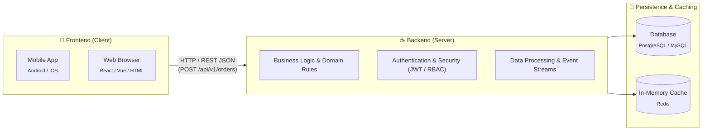
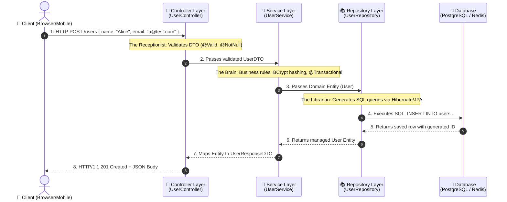

# Page 0: The Java Backend Developer Roadmap & Core Mental Model

Welcome to Page 0 of the Java Backend Engineering series. If you are a student, a fresher, or transitioning from frontend/desktop development, this page answers the three most important foundational questions:
1. **What actually is backend development?**
2. **How does a Java backend work under the hood?**
3. **What do I need to study, in what exact sequence, and why?**

---

## 1. What is Backend Development? (No Jargon)

When you order food on an app:
- The buttons, images, animations, and form fields you tap are the **Frontend (Client)**.
- But who verifies if your credit card has enough balance? Who calculates the distance to the restaurant? Who locks the order in a database so you aren't charged twice? Who dispatches an SMS notification to the delivery driver?

**That is the Backend (Server).**

The backend is responsible for:
1. **Data Integrity & Storage**: Ensuring data is securely and accurately saved in databases.
2. **Business Logic Execution**: Calculating taxes, discounts, applying domain rules.
3. **Security & Access Control**: Verifying passwords, issuing JWT tokens, protecting private user records.
4. **Performance & Scalability**: Serving tens of thousands of concurrent requests per second without crashing.

---

## 2. The Core 3-Tier Java Backend Mental Model

Every enterprise Java application—whether a simple CRUD app or a billion-dollar fintech engine—is structured into **three distinct layers**:

> [!IMPORTANT]
> **Separation of Concerns**:
> - The **Controller** never writes SQL queries.
> - The **Repository** never validates user passwords or writes business rules.
> - The **Service** does the heavy thinking and coordinates between controllers and repositories.

---

## 3. The Visual Master Roadmap ("What to Study & When")

To become a high-impact Java Backend Engineer, you must master the stack in progressive, logical stages:

```mermaid
flowchart TD
    subgraph S1["🌱 STAGE 1: The Foundations"]
        P00["Page 00: Master Roadmap & Mental Model<br/><sub>Client ➔ Controller ➔ Service ➔ DB</sub>"]
        P01["Page 01: Web & HTTP Protocols<br/><sub>Request/Response, Methods, Status Codes, REST</sub>"]
    end

    subgraph S2["⚙️ STAGE 2: The Java Web Engine"]
        P02["Page 02: Servlets & Spring MVC<br/><sub>Tomcat, DispatcherServlet, Filters vs Interceptors</sub>"]
        P03["Page 03: Spring Framework & Boot Core<br/><sub>IoC, Dependency Injection, Beans, Auto-Configuration</sub>"]
    end

    subgraph S3["💾 STAGE 3: Data Persistence & Business Logic"]
        P04["Page 04: REST APIs & Validation<br/><sub>DTO Pattern, Jakarta Validation, @RestControllerAdvice</sub>"]
        P05["Page 05: Database Persistence<br/><sub>Spring Data JPA, Hibernate ORM, N+1 Query Fixes</sub>"]
        P06["Page 06: Transactions & Locking<br/><sub>@Transactional, Propagation, Optimistic vs Pessimistic</sub>"]
    end

    subgraph S4["⚡ STAGE 4: Performance & Async Processing"]
        P07["Page 07: Async & Virtual Threads<br/><sub>CompletableFuture, Java 21 Loom, ScopedValue</sub>"]
        P08["Page 08: Caching with Redis<br/><sub>Spring Cache, RedisTemplate, Cache-Aside, Stampede</sub>"]
    end

    subgraph S5["📡 STAGE 5: Distributed & Event-Driven Systems"]
        P09["Page 09: Messaging with Apache Kafka<br/><sub>Event-Driven, KafkaTemplate, Offsets, DLQ</sub>"]
        P10["Page 10: Microservices with Spring Cloud<br/><sub>API Gateway, Eureka Discovery, OpenFeign</sub>"]
    end

    subgraph S6["🛡️ STAGE 6: Enterprise Security & Resilience"]
        P11["Page 11: Backend Security with JWT<br/><sub>SecurityFilterChain, Stateless Auth Filter, RBAC</sub>"]
        P12["Page 12: Production Observability & Resilience<br/><sub>Actuator, Prometheus, Distributed Tracing, Resilience4j</sub>"]
    end

    S1 --> S2 --> S3 --> S4 --> S5 --> S6
```

---

## 4. Stage Breakdown: What You Will Master in Each Module

### Stage 1: The Foundations
- **Page 00: Roadmap & Mental Model** — Understanding backend architecture, client-server models, and the 3-tier pattern.
- **Page 01: Web & HTTP Protocols** — How data travels across the wire. HTTP methods, headers, status codes, REST architectural constraints, cookies, sessions, and stateless tokens.

### Stage 2: The Java Web Engine
- **Page 02: Servlet Containers & Spring MVC** — How Java executes web code. Servlets, Tomcat thread pool, `DispatcherServlet` front controller, Filters vs Interceptors.
- **Page 03: Spring Framework & Boot Core** — Eliminating boilerplate. Inversion of Control (IoC), Dependency Injection (DI), Bean lifecycles, and Spring Boot auto-configuration.

### Stage 3: Data Persistence & Business Logic
- **Page 04: REST APIs, DTOs & Validation** — Designing robust REST endpoints, DTO separation, Jakarta Bean Validation (`@NotNull`, `@Size`), and global error handling with `@RestControllerAdvice`.
- **Page 05: Database Persistence (Spring Data JPA & Hibernate)** — Object-Relational Mapping, entity modeling, relationship mappings (`@OneToMany`, `@ManyToOne`), and diagnosing and fixing the dreaded **N+1 query problem**.
- **Page 06: Transaction Management & Locking** — ACID in enterprise Java, `@Transactional` internals, propagation levels, isolation levels, and concurrency control using Optimistic vs Pessimistic locking.

### Stage 4: Performance & Asynchronous Processing
- **Page 07: Async & Virtual Threads (Java 21)** — High-throughput non-blocking backends. `CompletableFuture` async pipelines, Virtual Threads (Project Loom), carrier threads, and `ScopedValue`.
- **Page 08: Caching & Redis Integration** — Slashing database latency from $50\text{ ms}$ to $< 1\text{ ms}$. Spring Cache abstraction, Redis, Cache-Aside pattern, and mitigating Cache Stampede / Avalanche / Penetration.

### Stage 5: Distributed & Event-Driven Systems
- **Page 09: Asynchronous Messaging with Apache Kafka** — Decoupling services with event streams. Producers (`acks=all`), Consumers, partition offsets, Dead Letter Queues (DLQ), and Spring Application Events.
- **Page 10: Microservices with Spring Cloud** — Decomposing the monolith. Spring Cloud Gateway, Eureka service discovery, declarative REST with OpenFeign, and centralized configuration.

### Stage 6: Enterprise Security & Production Observability
- **Page 11: Backend Security with Spring Security & JWT** — Production-grade defense. Security Filter Chain, stateless JWT authentication filter, password hashing with BCrypt, and Role-Based Access Control (RBAC).
- **Page 12: Production Readiness, Observability & Resilience** — Running in production. Spring Boot Actuator, Prometheus/Micrometer metrics, distributed tracing with Zipkin, and Resilience4j circuit breakers.

---

## 5. Prerequisites & Developer Tooling Checklist

Before building backend applications, ensure you have:
1. **Java Development Kit (JDK)**: JDK 17 or JDK 21 (LTS releases).
2. **Build Tool**: Apache Maven (`pom.xml`) or Gradle (`build.gradle`).
3. **Integrated Development Environment (IDE)**: IntelliJ IDEA (Community or Ultimate) or VS Code with Java Extension Pack.
4. **API Client**: Postman, Insomnia, or command-line `cURL` for testing HTTP requests.
5. **Relational Database**: PostgreSQL or MySQL installed locally or via Docker.
6. **Core Java Proficiency**: Comfort with OOP, Collections (`List`, `Map`, `Set`), Exception Handling, and Streams (covered in [Java Fundamentals](../java-fundamentals/README.md)).

---

## 🧭 Continue Learning

| 🏁 Track Start | 🧭 Track Hub | Next Topic ▶️ |
| :--- | :---: | ---: |
| *You are at the first topic* | [**Java Backend Index**](README.md) *Curriculum & Architecture* | [**Page 1: Web & HTTP Protocols**](01-web-and-http-protocols.md) *HTTP Methods, Status Codes & REST* |
