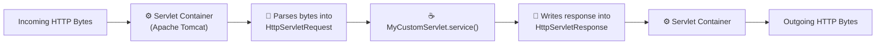
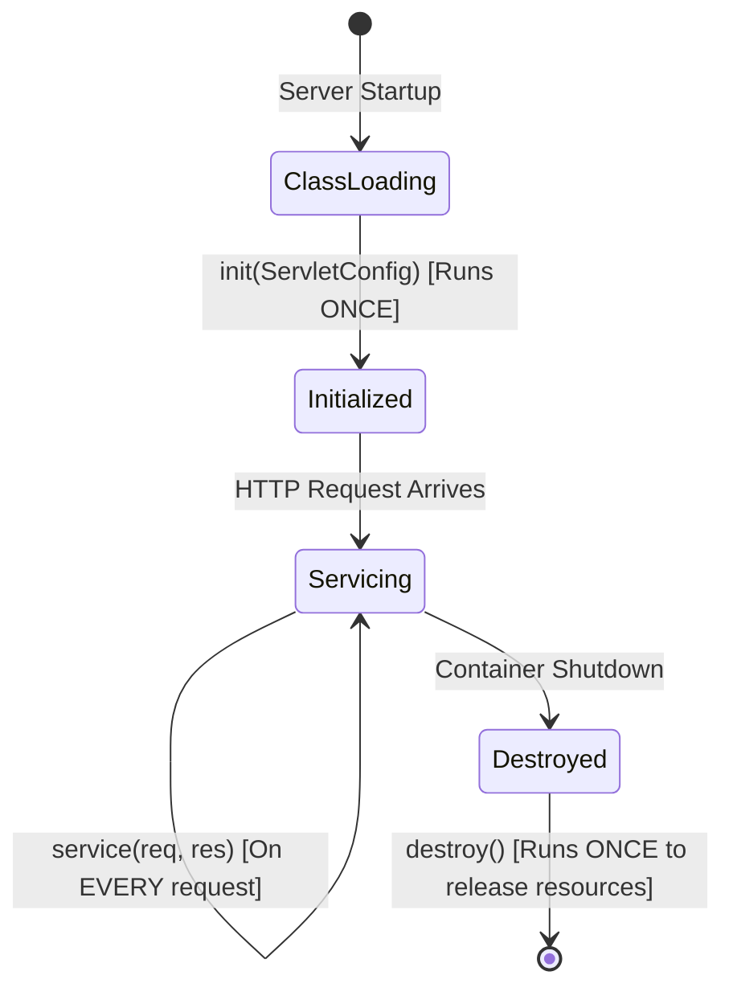
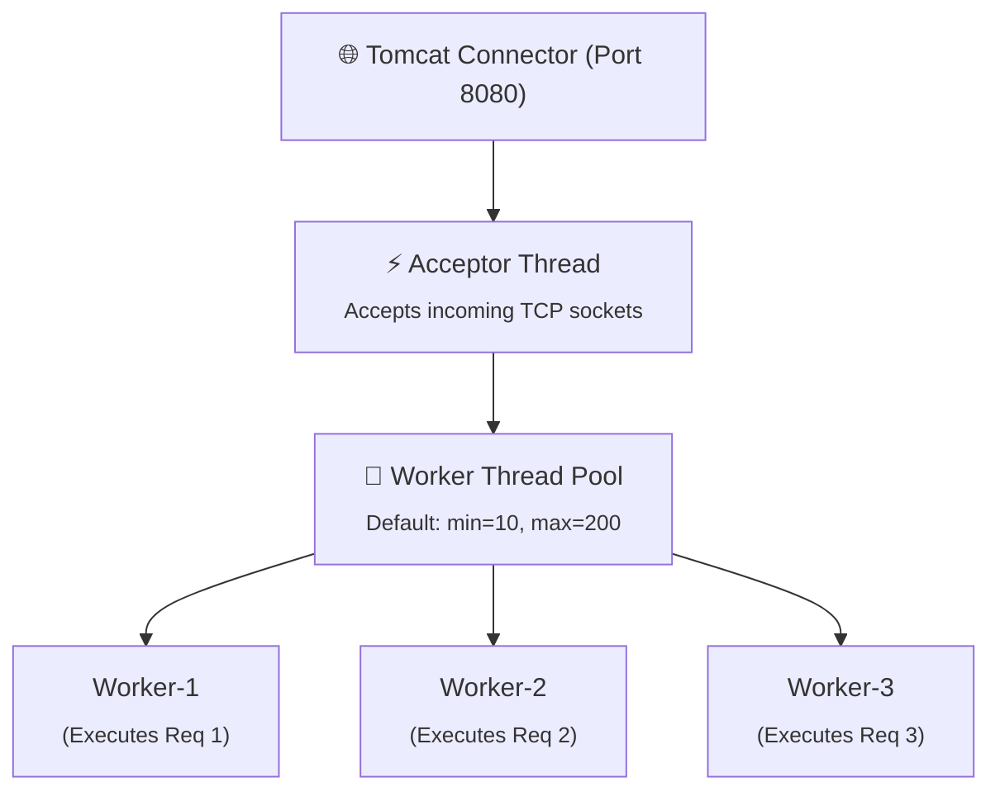
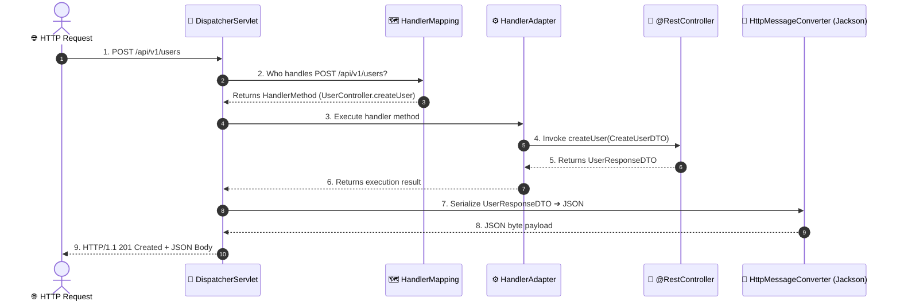
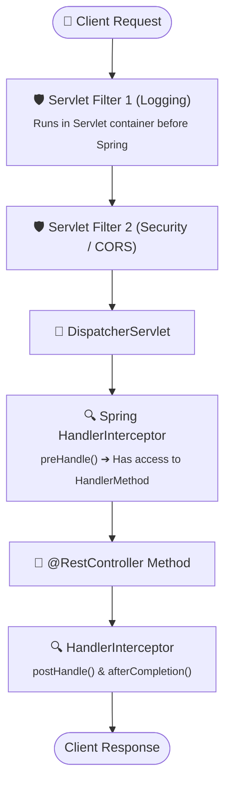

# Page 2: Servlet Containers & Spring MVC Architecture

Welcome to Page 2 of the Java Backend Engineering series. Every Java web application—including modern Spring Boot microservices—relies on **Servlets** and **Servlet Containers** (like Apache Tomcat). Understanding this plumbing is what distinguishes junior developers from senior engineers who can debug performance bottlenecks.

---

## 1. What is a Servlet?

A **Servlet** is a Java class that runs inside a web server, listening for incoming HTTP requests and generating responses.



### The Servlet Lifecycle (Managed by the Container)

A Servlet undergoes three lifecycle phases:



1. **`init()`**: Executed exactly once when the servlet is first instantiated. Used for one-time initialization (e.g., loading config).
2. **`service()`**: Executed on **every incoming HTTP request**. Inspects the HTTP method and delegates to `doGet()`, `doPost()`, `doPut()`, or `doDelete()`.
3. **`destroy()`**: Executed once when the web container shuts down. Used to release external resources and close thread pools.

---

## 2. Servlet Containers: Inside Apache Tomcat

When you run a Spring Boot application (`@SpringBootApplication`), it embeds an **Apache Tomcat** web server by default on port `8080`.



### Key Tomcat Performance Properties in Spring Boot:
```properties
# application.properties
server.port=8080
server.tomcat.threads.max=200        # Maximum simultaneous worker threads
server.tomcat.threads.min-spare=10   # Core idle threads always kept alive
server.tomcat.max-connections=8192   # Max active TCP sockets before connection refused
server.tomcat.accept-count=100       # Queue size when all 200 threads are busy
```

---

## 3. The Front Controller Pattern & Spring's `DispatcherServlet`

In early Java web development, you had to write a separate Servlet class for every single URL (e.g., `LoginServlet`, `OrderServlet`, `UserServlet`). This was unmaintainable.

Spring solves this with the **Front Controller Pattern** via a single master servlet: **`DispatcherServlet`**.



---

## 4. The Interception Pipeline: `Filter` vs. `HandlerInterceptor`

When an HTTP request enters your application, it passes through two layers of interception:



### Detailed Comparison:

| Feature | `jakarta.servlet.Filter` | Spring `HandlerInterceptor` |
| :--- | :--- | :--- |
| **Specification** | Java Servlet API (Jakarta EE) | Spring MVC Framework |
| **Execution Point** | Before reaching `DispatcherServlet` | After `DispatcherServlet`, before Controller |
| **Aware of Controller?** | No (only sees raw request/response) | **Yes** (receives `Object handler` metadata) |
| **Best Used For** | Low-level CORS, Request wrapping, IP blocking | Business metrics, auth tokens, timing execution |

### 1. Custom Servlet Filter Example:

```java
import jakarta.servlet.*;
import jakarta.servlet.http.HttpServletRequest;
import org.springframework.stereotype.Component;
import java.io.IOException;

@Component
public class RequestTimingFilter implements Filter {
    @Override
    public void doFilter(ServletRequest request, ServletResponse response, FilterChain chain)
            throws IOException, ServletException {
        long startTime = System.currentTimeMillis();
        HttpServletRequest req = (HttpServletRequest) request;

        try {
            // Passes request to the next filter in the chain (or DispatcherServlet)
            chain.doFilter(request, response);
        } finally {
            long duration = System.currentTimeMillis() - startTime;
            System.out.println("HTTP " + req.getMethod() + " " + req.getRequestURI() + 
                               " took " + duration + " ms");
        }
    }
}
```

### 2. Custom Spring HandlerInterceptor Example:

```java
import jakarta.servlet.http.HttpServletRequest;
import jakarta.servlet.http.HttpServletResponse;
import org.springframework.web.servlet.HandlerInterceptor;
import org.springframework.web.method.HandlerMethod;

public class ExecutionLoggerInterceptor implements HandlerInterceptor {
    @Override
    public boolean preHandle(HttpServletRequest request, HttpServletResponse response, Object handler) {
        if (handler instanceof HandlerMethod handlerMethod) {
            System.out.println("Executing Controller Method: " + 
                               handlerMethod.getMethod().getName());
        }
        return true; // Return true to continue request flow, false to abort!
    }
}
```

---

## 5. Self-Check & Quick Review

1. **Q**: Is a standard Servlet instance thread-safe?
   - *A*: **No!** The servlet container creates only **one instance** of each Servlet (singleton), and multiple worker threads execute `service()` concurrently on that same instance. Never declare mutable instance variables inside a Servlet or Controller!
2. **Q**: What happens when all 200 Tomcat worker threads are busy?
   - *A*: Incoming connections wait in the `accept-count` queue (default 100). If that queue fills up too, Tomcat immediately rejects incoming connections with `Connection Refused`.
3. **Q**: When would you use a `Filter` instead of a `HandlerInterceptor`?
   - *A*: Use a `Filter` when you need to intercept requests before Spring MVC even processes them (e.g., decrypting request bodies, handling low-level CORS headers, or blocking unauthorized IP ranges).

---

## 🧭 Continue Learning

| ◀️ Previous Topic | 🧭 Track Hub | Next Topic ▶️ |
| :--- | :---: | ---: |
| [**Page 1: Web & HTTP Protocols**](01-web-and-http-protocols.md)<br><sub>*HTTP Methods, Status Codes & REST*</sub> | [**Java Backend Index**](README.md)<br><sub>*Curriculum & Architecture*</sub> | [**Page 3: Spring Boot Core & IoC**](03-spring-framework-and-boot-core.md)<br><sub>*Dependency Injection & Auto-Configuration*</sub> |
