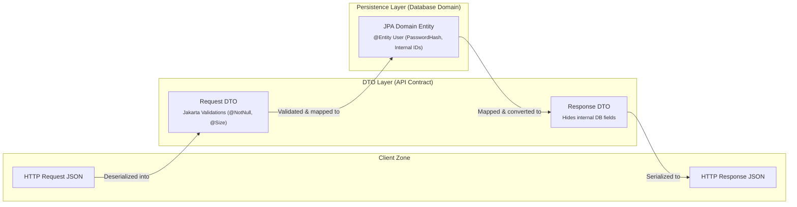

# Page 4: Building RESTful APIs, DTO Pattern & Validation

Welcome to Page 4 of the Java Backend Engineering series. Building production-grade APIs requires more than just returning JSON. It requires robust input validation, clean architectural separation between public contracts and database entities, and centralized error handling.

---

## 1. The DTO Pattern: Why Entities Must NEVER Be Exposed

A common beginner mistake is returning database entities directly from `@RestController` methods:

```java
// ❌ DANGEROUS: Returning JPA Entity directly to the client
@GetMapping("/users/{id}")
public User getUser(@PathVariable Long id) {
    return userRepository.findById(id).orElseThrow();
}
```

### Why Exposing Entities is Fatal in Production:
1. **Security Leaks**: The `User` entity might contain sensitive fields (`passwordHash`, `ssn`, `internalAuditNotes`). Returning the entity serializes these fields to the client!
2. **Infinite JSON Recursion**: If `User` has `@OneToMany List<Order> orders` and `Order` has `@ManyToOne User user`, Jackson serializer enters an infinite loop, throwing **`StackOverflowError`** and crashing the thread!
3. **API Contract Breaking**: If you rename a database column from `first_name` to `given_name`, your public API contract breaks for all mobile apps and web clients.



### Using Modern Java Records as DTOs (Java 16+ / Spring Boot 3)
Java **Records** are ideal for DTOs because they are immutable, thread-safe, and eliminate boilerplate getters/setters:

```java
public record CreateUserRequest(
    @NotBlank(message = "Username cannot be blank")
    @Size(min = 3, max = 50, message = "Username must be between 3 and 50 characters")
    String username,

    @NotBlank(message = "Email cannot be blank")
    @Email(message = "Invalid email format")
    String email,

    @NotBlank(message = "Password cannot be blank")
    @Size(min = 8, message = "Password must be at least 8 characters long")
    String password
) {}

public record UserResponse(
    Long id,
    String username,
    String email,
    LocalDateTime createdAt
) {}
```

---

## 2. Jakarta Bean Validation

Spring Boot validates incoming payloads using the **Jakarta Bean Validation** API (`jakarta.validation`).

### Essential Validation Annotations:
- `@NotNull`: Value cannot be `null` (permits empty strings `""`).
- `@NotEmpty`: Cannot be `null` and size/length must be $> 0$.
- `@NotBlank`: Cannot be `null`, and trimmed length must be $> 0$ (best for Strings!).
- `@Min(value)` / `@Max(value)`: Enforces numeric limits.
- `@Size(min, max)`: Enforces string or collection bounds.
- `@Email`: Verifies standard email structure.
- `@Pattern(regexp = "...")`: Verifies string against a regex.

### Enforcing Validation in Controllers with `@Valid`:
```java
@RestController
@RequestMapping("/api/v1/users")
public class UserController {

    private final UserService userService;

    public UserController(UserService userService) {
        this.userService = userService;
    }

    @PostMapping
    public ResponseEntity<UserResponse> createUser(
            @Valid @RequestBody CreateUserRequest request) { // @Valid triggers validation!
        UserResponse response = userService.createUser(request);
        URI location = URI.create("/api/v1/users/" + response.id());
        return ResponseEntity.created(location).body(response);
    }
}
```

---

## 3. Global Exception Handling with `@RestControllerAdvice`

Never wrap controller methods in cluttered `try-catch` blocks. Spring provides **`@RestControllerAdvice`** to intercept exceptions globally across the entire application.

### The RFC 7807 Standard (Problem Details)
Spring Boot 3 natively supports **RFC 7807 (Problem Details for HTTP APIs)**, providing a standardized, machine-readable JSON error format:

```json
{
  "type": "about:blank",
  "title": "Validation Failed",
  "status": 400,
  "detail": "Input payload failed validation rules",
  "instance": "/api/v1/users",
  "timestamp": "2026-09-15T03:55:00Z",
  "invalidFields": {
    "email": "Invalid email format",
    "password": "Password must be at least 8 characters long"
  }
}
```

### Production Global Exception Handler Implementation:

```java
import org.springframework.http.HttpStatus;
import org.springframework.http.ProblemDetail;
import org.springframework.validation.FieldError;
import org.springframework.web.bind.MethodArgumentNotValidException;
import org.springframework.web.bind.annotation.ExceptionHandler;
import org.springframework.web.bind.annotation.RestControllerAdvice;

import java.net.URI;
import java.time.Instant;
import java.util.HashMap;
import java.util.Map;

@RestControllerAdvice
public class GlobalExceptionHandler {

    // 1. Handle Bean Validation Errors (@Valid failure)
    @ExceptionHandler(MethodArgumentNotValidException.class)
    public ProblemDetail handleValidationExceptions(MethodArgumentNotValidException ex) {
        ProblemDetail problemDetail = ProblemDetail.forStatusAndDetail(
                HttpStatus.BAD_REQUEST, "Input payload failed validation rules");
        problemDetail.setTitle("Validation Failed");
        problemDetail.setType(URI.create("https://api.example.com/errors/validation-failed"));
        problemDetail.setProperty("timestamp", Instant.now());

        Map<String, String> invalidFields = new HashMap<>();
        for (FieldError error : ex.getBindingResult().getFieldErrors()) {
            invalidFields.put(error.getField(), error.getDefaultMessage());
        }
        problemDetail.setProperty("invalidFields", invalidFields);

        return problemDetail;
    }

    // 2. Handle Custom Domain Exceptions (e.g., ResourceNotFoundException)
    @ExceptionHandler(ResourceNotFoundException.class)
    public ProblemDetail handleNotFound(ResourceNotFoundException ex) {
        ProblemDetail problemDetail = ProblemDetail.forStatusAndDetail(
                HttpStatus.NOT_FOUND, ex.getMessage());
        problemDetail.setTitle("Resource Not Found");
        problemDetail.setProperty("timestamp", Instant.now());
        return problemDetail;
    }

    // 3. Fallback for Uncaught Runtime Exceptions (Prevents leaking stack traces!)
    @ExceptionHandler(Exception.class)
    public ProblemDetail handleGeneralException(Exception ex) {
        ProblemDetail problemDetail = ProblemDetail.forStatusAndDetail(
                HttpStatus.INTERNAL_SERVER_ERROR, "An unexpected internal server error occurred");
        problemDetail.setTitle("Internal Server Error");
        problemDetail.setProperty("timestamp", Instant.now());
        return problemDetail;
    }
}
```

---

## 4. Pagination & Sorting in REST Controllers (`Pageable`, `@PageableDefault`)

In production, endpoints must **never return an unbound `List<T>`**. If a database table grows to 1,000,000 orders, calling `GET /api/v1/orders` without limits will:
1. Trigger an out-of-memory error (`OutOfMemoryError: Java heap space`) on the JVM.
2. Saturate database CPU and lock buffer pools with massive table scans.
3. Choke the network serializing hundreds of megabytes of JSON.

Spring Web provides first-class support for pagination and sorting via the **`Pageable`** interface.

### Controller Integration: `@PageableDefault`

Spring MVC automatically parses URL query parameters such as:
`GET /api/v1/orders?page=0&size=20&sort=createdAt,desc&sort=totalAmount,asc`

```java
@RestController
@RequestMapping("/api/v1/orders")
public class OrderController {

    private final OrderService orderService;

    public OrderController(OrderService orderService) {
        this.orderService = orderService;
    }

    @GetMapping
    public ResponseEntity<PagedResponse<OrderResponseDTO>> getOrders(
            @PageableDefault(page = 0, size = 20, sort = "createdAt", direction = Sort.Direction.DESC)
            Pageable pageable) {

        PagedResponse<OrderResponseDTO> response = orderService.getOrders(pageable);
        return ResponseEntity.ok(response);
    }
}
```

---

### Designing a Standard `PagedResponse<T>` DTO

While Spring's default `org.springframework.data.domain.Page<T>` can be serialized directly, production APIs typically wrap results in a custom immutable record to control the JSON contract:

```java
public record PagedResponse<T>(
    List<T> content,
    int pageNumber,
    int pageSize,
    long totalElements,
    int totalPages,
    boolean isLast
) {
    public static <T> PagedResponse<T> from(Page<T> page) {
        return new PagedResponse<>(
            page.getContent(),
            page.getNumber(),
            page.getSize(),
            page.getTotalElements(),
            page.getTotalPages(),
            page.isLast()
        );
    }
}
```

#### Client JSON Response Payload:
```json
{
  "content": [
    {
      "id": 1042,
      "orderNumber": "ORD-99823",
      "totalAmount": 149.99,
      "createdAt": "2026-03-15T10:30:00Z"
    }
  ],
  "pageNumber": 0,
  "pageSize": 20,
  "totalElements": 384,
  "totalPages": 20,
  "isLast": false
}
```

> [!TIP]
> **Defensive API Design**: Always enforce a hard ceiling on `size` (e.g. `size = Math.min(pageable.getPageSize(), 100)`). Malicious clients could otherwise pass `?size=500000` to intentionally trigger an application Denial of Service (DoS).

---

## 5. Self-Check & Quick Review

1. **Q**: What is the difference between `@NotNull`, `@NotEmpty`, and `@NotBlank`?
   - *A*: 
     - `@NotNull`: `null` is invalid; `""` and `" "` are valid.
     - `@NotEmpty`: `null` and `""` are invalid; `" "` (whitespace) is valid.
     - `@NotBlank`: `null`, `""`, and `" "` are **all invalid**. (Always use `@NotBlank` for String text inputs).
2. **Q**: What causes a `StackOverflowError` when serializing a JPA entity to JSON?
   - *A*: A bidirectional relationship (e.g., User $\leftrightarrow$ Orders) creates a circular loop where Jackson serializes `user.orders[0].user.orders[0]...` indefinitely. DTOs completely solve this.
3. **Q**: What HTTP status code should a `POST` creation request return?
   - *A*: **`201 Created`** (accompanied by a `Location` header pointing to the new resource URI), not a generic `200 OK`.
4. **Q**: Why must production REST endpoints never return an unbound `List<T>`?
   - *A*: As tables grow, fetching an entire table causes JVM heap exhaustion (`OOM`), network saturation, and severe database connection starvation. Endpoints must always enforce pagination via `Pageable`.
5. **Q**: How can you prevent clients from requesting an overwhelming page size like `?size=1000000`?
   - *A*: Set a global maximum in `application.yml` (`spring.data.web.pageable.max-page-size=100`) or clamp the value inside the service/controller layer.

---

## 🧭 Continue Learning

| ◀️ Previous Topic | 🧭 Track Hub | Next Topic ▶️ |
| :--- | :---: | ---: |
| [**Page 3: Spring Boot Core & IoC**](03-spring-framework-and-boot-core.md)<br><sub>*Dependency Injection & Auto-Configuration*</sub> | [**Java Backend Index**](README.md)<br><sub>*Curriculum & Architecture*</sub> | [**Page 5: JPA & Hibernate Persistence**](05-database-persistence-jpa-hibernate.md)<br><sub>*Entity Relationships & N+1 Query Fixes*</sub> |

