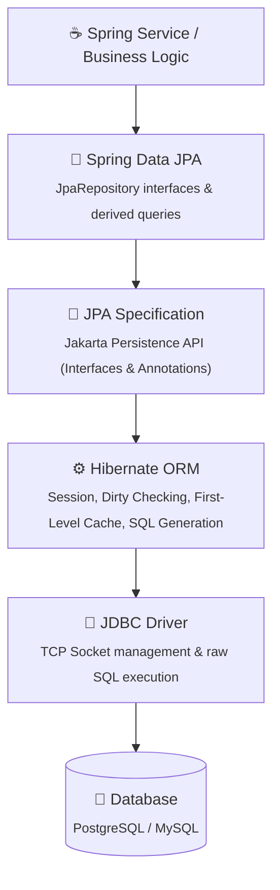
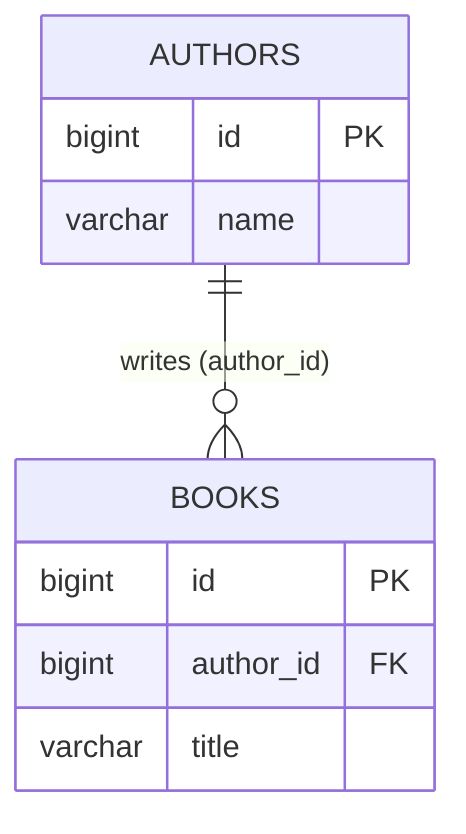
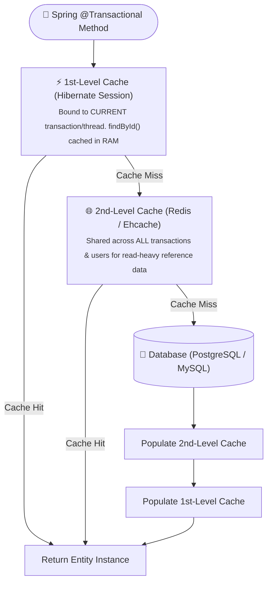

# Page 5: Database Persistence with Spring Data JPA & Hibernate

Welcome to Page 5 of the Java Backend Engineering series. In enterprise software, database interactions represent the single biggest bottleneck and source of production bugs. This page covers **Object-Relational Mapping (ORM)**, relationship mapping, and how to conquer the infamous **N+1 query problem**.

---

## 1. The Persistence Hierarchy: JDBC vs. JPA vs. Hibernate

Understanding the separation between specifications and implementations is essential:



- **JPA**: The specification (interfaces, annotations like `@Entity`, `@Id`, `@ManyToOne`).
- **Hibernate**: The engine that implements JPA and converts Java object graphs into SQL statements.
- **Spring Data JPA**: A library that generates repository implementations (`JpaRepository<User, Long>`) dynamically at runtime without you writing boilerplate DAO classes!

---

## 2. Entity Modeling Best Practices

```java
import jakarta.persistence.*;
import java.time.Instant;

@Entity
@Table(name = "users")
public class User {

    @Id
    @GeneratedValue(strategy = GenerationType.IDENTITY) // Uses DB auto-increment
    private Long id;

    @Column(nullable = false, unique = true, length = 50)
    private String email;

    @Column(nullable = false)
    private String passwordHash;

    @Enumerated(EnumType.STRING) // ✅ ALWAYS use STRING (never ORDINAL which breaks on enum reorder!)
    @Column(nullable = false, length = 20)
    private UserRole role;

    @Column(nullable = false, updatable = false)
    private Instant createdAt = Instant.now();

    // Protected or public no-arg constructor required by Hibernate:
    protected User() {}

    public User(String email, String passwordHash, UserRole role) {
        this.email = email;
        this.passwordHash = passwordHash;
        this.role = role;
    }

    // Getters and business methods...
}
```

---

## 3. Entity Relationships: Owning vs. Inverse Side

In relational databases, relationships are formed by **Foreign Keys (FK)**. In Java, relationships are formed by **Object References**.



### 1. The Golden Rule: `@ManyToOne` is Always the Owning Side
```java
@Entity
@Table(name = "books")
public class Book {
    @Id
    @GeneratedValue(strategy = GenerationType.IDENTITY)
    private Long id;

    private String title;

    // ✅ ALWAYS use LAZY fetch! (EAGER causes accidental multi-table joins)
    @ManyToOne(fetch = FetchType.LAZY, optional = false)
    @JoinColumn(name = "author_id", nullable = false) // Defines Foreign Key column
    private Author author;

    // constructor, getters, setters
}
```

### 2. The Inverse Side: `@OneToMany(mappedBy = "...")`
```java
@Entity
@Table(name = "authors")
public class Author {
    @Id
    @GeneratedValue(strategy = GenerationType.IDENTITY)
    private Long id;

    private String name;

    // mappedBy points to the field name in the Book class that owns the foreign key!
    @OneToMany(mappedBy = "author", cascade = CascadeType.ALL, orphanRemoval = true)
    private List<Book> books = new ArrayList<>();

    // Helper synchronization method for bidirectional consistency:
    public void addBook(Book book) {
        books.add(book);
        book.setAuthor(this);
    }

    public void removeBook(Book book) {
        books.remove(book);
        book.setAuthor(null);
    }
}
```

> [!WARNING]
> **Avoid `@ManyToMany` with simple `@JoinTable` in Production**:
> A raw `@ManyToMany` makes it impossible to store additional attributes on the relationship (e.g., `enrolled_date` in Student-Course). Always model many-to-many as two separate `@ManyToOne` relationships pointing to a dedicated join entity (e.g., `Enrollment`).

---

## 4. The Dreaded N+1 Query Problem & How to Conquer It

The **N+1 Problem** is the #1 performance bug in Spring/Hibernate backends.

### How It Happens:
Suppose you want to display a list of 100 books and their respective authors:

```java
// ❌ Generates N + 1 SQL Queries!
List<Book> books = bookRepository.findAll(); // Query 1: SELECT * FROM books;

for (Book book : books) {
    // Because author is LAZY, accessing getAuthor() fires a separate SQL query for EACH book!
    System.out.println(book.getTitle() + " by " + book.getAuthor().getName()); 
}
```
If there are 100 books, this executes **1 query for books + 100 queries for authors = 101 queries!** Under high traffic, this overwhelms and crashes the database.

```
Query 1:   SELECT * FROM books;
Query 2:   SELECT * FROM authors WHERE id = 1;
Query 3:   SELECT * FROM authors WHERE id = 2;
...
Query 101: SELECT * FROM authors WHERE id = 100;  (101 network round trips!)
```

### Solution 1: `JOIN FETCH` in JPQL (The Standard Fix)
`JOIN FETCH` forces Hibernate to fetch the parent and child entities in a **single SQL JOIN query**:

```java
public interface BookRepository extends JpaRepository<Book, Long> {

    // ✅ Executes 1 SQL query: SELECT b.*, a.* FROM books b INNER JOIN authors a ON b.author_id = a.id
    @Query("SELECT b FROM Book b JOIN FETCH b.author")
    List<Book> findAllWithAuthors();
}
```

### Solution 2: `@EntityGraph` (Declarative Fix)
Overrides the default `LAZY` fetching strategy on demand for a specific query without writing custom JPQL:

```java
public interface BookRepository extends JpaRepository<Book, Long> {

    @EntityGraph(attributePaths = {"author"})
    @Override
    List<Book> findAll(); // Automatically executes a single SQL JOIN query!
}
```

---

## 5. Hibernate Caching: First-Level vs. Second-Level



---

## 6. Database Pagination & Slicing: `Page<T>` vs. `Slice<T>`

When fetching large datasets from SQL databases, Spring Data JPA provides two distinct pagination interfaces: **`Page<T>`** and **`Slice<T>`**. Choosing the wrong one can degrade database throughput under high traffic.

### The Hidden Cost of `Page<T>`: The `COUNT(*)` Query

When a repository method returns `Page<T>`, Spring Data executes **two separate SQL queries**:
1. The paginated data query: `SELECT * FROM orders WHERE status = 'COMPLETED' LIMIT 20 OFFSET 0`
2. The total count query: `SELECT count(*) FROM orders WHERE status = 'COMPLETED'`

On tables with tens of millions of rows, `SELECT count(*)` can require a full index scan or sequential disk scan, taking seconds to finish!

### `Slice<T>`: The High-Performance Alternative

If your application uses **infinite scroll**, "Load More" buttons, or mobile feeds, you do not need to know the total page count—you only need to know if there is a **next page**.

`Slice<T>` executes **only ONE query**:
`SELECT * FROM orders WHERE status = 'COMPLETED' LIMIT 21 OFFSET 0` *(Requested size + 1)*

If the database returns 21 rows, Spring slices off the 21st record and sets `slice.hasNext() = true`—**without ever running `COUNT(*)`**!

```java
public interface OrderRepository extends JpaRepository<Order, Long> {

    // ❌ Slower on huge tables (executes data query + SELECT COUNT(*))
    Page<Order> findByStatus(OrderStatus status, Pageable pageable);

    // ⚡ Ultra-fast for infinite scroll / mobile (single query with LIMIT size + 1)
    Slice<Order> findSliceByStatus(OrderStatus status, Pageable pageable);
}
```

| Criteria | `Page<T>` | `Slice<T>` |
| :--- | :--- | :--- |
| **SQL Queries Executed** | 2 (`SELECT ... LIMIT` + `SELECT COUNT(*)`) | 1 (`SELECT ... LIMIT size + 1`) |
| **Total Count / Pages** | ✅ Available (`getTotalElements()`, `getTotalPages()`) | ❌ Not available (Only `hasNext()`, `hasPrevious()`) |
| **Best Used For** | Numbered pagination controls (e.g. `1, 2, 3... 100`) | Mobile apps, infinite scrolling, social feeds |

---

## 7. Production Schema Versioning with Flyway

In development tutorials, you often see:
```properties
spring.jpa.hibernate.ddl-auto=update
```

> [!CAUTION]
> **Production Anti-Pattern**: Setting `ddl-auto=update` in production will eventually corrupt data, lock active tables during peak traffic, fail silently during complex column type migrations, and offers zero rollback capability across multi-instance clusters.

In enterprise engineering, database schemas are treated as code, tracked in version control, and migrated deterministically using tools like **Flyway**.

### How Flyway Works

```
┌─────────────────────────────────────────────────────────────┐
│                   FLYWAY STARTUP WORKFLOW                   │
├─────────────────────────────────────────────────────────────┤
│  1. Spring Boot starts up                                   │
│  2. Flyway acquires DB cluster lock                         │
│  3. Reads `flyway_schema_history` table in DB               │
│  4. Scans classpath: `src/main/resources/db/migration`      │
│  5. Verifies checksums of previously applied scripts        │
│  6. Executes pending migrations in strict numerical order   │
│  7. Releases lock and hands DB connection to Hibernate     │
└─────────────────────────────────────────────────────────────┘
```

### Migration File Naming Convention
Flyway scripts reside in `src/main/resources/db/migration/`:

```
db/migration/
├── V1__create_users_and_orders_table.sql
├── V2__add_index_on_user_email.sql
└── V3__add_status_column_to_orders.sql
```

Naming format:
- `V` = Versioned migration
- `1` = Version number (supports dot notation, e.g. `V1.1__...`)
- `__` = Two underscores separator
- `description` = Snake-case description
- `.sql` = File extension

#### Example: `V1__create_users_and_orders_table.sql`
```sql
CREATE TABLE users (
    id BIGSERIAL PRIMARY KEY,
    email VARCHAR(255) NOT NULL UNIQUE,
    full_name VARCHAR(150) NOT NULL,
    created_at TIMESTAMP WITH TIME ZONE DEFAULT CURRENT_TIMESTAMP
);

CREATE TABLE orders (
    id BIGSERIAL PRIMARY KEY,
    user_id BIGINT NOT NULL REFERENCES users(id),
    total_amount NUMERIC(10, 2) NOT NULL,
    status VARCHAR(50) NOT NULL,
    created_at TIMESTAMP WITH TIME ZONE DEFAULT CURRENT_TIMESTAMP
);

CREATE INDEX idx_orders_user_id ON orders(user_id);
```

#### Production `application.yml` Setup:
```yaml
spring:
  jpa:
    hibernate:
      ddl-auto: validate # Hibernate only verifies that entity mappings match the DB schema!
  flyway:
    enabled: true
    baseline-on-migrate: true # Safe adoption for existing databases
    locations: classpath:db/migration
```

---

## 8. Self-Check & Quick Review

1. **Q**: Why should you never use `EnumType.ORDINAL` with `@Enumerated`?
   - *A*: `ORDINAL` saves the enum's position index (`0, 1, 2`) into the database. If a developer later inserts a new enum value at the top, all existing database rows will permanently map to the wrong enum values! Always use `EnumType.STRING`.
2. **Q**: What does `orphanRemoval = true` do in a `@OneToMany` relationship?
   - *A*: If a child entity is removed from the parent's collection (`author.getBooks().remove(book)`), Hibernate will automatically issue an SQL `DELETE FROM books WHERE id = ?` to remove the orphaned record from the database.
3. **Q**: What is the difference between `JOIN` and `JOIN FETCH` in JPQL?
   - *A*: A plain `JOIN` filters rows in SQL but only hydrates the root entity into memory (leaving the related entity uninitialized). A `JOIN FETCH` instructs Hibernate to initialize and populate the related child entities in the same query, eliminating the N+1 problem.
4. **Q**: When should you use `Slice<T>` instead of `Page<T>` in Spring Data JPA?
   - *A*: Use `Slice<T>` when you do not need the total element count (e.g., infinite scrolling, mobile feeds). It avoids the expensive `SELECT COUNT(*)` query by querying for `size + 1` rows to verify if a next page exists.
5. **Q**: Why is `spring.jpa.hibernate.ddl-auto=update` unacceptable in production?
   - *A*: It cannot safely perform column renames, drops, or zero-downtime alterations, has no migration history, and causes race conditions when multiple server instances boot simultaneously. Production systems use versioned tools like Flyway with `ddl-auto=validate`.

---

## 🧭 Continue Learning

| ◀️ Previous Topic | 🧭 Track Hub | Next Topic ▶️ |
| :--- | :---: | ---: |
| [**Page 4: REST APIs & Validation**](04-restful-apis-dto-and-validation.md)<br><sub>*DTO Pattern, Jakarta Validation & Error Handling*</sub> | [**Java Backend Index**](README.md)<br><sub>*Curriculum & Architecture*</sub> | [**Page 6: Transactions & Locking**](06-transaction-management-and-locking.md)<br><sub>*@Transactional, Isolation & Concurrency Locks*</sub> |

