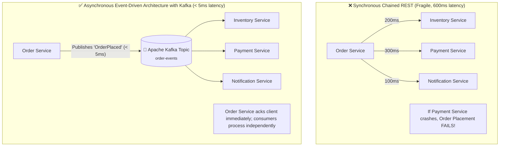

# Page 9: Asynchronous Messaging & Apache Kafka

Welcome to Page 9 of the Java Backend Engineering series. In modern microservices, synchronous REST calls tightly couple services: if the Payment service slows down, the Order service hangs and crashes. **Asynchronous event-driven architecture with Apache Kafka** decouples systems, absorbs traffic bursts, and enables resilient distributed processing.

---

## 1. Synchronous REST vs. Asynchronous Event-Driven Flow



---

## 2. Apache Kafka Architecture: Partitions & Consumer Groups

1. **Topic**: A category/feed name to which records are published (e.g., `order-events`).
2. **Partition**: The physical append-only log file on disk. Partitions allow topics to scale across multiple broker servers.
3. **Consumer Group**: A set of consumers cooperating to read data.

```text
╭─────────────────────────────────────────────────────────────────────────────╮
│              Apache Kafka Topic: "order-events" Partitions                  │
├─────────────────────────────────────────────────────────────────────────────┤
│ Partition 0: [ Msg 0 | Msg 1 | Msg 2 | Msg 3 ] ➔ Consumer 1 (Group A)       │
│ Partition 1: [ Msg 0 | Msg 1 | Msg 2 | Msg 3 ] ➔ Consumer 2 (Group A)       │
│ Partition 2: [ Msg 0 | Msg 1 | Msg 2 | Msg 3 ] ➔ Consumer 3 (Group A)       │
├─────────────────────────────────────────────────────────────────────────────┤
│ 💡 Rule: 1 partition is assigned to at most 1 consumer instance in a group  │
│ 💡 Message Key: Hashing message key (e.g. userId) guarantees FIFO ordering │
╰─────────────────────────────────────────────────────────────────────────────╯
```

> [!IMPORTANT]
> **Strict Ordering Guarantee**:
> In Kafka, ordering is **only guaranteed within a single partition**, not across the entire topic!
> To ensure all orders for `userId = 123` are processed in strict chronological order, use `userId` as the **Kafka message key**. Kafka hashes the key so all messages with that key always route to the **same partition**.

---

## 3. Spring for Apache Kafka Implementation

### 1. Production Kafka Producer:

```java
import org.springframework.kafka.core.KafkaTemplate;
import org.springframework.kafka.support.SendResult;
import org.springframework.stereotype.Service;

import java.util.concurrent.CompletableFuture;

@Service
public class OrderEventProducer {

    private final KafkaTemplate<String, OrderEvent> kafkaTemplate;

    public OrderEventProducer(KafkaTemplate<String, OrderEvent> kafkaTemplate) {
        this.kafkaTemplate = kafkaTemplate;
    }

    public void publishOrderPlaced(OrderEvent event) {
        String topic = "order-events";
        String key = event.userId().toString(); // Ensures per-user partition ordering!

        CompletableFuture<SendResult<String, OrderEvent>> future = 
                kafkaTemplate.send(topic, key, event);

        future.whenComplete((result, ex) -> {
            if (ex == null) {
                System.out.println("Event published to partition: " + 
                        result.getRecordMetadata().partition() + 
                        " offset: " + result.getRecordMetadata().offset());
            } else {
                System.err.println("Failed to publish event: " + ex.getMessage());
                // Handle retry or write to local fallback table
            }
        });
    }
}
```

### 2. Resilient Kafka Consumer with Manual Acknowledgment:

```java
import org.apache.kafka.clients.consumer.ConsumerRecord;
import org.springframework.kafka.annotation.KafkaListener;
import org.springframework.kafka.support.Acknowledgment;
import org.springframework.stereotype.Service;

@Service
public class InventoryConsumer {

    @KafkaListener(
        topics = "order-events",
        groupId = "inventory-service-group",
        containerFactory = "kafkaListenerContainerFactory"
    )
    public void handleOrderPlaced(ConsumerRecord<String, OrderEvent> record, Acknowledgment ack) {
        OrderEvent event = record.value();
        System.out.println("Processing inventory reservation for order: " + event.orderId());

        try {
            // 1. Process business logic (reserve stock)
            reserveInventory(event.productId(), event.quantity());

            // 2. Commit offset manually ONLY after success (At-Least-Once Delivery)
            ack.acknowledge();
        } catch (Exception e) {
            System.err.println("Error processing record: " + e.getMessage());
            // Rethrowing triggers Spring Kafka's Dead Letter Queue (DLQ) recovery
            throw e; 
        }
    }

    private void reserveInventory(Long productId, int quantity) {
        // updates database stock
    }
}
```

---

## 4. Error Handling & Dead Letter Queues (DLQ)

When a consumer encounters a "poison pill" (corrupted JSON or bug in business logic), retrying indefinitely blocks the entire partition!

Spring Kafka provides the **`DeadLetterPublishingRecoverer`**:

```java
@Configuration
public class KafkaConsumerConfig {

    @Bean
    public DefaultErrorHandler errorHandler(KafkaTemplate<Object, Object> template) {
        // 1. Retry up to 3 times with 1-second backoff
        // 2. If all 3 retries fail, publish record to Dead Letter Topic: "order-events.DLT"
        var recoverer = new DeadLetterPublishingRecoverer(template);
        var backOff = new FixedBackOff(1000L, 3L);
        return new DefaultErrorHandler(recoverer, backOff);
    }
}
```

---

## 5. Domain Events in Spring: `@TransactionalEventListener`

What happens if you publish an event inside a database transaction, but the transaction rolls back?

```java
@Transactional
public void placeOrder(Order order) {
    orderRepository.save(order);
    
    // ❌ DANGEROUS: If DB commit fails on the next line, the email is already sent!
    kafkaTemplate.send("order-events", new OrderPlacedEvent(order.getId())); 
}
```

### The Fix: Spring's `@TransactionalEventListener`
Spring allows listening to events **only after the database transaction successfully commits**:

```java
@Service
public class OrderService {
    private final ApplicationEventPublisher eventPublisher;

    public OrderService(ApplicationEventPublisher eventPublisher) {
        this.eventPublisher = eventPublisher;
    }

    @Transactional
    public void placeOrder(Order order) {
        orderRepository.save(order);
        // Publishes internal Spring event
        eventPublisher.publishEvent(new OrderPlacedEvent(order.getId()));
    }
}

@Component
public class OrderEventListener {

    private final KafkaTemplate<String, Object> kafkaTemplate;

    public OrderEventListener(KafkaTemplate<String, Object> kafkaTemplate) {
        this.kafkaTemplate = kafkaTemplate;
    }

    // ✅ Executed ONLY AFTER the database transaction successfully commits!
    @TransactionalEventListener(phase = TransactionPhase.AFTER_COMMIT)
    public void handleOrderPlaced(OrderPlacedEvent event) {
        kafkaTemplate.send("order-events", event);
    }
}
```

---

## 6. Self-Check & Quick Review

1. **Q**: How do you guarantee the ordering of messages in Apache Kafka?
   - *A*: By specifying a consistent message **key** (e.g., `userId` or `orderId`). Kafka hashes the key to ensure all messages with that key always route to the exact same partition.
2. **Q**: What is a Dead Letter Topic (DLT)?
   - *A*: A dedicated Kafka topic where failed/unparseable messages ("poison pills") are routed after a configured number of retries, preventing consumer lag and partition blockage.
3. **Q**: Why should you use `TransactionPhase.AFTER_COMMIT` when publishing Kafka events from a database transaction?
   - *A*: To ensure external events are not published if the local database transaction rolls back, preventing "phantom events" (e.g., sending an order confirmation email for an order that failed to save).

---

## 🧭 Continue Learning

| ◀️ Previous Topic | 🧭 Track Hub | Next Topic ▶️ |
| :--- | :---: | ---: |
| [**Page 8: Caching & Redis Integration**](08-caching-and-redis-integration.md)<br><sub>*Spring Cache, RedisTemplate & Stampede Fixes*</sub> | [**Java Backend Index**](README.md)<br><sub>*Curriculum & Architecture*</sub> | [**Page 10: Microservices with Spring Cloud**](10-microservices-with-spring-cloud.md)<br><sub>*API Gateway, Eureka Discovery & OpenFeign*</sub> |
