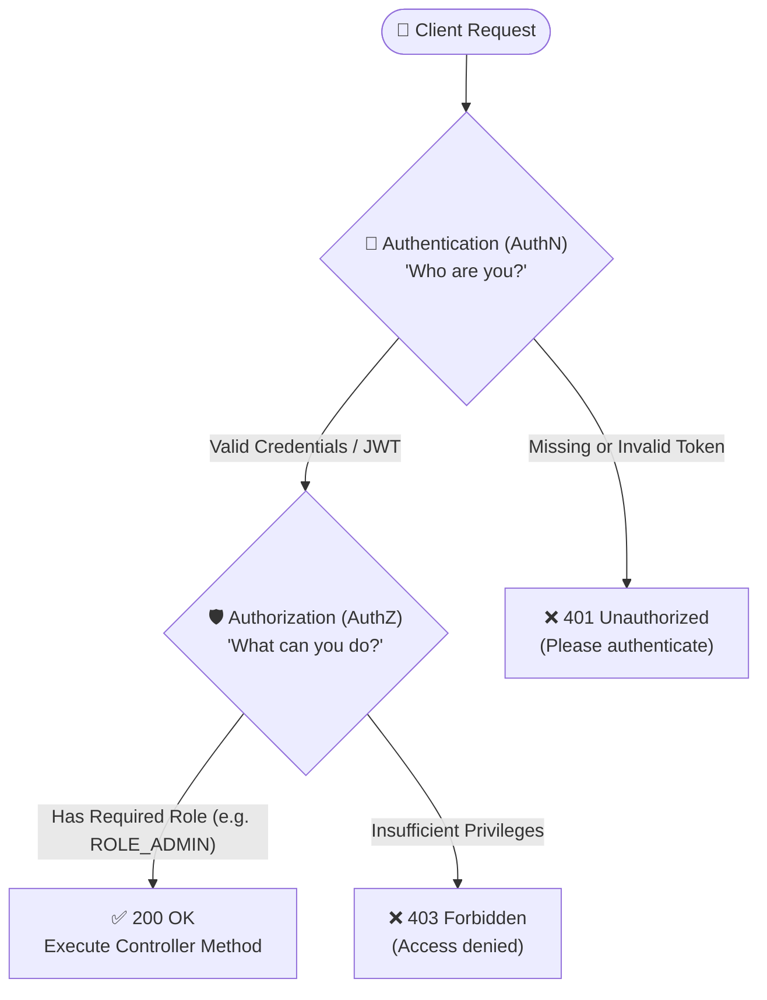
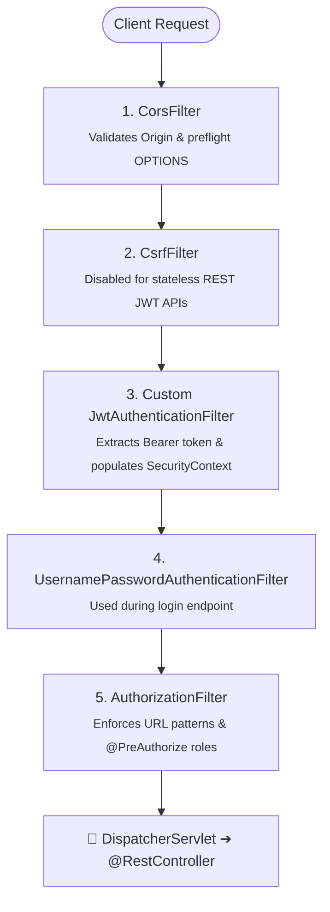

# Page 11: Backend Security with Spring Security & JWT

Welcome to Page 11 of the Java Backend Engineering series. Security is not an afterthought—it must be architected from day one. In this page, we cover modern **Spring Security 6 (Spring Boot 3.x)**, the internal **Security Filter Chain**, password hashing with **BCrypt**, and a complete, production-ready **Stateless JWT Authentication** implementation.

---

## 1. Authentication vs. Authorization



---

## 2. Spring Security 6 Architecture: The `SecurityFilterChain`

In modern Spring Boot 3, configuration is 100% component-based using the **`SecurityFilterChain`** bean (the legacy `WebSecurityConfigurerAdapter` is completely removed).



---

## 3. Password Hashing: Why BCrypt is Mandatory

> [!CAUTION]
> **Never use MD5 or SHA-256 for passwords!**
> Fast hash algorithms (like MD5 or SHA-256) can calculate billions of hashes per second, making them trivial to crack using GPU rainbow tables.

### Why BCrypt is the Enterprise Standard:
1. **Automatic Salting**: Generates a cryptographically random 16-byte salt for every password, ensuring identical passwords generate completely different hashes.
2. **Work Factor (Adaptive Cost)**: Configurable iteration rounds ($2^{10} = 1,024$ rounds) that deliberately slow down the hashing process to thwart brute-force cracking attempts.

```java
@Bean
public PasswordEncoder passwordEncoder() {
    return new BCryptPasswordEncoder(12); // Work factor 12
}

// Storing in DB:
String hashed = passwordEncoder.encode("mySecretPassword123");
// Verification during login:
boolean matches = passwordEncoder.matches("mySecretPassword123", hashed);
```

---

## 4. Stateless JWT Authentication: Step-by-Step Implementation

### Step 1: JWT Utility Provider (`JwtTokenProvider.java`)

```java
import io.jsonwebtoken.*;
import io.jsonwebtoken.security.Keys;
import org.springframework.stereotype.Component;

import javax.crypto.SecretKey;
import java.nio.charset.StandardCharsets;
import java.util.Date;

@Component
public class JwtTokenProvider {

    // Minimum 256-bit secret key for HMAC-SHA256
    private static final String SECRET = "your-ultra-secure-256-bit-secret-key-that-is-very-long!";
    private final SecretKey key = Keys.hmacShaKeyFor(SECRET.getBytes(StandardCharsets.UTF_8));
    private final long validityInMilliseconds = 3600000; // 1 hour

    // Generate Token upon successful login
    public String createToken(String username, String role) {
        Date now = new Date();
        Date validity = new Date(now.getTime() + validityInMilliseconds);

        return Jwts.builder()
                .subject(username)
                .claim("role", role)
                .issuedAt(now)
                .expiration(validity)
                .signWith(key)
                .compact();
    }

    // Validate Signature and Expiration
    public boolean validateToken(String token) {
        try {
            Jwts.parser().verifyWith(key).build().parseSignedClaims(token);
            return true;
        } catch (JwtException | IllegalArgumentException e) {
            return false; // Token is expired or signature tampered with
        }
    }

    public String getUsername(String token) {
        return Jwts.parser().verifyWith(key).build()
                .parseSignedClaims(token).getPayload().getSubject();
    }
}
```

---

### Step 2: Custom JWT Request Filter (`JwtAuthenticationFilter.java`)

```java
import jakarta.servlet.FilterChain;
import jakarta.servlet.ServletException;
import jakarta.servlet.http.HttpServletRequest;
import jakarta.servlet.http.HttpServletResponse;
import org.springframework.security.authentication.UsernamePasswordAuthenticationToken;
import org.springframework.security.core.context.SecurityContextHolder;
import org.springframework.security.core.userdetails.UserDetails;
import org.springframework.security.core.userdetails.UserDetailsService;
import org.springframework.security.web.authentication.WebAuthenticationDetailsSource;
import org.springframework.stereotype.Component;
import org.springframework.web.filter.OncePerRequestFilter;

import java.io.IOException;

@Component
public class JwtAuthenticationFilter extends OncePerRequestFilter {

    private final JwtTokenProvider tokenProvider;
    private final UserDetailsService userDetailsService;

    public JwtAuthenticationFilter(JwtTokenProvider tokenProvider, UserDetailsService userDetailsService) {
        this.tokenProvider = tokenProvider;
        this.userDetailsService = userDetailsService;
    }

    @Override
    protected void doFilterInternal(HttpServletRequest request, HttpServletResponse response, FilterChain filterChain)
            throws ServletException, IOException {

        String header = request.getHeader("Authorization");

        // 1. Check for "Bearer <token>"
        if (header != null && header.startsWith("Bearer ")) {
            String token = header.substring(7);

            // 2. Validate Token
            if (tokenProvider.validateToken(token)) {
                String username = tokenProvider.getUsername(token);
                UserDetails userDetails = userDetailsService.loadUserByUsername(username);

                // 3. Set Authentication into Spring's SecurityContextHolder
                var auth = new UsernamePasswordAuthenticationToken(
                        userDetails, null, userDetails.getAuthorities());
                auth.setDetails(new WebAuthenticationDetailsSource().buildDetails(request));
                SecurityContextHolder.getContext().setAuthentication(auth);
            }
        }

        // 4. Continue the filter chain
        filterChain.doFilter(request, response);
    }
}
```

---

### Step 3: Modern Security Configuration (`SecurityConfig.java`)

```java
import org.springframework.context.annotation.Bean;
import org.springframework.context.annotation.Configuration;
import org.springframework.security.config.annotation.method.configuration.EnableMethodSecurity;
import org.springframework.security.config.annotation.web.builders.HttpSecurity;
import org.springframework.security.config.http.SessionCreationPolicy;
import org.springframework.security.web.SecurityFilterChain;
import org.springframework.security.web.authentication.UsernamePasswordAuthenticationFilter;

@Configuration
@EnableMethodSecurity // Enables @PreAuthorize("hasRole('ADMIN')")
public class SecurityConfig {

    private final JwtAuthenticationFilter jwtAuthFilter;

    public SecurityConfig(JwtAuthenticationFilter jwtAuthFilter) {
        this.jwtAuthFilter = jwtAuthFilter;
    }

    @Bean
    public SecurityFilterChain securityFilterChain(HttpSecurity http) throws Exception {
        http
            // 1. Disable CSRF (Stateless REST APIs using JWT are immune to CSRF!)
            .csrf(csrf -> csrf.disable())

            // 2. Stateless session management (No JSESSIONID cookie generated)
            .sessionManagement(session -> session.sessionCreationPolicy(SessionCreationPolicy.STATELESS))

            // 3. URL Authorization Rules
            .authorizeHttpRequests(auth -> auth
                .requestMatchers("/api/v1/auth/**").permitAll() // Public login/register endpoints
                .requestMatchers("/api/v1/admin/**").hasRole("ADMIN")
                .anyRequest().authenticated()
            )

            // 4. Inject our custom JWT filter before the standard username/password filter
            .addFilterBefore(jwtAuthFilter, UsernamePasswordAuthenticationFilter.class);

        return http.build();
    }
}
```

---

## 5. Role-Based Access Control (RBAC) in Action

With `@EnableMethodSecurity`, you can secure individual business methods declaratively:

```java
@RestController
@RequestMapping("/api/v1/users")
public class UserController {

    @PreAuthorize("hasRole('ADMIN')") // Only users with 'ROLE_ADMIN' can execute this!
    @DeleteMapping("/{id}")
    public ResponseEntity<Void> deleteUser(@PathVariable Long id) {
        userService.deleteUser(id);
        return ResponseEntity.noContent().build();
    }
}
```

---

## 6. Self-Check & Quick Review

1. **Q**: Why is CSRF (Cross-Site Request Forgery) protection safely disabled in stateless JWT REST backends?
   - *A*: CSRF attacks exploit web browsers automatically attaching stored session cookies to cross-origin requests. Because stateless REST APIs use `Authorization: Bearer <token>` stored in memory rather than ambient browser cookies, cross-origin sites cannot forge authenticated requests.
2. **Q**: What happens when `SecurityContextHolder.getContext().setAuthentication(auth)` is called?
   - *A*: It associates the authenticated user's identity and granted roles with the **current thread's execution context**, allowing downstream controllers and `@PreAuthorize` checks to verify authorization.
3. **Q**: What is the purpose of the salt in BCrypt?
   - *A*: It ensures that two users with the identical password (e.g., `"password123"`) will have completely different hashes stored in the database, defeating precomputed rainbow table lookup attacks.

---

## 🧭 Continue Learning

| ◀️ Previous Topic | 🧭 Track Hub | Next Topic ▶️ |
| :--- | :---: | ---: |
| [**Page 10: Microservices with Spring Cloud**](10-microservices-with-spring-cloud.md)<br><sub>*API Gateway, Eureka Discovery & OpenFeign*</sub> | [**Java Backend Index**](README.md)<br><sub>*Curriculum & Architecture*</sub> | [**Page 12: Production & Resilience**](12-production-readiness-and-resilience.md)<br><sub>*Actuator, Prometheus, Tracing & Resilience4j*</sub> |
