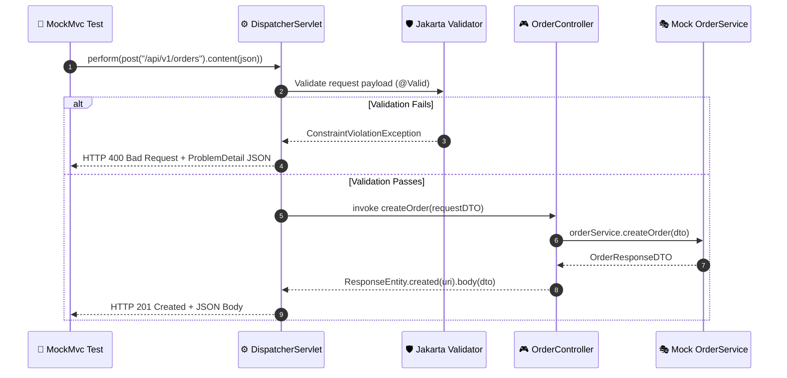

# Testing, Build Tools & Application Packaging in Spring Boot

In professional software engineering, writing code is only half the battle. Delivering reliable backend services requires mastering **automated testing pyramids**, **dependency management**, and **production container packaging**.

---

## 1. The Spring Boot Testing Pyramid

Testing distributed backend applications requires balancing execution speed, diagnostic precision, and environment realism.

```
┌─────────────────────────────────────────────────────────────┐
│                 SPRING BOOT TESTING PYRAMID                 │
├─────────────────────────────────────────────────────────────┤
│                                                             │
│                      ▲                                      │
│                     / \       E2E / Integration Tests       │
│                    /   \      • @SpringBootTest             │
│                   /     \     • Real DB (Testcontainers)    │
│                  /───────\    • Slowest (~5-30s), Real Port │
│                 /         \                                 │
│                /           \    Architectural Slice Tests   │
│               /  SLICES     \   • @WebMvcTest (Controllers) │
│              /               \  • @DataJpaTest (Repository) │
│             /─────────────────\ Fast (~500ms), Focused      │
│            /                   \                            │
│           /                     \  Pure Unit Tests          │
│          /      UNIT TESTS       \ • JUnit 5 + Mockito      │
│         /                         \• No Spring Context      │
│        /───────────────────────────\Blazing Fast (~5-10ms)  │
│                                                             │
└─────────────────────────────────────────────────────────────┘
```

| Test Type | Spring Context Loaded? | Database Loaded? | Speed | Primary Purpose |
| :--- | :---: | :---: | :---: | :--- |
| **Unit Test** | ❌ No | ❌ No | ~5 ms | Complex business logic and edge cases |
| **`@WebMvcTest`** | ⚠️ Web slice only | ❌ No | ~500 ms | HTTP routing, JSON serialization, validation rules |
| **`@DataJpaTest`** | ⚠️ JPA slice only | ⚠️ In-memory / Testcontainer | ~1 s | Custom SQL queries, entity mappings, repository logic |
| **`@SpringBootTest`** | ✅ Complete Context | ✅ Testcontainers / DB | ~5–20 s | End-to-end workflow verification across all layers |

---

## 2. Build Tools & Dependency Management: Maven vs. Gradle

Java backends rely on **Apache Maven** (`pom.xml`) or **Gradle** (`build.gradle`) to compile code, resolve third-party libraries, and bundle executables.

### The Bill of Materials (BOM) Pattern
Spring Boot manages hundreds of library versions through its parent BOM:

```xml
<parent>
    <groupId>org.springframework.boot</groupId>
    <artifactId>spring-boot-starter-parent</artifactId>
    <version>3.2.3</version>
</parent>
```

> [!TIP]
> **Why Starter Parents Matter**: You do not need to specify `<version>` tags for Spring-managed dependencies (like Jackson, Hibernate, Kafka, or PostgreSQL driver). The BOM guarantees that all included library versions are mutually compatible and free from binary conflicts.

### Dependency Scopes Breakdown

```xml
<dependencies>
    <!-- 1. Compile & Runtime: Needed everywhere -->
    <dependency>
        <groupId>org.springframework.boot</groupId>
        <artifactId>spring-boot-starter-web</artifactId>
    </dependency>

    <!-- 2. Compile-Only: Stripped from final JAR (Lombok, Annotation Processors) -->
    <dependency>
        <groupId>org.projectlombok</groupId>
        <artifactId>lombok</artifactId>
        <optional>true</optional>
    </dependency>

    <!-- 3. Runtime-Only: Needed at runtime, not during compilation -->
    <dependency>
        <groupId>org.postgresql</groupId>
        <artifactId>postgresql</artifactId>
        <scope>runtime</scope>
    </dependency>

    <!-- 4. Test-Only: Never packaged into the production artifact -->
    <dependency>
        <groupId>org.springframework.boot</groupId>
        <artifactId>spring-boot-starter-test</artifactId>
        <scope>test</scope>
    </dependency>
</dependencies>
```

---

## 3. Packaging & Deploying: The Spring Boot "Fat JAR"

When you execute:
```bash
mvn clean package
```

The `spring-boot-maven-plugin` packages your application into an executable **Fat / Uber JAR**.

### How a Fat JAR Works Under the Hood
A standard Java JAR cannot natively nest other JAR files inside itself. Spring Boot solves this by embedding a specialized classloader:

```
target/order-service-1.0.0.jar
├── META-INF/
│   └── MANIFEST.MF (Main-Class: org.springframework.boot.loader.JarLauncher)
├── org/springframework/boot/loader/ (Spring's custom nested JAR launcher)
└── BOOT-INF/
    ├── classes/                     (Your compiled .class files and application.yml)
    └── lib/                         (All third-party dependency .jar files)
```

When you execute `java -jar app.jar`:
1. The JVM invokes Spring's `JarLauncher`.
2. `JarLauncher` creates a virtual classpath indexing all nested JARs inside `BOOT-INF/lib/`.
3. `JarLauncher` delegates control to your actual application class (`Application.main()`).

### Production Multi-Stage Dockerfile

```dockerfile
# Stage 1: Build the artifact
FROM eclipse-temurin:21-jdk-alpine AS builder
WORKDIR /workspace
COPY . .
RUN ./mvnw clean package -DskipTests

# Stage 2: Minimal, secure runtime image
FROM eclipse-temurin:21-jre-alpine
WORKDIR /app
RUN addgroup -S spring && adduser -S spring -G spring
USER spring:spring
COPY --from=builder /workspace/target/*.jar app.jar

ENV JAVA_OPTS="-XX:+UseG1GC -XX:MaxRAMPercentage=75.0"
ENTRYPOINT ["sh", "-c", "java $JAVA_OPTS -jar app.jar"]
```

---

## 4. Pure Unit Testing with JUnit 5 & Mockito

Unit tests execute directly in memory with **zero Spring overhead**, running in under $10\text{ ms}$.

```java
@ExtendWith(MockitoExtension.class)
class OrderServiceTest {

    @Mock
    private OrderRepository orderRepository;

    @Mock
    private PaymentGateway paymentGateway;

    @InjectMocks
    private OrderService orderService; // Injects mocks into OrderService constructor

    @Test
    @DisplayName("Should successfully process order when payment succeeds")
    void processOrder_Success() {
        // 1. Arrange (Given)
        CreateOrderRequest request = new CreateOrderRequest("user-1", new BigDecimal("99.99"));
        Order savedOrder = new Order(1L, "user-1", new BigDecimal("99.99"), OrderStatus.CREATED);

        when(orderRepository.save(any(Order.class))).thenReturn(savedOrder);
        when(paymentGateway.charge(eq("user-1"), any(BigDecimal.class))).thenReturn(true);

        // 2. Act (When)
        OrderResponseDTO response = orderService.createOrder(request);

        // 3. Assert (Then)
        assertThat(response).isNotNull();
        assertThat(response.id()).isEqualTo(1L);
        assertThat(response.status()).isEqualTo(OrderStatus.PAID);

        // Verify repository interaction
        verify(orderRepository, times(1)).save(any(Order.class));
        verify(paymentGateway, times(1)).charge("user-1", new BigDecimal("99.99"));
    }

    @Test
    @DisplayName("Should throw PaymentFailedException when gateway declines payment")
    void processOrder_PaymentDeclined_ThrowsException() {
        CreateOrderRequest request = new CreateOrderRequest("user-1", new BigDecimal("99.99"));
        when(paymentGateway.charge(anyString(), any(BigDecimal.class))).thenReturn(false);

        assertThrows(PaymentFailedException.class, () -> orderService.createOrder(request));

        // Verify that database save was never called
        verify(orderRepository, never()).save(any(Order.class));
    }
}
```

---

## 5. Web Layer Slice Testing: `@WebMvcTest` & `MockMvc`

`@WebMvcTest` starts only the Spring Web infrastructure (`DispatcherServlet`, validation, JSON serialization, and filters). It **does not** start the database or application context.



### Writing a `@WebMvcTest`

```java
@WebMvcTest(OrderController.class)
class OrderControllerTest {

    @Autowired
    private MockMvc mockMvc;

    @Autowired
    private ObjectMapper objectMapper;

    @MockBean
    private OrderService orderService; // Spring replaces the real service with a Mockito mock

    @Test
    @DisplayName("POST /api/v1/orders - Valid Payload returns 201 Created")
    void createOrder_ValidPayload_Returns201() throws Exception {
        CreateOrderRequest request = new CreateOrderRequest("user-123", new BigDecimal("49.99"));
        OrderResponseDTO response = new OrderResponseDTO(10L, "user-123", new BigDecimal("49.99"), OrderStatus.PAID);

        when(orderService.createOrder(any(CreateOrderRequest.class))).thenReturn(response);

        mockMvc.perform(post("/api/v1/orders")
                .contentType(MediaType.APPLICATION_JSON)
                .content(objectMapper.writeValueAsString(request)))
                .andExpect(status().isCreated())
                .andExpect(header().exists("Location"))
                .andExpect(jsonPath("$.id").value(10))
                .andExpect(jsonPath("$.status").value("PAID"));
    }

    @Test
    @DisplayName("POST /api/v1/orders - Invalid Payload returns 400 Bad Request")
    void createOrder_InvalidPayload_Returns400() throws Exception {
        // Missing required fields triggering @NotBlank validation
        CreateOrderRequest invalidRequest = new CreateOrderRequest("", new BigDecimal("-10.00"));

        mockMvc.perform(post("/api/v1/orders")
                .contentType(MediaType.APPLICATION_JSON)
                .content(objectMapper.writeValueAsString(invalidRequest)))
                .andExpect(status().isBadRequest())
                .andExpect(jsonPath("$.title").value("Validation Error"))
                .andExpect(jsonPath("$.errors.userId").exists());
    }
}
```

---

## 6. Data Layer Testing: `@DataJpaTest` & Testcontainers

In-memory databases like H2 can disguise bugs because H2 does not support PostgreSQL-specific JSONB operators, window functions, or locking syntax. **Testcontainers** spins up an actual PostgreSQL container in Docker for tests.

```java
@DataJpaTest
@Testcontainers
@AutoConfigureTestDatabase(replace = AutoConfigureTestDatabase.Replace.NONE) // Don't replace with H2!
class UserRepositoryTest {

    @Container
    static PostgreSQLContainer<?> postgres = new PostgreSQLContainer<>("postgres:16-alpine");

    @DynamicPropertySource
    static void configureProperties(DynamicPropertyRegistry registry) {
        registry.add("spring.datasource.url", postgres::getJdbcUrl);
        registry.add("spring.datasource.username", postgres::getUsername);
        registry.add("spring.datasource.password", postgres::getPassword);
    }

    @Autowired
    private UserRepository userRepository;

    @Test
    void findByEmail_ReturnsUser() {
        User user = new User("alice@example.com", "Alice Smith");
        userRepository.save(user);

        Optional<User> found = userRepository.findByEmail("alice@example.com");

        assertThat(found).isPresent();
        assertThat(found.get().getFullName()).isEqualTo("Alice Smith");
    }
}
```

---

## 7. Full Integration Testing: `@SpringBootTest`

Integration tests boot the entire Spring application on a random port, verifying that all beans, filters, security chains, and database operations execute harmoniously.

```java
@SpringBootTest(webEnvironment = SpringBootTest.WebEnvironment.RANDOM_PORT)
class OrderIntegrationTest {

    @Autowired
    private TestRestTemplate restTemplate;

    @Autowired
    private OrderRepository orderRepository;

    @Test
    void endToEndOrderCreationFlow() {
        CreateOrderRequest request = new CreateOrderRequest("user-99", new BigDecimal("120.00"));

        ResponseEntity<OrderResponseDTO> response = restTemplate.postForEntity(
                "/api/v1/orders", request, OrderResponseDTO.class);

        assertThat(response.getStatusCode()).isEqualTo(HttpStatus.CREATED);
        assertThat(response.getBody()).isNotNull();

        // Verify entity persisted in real database
        Long generatedId = response.getBody().id();
        assertThat(orderRepository.findById(generatedId)).isPresent();
    }
}
```

---

## 8. Self-Check & Quick Review

1. **Q**: What is the key performance advantage of `@WebMvcTest` over `@SpringBootTest`?
   - *A*: `@WebMvcTest` only starts the web layer (controller, security filters, Jackson, validation) and ignores database beans, messaging listeners, and background tasks. It boots in hundreds of milliseconds rather than tens of seconds.
2. **Q**: What is the difference between `@Mock` and `@MockBean`?
   - *A*: `@Mock` is a pure Mockito annotation used in unit tests without Spring. `@MockBean` is a Spring Boot annotation that replaces an existing bean inside the running `ApplicationContext` with a Mockito mock.
3. **Q**: Why are BOMs (Bill of Materials) used in Maven/Gradle builds?
   - *A*: BOMs define coordinated, pre-tested library dependency versions, preventing version mismatches and `NoSuchMethodError` classpath conflicts.
4. **Q**: Why should you prefer Testcontainers over an in-memory H2 database for JPA testing?
   - *A*: H2 has different SQL dialects, locking semantics, and indexing algorithms than production engines like PostgreSQL or MySQL. Testcontainers guarantees tests run against the exact same engine used in production.
5. **Q**: How does a Spring Boot Fat JAR execute when standard Java JARs cannot nest JARs?
   - *A*: Spring Boot embeds `JarLauncher` as the `Main-Class` in the manifest. On startup, `JarLauncher` unpacks virtual classloaders to read dependencies directly from the nested `BOOT-INF/lib/` directory.

---

## 🧭 Continue Learning

| ◀️ Previous Topic | 🧭 Track Hub | 🚀 Next Track |
| :--- | :---: | ---: |
| [**Page 12: Production Readiness**](12-production-readiness-and-resilience.md)<br><sub>*Actuator, Observability & Graceful Shutdown*</sub> | [**Java Backend Index**](README.md)<br><sub>*Curriculum & Architecture*</sub> | [**System Design Fundamentals**](../../system-design/system-design-fundamentals/README.md)<br><sub>*High-Level Architecture & Scaling*</sub> |
