# Java Backend Engineering: Zero to Production

Welcome to the comprehensive, enterprise-grade guide to **Java Backend Development**. This guide is designed for students, interview candidates, and engineers who want to master how real-world backend applications are architected, developed, secured, and scaled using modern **Java 17/21** and the **Spring Boot 3.x** ecosystem.

---

## 🗺️ Master Visual Learning Roadmap

```mermaid
flowchart TD
    subgraph S1["🌱 STAGE 1: The Foundations"]
        P00["Page 00: Master Roadmap & Mental Model<br/><sub>Client ➔ Controller ➔ Service ➔ DB</sub>"]
        P01["Page 01: Web & HTTP Protocols<br/><sub>Request/Response, Methods, Status Codes, REST</sub>"]
    end

    subgraph S2["⚙️ STAGE 2: The Java Web Engine"]
        P02["Page 02: Servlets & Spring MVC<br/><sub>Tomcat, DispatcherServlet, Filters vs Interceptors</sub>"]
        P03["Page 03: Spring Framework & Boot Core<br/><sub>IoC, Dependency Injection, Beans, Auto-Configuration</sub>"]
    end

    subgraph S3["💾 STAGE 3: Data Persistence & Business Logic"]
        P04["Page 04: REST APIs & Validation<br/><sub>DTO Pattern, Jakarta Validation, @RestControllerAdvice</sub>"]
        P05["Page 05: Database Persistence<br/><sub>Spring Data JPA, Hibernate ORM, N+1 Query Fixes</sub>"]
        P06["Page 06: Transactions & Locking<br/><sub>@Transactional, Propagation, Optimistic vs Pessimistic</sub>"]
    end

    subgraph S4["⚡ STAGE 4: Performance & Async Processing"]
        P07["Page 07: Async & Virtual Threads<br/><sub>CompletableFuture, Java 21 Loom, ScopedValue</sub>"]
        P08["Page 08: Caching with Redis<br/><sub>Spring Cache, RedisTemplate, Cache-Aside, Stampede</sub>"]
    end

    subgraph S5["📡 STAGE 5: Distributed & Event-Driven Systems"]
        P09["Page 09: Messaging with Apache Kafka<br/><sub>Event-Driven, KafkaTemplate, Offsets, DLQ</sub>"]
        P10["Page 10: Microservices with Spring Cloud<br/><sub>API Gateway, Eureka Discovery, OpenFeign</sub>"]
    end

    subgraph S6["🛡️ STAGE 6: Enterprise Security & Resilience"]
        P11["Page 11: Backend Security with JWT<br/><sub>SecurityFilterChain, Stateless Auth Filter, RBAC</sub>"]
        P12["Page 12: Production Observability & Resilience<br/><sub>Actuator, Prometheus, Distributed Tracing, Resilience4j</sub>"]
    end

    S1 --> S2 --> S3 --> S4 --> S5 --> S6
```

---

## 📖 Table of Contents (Page by Page)

| Page | Title & Link | What You Master |
| :---: | :--- | :--- |
| **00** | [**Roadmap & Mental Model**](00-java-backend-roadmap-and-prerequisites.md) | What is backend development, 3-tier mental model, tools & setup |
| **01** | [**Web & HTTP Protocols**](01-web-and-http-protocols.md) | TCP handshake, HTTP methods, status codes, headers, stateless REST, cookies vs sessions vs JWT |
| **02** | [**Servlets & Spring MVC**](02-servlet-containers-and-spring-mvc.md) | Servlet lifecycle, Apache Tomcat thread pool, `DispatcherServlet` pipeline, Filters vs Interceptors |
| **03** | [**Spring Boot Core & IoC**](03-spring-framework-and-boot-core.md) | Inversion of Control (IoC), Dependency Injection, Bean scopes & lifecycle, Auto-configuration demystified |
| **04** | [**REST APIs, DTOs & Validation**](04-restful-apis-dto-and-validation.md) | `@RestController`, DTO pattern, Jakarta Bean Validation (`@NotNull`, `@Size`), `@RestControllerAdvice` error handling |
| **05** | [**JPA & Hibernate Persistence**](05-database-persistence-jpa-hibernate.md) | ORM fundamentals, Entity relationships (`@ManyToOne`, `@OneToMany`), Fixing the N+1 problem (`JOIN FETCH`), Caches |
| **06** | [**Transactions & Locking**](06-transaction-management-and-locking.md) | `@Transactional` AOP internals, Propagation levels, Isolation levels, Optimistic vs Pessimistic locks, Self-invocation trap |
| **07** | [**Async & Virtual Threads**](07-async-virtual-threads-and-concurrency.md) | `@Async`, `CompletableFuture` non-blocking pipelines, Java 21 Virtual Threads, Carrier threads, `ScopedValue` |
| **08** | [**Caching & Redis**](08-caching-and-redis-integration.md) | Spring Cache (`@Cacheable`), Redis integration, Cache-Aside, Stampede, Avalanche, Bloom Filters, Redisson locks |
| **09** | [**Messaging & Apache Kafka**](09-messaging-kafka-and-event-driven.md) | Event-driven backends, `KafkaTemplate`, `@KafkaListener`, Consumer groups, Offsets, Dead Letter Queues, Spring Events |
| **10** | [**Microservices & Spring Cloud**](10-microservices-with-spring-cloud.md) | Monolith to microservices, Spring Cloud Gateway, Eureka discovery, Declarative REST with OpenFeign, Config Server |
| **11** | [**Security & JWT Authentication**](11-backend-security-spring-security-jwt.md) | `SecurityFilterChain`, Custom Stateless JWT Filter, BCrypt password hashing, RBAC (`@PreAuthorize`), CORS/CSRF |
| **12** | [**Production & Observability**](12-production-readiness-and-resilience.md) | Spring Boot Actuator, Micrometer & Prometheus metrics, Distributed Tracing (Zipkin), Resilience4j Circuit Breakers |

---

## 🎯 How to Use This Course
1. **Follow Sequentially**: Each page builds on the conceptual foundation of the previous page.
2. **Examine Architecture Diagrams**: Every guide begins with a visual mental model of how data and execution flow.
3. **Study the Code & Traps**: Focus on the highlighted "Production Pitfalls" and "Interview Gotchas" to understand common bugs and design trade-offs.

---

## 🧭 Course Navigation

| 🏁 First Topic | 🚀 Start Course | 📑 Next Track |
| :--- | :---: | ---: |
| [**Page 0: Roadmap & Prerequisites**](00-java-backend-roadmap-and-prerequisites.md) *Architecture & 3-Tier Mental Model* | [**Begin Module 0 ▶️**](00-java-backend-roadmap-and-prerequisites.md) *Start your backend engineering journey* | [**System Design Fundamentals**](../../system-design/system-design-fundamentals/README.md) *High-Level Architecture & Scaling* |
