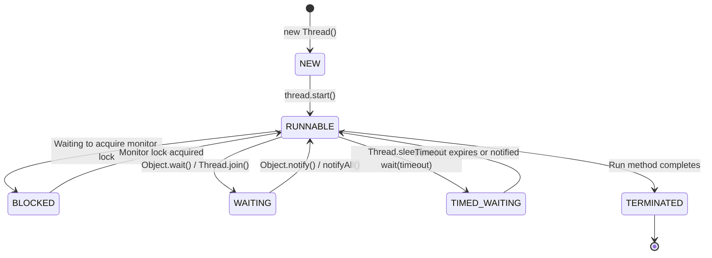

# Page 10: Multithreading & Concurrency Basics

Welcome to Page 10 of the Java Fundamentals series. Multithreading is a core topic in senior coding interviews, Low-Level Design (LLD), and System Design. This page covers thread mechanics, synchronization, thread safety, and high-concurrency utilities.

---

## 1. Processes vs. Threads

| Metric | Process | Thread (Lightweight Process) |
| :--- | :--- | :--- |
| **Definition** | An executing instance of an application | The smallest unit of CPU execution inside a process |
| **Memory** | Own isolated virtual address space | Shares Heap, Metaspace, and open files with other threads in the same process |
| **Stack** | Own call stack | Has its **own independent call stack** |
| **Creation Cost** | Heavyweight (OS level) | Lightweight |

```text
╭─────────────────────────────────────────────────────────────────────────────╮
│                     Java Process vs. Threads Memory Layout                  │
├─────────────────────────────────────────────────────────────────────────────┤
│ 🌐 Process (JVM Application Instance)                                       │
│    Shared Heap Memory (Objects, Arrays, Metaspace, Class Definitions)       │
│                                                                             │
│    ╭──────────────────────────────╮  ╭──────────────────────────────╮       │
│    │ 🧵 Thread 1                  │  │ 🧵 Thread 2                  │       │
│    │  • Program Counter (PC)      │  │  • Program Counter (PC)      │  ...  │
│    │  • Independent Thread Stack  │  │  • Independent Thread Stack  │       │
│    │    (LIFO Method Call Frames) │  │    (LIFO Method Call Frames) │       │
│    ╰──────────────────────────────╯  ╰──────────────────────────────╯       │
╰─────────────────────────────────────────────────────────────────────────────╯
```

### The 6 States of a Java Thread (Thread Lifecycle)



---

## 2. Creating Threads: `Runnable` vs. `Callable`

### 1. The `Runnable` Interface (No Return Value)

```java
// Preferred approach: Implementing Runnable (decouples task from execution)
Runnable task = () -> {
    System.out.println("Running on thread: " + Thread.currentThread().getName());
};

Thread thread = new Thread(task);
thread.start(); // Spawns a new OS thread (Do NOT call thread.run() directly!)
```

### 2. The `Callable<V>` Interface (Returns a Result & Can Throw Exceptions)

```java
import java.util.concurrent.*;

Callable<Integer> computeTask = () -> {
    // Computes and returns value
    return 42;
};

ExecutorService executor = Executors.newSingleThreadExecutor();
Future<Integer> future = executor.submit(computeTask);

// Blocking call to retrieve result:
int result = future.get(); // returns 42
executor.shutdown();
```

---

## 3. Thread Synchronization & The Race Condition Problem

When two or more threads concurrently read and write shared mutable state without coordination, a **race condition** occurs:

```java
class UnsafeCounter {
    int count = 0;

    // count++ is NOT atomic! It comprises 3 operations:
    // 1. Read count from memory
    // 2. Increment value in register
    // 3. Write updated value back
    public void increment() {
        count++; // Race condition!
    }
}
```

### Fixing Race Conditions: The `synchronized` Keyword
Every object in Java has an **intrinsic lock (monitor)**. A `synchronized` block acquires the lock before entering and releases it upon exit.

```java
class SafeCounter {
    private int count = 0;

    // Option A: Synchronized Method (acquires `this` lock)
    public synchronized void increment() {
        count++;
    }

    // Option B: Synchronized Block (preferred for fine-grained locking)
    private final Object lock = new Object();
    public void incrementBlock() {
        synchronized (lock) {
            count++;
        }
    }

    public synchronized int getCount() {
        return count;
    }
}
```

---

## 4. `volatile` vs. Atomic Variables

### 1. The `volatile` Keyword: Visibility Guarantee
CPUs cache variables in fast local L1/L2 caches. When Thread A updates a shared variable, Thread B running on another CPU core might continue reading stale cached data.

- Declaring a field `volatile` ensures all reads and writes go **directly to main memory**, preventing CPU caching and instruction reordering.
- **Limitation**: `volatile` guarantees **visibility**, but **NOT atomicity** (e.g., `volatileCount++` is still vulnerable to race conditions!).

### 2. Atomic Classes (`java.util.concurrent.atomic`)
For lock-free thread-safe operations on single variables, use atomic classes backed by CPU-level **CAS (Compare-And-Swap)** instructions:

```java
import java.util.concurrent.atomic.AtomicInteger;

class AtomicCounter {
    private final AtomicInteger count = new AtomicInteger(0);

    public void increment() {
        count.incrementAndGet(); // Atomic CAS operation without locks!
    }

    public int get() {
        return count.get();
    }
}
```

---

## 5. Thread Coordination: The Producer-Consumer Pattern

Threads coordinate work using `wait()`, `notify()`, and `notifyAll()` (must always be called inside a `synchronized` block):

```java
import java.util.LinkedList;
import java.util.Queue;

public class BoundedBuffer<T> {
    private final Queue<T> queue = new LinkedList<>();
    private final int capacity;

    public BoundedBuffer(int capacity) {
        this.capacity = capacity;
    }

    public synchronized void produce(T item) throws InterruptedException {
        // Always use while-loop to check conditions (guards against spurious wakeups!)
        while (queue.size() == capacity) {
            wait(); // Releases lock and sleeps until notified
        }
        queue.offer(item);
        notifyAll(); // Wakes up waiting consumers
    }

    public synchronized T consume() throws InterruptedException {
        while (queue.isEmpty()) {
            wait(); // Releases lock and sleeps until notified
        }
        T item = queue.poll();
        notifyAll(); // Wakes up waiting producers
        return item;
    }
}
```

---

## 6. Modern Concurrency: `java.util.concurrent` (JUC)

In modern Java, you rarely manage raw threads directly. The `java.util.concurrent` package provides enterprise-grade abstractions:

### 1. `ExecutorService` & Thread Pools

```java
// Fixed pool of 4 worker threads reusing threads to avoid creation overhead
ExecutorService pool = Executors.newFixedThreadPool(4);

for (int i = 0; i < 10; i++) {
    final int taskId = i;
    pool.execute(() -> {
        System.out.println("Task " + taskId + " executed by " + Thread.currentThread().getName());
    });
}

pool.shutdown(); // Closes pool after pending tasks finish
```

### 2. Thread-Safe Collections: `ConcurrentHashMap` & `BlockingQueue`

- **`ConcurrentHashMap<K, V>`**: Uses fine-grained bucket-level locks and lock-free reads. Scales far better than `Hashtable` or `Collections.synchronizedMap()`.
- **`ArrayBlockingQueue<E>`**: Out-of-the-box, thread-safe implementation of the Producer-Consumer bounded queue.

```java
BlockingQueue<Integer> queue = new ArrayBlockingQueue<>(10);
// queue.put(1);  // blocks if full
// int x = queue.take(); // blocks if empty
```

---

## 7. Self-Check & Quick Review

1. **Q**: What happens if you call `thread.run()` instead of `thread.start()`?
   - *A*: `thread.run()` executes synchronously on the **current calling thread** like a regular method; it does **not** spawn a new OS thread.
2. **Q**: What is the difference between `volatile` and `synchronized`?
   - *A*: `volatile` ensures memory visibility across CPU caches for variable reads/writes without locking. `synchronized` guarantees both visibility **and** mutual exclusion (atomicity) via monitor locks.
3. **Q**: Why must `wait()` always be called inside a `while` loop rather than an `if` condition?
   - *A*: To guard against **spurious wakeups** (threads waking without an explicit notification) and race conditions where another thread consumes the resource first.

---

## 🧭 Continue Learning

| ◀️ Previous Topic | 🧭 Track Hub | 🚀 Next Track |
| :--- | :---: | ---: |
| [**Page 9: Functional Java & Streams**](09-lambdas-and-streams.md)<br><sub>*Lambdas, Streams API Pipelines & Records*</sub> | [**Java Fundamentals Index**](README.md)<br><sub>*Core Language & Runtime Mechanics*</sub> | [**Java Backend Engineering Course**](../java-backend/README.md)<br><sub>*Spring Boot, Persistence & Microservices*</sub> |
