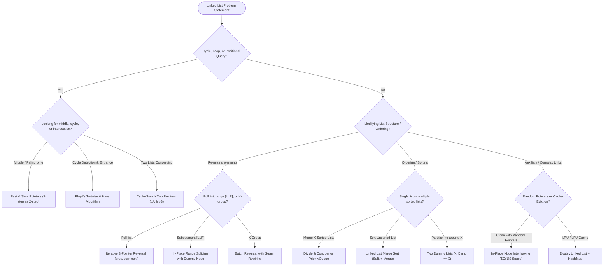

# Data Structures & Algorithms: Linked Lists & ArrayList Mastery

Welcome to the **Linked Lists & ArrayList Track**. While arrays provide the backbone for contiguous, index-addressable storage, linked structures represent the foundation of **pointer-driven dynamic allocation**, allowing memory to be acquired on-demand without the requirement for large contiguous blocks of physical RAM.

This curriculum is structured into two progressive phases:
1. **Architectural Foundations**: The physical limitations of arrays, what linked lists solve, the internal JVM memory footprints of `ArrayList` vs `LinkedList`, node mechanics, and sentinel node engineering.
2. **Algorithmic Patterns & Systems**: Pointer invariants, fast/slow pointers, in-place reversals, list sorting, deep-copy interleaving, composite structures (LRU/LFU caches), and concurrent lock-free queues.

---

## 🗺️ Curriculum Roadmap

```text
╭────────────────────────────────────────────────────────────────────────────────────────╮
│                            LINKED LISTS CURRICULUM ROADMAP                             │
├────────────────────────────────────────────────────────────────────────────────────────┤
│  [Page 00] Problem Types & Pointer Patterns (Archetypes, Invariants & Decision Matrix)  │
│                                    │                                                   │
│                                    ▼                                                   │
│  [Page 01] Array Limitations & LinkedList Fundamentals (ArrayList vs LinkedList)       │
│                                    │                                                   │
│                                    ▼                                                   │
│  [Page 02] Fast & Slow Pointers & Cycle Detection (Floyd's Algorithm, Middle, Palindrome)│
│                                    │                                                   │
│                                    ▼                                                   │
│  [Page 03] In-Place Reversal & Subsegment Manipulations (Iterative/Recursive, K-Group) │
│                                    │                                                   │
│                                    ▼                                                   │
│  [Page 04] Merging, Sorting & Partitioning (Merge K Lists, Sort List, 3-Way Partition)  │
│                                    │                                                   │
│                                    ▼                                                   │
│  [Page 05] Deep Copy & Complex Pointer Rewiring (Random Pointers Interleaving, Flatten) │
│                                    │                                                   │
│                                    ▼                                                   │
│  [Page 06] Composite Data Structures: LRU & LFU Cache (HashMap + Doubly Linked List)   │
│                                    │                                                   │
│                                    ▼                                                   │
│  [Page 07] Advanced Techniques & Systems (Skip Lists, Lock-Free Concurrent Queue)      │
╰────────────────────────────────────────────────────────────────────────────────────────╯
```

---

## 📚 Complete Course Modules

| Page | Topic | Core Focus & Techniques | Link |
| :---: | :--- | :--- | :--- |
| **Page 00** | **Problem Types & Pointer Patterns** | 6 Problem Archetypes, Pointer Decision Matrix, The 3 Golden Rules of Linked List Invariants | [00-linked-list-problem-types-and-patterns.md](00-linked-list-problem-types-and-patterns.md) |
| **Page 01** | **Array Limitations & Fundamentals** | Array Fragmentation Bottleneck, What LinkedList Solves, `ArrayList` vs `LinkedList` Memory Model, Sentinel Nodes | [01-array-limitations-and-linkedlist-fundamentals.md](01-array-limitations-and-linkedlist-fundamentals.md) |
| **Page 02** | **Fast & Slow Pointers (Cycle Detection)** | Floyd's Cycle Detection ($2k - k = nC$), Middle of List, Palindrome List (In-Place), List Intersections | [02-fast-and-slow-pointers-and-cycle-detection.md](02-fast-and-slow-pointers-and-cycle-detection.md) |
| **Page 03** | **In-Place Reversal & Subsegments** | Iterative vs Recursive Reversal, Subsegment Reversal ($L \dots R$), Reverse Nodes in $K$-Group, Reorder List | [03-in-place-reversal-and-subsegment-manipulations.md](03-in-place-reversal-and-subsegment-manipulations.md) |
| **Page 04** | **Merging, Sorting & Partitioning** | Merge Two Lists, Merge $K$ Sorted Lists (Divide & Conquer vs Min-Heap), Merge Sort ($O(N \log N)$), Partition List | [04-merging-sorting-and-partitioning.md](04-merging-sorting-and-partitioning.md) |
| **Page 05** | **Deep Copy & Complex Pointer Rewiring** | Copy List with Random Pointer (Interleaving $O(1)$ space), Flattening Multilevel Doubly Linked Lists | [05-deep-copy-and-complex-pointer-rewiring.md](05-deep-copy-and-complex-pointer-rewiring.md) |
| **Page 06** | **Composite Structures: LRU & LFU Cache** | LRU Cache (`HashMap` + Doubly Linked List), $O(1)$ Eviction Mechanics, LFU Cache (Dual-Map + Frequency Deques) | [06-composite-data-structures-lru-and-lfu-cache.md](06-composite-data-structures-lru-and-lfu-cache.md) |
| **Page 07** | **Advanced Techniques & Scale Systems** | Skip Lists (Probabilistic $O(\log N)$ Search/Insert), Lock-Free `ConcurrentLinkedQueue` (Michael-Scott CAS), GC Recyclers | [07-advanced-techniques-and-system-scale.md](07-advanced-techniques-and-system-scale.md) |

---

## ⚡ Architectural Trade-Off: `ArrayList` vs. `LinkedList`

| Metric / Dimension | `ArrayList` (Dynamic Array) | `LinkedList` (Doubly Linked) | Singly Linked List |
| :--- | :---: | :---: | :---: |
| **Random Access (`get(i)`)** | **$O(1)$** (Direct pointer offset) | $O(N)$ (Must walk pointers) | $O(N)$ (Must walk pointers) |
| **Insert / Delete at Head** | $O(N)$ (Shifts all elements) | **$O(1)$** (Rewires head pointer) | **$O(1)$** (Rewires head pointer) |
| **Insert / Delete at Tail** | **Amortized $O(1)$** | **$O(1)$** (With tail reference) | **$O(1)$** (With tail reference) |
| **Insert / Delete at Given Node** | $O(N)$ (Shifts remaining) | **$O(1)$** (Self-excision) | $O(1)$ (Value copy / singly pointer) |
| **Memory Layout** | **Contiguous** memory buffer | **Scattered** heap nodes | **Scattered** heap nodes |
| **Memory Overhead per Item** | **0 bytes** (in raw array) | **24–32 bytes** (Object header + 2 ptrs) | **16–24 bytes** (Object header + 1 ptr) |
| **CPU Cache Friendliness** | **Extremely High** (L1/L2 hits) | **Extremely Low** (Cache misses) | **Extremely Low** (Cache misses) |
| **Memory Allocation Behavior** | Pre-allocates chunk ($1.5\times$) | Allocates strictly on-demand | Allocates strictly on-demand |
| **Tolerance to RAM Fragmentation**| **Low** (Needs large contiguous block)| **High** (Tolerates scattered pages)| **High** (Tolerates scattered pages)|

---

## 🧭 Pointer-Pattern Decision Matrix



---

## 🧭 Navigation

| 🏁 Track Home | Next Topic ▶️ |
| :--- | ---: |
| [**Java Track Hub**](../README.md)<br><sub>*Language, Backend & DSA*</sub> | [**Page 00: Linked List Problem Types & Patterns**](00-linked-list-problem-types-and-patterns.md)<br><sub>*Taxonomy, Invariants & Archetypes*</sub> |
