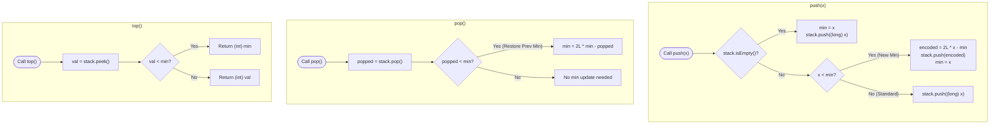
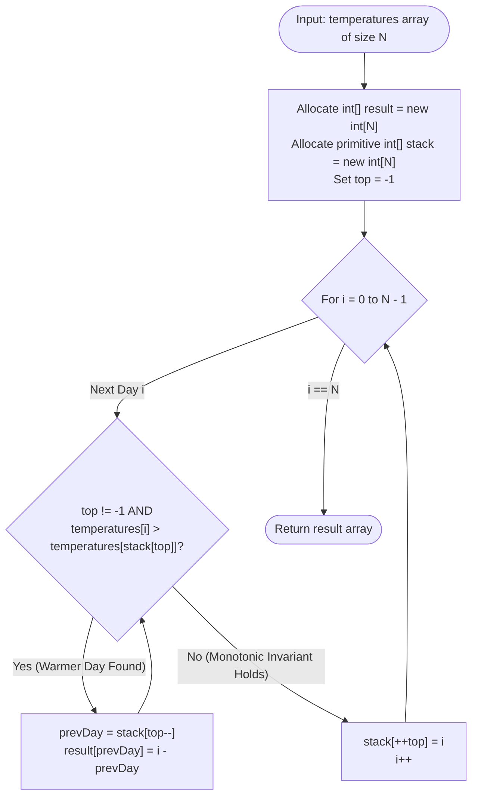

# Module 01: Stack Fundamentals, Difference Encoding & Monotonic Stacks

The Stack is the fundamental **Last-In, First-Out (LIFO)** restricted linear structure. Beyond basic push and pop operations, the stack mirrors the internal mechanics of modern CPU instruction execution (the hardware Call Stack) and unlocks **linear-time boundary discovery** through monotonic ordering invariants.

---

## 🏛️ 1. Theoretical & Mechanical Foundations

```text
╭─────────────────────────────────────────────────────────────────────────────────────────────╮
│                         JVM EXECUTION CALL STACK & ACTIVATION RECORDS                       │
├─────────────────────────────────────────────────────────────────────────────────────────────┤
│                                                                                             │
│  High Memory Address                                                                        │
│  ┌───────────────────────────────────────────────────────────┐                              │
│  │ Stack Frame: main()                                       │                              │
│  │   • Local Variables: args, int x = 10                     │                              │
│  │   • Return Address: OS Process Exit                       │                              │
│  ├───────────────────────────────────────────────────────────┤                              │
│  │ Stack Frame: calculateTax()                               │                              │
│  │   • Local Variables: double rate = 0.15                   │                              │
│  │   • Operand Stack: [ 100, 0.15 ] ──> CPU ALUs             │                              │
│  │   • Return Address: main() + 12                           │                              │
│  ├───────────────────────────────────────────────────────────┤                              │
│  │ Stack Frame: logAudit() <── Stack Pointer (RSP / Top)     │                              │
│  │   • Local Variables: long timestamp                       │                              │
│  └───────────────────────────────────────────────────────────┘                              │
│  Low Memory Address (Grows downward on x86/ARM)                                             │
│                                                                                             │
│  StackOverflowError: Recursion without base case exhausts the thread stack size (-Xss1m).   │
╰─────────────────────────────────────────────────────────────────────────────────────────────╯
```

### In-Memory Implementations:
1. **Primitive Array Stack (`int[] stack`, `int top = -1`)**: 
   - Fastest possible implementation. 100% L1 cache line hit rate, zero object boxing overhead, zero garbage collection impact.
2. **Dynamic Array (`java.util.ArrayDeque`)**: 
   - Modern standard for general objects. Amortized $O(1)$ operations via power-of-two circular indexing.
3. **`java.util.Stack` (Legacy)**: 
   - Deprecated. Inherits from `Vector`, acquiring a monitor lock on every method call, severely degrading multi-threaded throughput.

---

## Problem 1: Min Stack in Strictly $O(1)$ Time and $O(1)$ Auxiliary Space

### 1. Problem Statement & Operational Constraints

Design a stack that supports `push`, `pop`, `top`, and retrieving the minimum element in **strictly $O(1)$ time complexity** and **strictly $O(1)$ auxiliary space** (without allocating an auxiliary second stack).

- **Constraints**:
  - Values $\in [-2^{31}, 2^{31} - 1]$.
  - Operations: `push(val)`, `pop()`, `top()`, `getMin()`.
  - Methods `pop`, `top`, and `getMin` will always be called on non-empty stacks.

---

### 2. The Thought Process: Overcoming the Auxiliary Stack Overhead

#### The Standard Approach (Two Stacks)
- Maintain `dataStack` and `minStack`.
- Every time $x$ is pushed, push $\min(x, \text{minStack.peek()})$ onto `minStack`.
- **Bottleneck**: Consumes **$O(N)$ auxiliary space** (doubling heap memory).

#### The "Aha!" Insight: Mathematical Difference Encoding
Can we store a single integer in the stack that simultaneously encodes **both the incoming value and the previous minimum**?
- Let the current minimum be `min`.
- When an incoming value $x$ is **strictly less than `min`**, a new minimum is born!
- Instead of pushing $x$, we push a **difference-encoded value**:
  $$\text{encoded} = 2 \cdot x - \text{min}$$
- Because $x < \text{min}$, we know that:
  $$x - \text{min} < 0 \implies x + (x - \text{min}) < x \implies \mathbf{2 \cdot x - \text{min} < x}$$
- **The Core Invariant**:
  The encoded value stored on the stack is **strictly less than the new minimum $x$**!
  Whenever the value on the stack is strictly less than `min`, it acts as a sentinel flag signaling that:
  1. The actual value at the top of the stack is the current `min`!
  2. The previous minimum before this element can be mathematically reconstructed upon popping!

---

### 3. Deep Mathematical Proof of Difference Encoding

#### 1. Push Operation ($x < \text{min}$)
- Store: $\text{encoded} = 2x - \text{oldMin}$.
- Update: $\text{min} \leftarrow x$.
- **Validation**:
  $$\text{encoded} - \text{min} = (2x - \text{oldMin}) - x = x - \text{oldMin} < 0 \implies \text{encoded} < \text{min}$$

#### 2. Top Operation
- Look at `stack.peek()`:
  - If `stack.peek() >= min`: The element was pushed without updating the minimum. The true value is `stack.peek()`.
  - If `stack.peek() < min`: A new minimum was created here! By definition, the true value of this element was $x = \text{min}$. Return `min`.

#### 3. Pop Operation ($x < \text{min}$)
- Pop `encoded = stack.pop()`.
- If `encoded < min`, we must restore `min` back to `oldMin`:
  $$\text{encoded} = 2 \cdot \text{currentMin} - \text{oldMin}$$
  $$\mathbf{\text{oldMin} = 2 \cdot \text{currentMin} - \text{encoded}}$$
- **Correctness**: We restore the exact previous minimum in $O(1)$ time with zero extra memory!

> [!WARNING]
> **Numerical Overflow Defense**: Because $2 \cdot x - \text{min}$ can overflow a 32-bit signed integer when $x = -2^{31}$ and $\text{min} = 2^{31} - 1$, the internal stack must store 64-bit `long` primitives.

---

### 4. Procedural Mermaid State Machine ("How to Proceed")



---

### 5. Visual State Transition Diagram

Trace operations: `push(5)`, `push(3)`, `push(7)`, `push(2)`, `pop()`, `pop()`.

```text
╭─────────────────────────────────────────────────────────────────────────────────────────────╮
│                         MIN STACK DIFFERENCE TRACE                                          │
├─────────────────────────────────────────────────────────────────────────────────────────────┤
│ 1. push(5): Stack empty -> min = 5. Stack: [ 5 ]                                            │
│ 2. push(3): 3 < 5 (New Min!) -> encoded = 2*(3) - 5 = 1. Stack: [ 5, 1 ], min = 3.         │
│ 3. push(7): 7 >= 3 -> Standard push. Stack: [ 5, 1, 7 ], min = 3.                           │
│ 4. push(2): 2 < 3 (New Min!) -> encoded = 2*(2) - 3 = 1. Stack: [ 5, 1, 7, 1 ], min = 2.   │
│                                                                                             │
│ State: min = 2. top() = peek is 1 (< 2) -> returns min (2).                                 │
│                                                                                             │
│ 5. pop(): Popped 1 (< min 2) -> restore min = 2*(2) - 1 = 3! Stack: [ 5, 1, 7 ], min = 3.  │
│ 6. pop(): Popped 7 (>= min 3) -> no change to min. Stack: [ 5, 1 ], min = 3.               │
╰─────────────────────────────────────────────────────────────────────────────────────────────╯
```

---

### 6. Production Implementation (Java 17/21)

```java
package com.dataship.stacks;

import java.util.ArrayDeque;
import java.util.Deque;

public final class MinStack {

    // Store 64-bit longs to prevent integer overflow during 2 * x - min math
    private final Deque<Long> stack = new ArrayDeque<>();
    private long min;

    public MinStack() {}

    public void push(int val) {
        long x = val;
        if (stack.isEmpty()) {
            min = x;
            stack.push(x);
        } else if (x < min) {
            // Encode: 2 * x - oldMin is strictly less than x
            stack.push(2 * x - min);
            min = x; // Update new minimum
        } else {
            stack.push(x);
        }
    }

    public void pop() {
        if (stack.isEmpty()) return;
        long popped = stack.pop();
        if (popped < min) {
            // Restore previous minimum: oldMin = 2 * min - encoded
            min = 2 * min - popped;
        }
    }

    public int top() {
        long val = stack.peek();
        if (val < min) {
            // Encoded value signals the true value is current min
            return (int) min;
        }
        return (int) val;
    }

    public int getMin() {
        return (int) min;
    }
}
```

---

## Problem 2: Daily Temperatures & Next Greater Element

### 1. Problem Statement & Operational Constraints

Given an array of integers `temperatures` representing daily temperatures, return an array `answer` such that `answer[i]` is the number of days you have to wait after the $i$-th day to get a warmer temperature. If there is no future day for which this is possible, keep `answer[i] == 0`.

- **Constraints**:
  - $N \in [1, 10^5]$.
  - $\text{temperatures}[i] \in [30, 100]$.
  - Required Time Complexity: strictly **$O(N)$**.

---

### 2. The Thought Process: Monotonic Decreasing Stacks

#### The Brute-Force Bottleneck
For each day $i$, scanning forward day-by-day until finding day $j$ where $\text{temperatures}[j] > \text{temperatures}[i]$ takes $O(N^2)$ in the worst case (e.g. descending temperatures $[100, 99, 98, \dots, 30]$).

#### The "Aha!" Insight: Deferring Resolution until Warmer Day Appears
- If temperatures are decreasing ($[75, 71, 69]$), none of them have found a warmer day yet. We must **hold them in waiting**.
- The moment a warmer day arrives ($72$):
  - Is $72 > 69$? **Yes!** Day with temp $69$ has found its next warmer day! Pop it and calculate day difference.
  - Is $72 > 71$? **Yes!** Day with temp $71$ has found its next warmer day! Pop it.
  - Is $72 > 75$? **No.** Stop popping, and push $72$.
- **The Invariant**: The stack stores indices of days whose temperatures are **strictly monotonically decreasing**. Every element is pushed once and popped once $\implies \mathbf{O(N)}$ amortized time!

---

### 3. Procedural Mermaid Flowchart ("How to Proceed")



---

### 4. Production Implementation (Java 17/21)

```java
package com.dataship.stacks;

public final class DailyTemperatures {

    private DailyTemperatures() {}

    /**
     * Finds the number of days until the next warmer temperature in O(N) time and O(N) space.
     * Uses a primitive array stack to eliminate boxing overhead.
     */
    public static int[] dailyTemperatures(int[] temperatures) {
        if (temperatures == null || temperatures.length == 0) {
            return new int[0];
        }

        int n = temperatures.length;
        int[] result = new int[n];
        int[] stack = new int[n]; // Primitive stack storing indices
        int top = -1;

        for (int i = 0; i < n; i++) {
            int currentTemp = temperatures[i];

            // Resolve all days on the stack that are colder than the current day
            while (top != -1 && currentTemp > temperatures[stack[top]]) {
                int prevDay = stack[top--];
                result[prevDay] = i - prevDay;
            }

            stack[++top] = i;
        }

        return result;
    }
}
```

---

### 5. Interviewer Stress Questions & Defenses
> **Interviewer**: *"How do you adapt this algorithm if the array is circular (e.g. Next Greater Element II, where day 0 wraps around after day $N-1$)?"*
> **Defense**: "We simulate a double-length array by running our loop from $i = 0$ to $2N - 1$, mapping the index using modulo arithmetic: `curr = temperatures[i % n]`. We only push indices to the stack during the first pass ($i < n$), while both passes allow warmer days to pop and resolve elements on the stack. This achieves identical $O(N)$ time complexity."

---

<table width="100%">
  <tr>
    <td width="33%" align="left">
      <a href="./README.md">
        <strong>← Previous Module</strong><br>
        Track Hub & Roadmaps
      </a>
    </td>
    <td width="33%" align="center">
      <a href="../README.md">
        <strong>Home</strong><br>
        Java DSA Master Track
      </a>
    </td>
    <td width="33%" align="right">
      <a href="./02-queue-fundamentals-and-circular-buffers.md">
        <strong>Next Module →</strong><br>
        02. Queue Fundamentals & Circular Buffers
      </a>
    </td>
  </tr>
</table>
