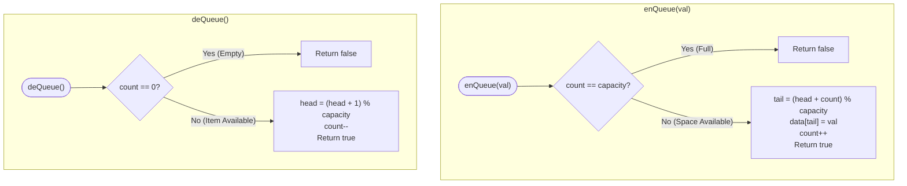

# Module 02: Queue Fundamentals, Circular Buffers & Amortized Transfers

The Queue is the universal **First-In, First-Out (FIFO)** linear structure. It governs message brokering, asynchronous request handling, and operating system CPU scheduling. This module explores how to eliminate the $O(N)$ array dequeue penalty using **Circular Ring Buffers** and proves the mathematical **$O(1)$ amortized transfer bound** of dual-stack queues.

---

## 🏛️ 1. Theoretical & Mechanical Foundations

```text
╭─────────────────────────────────────────────────────────────────────────────────────────────╮
│                         LINEAR QUEUE VS. CIRCULAR RING BUFFER                               │
├─────────────────────────────────────────────────────────────────────────────────────────────┤
│                                                                                             │
│ 1. Naive Linear Array Queue (The Shift Penalty):                                            │
│    Dequeue() removes index 0. To prevent memory drift, all N elements must shift left!       │
│    Cost: O(N) per dequeue. Unacceptable for high-throughput messaging.                      │
│                                                                                             │
│ 2. Circular Array Ring Buffer (Zero Shifting):                                              │
│    Fixed array of size K. Head and Tail pointers wrap around the boundary via modulo math.  │
│                                                                                             │
│                 [ Slot 0 ] ──> [ Slot 1 ] ──> [ Slot 2 ]                                    │
│                     ▲                             │                                         │
│                     │                             ▼                                         │
│                 [ Slot 5 ] <── [ Slot 4 ] <── [ Slot 3 ]                                    │
│                                                                                             │
│    Enqueue at Tail: tail = (tail + 1) % K                                                   │
│    Dequeue at Head: head = (head + 1) % K                                                   │
│    Cost: O(1) strictly constant time. Zero element shifting.                                │
╰─────────────────────────────────────────────────────────────────────────────────────────────╯
```

---

## Problem 1: Design Circular Queue (Bounded Ring Buffer)

### 1. Problem Statement & Operational Constraints

Design a circular queue implementation supporting:
- `MyCircularQueue(k)`: Initializes the object with the size of the queue to be `k`.
- `enQueue(value)`: Inserts an element into the circular queue. Return `true` if the operation is successful.
- `deQueue()`: Deletes an element from the circular queue. Return `true` if successful.
- `Front()`: Gets the front item from the queue. If empty, return `-1`.
- `Rear()`: Gets the last item from the queue. If empty, return `-1`.
- `isEmpty()`: Checks whether the circular queue is empty.
- `isFull()`: Checks whether the circular queue is full.

- **Constraints**:
  - $K \in [1, 1000]$.
  - Operations must execute in strictly **$O(1)$ time complexity**.

---

### 2. The Thought Process: Disambiguating Full vs. Empty

#### The Pointer Ambiguity Trap
In a circular queue with two pointers `head` and `tail`:
- When `head == tail`, is the queue completely **empty**, or is it completely **full**?
- **Solution A**: Leave one slot empty (capacity $K + 1$).
- **Solution B (Optimal & Clean)**: Maintain an explicit integer `count`.
  - `isEmpty() \iff count == 0`
  - `isFull() \iff count == capacity`
  - Eliminates pointer arithmetic gymnastics and simplifies state management.

---

### 3. Procedural Mermaid State Machine ("How to Proceed")



---

### 4. Production Implementation (Java 17/21)

```java
package com.dataship.queues;

public final class MyCircularQueue {

    private final int[] data;
    private final int capacity;
    private int head;
    private int count;

    public MyCircularQueue(int k) {
        if (k <= 0) throw new IllegalArgumentException("Capacity must be positive.");
        this.capacity = k;
        this.data = new int[k];
        this.head = 0;
        this.count = 0;
    }

    public boolean enQueue(int value) {
        if (isFull()) {
            return false;
        }
        // Calculate insertion slot dynamically without maintaining separate tail pointer
        int tail = (head + count) % capacity;
        data[tail] = value;
        count++;
        return true;
    }

    public boolean deQueue() {
        if (isEmpty()) {
            return false;
        }
        head = (head + 1) % capacity;
        count--;
        return true;
    }

    public int Front() {
        return isEmpty() ? -1 : data[head];
    }

    public int Rear() {
        if (isEmpty()) return -1;
        int tail = (head + count - 1) % capacity;
        return data[tail];
    }

    public boolean isEmpty() {
        return count == 0;
    }

    public boolean isFull() {
        return count == capacity;
    }
}
```

---

## Problem 2: Implement Queue using Stacks

### 1. Problem Statement & Operational Constraints

Implement a first-in, first-out (FIFO) queue using only two standard LIFO stacks:
- `push(x)`: Pushes element $x$ to the back of the queue.
- `pop()`: Removes the element from the front of the queue and returns it.
- `peek()`: Returns the element at the front of the queue.
- `empty()`: Returns true if the queue is empty, false otherwise.

- **Strict Constraint**: You must use only standard stack operations (`push`, `pop`, `peek`, `isEmpty`).

---

### 2. The Thought Process & Amortized $O(1)$ Proof

#### The Naive Trap: Inverting on Every Push
If you transfer elements between stacks on every `push`, each `push` costs $O(N)$, resulting in an $O(N^2)$ sequence for $N$ pushes.

#### The "Aha!" Insight: Lazy Two-Stack Partitioning
Split the queue across two specialized stacks:
1. `inStack`: Dedicated strictly to incoming pushes.
2. `outStack`: Dedicated strictly to outgoing pops and peeks.

```text
╭─────────────────────────────────────────────────────────────────────────────────────────────╮
│                         DUAL-STACK FIFO REVERSAL MECHANICS                                  │
├─────────────────────────────────────────────────────────────────────────────────────────────┤
│ Push(1), Push(2), Push(3):                                                                  │
│   inStack:  [ 1, 2, 3 ] <── Top is 3 (LIFO order)                                           │
│   outStack: [ ]                                                                             │
│                                                                                             │
│ First Pop(): outStack is empty! DRAIN inStack into outStack:                                │
│   Pop 3 from inStack -> Push to outStack                                                    │
│   Pop 2 from inStack -> Push to outStack                                                    │
│   Pop 1 from inStack -> Push to outStack                                                    │
│                                                                                             │
│ Transferred State:                                                                          │
│   inStack:  [ ]                                                                             │
│   outStack: [ 3, 2, 1 ] <── Top is 1 (FIFO order restored!)                                 │
│                                                                                             │
│ Key Invariant: As long as outStack has elements, pops/peeks take O(1) immediately!          │
╰─────────────────────────────────────────────────────────────────────────────────────────────╯
```

#### Mathematical Proof of Amortized $O(1)$ Complexity
Let an element $e$ enter the queue and eventually leave:
1. $e$ is pushed onto `inStack`: **1 operation** ($O(1)$).
2. $e$ is popped from `inStack`: **1 operation** ($O(1)$).
3. $e$ is pushed onto `outStack`: **1 operation** ($O(1)$).
4. $e$ is popped from `outStack`: **1 operation** ($O(1)$).

Total lifetime operations per element = **strictly 4 operations**.
For any sequence of $M$ operations containing $N$ pushes and $N$ pops, total work is $\le 4N$.
Therefore, the **amortized time per operation is $\frac{4N}{2N} = \mathbf{O(1)}$**!

---

### 3. Production Implementation (Java 17/21)

```java
package com.dataship.queues;

import java.util.ArrayDeque;
import java.util.Deque;

public final class MyQueue {

    private final Deque<Integer> inStack = new ArrayDeque<>();
    private final Deque<Integer> outStack = new ArrayDeque<>();

    public MyQueue() {}

    public void push(int x) {
        inStack.push(x);
    }

    public int pop() {
        shiftStacks();
        return outStack.pop();
    }

    public int peek() {
        shiftStacks();
        return outStack.peek();
    }

    public boolean empty() {
        return inStack.isEmpty() && outStack.isEmpty();
    }

    private void shiftStacks() {
        if (outStack.isEmpty()) {
            while (!inStack.isEmpty()) {
                outStack.push(inStack.pop());
            }
        }
    }
}
```

---

<table width="100%">
  <tr>
    <td width="33%" align="left">
      <a href="./01-stack-fundamentals-and-monotonic-stacks.md">
        <strong>← Previous Module</strong><br>
        01. Stack Fundamentals & Monotonic Stacks
      </a>
    </td>
    <td width="33%" align="center">
      <a href="../README.md">
        <strong>Home</strong><br>
        Java DSA Master Track
      </a>
    </td>
    <td width="33%" align="right">
      <a href="./03-deques-and-monotonic-sliding-windows.md">
        <strong>Next Module →</strong><br>
        03. Deques & Monotonic Sliding Windows
      </a>
    </td>
  </tr>
</table>
