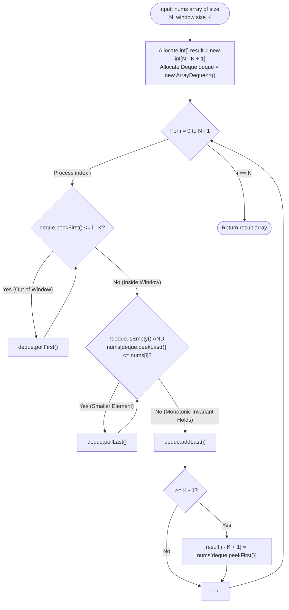

# Module 03: Double-Ended Queues (Deques) & Monotonic Sliding Windows

The **Double-Ended Queue (Deque)** unifies LIFO and FIFO capabilities by allowing insertion and deletion at both ends in strictly $O(1)$ time. When combined with monotonic ordering invariants, deques solve complex range extrema problems in **strictly linear $O(N)$ time**—even in the presence of negative numbers where standard two-pointer sliding windows catastrophically fail.

---

## 🏛️ 1. Theoretical & Mechanical Foundations

```text
╭─────────────────────────────────────────────────────────────────────────────────────────────╮
│                         JAVA ArrayDeque INTERNAL RESIZING & MASKING                         │
├─────────────────────────────────────────────────────────────────────────────────────────────┤
│ Capacity is strictly constrained to a power of two: C = 2^k (e.g. 16, 32, 64).              │
│                                                                                             │
│ Circular Array Mask: mask = C - 1                                                           │
│                                                                                             │
│ Enqueue Head: head = (head - 1) & mask                                                      │
│ Enqueue Tail: tail = (tail + 1) & mask                                                      │
│                                                                                             │
│ Full Condition: head == tail                                                                │
│ When full, ArrayDeque doubles capacity (2 * C) via System.arraycopy, preventing stalls.      │
╰─────────────────────────────────────────────────────────────────────────────────────────────╯
```

---

## Problem 1: Sliding Window Maximum

### 1. Problem Statement & Operational Constraints

Given an integer array `nums` and a sliding window of size $K$ moving from the left of the array to the right, return the max sliding window.

- **Constraints**:
  - $N \in [1, 10^5]$, $K \in [1, N]$.
  - $\text{nums}[i] \in [-10^4, 10^4]$.
  - Required Time Complexity: strictly **$O(N)$**.

---

### 2. The Thought Process: Monotonic Pruning

#### The Brute-Force Bottleneck
- Finding the maximum of each window takes $O(K)$. With $N - K + 1$ windows, total time is $O(N \cdot K) \approx 10^{10}$ operations (TLE).
- A Max-Heap (`PriorityQueue`) takes $O(N \log K)$ and incurs expensive lazy node removal overhead.

#### The "Aha!" Insight: The Survival Invariant
Suppose incoming element `nums[i] = 10`, and the current window contains `[3, 5, 2]`.
- Is there any possible scenario where `3`, `5`, or `2` could ever be the maximum of this window or any future window?
- **NEVER!** Why? Because `nums[i] = 10` is **both larger than them AND will survive longer** in all subsequent sliding windows!
- Therefore, all elements smaller than `nums[i]` are obsolete and can be immediately pruned from the back of our deque!

```text
╭─────────────────────────────────────────────────────────────────────────────────────────────╮
│                         MONOTONIC DECREASING DEQUE MECHANICS                                │
├─────────────────────────────────────────────────────────────────────────────────────────────┤
│ Window: [ 1, 3, -1, -3, 5, 3, 6, 7 ],  K = 3                                                │
│                                                                                             │
│ Deque stores indices. Values corresponding to indices are strictly decreasing:              │
│                                                                                             │
│ At i = 4 (nums[4] = 5):                                                                     │
│   Incoming: 5. Deque has values [-1, -3].                                                   │
│   5 is greater than -3 -> Pop -3 from back!                                                 │
│   5 is greater than -1 -> Pop -1 from back!                                                 │
│   Push index 4 (value 5).                                                                   │
│                                                                                             │
│ Front of Deque is ALWAYS the maximum of the current window!                                │
╰─────────────────────────────────────────────────────────────────────────────────────────────╯
```

---

### 3. Procedural Mermaid Flowchart ("How to Proceed")



---

### 4. Production Implementation (Java 17/21)

```java
package com.dataship.deques;

import java.util.ArrayDeque;
import java.util.Deque;

public final class SlidingWindowMaximum {

    private SlidingWindowMaximum() {}

    /**
     * Finds the maximum element in each sliding window of size K in O(N) amortized time.
     */
    public static int[] maxSlidingWindow(int[] nums, int k) {
        if (nums == null || k <= 0 || nums.length == 0) {
            return new int[0];
        }

        int n = nums.length;
        int[] result = new int[n - k + 1];
        // ArrayDeque stores INDICES to verify window boundaries in O(1)
        Deque<Integer> deque = new ArrayDeque<>(k);

        for (int i = 0; i < n; i++) {
            // Step 1: Evict elements from front that fell outside the sliding window
            while (!deque.isEmpty() && deque.peekFirst() <= i - k) {
                deque.pollFirst();
            }

            // Step 2: Evict smaller elements from back (monotonic decreasing invariant)
            while (!deque.isEmpty() && nums[deque.peekLast()] <= nums[i]) {
                deque.pollLast();
            }

            // Step 3: Add current index to back
            deque.addLast(i);

            // Step 4: Record window maximum once the first K elements have been scanned
            if (i >= k - 1) {
                result[i - k + 1] = nums[deque.peekFirst()];
            }
        }

        return result;
    }
}
```

---

## Problem 2: Shortest Subarray with Sum at Least $K$

### 1. Problem Statement & Operational Constraints

Given an integer array `nums` and an integer $K$, return the length of the **shortest non-empty subarray** with sum at least $K$. If there is no such subarray, return `-1`.

- **Constraints**:
  - $N \in [1, 10^5]$, $K \in [1, 10^9]$.
  - $\text{nums}[i] \in [-10^5, 10^5]$ (**Crucial: contains negative numbers!**).

---

### 2. The Thought Process: Why Standard Sliding Window Fails

In standard sliding window problems, all numbers are positive. Thus, expanding right strictly increases window sum, and contracting left strictly decreases it.
With **negative numbers**, adding an element can *decrease* the sum, and removing an element can *increase* it! The sum predicate is completely non-monotonic.

#### The "Aha!" Insight: Prefix Sums + Monotonic Deque
1. Convert the problem using **Prefix Sums**:
   $$\text{Sum}(i \dots j-1) = P[j] - P[i] \ge K \iff \mathbf{P[i] \le P[j] - K}$$
   We seek to minimize the length $j - i$.
2. Maintain a **Monotonic Deque of prefix sum indices** where $P[\text{index}]$ is strictly increasing:
   - **Front Eviction**: If $P[j] - P[\text{deque.peekFirst()}] \ge K$, we have found a valid subarray! We record its length and **pop from front immediately**. Why? Because any future $j' > j$ will result in a longer length ($j' - i > j - i$), so this $i$ can never beat our current result!
   - **Back Eviction**: If $P[j] \le P[\text{deque.peekLast()}]$, pop from back! Why? Because index $j$ has a **smaller or equal prefix sum** AND is located further right, making the older index strictly inferior in every future comparison!

---

### 3. Production Implementation (Java 17/21)

```java
package com.dataship.deques;

import java.util.ArrayDeque;
import java.util.Deque;

public final class ShortestSubarrayWithSumAtLeastK {

    private ShortestSubarrayWithSumAtLeastK() {}

    /**
     * Finds shortest subarray with sum >= K in O(N) time using Prefix Sums + Monotonic Deque.
     */
    public static int shortestSubarray(int[] nums, int k) {
        if (nums == null || nums.length == 0) {
            return -1;
        }

        int n = nums.length;
        // Use 64-bit longs for prefix sums to prevent integer overflow
        long[] prefixSum = new long[n + 1];
        for (int i = 0; i < n; i++) {
            prefixSum[i + 1] = prefixSum[i] + nums[i];
        }

        int minLen = Integer.MAX_VALUE;
        Deque<Integer> deque = new ArrayDeque<>();

        for (int j = 0; j <= n; j++) {
            // Check front: if valid sum >= K, record length and evict (can't produce shorter later)
            while (!deque.isEmpty() && prefixSum[j] - prefixSum[deque.peekFirst()] >= k) {
                minLen = Math.min(minLen, j - deque.pollFirst());
            }

            // Maintain strictly increasing monotonic prefix sums in deque
            while (!deque.isEmpty() && prefixSum[j] <= prefixSum[deque.peekLast()]) {
                deque.pollLast();
            }

            deque.addLast(j);
        }

        return (minLen == Integer.MAX_VALUE) ? -1 : minLen;
    }
}
```

---

<table width="100%">
  <tr>
    <td width="33%" align="left">
      <a href="./02-queue-fundamentals-and-circular-buffers.md">
        <strong>← Previous Module</strong><br>
        02. Queue Fundamentals & Circular Buffers
      </a>
    </td>
    <td width="33%" align="center">
      <a href="../README.md">
        <strong>Home</strong><br>
        Java DSA Master Track
      </a>
    </td>
    <td width="33%" align="right">
      <a href="./04-expression-parsing-and-evaluators.md">
        <strong>Next Module →</strong><br>
        04. Expression Parsing & Evaluators
      </a>
    </td>
  </tr>
</table>
