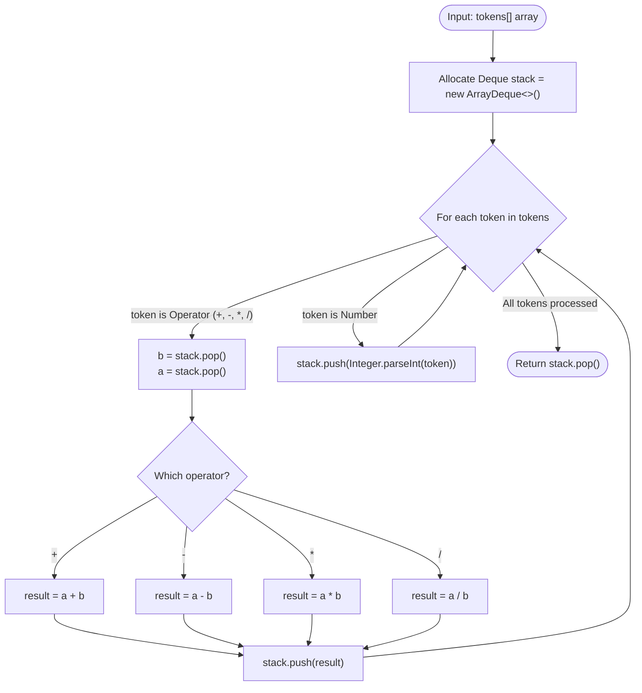

# Module 04: Expression Parsing, Polish Notations & Calculator Engines

Expression parsing is one of the most critical applications of stacks in computer science. It powers compilers, SQL query evaluators, spreadsheet engines, and arithmetic runtimes. This module deconstructs **Infix, Postfix (Reverse Polish), and Prefix notations**, the **Shunting-Yard algorithm**, and builds a production **Basic Calculator engine** handling operator precedence, unary negatives, and nested parentheses.

---

## 🏛️ 1. Theoretical & Grammar Foundations

```text
╭─────────────────────────────────────────────────────────────────────────────────────────────╮
│                         EXPRESSION NOTATION PARADIGMS                                       │
├─────────────────────────────────────────────────────────────────────────────────────────────┤
│ Notation       Representation        Evaluation Order                 Parentheses Required? │
│ ─────────────────────────────────────────────────────────────────────────────────────────── │
│ Infix          (3 + 4) * 5           Depends on precedence rules      Yes                   │
│ Postfix (RPN)  3 4 + 5 *             Strictly Left-to-Right (Stack)   No (Unambiguous)      │
│ Prefix (PN)    * + 3 4 5             Strictly Right-to-Left (Stack)   No (Unambiguous)      │
╰─────────────────────────────────────────────────────────────────────────────────────────────╯
```

---

## Problem 1: Evaluate Reverse Polish Notation (RPN)

### 1. Problem Statement & Operational Constraints

Evaluate the value of an arithmetic expression in Reverse Polish Notation given an array of string `tokens`. Valid operators are `+`, `-`, `*`, and `/`. Each operand may be an integer or another expression. Division between two integers truncates toward zero.

- **Constraints**:
  - `tokens[i]` is either an operator or an integer in range $[-200, 200]$.
  - The expression is guaranteed to be syntactically valid (no division by zero).

---

### 2. The Thought Process: Stack-Driven Operand Reduction

In Reverse Polish Notation, operators appear immediately after their operands.
- Scan left-to-right.
- When an **integer** is encountered: push to operand stack.
- When an **operator** is encountered: pop the top two numbers:
  - First popped is $B$ (the right operand).
  - Second popped is $A$ (the left operand).
  - Compute $A \text{ op } B$ and push the result back onto the stack!

---

### 3. Procedural Mermaid Flowchart ("How to Proceed")



---

### 4. Production Implementation (Java 17/21)

```java
package com.dataship.expressions;

import java.util.ArrayDeque;
import java.util.Deque;

public final class EvaluateRPN {

    private EvaluateRPN() {}

    public static int evalRPN(String[] tokens) {
        if (tokens == null || tokens.length == 0) {
            return 0;
        }

        Deque<Integer> stack = new ArrayDeque<>();

        for (String token : tokens) {
            switch (token) {
                case "+" -> stack.push(stack.pop() + stack.pop());
                case "-" -> {
                    int b = stack.pop();
                    int a = stack.pop();
                    stack.push(a - b);
                }
                case "*" -> stack.push(stack.pop() * stack.pop());
                case "/" -> {
                    int b = stack.pop();
                    int a = stack.pop();
                    stack.push(a / b);
                }
                default -> stack.push(Integer.parseInt(token));
            }
        }

        return stack.pop();
    }
}
```

---

## Problem 2: Basic Calculator (Parentheses & Unary Negatives)

### 1. Problem Statement & Operational Constraints

Given a string `s` representing a valid mathematical expression containing non-negative integers, `+`, `-`, `(`, `)`, and spaces, evaluate the expression.

- **Constraints**:
  - $|S| \in [1, 3 \times 10^5]$.
  - The expression can contain unary negative signs (e.g. `-(3 + 2)`).
  - Required Time Complexity: strictly **$O(N)$**.

---

### 2. The Thought Process: Context Stacks for Sub-Expressions

#### Why Flat Parsing Fails
Parentheses create an isolated, nested scope. The outer sign preceding `(` must be distributed across every element inside the parenthesis scope until `)` is met:
$$5 - (2 + 3) \implies 5 - 2 - 3 = 0$$

#### The "Aha!" Insight: Preserving Outer State on Stack
Whenever an opening parenthesis `(` is encountered:
1. Push the current accumulated `result` onto the stack.
2. Push the current `sign` (+1 or -1) onto the stack.
3. Reset `result = 0` and `sign = 1` to begin evaluating the inner sub-expression cleanly!
Whenever a closing parenthesis `)` is encountered:
1. Finish accumulating the inner sub-expression.
2. Multiply the inner result by the saved sign: `innerResult * stack.pop()`.
3. Add the saved outer result: `result = stack.pop() + (innerResult * sign)`.

```text
╭─────────────────────────────────────────────────────────────────────────────────────────────╮
│                         PARENTHESES SCOPE PRESERVATION TRACE                                │
├─────────────────────────────────────────────────────────────────────────────────────────────┤
│ Expression: 1 + ( 4 + 5 )                                                                   │
│                                                                                             │
│ State before '(': result = 1, sign = +1.                                                    │
│ Encounter '(':                                                                              │
│   Push result (1) to stack.                                                                 │
│   Push sign (+1) to stack.                                                                  │
│   Reset: result = 0, sign = +1.                                                             │
│                                                                                             │
│ Inside '(': Evaluates 4 + 5 -> result = 9.                                                  │
│                                                                                             │
│ Encounter ')':                                                                              │
│   result = result * stack.pop() (+1) = 9.                                                   │
│   result = result + stack.pop() (1)  = 10.                                                  │
╰─────────────────────────────────────────────────────────────────────────────────────────────╯
```

---

### 3. Production Implementation (Java 17/21)

```java
package com.dataship.expressions;

import java.util.ArrayDeque;
import java.util.Deque;

public final class BasicCalculator {

    private BasicCalculator() {}

    /**
     * Evaluates a mathematical expression containing '+', '-', '(', ')', and spaces in O(N) time.
     */
    public static int calculate(String s) {
        if (s == null || s.isEmpty()) {
            return 0;
        }

        Deque<Integer> stack = new ArrayDeque<>();
        int result = 0;
        int currentNumber = 0;
        int sign = 1; // 1 for '+', -1 for '-'

        for (int i = 0; i < s.length(); i++) {
            char c = s.charAt(i);

            if (Character.isDigit(c)) {
                currentNumber = currentNumber * 10 + (c - '0');
            } else if (c == '+') {
                result += sign * currentNumber;
                currentNumber = 0;
                sign = 1;
            } else if (c == '-') {
                result += sign * currentNumber;
                currentNumber = 0;
                sign = -1;
            } else if (c == '(') {
                // Save current context to stack
                stack.push(result);
                stack.push(sign);
                // Reset context for sub-expression inside parentheses
                result = 0;
                sign = 1;
            } else if (c == ')') {
                result += sign * currentNumber;
                currentNumber = 0;
                // Pop saved sign first, then saved outer result
                int prevSign = stack.pop();
                int prevResult = stack.pop();
                result = prevResult + (prevSign * result);
            }
        }

        // Flush any trailing operand
        result += sign * currentNumber;
        return result;
    }
}
```

---

<table width="100%">
  <tr>
    <td width="33%" align="left">
      <a href="./03-deques-and-monotonic-sliding-windows.md">
        <strong>← Previous Module</strong><br>
        03. Deques & Monotonic Sliding Windows
      </a>
    </td>
    <td width="33%" align="center">
      <a href="../README.md">
        <strong>Home</strong><br>
        Java DSA Master Track
      </a>
    </td>
    <td width="33%" align="right">
      <a href="./05-advanced-systems-stacks-queues.md">
        <strong>Next Module →</strong><br>
        05. Advanced Systems Stacks & Queues
      </a>
    </td>
  </tr>
</table>
