# Module 05: Advanced Systems Stacks, Lock-Free Queues & Memory Barriers

In mission-critical enterprise systems (e.g. trading engines, Kafka brokers, and high-frequency messaging buses), standard Java blocking queues (`ArrayBlockingQueue`, `LinkedBlockingQueue`) collapse under high contention due to **OS thread context switching** and **CPU cache invalidation (False Sharing)**. This module investigates how low-level memory barriers, lock-free CAS primitives, and cache-line padded ring buffers achieve **tens of millions of operations per second** with sub-microsecond latency.

---

## 🏛️ 1. The Micro-Architectural Foundations

```text
╭─────────────────────────────────────────────────────────────────────────────────────────────╮
│                         MUTEX LOCKS VS. LOCK-FREE MEMORY BARRIERS                           │
├─────────────────────────────────────────────────────────────────────────────────────────────┤
│ Metric               Mutex / ReentrantLock             Lock-Free Atomic / Ring Buffer       │
│ ─────────────────────────────────────────────────────────────────────────────────────────── │
│ Thread Suspension    OS Descheduling (Kernel Call)     Non-blocking Spin / Yield / Return   │
│ Context Switch Cost  ~ 1,000 - 3,000 nanoseconds       0 nanoseconds (User-space execution) │
│ CPU Cache Coherence  Invalidates core caches           Cache-line isolated (MESI friendly)  │
│ Throughput Ceiling   ~ 1 - 5 Million ops/sec           ~ 40 - 100 Million ops/sec           │
╰─────────────────────────────────────────────────────────────────────────────────────────────╯
```

---

## Problem 1: Lock-Free Single-Producer Single-Consumer (SPSC) Ring Buffer

### 1. Architectural Foundations: Zero Contention & Cache Line Isolation

In an SPSC model, exactly one thread offers data, and exactly one thread polls data. Because write operations to the `head` and `tail` counters are partitioned across distinct threads:
1. **Zero Lock Synchronization**: Neither thread ever acquires a lock.
2. **Eliminating False Sharing**: If `head` and `tail` reside on the same 64-byte cache line, modifying `tail` on Core 0 invalidates `head` on Core 1! We pad each counter with 7 dummy `long` fields ($7 \times 8 = 56$ bytes + 8-byte counter = 64 bytes) to guarantee distinct physical cache lines.
3. **Release/Acquire Memory Barriers**: 
   - When the producer writes an element, it uses **Release Semantics** (`lazySet` / StoreStore barrier). This guarantees the data item in the array slot is flushed and visible *before* the sequence counter increments!
   - When the consumer reads, it uses **Acquire Semantics** (LoadLoad barrier).

```text
╭─────────────────────────────────────────────────────────────────────────────────────────────╮
│                         SPSC CACHE LINE ISOLATION LAYOUT                                    │
├─────────────────────────────────────────────────────────────────────────────────────────────┤
│ Cache Line 0 (64 Bytes - Core 0):                                                           │
│ [ producerSeq: 8B ] [ p1 .. p7 Dummy Padding Fields: 56B ]                                  │
│                                                                                             │
│ Cache Line 1 (64 Bytes - Core 1):                                                           │
│ [ consumerSeq: 8B ] [ c1 .. c7 Dummy Padding Fields: 56B ]                                  │
│                                                                                             │
│ Result: Zero cache bouncing across CPU cores under maximum throughput!                      │
╰─────────────────────────────────────────────────────────────────────────────────────────────╯
```

---

### 2. Procedural Mermaid Flowchart ("How to Proceed")

```mermaid
flowchart TD
    subgraph "Producer: offer(item)"
        P1(["offer(item)"]) --> P2["Read head = producerSeq.get()"]
        P2 --> P3["Read tail = consumerSeq.get()"]
        P3 --> PCheck{"head - tail >= capacity?"}
        PCheck -- "Yes (Buffer Full)" --> PFail["Return false"]
        PCheck -- "No (Slot Free)" --> PWrite["slot = head & mask\nbuffer[slot] = item"]
        PWrite --> PBarrier["producerSeq.lazySet(head + 1)\nStoreStore Barrier"]
        PBarrier --> PSuccess["Return true"]
    end
    
    subgraph "Consumer: poll()"
        C1(["poll()"]) --> C2["Read tail = consumerSeq.get()"]
        C2 --> C3["Read head = producerSeq.get()"]
        C3 --> CCheck{"tail >= head?"}
        CCheck -- "Yes (Buffer Empty)" --> CNull["Return null"]
        CCheck -- "No (Item Available)" --> CRead["slot = tail & mask\nitem = buffer[slot]"]
        CRead --> CNullOut["buffer[slot] = null (GC Help)"]
        CNullOut --> CBarrier["consumerSeq.lazySet(tail + 1)\nStoreStore Barrier"]
        CBarrier --> CRet["Return item"]
    end
```



---

### 3. Production Implementation (Java 17/21)

```java
package com.dataship.systems;

import java.util.concurrent.atomic.AtomicLong;

public final class SpscLockFreeQueue<T> {

    // Cache-line padded counter ensuring dedicated 64-byte L1 cache line
    private static class PaddedAtomicLong extends AtomicLong {
        public volatile long p1, p2, p3, p4, p5, p6, p7; // 56 bytes padding

        PaddedAtomicLong(long initialValue) {
            super(initialValue);
        }
    }

    private final Object[] buffer;
    private final int mask;
    private final int capacity;

    private final PaddedAtomicLong producerSeq = new PaddedAtomicLong(0);
    private final PaddedAtomicLong consumerSeq = new PaddedAtomicLong(0);

    public SpscLockFreeQueue(int capacityPowerOfTwo) {
        if (Integer.bitCount(capacityPowerOfTwo) != 1) {
            throw new IllegalArgumentException("Capacity must be a strict power of two.");
        }
        this.capacity = capacityPowerOfTwo;
        this.mask = capacityPowerOfTwo - 1;
        this.buffer = new Object[capacityPowerOfTwo];
    }

    public boolean offer(T item) {
        if (item == null) throw new NullPointerException("Null items are not allowed.");

        long head = producerSeq.get();
        long tail = consumerSeq.get();

        if (head - tail >= capacity) {
            return false; // Queue is full
        }

        // Fast bitwise AND replaces division instruction (1 CPU cycle)
        int slot = (int) (head & mask);
        buffer[slot] = item;

        // lazySet enforces release semantics (StoreStore barrier) without expensive StoreLoad cost
        producerSeq.lazySet(head + 1);
        return true;
    }

    @SuppressWarnings("unchecked")
    public T poll() {
        long tail = consumerSeq.get();
        long head = producerSeq.get();

        if (tail >= head) {
            return null; // Queue is empty
        }

        int slot = (int) (tail & mask);
        T item = (T) buffer[slot];
        buffer[slot] = null; // Clean slot to enable garbage collection

        consumerSeq.lazySet(tail + 1);
        return item;
    }

    public int size() {
        return (int) (producerSeq.get() - consumerSeq.get());
    }

    public boolean isEmpty() {
        return producerSeq.get() == consumerSeq.get();
    }
}
```

---

## Problem 2: Lock-Free Multi-Producer Single-Consumer (MPSC) Linked Queue

### 1. Architectural Foundations: Atomic Pointer Swapping

When multiple producer threads concurrently submit tasks to a single consumer worker thread (e.g. Netty event loops or Actor mailboxes), an array ring buffer can suffer from CAS contention.
The **MPSC Linked Queue** solves this by using a **lock-free pointer swap**:
- Producers use an atomic `getAndSet` on the `tail` reference:
  ```java
  Node prevTail = tail.getAndSet(newNode);
  prevTail.next = newNode;
  ```
- This allows multiple producer threads to safely link their nodes into the queue concurrently in **wait-free $O(1)$ time**!

---

### 2. Production Implementation (Java 17/21)

```java
package com.dataship.systems;

import java.util.concurrent.atomic.AtomicReference;

public final class MpscLinkedQueue<T> {

    private static class Node<T> {
        T value;
        volatile Node<T> next;

        Node(T value) {
            this.value = value;
        }
    }

    private final Node<T> stub = new Node<>(null);
    private final AtomicReference<Node<T>> tail = new AtomicReference<>(stub);
    private Node<T> head = stub;

    public MpscLinkedQueue() {}

    /**
     * Wait-free multi-producer offer operation.
     */
    public boolean offer(T item) {
        if (item == null) throw new NullPointerException();

        Node<T> newNode = new Node<>(item);
        // Atomically swing the tail pointer to the new node
        Node<T> prevTail = tail.getAndSet(newNode);
        // Link the previous tail to the new node
        prevTail.next = newNode;
        return true;
    }

    /**
     * Single-consumer poll operation.
     */
    public T poll() {
        Node<T> currentHead = head;
        Node<T> nextNode = currentHead.next;

        if (nextNode == null) {
            return null; // Queue is empty
        }

        T value = nextNode.value;
        nextNode.value = null; // Help GC
        head = nextNode; // Advance head
        return value;
    }

    public boolean isEmpty() {
        return head.next == null;
    }
}
```

---

### 3. Interviewer Stress Questions & Defenses
> **Interviewer**: *"In the MPSC Linked Queue, what happens if Producer A swings the tail pointer via `getAndSet`, but is preempted by the OS scheduler before it can execute `prevTail.next = newNode`?"*
> **Defense**: "The queue enters a brief transient state where `tail` has advanced, but `prevTail.next` is still `null`. If the consumer calls `poll()` at that exact moment, it observes `head.next == null` and correctly treats the queue as temporarily empty (or spins briefly). The moment Producer A resumes and links `prevTail.next = newNode`, the node becomes immediately visible to the consumer. The algorithm remains 100% thread-safe and non-blocking."

---

<table width="100%">
  <tr>
    <td width="33%" align="left">
      <a href="./04-expression-parsing-and-evaluators.md">
        <strong>← Previous Module</strong><br>
        04. Expression Parsing & Evaluators
      </a>
    </td>
    <td width="33%" align="center">
      <a href="../README.md">
        <strong>Home</strong><br>
        Java DSA Master Track
      </a>
    </td>
    <td width="33%" align="right">
      <a href="./README.md">
        <strong>Track Hub →</strong><br>
        Stacks & Queues Overview
      </a>
    </td>
  </tr>
</table>
