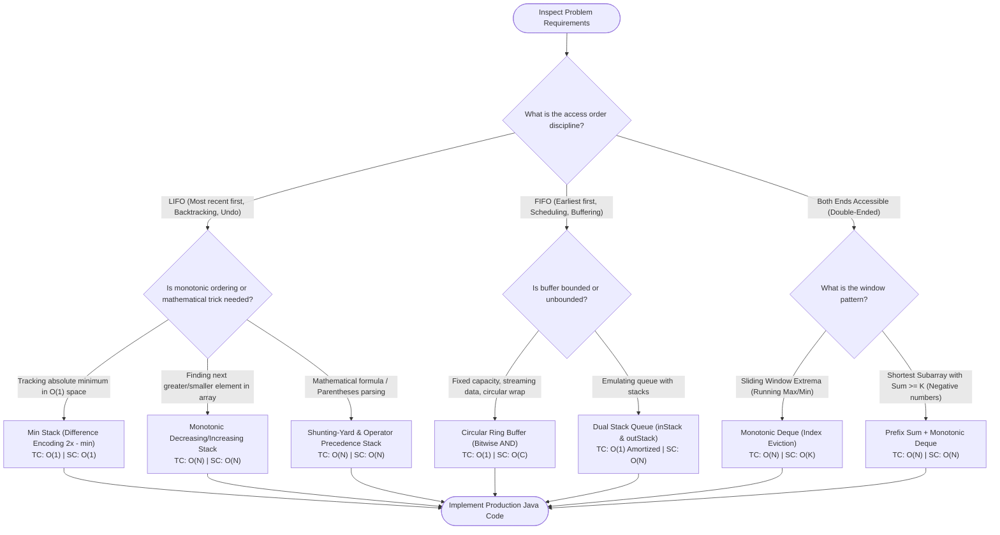

# Stacks, Queues & Deques: Constrained Linear Structures & Systems Engineering

Welcome to the **Stacks, Queues & Deques Track**. In the taxonomy of linear data structures, while general arrays and linked lists allow access and mutation at arbitrary indices, **Stacks**, **Queues**, and **Deques** are **Restricted-Access Linear Structures**. 

By intentionally constraining access to specific entry and exit boundaries (LIFO for Stacks, FIFO for Queues, and Double-Ended for Deques), these structures unlock **guaranteed $O(1)$ worst-case time complexity** for insertions, deletions, and inspections.

---

## 🏛️ 1. The Constrained Linear Paradigm

```text
╭─────────────────────────────────────────────────────────────────────────────────────────────╮
│                         RESTRICTED-ACCESS LINEAR STRUCTURES                                 │
├─────────────────────────────────────────────────────────────────────────────────────────────┤
│                                                                                             │
│  1. STACK (Last-In, First-Out - LIFO)                                                       │
│     Entry & Exit: Single aperture (Top).                                                    │
│                                                                                             │
│     Push ──> [ Top: Item C ]                                                                │
│              [ Item B       ]                                                                │
│              [ Bottom: Item A] ─── (Closed Base)                                             │
│     Pop  <── (From Top Only)                                                                │
│                                                                                             │
│  ─────────────────────────────────────────────────────────────────────────────────────────  │
│                                                                                             │
│  2. QUEUE (First-In, First-Out - FIFO)                                                      │
│     Entry: Rear. Exit: Front.                                                               │
│                                                                                             │
│     Enqueue (Rear) ──> [ Item C ] [ Item B ] [ Item A ] ──> Dequeue (Front)                 │
│                                                                                             │
│  ─────────────────────────────────────────────────────────────────────────────────────────  │
│                                                                                             │
│  3. DEQUE (Double-Ended Queue - FIFO + LIFO Unified)                                        │
│     Entry & Exit: Both Front and Rear are open.                                             │
│                                                                                             │
│     <── Front Operations ──> [ Item A ] [ Item B ] [ Item C ] <── Rear Operations ──>       │
│                                                                                             │
╰─────────────────────────────────────────────────────────────────────────────────────────────╯
```

---

## 💻 2. The Java Collection Reality: Why `java.util.Stack` is Deprecated in Modern Design

One of the most common pitfalls in Java engineering interviews is reaching for `java.util.Stack`. In production systems and modern coding, **never use `java.util.Stack`**:

```text
╭─────────────────────────────────────────────────────────────────────────────────────────────╮
│                         JAVA STACK IMPLEMENTATION COMPARISON                                │
├─────────────────────────────────────────────────────────────────────────────────────────────┤
│ Metric               java.util.Stack            java.util.LinkedList       java.util.ArrayDeque     │
│ ─────────────────────────────────────────────────────────────────────────────────────────── │
│ Underlying Layout    Synchronized Vector        Doubly Linked Node List    Circular Array Ring Buffer│
│ Threading Overhead   Synchronized on EVERY call None                       None                     │
│ Memory Overhead      High (Vector array)        Extremely High (24B/Node)  Optimal (Contiguous flat) │
│ CPU Cache Locality   Fair                       Devastating (L1 misses)    Optimal (64B Cache Line)  │
│ Recommended in 2026? ❌ NEVER (Legacy Java 1.0) ❌ POOR                    ✅ ALWAYS DE FACTO        │
╰─────────────────────────────────────────────────────────────────────────────────────────────╯
```

### Why `java.util.ArrayDeque` Wins Every Benchmark:
1. **Zero Synchronization Lock Penalty**: `java.util.Stack` extends `Vector`, forcing every single `push()` and `pop()` to acquire a mutual exclusion monitor lock—even in single-threaded execution! `ArrayDeque` has zero synchronization overhead.
2. **Superior Cache Line Prefetching**: `ArrayDeque` is backed by a flat contiguous array that wraps circularly via bitwise power-of-two masking. It eliminates the 24–32 byte object header penalty of `LinkedList` nodes.

---

## 🗺️ 3. Global Procedural Decision Flowchart

Use this procedural flowchart to determine the correct linear stack/queue archetype for any algorithmic challenge:



---

## 📚 4. Track Curriculum

| Module | Core Topics & Invariants | Problems Solved | Architectural & Systems Highlights |
| :--- | :--- | :--- | :--- |
| **[01. Stack Fundamentals & Monotonic Stacks](./01-stack-fundamentals-and-monotonic-stacks.md)** | JVM Call Stack, Activation Records, Difference Encoding Invariants, Monotonic Pruning | • Min Stack in $O(1)$ Space<br>• Daily Temperatures & Next Greater Element I/II | • Formal proof of difference encoding: $2 \cdot x - \text{min}$<br>• Circular array mapping via $2N$ modulo<br>• Zero-boxing primitive stacks |
| **[02. Queue Fundamentals & Circular Buffers](./02-queue-fundamentals-and-circular-buffers.md)** | FIFO Discipline, Head/Tail Choreography, Modulo Wraparound, Amortized Draining | • Design Circular Queue (Ring Buffer)<br>• Implement Queue using Stacks | • Power-of-two bitwise masking: `& (C - 1)`<br>• Full vs empty disambiguation<br>• Dual-stack amortized $O(1)$ transfer proof |
| **[03. Deques & Monotonic Sliding Windows](./03-deques-and-monotonic-sliding-windows.md)** | Double-Ended Queue Mechanics, Front & Rear Boundary Eviction, Prefix Invariants | • Sliding Window Maximum ($O(N)$)<br>• Shortest Subarray with Sum at Least $K$ | • Dual-ended monotonic deque state machine<br>• Overcoming negative number barriers where two pointers fail<br>• `ArrayDeque` resizing mechanics |
| **[04. Expression Parsing & Evaluators](./04-expression-parsing-and-evaluators.md)** | Operator Precedence, Associativity, Polish Notation, Shunting-Yard Algorithm | • Evaluate Reverse Polish Notation<br>• Basic Calculator I, II, & III | • Tokenizer state machines<br>• Unary minus handling without ASTs<br>• Generalized multi-level precedence engine |
| **[05. Advanced Systems Stacks & Queues](./05-advanced-systems-stacks-queues.md)** | High-Throughput Messaging, Concurrency, Hardware False Sharing, Memory Barriers | • Lock-Free SPSC Bounded Queue<br>• Multi-Producer Single-Consumer (MPSC) Buffer | • Cache line padding (56 bytes dummy longs)<br>• `VarHandle` acquire/release memory semantics<br>• Zero-allocation ring buffer recycling |

---

<table width="100%">
  <tr>
    <td width="33%" align="left">
      <a href="../00-linear-vs-non-linear-dsa-and-algorithms-guide.md">
        <strong>← Previous Guide</strong><br>
        Linear vs Non-Linear Master Guide
      </a>
    </td>
    <td width="33%" align="center">
      <a href="../README.md">
        <strong>Home</strong><br>
        Java DSA Master Track
      </a>
    </td>
    <td width="33%" align="right">
      <a href="./01-stack-fundamentals-and-monotonic-stacks.md">
        <strong>Next Module →</strong><br>
        01. Stack Fundamentals & Monotonic Stacks
      </a>
    </td>
  </tr>
</table>
