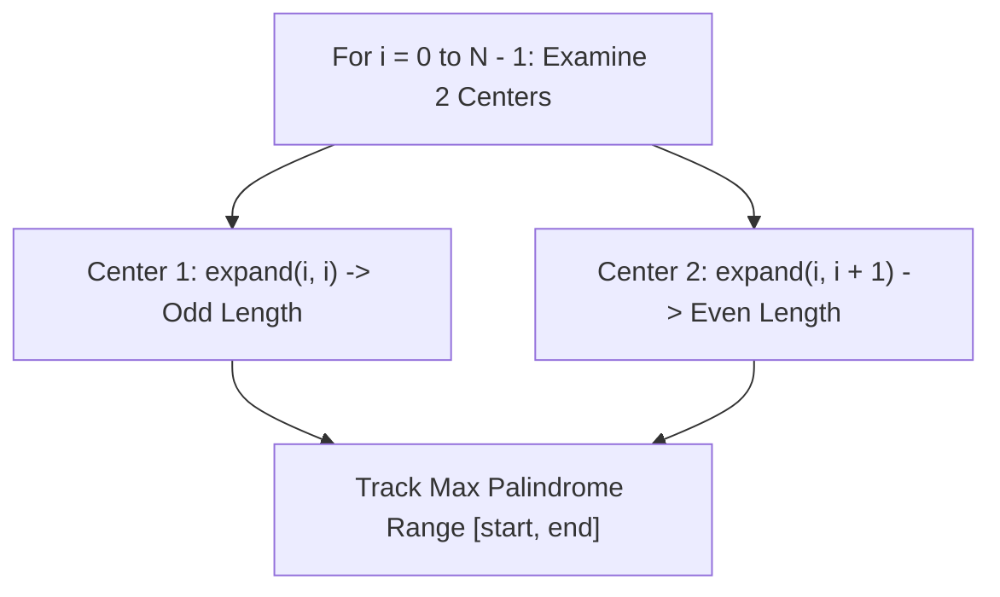

# 01. String Internals & Two-Pointer Palindromes

[← Back to String Algorithms Hub](./README.md) | [Track Hub](./README.md) | [Next: The KMP Algorithm & Prefix Function →](./02-the-kmp-algorithm-and-prefix-function.md)

---

## 🏛️ 1. Architecture & Memory Layouts: Java 21 String Internals

In modern Java, a `String` is an immutable sequence of characters. To optimize memory, **Compact Strings** (introduced in JDK 9 and standard in JDK 21) dynamically selects one of two byte encodings:
- **LATIN-1**: If all characters in the string fit within ISO-8859-1 (character code $\le 255$), characters are packed as **1 byte per character** into a contiguous `byte[] value`.
- **UTF-16**: If any character requires $> 255$, the internal array stores **2 bytes per character**.

```
╭───────────────────────────────────────────────────────────────────────────────────────────╮
│                             STRING MUTATION VS. BUILDER MEMORY ALLOCATION                 │
├────────────────────┬──────────────────────┬──────────────────────┬────────────────────────┤
│ Operation          │ Mechanism            │ Heap Allocations     │ Amortized Time         │
├────────────────────┼──────────────────────┼──────────────────────┼────────────────────────┤
│ s += "a" in loop   │ Creates new String   │ O(N) arrays created  │ O(N^2) quadratic copies│
│ StringBuilder      │ Mutable byte[] buffer│ Doubling array copy  │ O(1) amortized append  │
╰────────────────────┴──────────────────────┴──────────────────────┴────────────────────────╯
```

---

## ⚡ 2. Two-Pointer Palindromes: Valid Palindrome II (At Most 1 Deletion)

Given a string `s`, return `true` if the `s` can be palindrome after deleting at most one character from it.

### 2.1 The Greedy Branching Invariant
We place two pointers $L$ at $0$ and $R$ at $N - 1$. As long as `s[L] == s[R]`, we increment $L$ and decrement $R$.
When a mismatch `s[L] != s[R]` occurs, we have exactly two choices:
1. Delete character at $L$ and check if `s[L + 1 .. R]` is a palindrome.
2. Delete character at $R$ and check if `s[L .. R - 1]` is a palindrome.
Because at most one deletion is permitted, checking both alternatives takes strictly $\mathcal{O}(N)$ time.

```java
public final class ValidPalindrome {

    public static boolean validPalindrome(String s) {
        int l = 0, r = s.length() - 1;

        while (l < r) {
            if (s.charAt(l) != s.charAt(r)) {
                // Must be a palindrome after skipping either character at l or character at r
                return isPalindromeRange(s, l + 1, r) || isPalindromeRange(s, l, r - 1);
            }
            l++;
            r--;
        }

        return true;
    }

    private static boolean isPalindromeRange(String s, int l, int r) {
        while (l < r) {
            if (s.charAt(l) != s.charAt(r)) {
                return false;
            }
            l++;
            r--;
        }
        return true;
    }
}
```

---

## 🔍 3. Longest Palindromic Substring: Expand Around Center ($\mathcal{O}(N^2)$ Time, $\mathcal{O}(1)$ Space)

A palindrome mirrors around its center. A string of length $N$ has exactly:
- $N$ single-character centers (odd-length palindromes like `"aba"` centered at `'b'`).
- $N - 1$ two-character centers (even-length palindromes like `"abba"` centered between `'b'` and `'b'`).
Total centers $= 2N - 1$. Expanding around each center takes $\mathcal{O}(N)$ time, yielding an optimal $\mathcal{O}(1)$ memory solution.



```java
public final class LongestPalindromeCenter {

    public static String longestPalindrome(String s) {
        if (s == null || s.length() < 1) return "";

        int start = 0, end = 0;

        for (int i = 0; i < s.length(); i++) {
            // Expand for odd-length palindrome centered at i
            int len1 = expandAroundCenter(s, i, i);
            // Expand for even-length palindrome centered between i and i + 1
            int len2 = expandAroundCenter(s, i, i + 1);

            int maxLen = Math.max(len1, len2);
            if (maxLen > (end - start + 1)) {
                // Adjust boundaries based on odd/even parity
                start = i - (maxLen - 1) / 2;
                end = i + maxLen / 2;
            }
        }

        return s.substring(start, end + 1);
    }

    private static int expandAroundCenter(String s, int left, int right) {
        while (left >= 0 && right < s.length() && s.charAt(left) == s.charAt(right)) {
            left--;
            right++;
        }
        // Distance between pointers is (right - left + 1) - 2 = right - left - 1
        return right - left - 1;
    }
}
```

---

## 🧮 Complexity Analysis

| Algorithm | Time Complexity | Auxiliary Space | Best For |
| :--- | :--- | :--- | :--- |
| **`Valid Palindrome II`** | $\mathcal{O}(N)$ | $\mathcal{O}(1)$ | Single mismatch tolerance checks |
| **`Expand Around Center`** | $\mathcal{O}(N^2)$ | $\mathcal{O}(1)$ | Memory-constrained environments |
| **`Manacher's Algorithm`** | $\mathcal{O}(N)$ | $\mathcal{O}(N)$ | Extreme performance / $N \ge 10^5$ |

---

<div align="center">

| [← Back to String Algorithms Hub](./README.md) | [Track Hub: Strings](./README.md) | [Next: The KMP Algorithm & Prefix Function →](./02-the-kmp-algorithm-and-prefix-function.md) |
| :--- | :---: | ---: |

</div>
