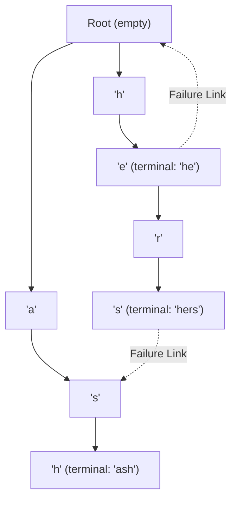

# 06. Aho-Corasick Multi-Pattern Automata

[← Back to Manacher's Algorithm](./05-manachers-algorithm-linear-time-palindromes.md) | [Track Hub](./README.md) | [Java Track Home](../README.md)

---

## 🏛️ 1. Theoretical Foundations: The Multi-String Search Challenge

When searching for a single pattern in a text, KMP and Rabin-Karp execute in $\mathcal{O}(N + M)$ time. However, in enterprise network security (Snort IDS), bioinformatic DNA motif search, and content moderation systems, we must search for **$K$ distinct keywords** simultaneously inside streaming text.
- Running KMP $K$ times takes $\mathcal{O}(K \cdot N + \sum M_i)$ time, which stalls under high throughput.
- The **Aho-Corasick Automaton** (1975) constructs a **Finite State Machine** that searches all $K$ patterns simultaneously in strictly **$\mathcal{O}(N + \sum M_i + \text{matches})$** time!

```
╭───────────────────────────────────────────────────────────────────────────────────────────╮
│                             MULTI-STRING MATCHING COMPLEXITY CLASSES                      │
├────────────────────┬───────────────────────────────┬──────────────────────────────────────┤
│ Strategy           │ Search Time                   │ Memory Space                         │
├────────────────────┼───────────────────────────────┼──────────────────────────────────────┤
│ Naive Scan         │ O(K * N * M)                  │ O(1)                                 │
│ K Independent KMP  │ O(K * N + Sum(M))             │ O(Sum(M))                            │
│ Aho-Corasick FSM   │ O(N + Sum(M) + matches)       │ O(Sum(M) * AlphabetSize)             │
╰────────────────────┴───────────────────────────────┴──────────────────────────────────────╯
```

---

## 🏗️ 2. Architectural Components of the Automaton

The Aho-Corasick automaton enhances a standard Trie with two additional link types:
1. **Trie Edges (Goto Function)**: Direct transitions between characters in keywords.
2. **Failure Links (Failure Function)**: Analogous to KMP's $\pi$ array. Points from node $u$ to the node representing the **longest proper suffix** of the string represented by $u$. Constructed via **Breadth-First Search (BFS)** level-by-level.
3. **Dictionary / Output Links**: Points to the nearest terminal node reachable by following failure links, enabling instant detection of sub-matches in $\mathcal{O}(1)$ per match.



---

## ⚡ 3. Production Java 21 Implementation

```java
import java.util.*;

public final class AhoCorasick {

    public record Match(int endIndex, String keyword) {}

    private static final class Node {
        final Map<Character, Node> children = new HashMap<>();
        Node fail;
        Node outputLink; // Points to nearest accepting node in failure chain
        final List<String> matchedWords = new ArrayList<>();
    }

    private final Node root = new Node();

    public AhoCorasick(List<String> keywords) {
        buildTrie(keywords);
        buildFailureAndOutputLinks();
    }

    // Step 1: Standard Prefix Trie Construction
    private void buildTrie(List<String> keywords) {
        for (String word : keywords) {
            Node curr = root;
            for (char ch : word.toCharArray()) {
                curr = curr.children.computeIfAbsent(ch, k -> new Node());
            }
            curr.matchedWords.add(word);
        }
    }

    // Step 2: BFS Level-Order Construction of Failure and Output Links
    private void buildFailureAndOutputLinks() {
        ArrayDeque<Node> queue = new ArrayDeque<>();

        // Depth 1 children fail back to root
        for (Node child : root.children.values()) {
            child.fail = root;
            queue.offer(child);
        }

        while (!queue.isEmpty()) {
            Node curr = queue.poll();

            for (Map.Entry<Character, Node> entry : curr.children.entrySet()) {
                char ch = entry.getKey();
                Node child = entry.getValue();

                // Trace failure transitions until a valid transition for 'ch' is found or root is reached
                Node f = curr.fail;
                while (f != null && !f.children.containsKey(ch)) {
                    f = f.fail;
                }

                child.fail = (f == null) ? root : f.children.get(ch);

                // Set output link for instant sub-match reporting
                if (child.fail.matchedWords.isEmpty()) {
                    child.outputLink = child.fail.outputLink;
                } else {
                    child.outputLink = child.fail;
                }

                queue.offer(child);
            }
        }
    }

    // Step 3: Stream Text Search in O(N + matches)
    public List<Match> search(String text) {
        List<Match> matches = new ArrayList<>();
        Node curr = root;

        for (int i = 0; i < text.length(); i++) {
            char ch = text.charAt(i);

            // Follow failure links if current node lacks a transition for 'ch'
            while (curr != root && !curr.children.containsKey(ch)) {
                curr = curr.fail;
            }

            curr = curr.children.getOrDefault(ch, root);

            // Report matches at current node
            for (String word : curr.matchedWords) {
                matches.add(new Match(i, word));
            }

            // Report matches from dictionary output links
            Node out = curr.outputLink;
            while (out != null) {
                for (String word : out.matchedWords) {
                    matches.add(new Match(i, word));
                }
                out = out.outputLink;
            }
        }

        return matches;
    }
}
```

---

## 🧮 4. Enterprise Applications

1. **Network Intrusion Detection Systems (Snort / Suricata)**: Inspects TCP packet payloads for thousands of malicious signature strings in real-time at 10+ Gbps line rate.
2. **Real-Time Content Moderation**: Scanning chat messages, comments, and forum posts against blacklists of offensive terms without delaying message delivery.
3. **Bioinformatics & Genomics**: Scanning chromosome strings (billions of base pairs) for thousands of regulatory DNA motifs simultaneously.

---

## 🧮 Complexity Analysis

| Phase | Time Complexity | Auxiliary Space | Determinism |
| :--- | :--- | :--- | :--- |
| **Trie Construction** | $\mathcal{O}(\sum M_i)$ | $\mathcal{O}(\sum M_i)$ | Deterministic |
| **BFS Failure Links** | $\mathcal{O}(\sum M_i)$ | $\mathcal{O}(\sum M_i)$ queue | Deterministic |
| **Text Search** | $\mathcal{O}(N + \text{matches})$ | $\mathcal{O}(1)$ beyond matches | Linear single-pass |

---

<div align="center">

| [← Back to Manacher's Algorithm](./05-manachers-algorithm-linear-time-palindromes.md) | [Track Hub: Strings](./README.md) | [Java Track Home](../README.md) |
| :--- | :---: | ---: |

</div>
