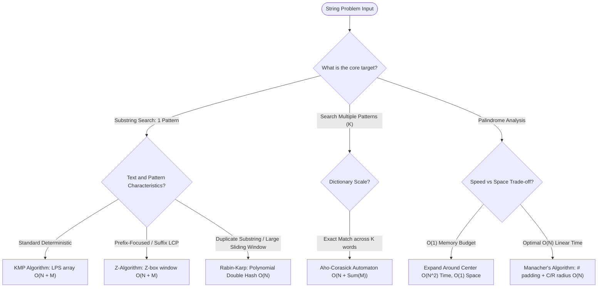

# 🔤 String Algorithms & Pattern Matching Mastery

[Java Track Home](../README.md) | [Strategies Hub](../../dsa-strategies/README.md) | [Next: String Internals & Palindromes →](./01-string-internals-and-two-pointer-palindromes.md)

---

## 🧭 Executive Overview: The Substring & Automata Universe

String processing forms the foundational core of compilers, full-text search engines (Lucene/Elasticsearch), bioinformatics sequence alignment (DNA/RNA genomics), and network packet inspection.

While naive brute-force string operations suffer from catastrophic $\mathcal{O}(N \cdot M)$ quadratic slowdowns on repetitive text (e.g., searching `"aaaaab"` inside `"aaaaaaaaaaaa..."`), advanced string algorithms achieve strictly **linear $\mathcal{O}(N + M)$ time** by extracting mathematical invariants:
1. **Prefix-Suffix Symmetry (KMP & Z-Algorithm)**: Reusing previously matched character states without backtracking the text pointer.
2. **Algebraic Rolling Hashes (Rabin-Karp)**: Converting string equality into $\mathcal{O}(1)$ modular arithmetic.
3. **Palindrome Reflection Invariants (Manacher's Algorithm)**: Mirroring palindrome radii across a center to eliminate duplicate expansions.
4. **Tree-Based Finite Automata (Aho-Corasick)**: Searching dictionary sets of $K$ keywords simultaneously in a single linear pass.

```
                      ╭────────────────────────────────────────╮
                      │      STRING PROCESSING PROBLEM SPACE   │
                      ╰───────────────────┬────────────────────╯
                                          │
                         What is the primary objective?
                                          │
                         ┌────────────────┴────────────────┐
                         ▼                                 ▼
                 PATTERN MATCHING                     PALINDROMES
                         │                                 │
             Single or Multi-Pattern?              Odd/Even Symmetry
                         │                                 │
                 ┌───────┴───────┐                 ┌───────┴───────┐
                 ▼               ▼                 ▼               ▼
           SINGLE PATTERN   DICTIONARY (K)      O(1) SPACE       O(N) TIME
             KMP / Z-Alg     Aho-Corasick      Center Expand     Manacher's
```

---

## 💾 1. Physical Memory Layout: Modern Java 21 String Internals

Prior to Java 9, `java.lang.String` stored characters as a 16-bit UTF-16 array `char[] value`, consuming 2 bytes per character even for pure ASCII strings.
Modern Java (Java 9 through 21) uses **Compact Strings** (JEP 254):

```
+─────────────────────────────────────────────────────────────+
|               JVM STRING OBJECT MEMORY LAYOUT               |
|                                                             |
|  String Object Header (12 bytes with Compressed OOPs)      |
|  ├───────────────────────────────────────────────────────┤  |
|  │ byte coder (1 byte: 0 = LATIN1 [1B/char], 1 = UTF16)   │  |
|  ├───────────────────────────────────────────────────────┤  |
|  │ int hash (4 bytes: lazily cached hashCode)            │  |
|  ├───────────────────────────────────────────────────────┤  |
|  │ byte[] value reference (4 bytes: pointer to byte array│  |
|  └───────────────────────────────────────────────────────┘  |
|                             │                               |
|                             ▼                               |
|  ┌───────────────────────────────────────────────────────┐  |
|  │ byte[] array on heap: contiguous ASCII / Latin-1 bytes│  |
|  └───────────────────────────────────────────────────────┘  |
+─────────────────────────────────────────────────────────────+
```

### 1.1 The Immutability & String Constant Pool Invariant
- Strings in Java are strictly **immutable**. Modifying a string creates a new heap allocation unless using `StringBuilder` (backed by a mutable, auto-doubling `byte[]` buffer).
- Identical string literals are deduplicated into the JVM's **String Constant Pool** (residing in the Metaspace/Native memory or Heap depending on JVM configuration).

---

## 🧭 2. The Global String Decision Engine



---

## 🗺️ 3. Master Curriculum Roadmap

| Module | Core Paradigm | Key Algorithms & Invariants | Canonical Problems |
| :--- | :--- | :--- | :--- |
| **[01. String Internals & Palindromes](./01-string-internals-and-two-pointer-palindromes.md)** | JVM Memory & Two Pointers | Compact Strings (Latin-1), Center expansion, Palindrome verification | Valid Palindrome I & II, Longest Palindromic Substring |
| **[02. The KMP Algorithm & Prefix Function](./02-the-kmp-algorithm-and-prefix-function.md)** | Deterministic Matching | LPS $\pi$ array, Transition on mismatch, Periodicity arithmetic | Implement strStr(), Repeated Substring Pattern |
| **[03. Rabin-Karp Rolling Hash](./03-rabin-karp-rolling-hash-and-string-matching.md)** | Algebraic Sliding Windows | Polynomial hash, Base/Modulus selection, Double hashing | Repeated DNA Sequences, Longest Duplicate Substring |
| **[04. The Z-Algorithm & LCP](./04-z-algorithm-and-longest-common-prefix.md)** | Prefix-Box Synchronization | $Z$-array, $[L, R]$ Z-box expansion invariant | Pattern Matching via $P + \text{"\$"} + T$, Longest Prefix Suffix |
| **[05. Manacher's Linear-Time Palindromes](./05-manachers-algorithm-linear-time-palindromes.md)** | Mirrored Radius Symmetry | Virtual `#` padding, Center $C$, Right edge $R$, Mirrored index $i'$ | Linear Longest Palindromic Substring, Palindromic Substrings |
| **[06. Aho-Corasick Multi-Pattern Automata](./06-aho-corasick-and-multi-pattern-automata.md)** | Tree-Based Finite Automata | Trie construction, BFS failure links, Dictionary output links | Multi-keyword search, Stream of Characters |

---

<div align="center">

| [← Back to Java Track Home](../README.md) | [Track Hub: Strings](./README.md) | [Next: String Internals & Palindromes →](./01-string-internals-and-two-pointer-palindromes.md) |
| :--- | :---: | ---: |

</div>
