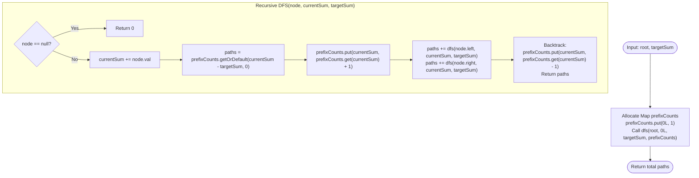

# Module 00: Tree Problem Archetypes, Traversal Array Invariants & Prefix DFS

Tree problems in algorithmic interviews are not random puzzles. Nearly every complex tree challenge can be mapped directly to one of **7 Universal Tree Archetypes**. This module establishes these mental archetypes and deconstructs three canonical challenges—**Prefix Sum Tree DFS**, **Dual-Array Tree Reconstruction**, and **In-Place Morris Flattening**—using our rigorous 7-step engineering framework.

---

## 🏛️ 1. The 7 Universal Tree Problem Archetypes

```text
╭─────────────────────────────────────────────────────────────────────────────────────────────╮
│                         THE 7 UNIVERSAL TREE PROBLEM ARCHETYPES                             │
├─────────────────────────────────────────────────────────────────────────────────────────────┤
│                                                                                             │
│ 1. Top-Down DFS (State Passing):                                                            │
│    • Invariant: Parent passes context (depth, max ancestor, running path) down to children.│
│    • Canonical examples: Validate BST [min, max], Root-to-Leaf Path Sum, Max Depth.         │
│                                                                                             │
│ 2. Bottom-Up DFS / Tree DP (Information Bubbling):                                          │
│    • Invariant: Children compute metrics and return them upward to synthesize parent state. │
│    • Canonical examples: Diameter of Binary Tree, Maximum Path Sum, Height Balance Check.   │
│                                                                                             │
│ 3. Level-Order BFS (Horizontal Breadth Queue):                                              │
│    • Invariant: Nodes explored in concentric horizontal rings using a FIFO queue.          │
│    • Canonical examples: Level Averages, Zigzag Traversal, Vertical Order, Tree Views.      │
│                                                                                             │
│ 4. Prefix Sums on Tree Call Stack:                                                          │
│    • Invariant: Tracking root-to-current prefix sums in a hash map; backtracking upon return│
│    • Canonical examples: Path Sum III (O(N) time without O(N²) nested loops).               │
│                                                                                             │
│ 5. Tree Synthesis from Traversal Projections:                                               │
│    • Invariant: Pairing root discovery (Preorder/Postorder) with left/right splits (Inorder)│
│    • Canonical examples: Construct Tree from Preorder & Inorder, Postorder & Inorder.       │
│                                                                                             │
│ 6. In-Order Succession & BST Range Pruning:                                                 │
│    • Invariant: BST In-Order Traversal yields strictly sorted ascending order.              │
│    • Canonical examples: In-Order Successor, Kth Smallest, Recover Swapped BST.             │
│                                                                                             │
│ 7. In-Place Pointer Rewiring & Flattening:                                                  │
│    • Invariant: Splicing subtrees into right-skewed linked lists in O(1) auxiliary space.   │
│    • Canonical examples: Flatten Binary Tree to Linked List, Binary Tree to DLL.            │
│                                                                                             │
╰─────────────────────────────────────────────────────────────────────────────────────────────╯
```

---

## Problem 1: Path Sum III (Prefix Sum on Tree DFS)

### 1. Problem Statement & Operational Constraints

Given the `root` of a binary tree and an integer `targetSum`, return the number of paths where the sum of the values along the path equals `targetSum`. The path does **not** need to start or end at the root or a leaf, but it must go downwards (traveling only from parent nodes to child nodes).

- **Constraints**:
  - Number of nodes $\in [0, 1000]$.
  - $\text{Node.val} \in [-10^9, 10^9]$.
  - $\text{targetSum} \in [-10^9, 10^9]$.
  - Required Time Complexity: strictly **$O(N)$** (avoiding naive $O(N^2)$ double DFS).

---

### 2. The Thought Process (How an Expert Approaches It from Scratch)

#### The Naive Double-DFS Bottleneck
- Run a DFS starting from every single node in the tree.
- For each starting node, run a second DFS downwards to find all valid path sums.
- **Cost**: On a skewed tree of height $N$, this performs $\sum_{i=1}^N i = O(N^2)$ operations. For $N = 10^5$, $10^{10}$ operations causes a Time Limit Exceeded (TLE).

#### The "Aha!" Insight: Prefix Sums on Tree Branches
Recall how we solved **Subarray Sum Equals K** on 1D arrays:
$$\text{Sum}(i \dots j) = P[j] - P[i-1] = K \iff \mathbf{P[i-1] = P[j] - K}$$
Can we apply this to trees?
- As we traverse down from the root to the current node, we accumulate a running `currentSum`.
- Any valid downward subpath ending at the current node that sums to `targetSum` implies that some **ancestor** along this specific branch had a prefix sum of:
  $$\mathbf{\text{ancestorSum} = \text{currentSum} - \text{targetSum}}$$
- We maintain a hash map `prefixCounts` of prefix sum frequencies along the **current recursion stack**!
- **The Backtracking Rule**: When returning upward from the recursive call (backtracking), we **decrement** `prefixCounts[currentSum]` by $1$. This guarantees that nodes from sibling subtrees or cousin branches never contaminate each other!

---

### 3. Deep Mathematical & Backtracking Invariant Proof

#### The Branch Isolation Invariant
Let $S_u$ be the set of ancestors of node $u$ on the path from the root.
At the moment the recursion visits node $u$:
$$\forall k \in \text{prefixCounts.keySet()}, \quad \text{prefixCounts}[k] = |\{v \in S_u \cup \{\text{root}\} \mid \text{prefixSum}(v) = k\}|$$

1. **Base Case**: The path starting from the root itself has an implicit prefix sum of `0` before any node is visited. We initialize:
   $$\text{prefixCounts}[0] = 1$$
2. **Current Subpath Target**:
   $$\Delta = \text{currentSum} - \text{targetSum}$$
   If $\Delta \in \text{prefixCounts}$, there are exactly $\text{prefixCounts}[\Delta]$ ancestors that form a valid downward subpath ending at node $u$!
3. **Backtracking Invariant**:
   When leaving node $u$ to return to its parent, node $u$ is no longer an ancestor of any remaining nodes. Decrementing $\text{prefixCounts}[\text{currentSum}]$ restores the map to match the parent's ancestor set $S_{\text{parent}}$ exactly.
4. **Time & Space Bounds**:
   - Each tree node is visited **exactly once**: $O(N)$ time.
   - The hash map holds at most $H$ entries, where $H$ is tree height ($O(\log N)$ balanced, $O(N)$ worst-case skewed). Auxiliary Space: $\mathbf{O(H)}$.

---

### 4. Procedural Mermaid Flowchart ("How to Proceed")



---

### 5. Production Implementation (Java 17/21)

```java
package com.dataship.trees.archetypes;

import java.util.HashMap;
import java.util.Map;

public final class PathSumIII {

    public static class TreeNode {
        public int val;
        public TreeNode left;
        public TreeNode right;
        public TreeNode(int val) { this.val = val; }
    }

    private PathSumIII() {}

    /**
     * Finds the number of paths summing to targetSum in strictly O(N) time and O(H) space.
     */
    public static int pathSum(TreeNode root, int targetSum) {
        if (root == null) return 0;

        // Use Long keys to prevent 32-bit integer overflow when accumulating sums
        Map<Long, Integer> prefixCounts = new HashMap<>();
        prefixCounts.put(0L, 1); // Base case: path starting directly at root

        return dfs(root, 0L, targetSum, prefixCounts);
    }

    private static int dfs(TreeNode node, long currentSum, int targetSum, Map<Long, Integer> prefixCounts) {
        if (node == null) {
            return 0;
        }

        currentSum += node.val;
        long complement = currentSum - targetSum;

        // Count how many ancestors end a valid subpath
        int validPaths = prefixCounts.getOrDefault(complement, 0);

        // Register current prefix sum into map
        prefixCounts.put(currentSum, prefixCounts.getOrDefault(currentSum, 0) + 1);

        // Recurse left and right
        validPaths += dfs(node.left, currentSum, targetSum, prefixCounts);
        validPaths += dfs(node.right, currentSum, targetSum, prefixCounts);

        // Backtrack: remove current node's prefix sum before returning to parent
        prefixCounts.put(currentSum, prefixCounts.get(currentSum) - 1);

        return validPaths;
    }
}
```

---

## Problem 2: Construct Binary Tree from Preorder & Inorder Traversal

### 1. Problem Statement & Operational Constraints

Given two integer arrays `preorder` and `inorder` where `preorder` is the preorder traversal of a binary tree and `inorder` is the inorder traversal of the same tree, construct and return the binary tree.

- **Constraints**:
  - $N \in [1, 3000]$.
  - `preorder` and `inorder` consist of **unique** values.
  - Required Time Complexity: strictly **$O(N)$**.

---

### 2. The Thought Process & Partition Invariants

```text
╭─────────────────────────────────────────────────────────────────────────────────────────────╮
│                         TRAVERSAL ARRAY PARTITIONING                                        │
├─────────────────────────────────────────────────────────────────────────────────────────────┤
│ Preorder: [ Root ] [ ─── Left Subtree ─── ] [ ─── Right Subtree ─── ]                       │
│             │                                                                               │
│ Inorder:  [ ─── Left Subtree ─── ] [ Root ] [ ─── Right Subtree ─── ]                       │
│                                      ▲                                                      │
│                                      │ (Found via Hash Map in O(1))                         │
│                                                                                             │
│ Key Invariant:                                                                              │
│ 1. preorder[preStart] is ALWAYS the root of the current subtree.                            │
│ 2. Find index of root in inorder array: rootIdx.                                            │
│ 3. Left Subtree Size: leftSize = rootIdx - inStart.                                         │
│ 4. Left Subtree Preorder Range:  [ preStart + 1 ... preStart + leftSize ]                   │
│ 5. Right Subtree Preorder Range: [ preStart + leftSize + 1 ... preEnd ]                     │
╰─────────────────────────────────────────────────────────────────────────────────────────────╯
```

---

### 3. Production Implementation (Java 17/21)

```java
package com.dataship.trees.archetypes;

import java.util.HashMap;
import java.util.Map;

public final class ConstructTreePreIn {

    public static class TreeNode {
        public int val;
        public TreeNode left;
        public TreeNode right;
        public TreeNode(int val) { this.val = val; }
    }

    private ConstructTreePreIn() {}

    public static TreeNode buildTree(int[] preorder, int[] inorder) {
        if (preorder == null || inorder == null || preorder.length != inorder.length) {
            return null;
        }

        // Map inorder values to their indices for O(1) subtree boundary partitioning
        Map<Integer, Integer> inMap = new HashMap<>();
        for (int i = 0; i < inorder.length; i++) {
            inMap.put(inorder[i], i);
        }

        return build(preorder, 0, preorder.length - 1, 
                     inorder, 0, inorder.length - 1, inMap);
    }

    private static TreeNode build(int[] preorder, int preStart, int preEnd,
                                  int[] inorder, int inStart, int inEnd,
                                  Map<Integer, Integer> inMap) {
        if (preStart > preEnd || inStart > inEnd) {
            return null;
        }

        int rootVal = preorder[preStart];
        TreeNode root = new TreeNode(rootVal);

        int rootIdx = inMap.get(rootVal);
        int leftSubtreeSize = rootIdx - inStart;

        root.left = build(preorder, preStart + 1, preStart + leftSubtreeSize,
                          inorder, inStart, rootIdx - 1, inMap);

        root.right = build(preorder, preStart + leftSubtreeSize + 1, preEnd,
                           inorder, rootIdx + 1, inEnd, inMap);

        return root;
    }
}
```

---

## Problem 3: Flatten Binary Tree to Linked List (In-Place $O(1)$ Space)

### 1. Problem Statement & Operational Constraints

Given the `root` of a binary tree, flatten the tree into a "linked list" in-place:
- The "linked list" should use the same `TreeNode` class where the `right` child pointer points to the next node and the `left` child pointer is always `null`.
- The "linked list" must follow the **Preorder Traversal** sequence.
- Must execute in **$O(N)$ time** and strictly **$O(1)$ auxiliary space**.

---

### 2. The Thought Process: Morris-Style Pointer Splicing

#### Why Standard Recursion or Stacks Fail the $O(1)$ Space Constraint
Recursively collecting nodes or using a stack consumes $O(H)$ memory on the call stack.

#### The "Aha!" Insight: Predecessor Threading
Observe a node with a left child:
- In Preorder (`Root -> Left -> Right`), every node in the **Left Subtree** is visited *before* the **Right Subtree**!
- What is the very last node visited in the left subtree?
  - It is the **rightmost node in the left subtree** (the in-order predecessor of the right child).
- If we attach the current node's `right` subtree directly to the `right` of that rightmost node, the preorder sequence is preserved!
- We then move `curr.left` to `curr.right`, nullify `curr.left`, and advance `curr = curr.right`.

```text
╭─────────────────────────────────────────────────────────────────────────────────────────────╮
│                         IN-PLACE FLATTENING POINTER SPLICING                                │
├─────────────────────────────────────────────────────────────────────────────────────────────┤
│         1                      1                       1                                    │
│        / \                      \                       \                                   │
│       2   5   ───────>           2                       2                                  │
│      / \   \                    / \                       \                                 │
│     3   4   6                  3   4                       3                                │
│                                     \                       \                               │
│                                      5                       4                              │
│                                       \                       \                             │
│                                        6                       5                            │
│                                                                 \                           │
│                                                                  6                          │
╰─────────────────────────────────────────────────────────────────────────────────────────────╯
```

---

### 3. Production Implementation (Java 17/21)

```java
package com.dataship.trees.archetypes;

public final class FlattenBinaryTree {

    public static class TreeNode {
        public int val;
        public TreeNode left;
        public TreeNode right;
        public TreeNode(int val) { this.val = val; }
    }

    private FlattenBinaryTree() {}

    /**
     * Flattens binary tree to a right-skewed linked list in O(N) time and O(1) auxiliary space.
     */
    public static void flatten(TreeNode root) {
        TreeNode curr = root;

        while (curr != null) {
            if (curr.left != null) {
                // Find the rightmost node in the left subtree
                TreeNode predecessor = curr.left;
                while (predecessor.right != null) {
                    predecessor = predecessor.right;
                }

                // Connect predecessor's right to current's right
                predecessor.right = curr.right;

                // Move left subtree to right
                curr.right = curr.left;
                curr.left = null;
            }
            // Advance to next node on the right chain
            curr = curr.right;
        }
    }
}
```

---

<table width="100%">
  <tr>
    <td width="33%" align="left">
      <a href="./README.md">
        <strong>← Previous Module</strong><br>
        Track Hub & Roadmaps
      </a>
    </td>
    <td width="33%" align="center">
      <a href="../README.md">
        <strong>Home</strong><br>
        Java DSA Master Track
      </a>
    </td>
    <td width="33%" align="right">
      <a href="./01-tree-fundamentals-and-traversal-paradigms.md">
        <strong>Next Module →</strong><br>
        01. Tree Fundamentals & Traversals
      </a>
    </td>
  </tr>
</table>
