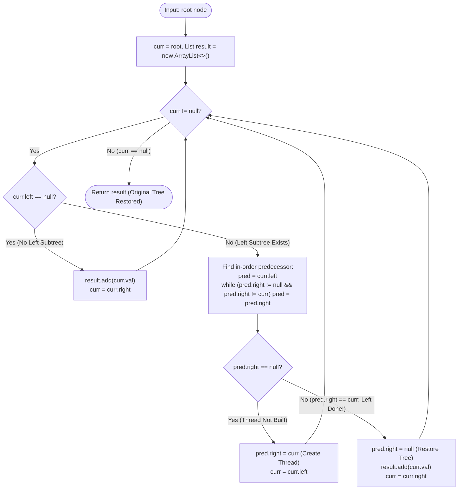

# Module 01: Tree Fundamentals, Memory Footprints & Traversal Paradigms

Traversing a linear structure requires only a single pointer advancing along memory addresses. Traversing a non-linear tree requires managing **branching state transitions**. This module dissects the physical JVM memory footprint of tree nodes, compares the 4 canonical traversals, proves the mathematical foundations of **Morris Traversal ($O(N)$ time with strictly $O(1)$ space)**, and implements enterprise-grade **Tree Serialization engines**.

---

## 🏛️ 1. Theoretical & Memory Foundations

```text
╭─────────────────────────────────────────────────────────────────────────────────────────────╮
│                         RECURSIVE CALL STACK VS. MORRIS THREADING                           │
├─────────────────────────────────────────────────────────────────────────────────────────────┤
│                                                                                             │
│ 1. Standard Recursive Traversal (Call Stack Overhead):                                      │
│    Stack Frame [dfs(node.left.left)] ──> Stack Frame [dfs(node.left)] ──> [dfs(root)]       │
│    Memory Cost: O(H) call stack frames.                                                     │
│    On skewed trees (e.g. 1 -> 2 -> 3 -> ... -> N), H = N, triggering StackOverflowError!     │
│                                                                                             │
│ 2. Morris In-Order Traversal (Zero Memory Threading):                                       │
│    Exploits unused null right pointers of leaf nodes to create temporary threads back to    │
│    their in-order successors.                                                               │
│                                                                                             │
│         (Current: 4)                                                                        │
│            /                                                                                │
│          (2)                                                                                │
│            \                                                                                │
│            (3) ─── Temporary Thread (predecessor.right = curr) ───> (4)                     │
│                                                                                             │
│    Memory Cost: STRICTLY O(1) auxiliary space. Zero stack allocation.                       │
╰─────────────────────────────────────────────────────────────────────────────────────────────╯
```

---

## Problem 1: Morris In-Order Traversal ($O(N)$ Time, $O(1)$ Space)

### 1. Problem Statement & Operational Constraints

Given the `root` of a binary tree, return the **inorder traversal** of its nodes' values **without using recursion** and **without using an auxiliary stack**. The algorithm must execute in strictly **$O(1)$ auxiliary space** and restore the tree to its original state.

- **Constraints**:
  - $N \in [0, 10^5]$.
  - Auxiliary Space: strictly **$O(1)$** (modifying existing pointers temporarily is allowed, but must be completely restored).

---

### 2. The Thought Process: Threaded In-Order Traversal

#### Why Standard Approaches Fail the $O(1)$ Space Limit
- Recursion consumes $O(H)$ stack frames.
- Iterative traversal with `ArrayDeque` consumes $O(H)$ heap memory.

#### The "Aha!" Insight: J.H. Morris Threading (1979)
In an In-Order traversal (`Left -> Root -> Right`):
- After finishing the entire left subtree of `curr`, what is the **very last node** visited before `curr`?
- It is the **rightmost node in the left subtree** (the in-order predecessor).
- In a normal binary tree, this predecessor node has `predecessor.right == null`!
- Instead of using a call stack to remember where to return:
  1. We locate the in-order predecessor.
  2. If `predecessor.right == null`: We create a temporary thread: `predecessor.right = curr`, and move `curr = curr.left`.
  3. If `predecessor.right == curr`: The thread was already created, meaning **we have just finished visiting the left subtree**! We dismantle the thread (`predecessor.right = null`), record `curr.val`, and move `curr = curr.right`!

---

### 3. Deep Mathematical Proof of $O(N)$ Time Complexity

A common misconception is that finding the predecessor at each node degrades Morris Traversal to $O(N^2)$ or $O(N \log N)$. **This is mathematically false.**

#### Proof by Edge-Traversal Bounds:
Let $T$ be a binary tree with $N$ nodes.
- A tree with $N$ nodes contains **strictly $N - 1$ edges**.
- During the entire execution of Morris Traversal:
  1. An edge is traversed when finding a predecessor to **establish a thread**.
  2. The same edge is traversed when finding the predecessor to **dismantle the thread**.
  3. The edge is traversed when `curr` advances through normal pointer movement.
- **Each edge in the tree is traversed at most 3 times!**
$$\text{Total Operations} \le 3 \cdot (N - 1) = O(N)$$
Thus, Morris Traversal runs in **strictly linear $O(N)$ time** while consuming **$O(1)$ auxiliary memory**!

---

### 4. Procedural Mermaid Flowchart ("How to Proceed")



---

### 5. Production Implementation (Java 17/21)

```java
package com.dataship.trees.traversals;

import java.util.ArrayList;
import java.util.List;

public final class MorrisInorderTraversal {

    public static class TreeNode {
        public int val;
        public TreeNode left;
        public TreeNode right;
        public TreeNode(int val) { this.val = val; }
    }

    private MorrisInorderTraversal() {}

    /**
     * Executes in-order traversal in O(N) time and strictly O(1) auxiliary space.
     * Guaranteed to restore the original tree pointers upon completion.
     */
    public static List<Integer> inorderTraversal(TreeNode root) {
        List<Integer> result = new ArrayList<>();
        TreeNode curr = root;

        while (curr != null) {
            if (curr.left == null) {
                // If no left child, visit current node and move right
                result.add(curr.val);
                curr = curr.right;
            } else {
                // Find in-order predecessor (rightmost node in left subtree)
                TreeNode pred = curr.left;
                while (pred.right != null && pred.right != curr) {
                    pred = pred.right;
                }

                if (pred.right == null) {
                    // Create temporary thread back to current node
                    pred.right = curr;
                    curr = curr.left;
                } else {
                    // Left subtree already visited; dismantle thread and visit current node
                    pred.right = null;
                    result.add(curr.val);
                    curr = curr.right;
                }
            }
        }

        return result;
    }
}
```

---

## Problem 2: Serialize and Deserialize Binary Tree

### 1. Problem Statement & Operational Constraints

Design an algorithm to serialize a binary tree to a string format and deserialize that string back to the original binary tree structure. There is no restriction on how your serialization/deserialization format is structured, as long as a binary tree can be serialized to a string and this string can be deserialized to the original tree.

- **Constraints**:
  - $N \in [0, 10^4]$.
  - Node values $\in [-1000, 1000]$.
  - Operations must execute in strictly **$O(N)$ time**.

---

### 2. The Thought Process: BFS Queue vs. Preorder DFS

#### Why In-Order Traversal Alone Cannot Be Deserialized
An in-order sequence alone is ambiguous: trees $[1, 2, \text{null}]$ and $[\text{null}, 2, 1]$ produce identical in-order strings (`"1, 2"`). 
However, **Preorder DFS** or **BFS Level-Order** with **explicit null sentinels** uniquely identifies any tree topology!

#### The "Aha!" Insight: Preorder Traversal with Delimiters
- When serializing via Preorder (`Root -> Left -> Right`), output `node.val` followed by `,`.
- When encountering a `null` child, append `#` followed by `,`.
- During deserialization: split string by `,` into a FIFO queue. The head of the queue is always the root of the current subtree!

```text
╭─────────────────────────────────────────────────────────────────────────────────────────────╮
│                         TREE SERIALIZATION STRING ENCODING                                  │
├─────────────────────────────────────────────────────────────────────────────────────────────┤
│         1                                                                                   │
│        / \              Serialized String:                                                  │
│       2   3    ───────> "1,2,#,#,3,4,#,#,5,#,#"                                             │
│          / \                                                                                │
│         4   5                                                                               │
╰─────────────────────────────────────────────────────────────────────────────────────────────╯
```

---

### 3. Production Implementation (Java 17/21)

```java
package com.dataship.trees.traversals;

import java.util.ArrayDeque;
import java.util.Arrays;
import java.util.Deque;

public final class Codec {

    public static class TreeNode {
        public int val;
        public TreeNode left;
        public TreeNode right;
        public TreeNode(int val) { this.val = val; }
    }

    private static final String NULL_MARKER = "#";
    private static final String DELIMITER = ",";

    // Encodes a tree to a single string.
    public String serialize(TreeNode root) {
        StringBuilder sb = new StringBuilder();
        buildString(root, sb);
        return sb.toString();
    }

    private void buildString(TreeNode node, StringBuilder sb) {
        if (node == null) {
            sb.append(NULL_MARKER).append(DELIMITER);
            return;
        }
        sb.append(node.val).append(DELIMITER);
        buildString(node.left, sb);
        buildString(node.right, sb);
    }

    // Decodes your encoded data to tree.
    public TreeNode deserialize(String data) {
        if (data == null || data.isEmpty()) {
            return null;
        }
        Deque<String> nodes = new ArrayDeque<>(Arrays.asList(data.split(DELIMITER)));
        return buildTree(nodes);
    }

    private TreeNode buildTree(Deque<String> nodes) {
        if (nodes.isEmpty()) return null;

        String val = nodes.poll();
        if (val.equals(NULL_MARKER)) {
            return null;
        }

        TreeNode node = new TreeNode(Integer.parseInt(val));
        node.left = buildTree(nodes);
        node.right = buildTree(nodes);
        return node;
    }
}
```

---

<table width="100%">
  <tr>
    <td width="33%" align="left">
      <a href="./00-tree-problem-archetypes-and-patterns.md">
        <strong>← Previous Module</strong><br>
        00. Problem Archetypes & Patterns
      </a>
    </td>
    <td width="33%" align="center">
      <a href="../README.md">
        <strong>Home</strong><br>
        Java DSA Master Track
      </a>
    </td>
    <td width="33%" align="right">
      <a href="./02-tree-archetypes-and-path-metrics.md">
        <strong>Next Module →</strong><br>
        02. Tree Archetypes & Path Metrics
      </a>
    </td>
  </tr>
</table>
