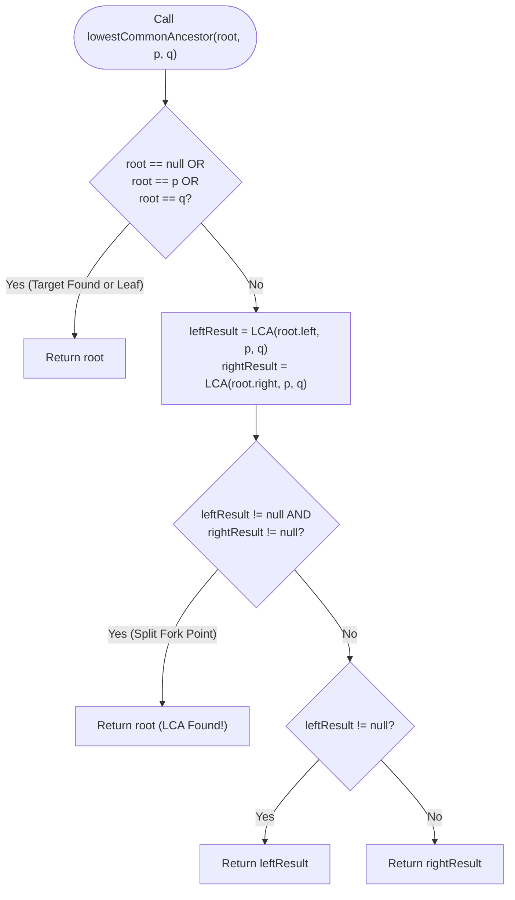

# Module 02: Tree Archetypes, Path Metrics & 2D Coordinate Projections

In linear structures, distances are simple scalar index subtractions ($j - i$). In hierarchical trees, paths diverge across branching nodes, requiring **Post-Order Dynamic Programming** to compute subtree aggregations and **2D Coordinate Projections** to capture spatial geometric perspectives. This module solves three master archetypes: **Lowest Common Ancestor (LCA)**, **Binary Tree Maximum Path Sum**, and **Vertical Coordinate Tree Views**.

---

## Problem 1: Lowest Common Ancestor (LCA) in a Binary Tree

### 1. Problem Statement & Operational Constraints

Given a binary tree and two nodes $p$ and $q$, find their **Lowest Common Ancestor (LCA)**. The LCA of $p$ and $q$ is defined as the lowest node $T$ in the tree that has both $p$ and $q$ as descendants (where a node can be a descendant of itself).

- **Constraints**:
  - Number of nodes $N \in [2, 10^5]$.
  - All `Node.val` are unique.
  - $p$ and $q$ are guaranteed to exist in the tree ($p \ne q$).
  - Required Time Complexity: strictly **$O(N)$**.

---

### 2. The Thought Process: Post-Order State Bubbling

#### The Naive Path-Comparison Bottleneck
- Trace root-to-$p$ path into list $L_p$, and root-to-$q$ path into list $L_q$.
- Compare lists to find the last common node.
- **Cost**: Requires $O(N)$ time and $O(N)$ auxiliary heap memory to store path nodes.

#### The "Aha!" Insight: Bottom-Up Post-Order Bubbling
Can we determine the LCA in a single traversal pass without storing paths?
- In a post-order traversal (`Left -> Right -> Root`), subtrees report their findings upward to the parent:
  1. If current `node == null`, return `null`.
  2. If current `node == p` or `node == q`, **return current node immediately**!
  3. Recurse left (`leftResult`) and right (`rightResult`).
  4. **The Split-Point Invariant**:
     - If both `leftResult != null` AND `rightResult != null`:
       - This means $p$ was found in one subtree and $q$ was found in the other subtree!
       - Therefore, the current node is the **exact fork point** where their paths diverge $\implies$ **Current node IS the LCA**!
     - If only one child returned non-null:
       - Both $p$ and $q$ lie inside that single subtree (or one is an ancestor of the other). Bubble that non-null result upward!

```text
╭─────────────────────────────────────────────────────────────────────────────────────────────╮
│                         LCA POST-ORDER BUBBLING MECHANICS                                   │
├─────────────────────────────────────────────────────────────────────────────────────────────┤
│                 (3) <── Left returned 5, Right returned 1 -> Both non-null! (LCA = 3)       │
│                /   \                                                                        │
│              (5)   (1) <── Matches q=1! Returns 1 upward                                    │
│             /   \                                                                           │
│           (6)   (2)                                                                         │
│                 / \                                                                         │
│               (7) (4) <── Matches p=4! Returns 4 upward                                     │
╰─────────────────────────────────────────────────────────────────────────────────────────────╯
```

---

### 3. Procedural Mermaid Flowchart ("How to Proceed")



---

### 4. Production Implementation (Java 17/21)

```java
package com.dataship.trees.metrics;

public final class LowestCommonAncestor {

    public static class TreeNode {
        public int val;
        public TreeNode left;
        public TreeNode right;
        public TreeNode(int val) { this.val = val; }
    }

    private LowestCommonAncestor() {}

    /**
     * Finds the lowest common ancestor in O(N) time and O(H) auxiliary call stack space.
     */
    public static TreeNode lowestCommonAncestor(TreeNode root, TreeNode p, TreeNode q) {
        // Base condition: root is null, or matches p or q
        if (root == null || root == p || root == q) {
            return root;
        }

        TreeNode left = lowestCommonAncestor(root.left, p, q);
        TreeNode right = lowestCommonAncestor(root.right, p, q);

        // If both left and right return non-null, root is the convergence point (LCA)
        if (left != null && right != null) {
            return root;
        }

        // Otherwise bubble up the non-null result
        return (left != null) ? left : right;
    }
}
```

---

## Problem 2: Binary Tree Maximum Path Sum

### 1. Problem Statement & Operational Constraints

A path in a binary tree is a sequence of nodes where each pair of adjacent nodes in the sequence has an edge connecting them. A node can only appear in the sequence at most once. The path does **not** need to pass through the root. Return the **maximum path sum** of any non-empty path.

- **Constraints**:
  - Number of nodes $N \in [1, 3 \times 10^4]$.
  - $\text{Node.val} \in [-1000, 1000]$ (contains negative values!).
  - Required Time Complexity: strictly **$O(N)$**.

---

### 2. The Thought Process: Turning Paths vs. Contributing Branches

#### The Structural Conflict
At any arbitrary node $U$:
1. A path can **turn** through $U$, connecting $U$'s left subtree, $U$ itself, and $U$'s right subtree:
   $$\text{Turning Path Sum} = \text{val} + \text{gainLeft} + \text{gainRight}$$
2. However, if $U$'s parent wants to use $U$ to extend a larger path higher up the tree, the path **cannot turn at $U$**! A path cannot branch in two directions and continue upward without visiting $U$ twice (violating the simple path definition).
3. Therefore, $U$ can only return a **single contributing branch** to its parent!

#### The "Aha!" Insight: Dual-Metric Post-Order DP
At each node $U$:
- Compute the maximum downward path sum of its left child and right child.
- **Negative Gain Pruning**: If a child's branch sum is negative, ignore it completely ($\max(0, \text{gain})$)!
- Update the global maximum path sum using the **turning path**:
  $$\text{maxSum} = \max(\text{maxSum}, U.\text{val} + \text{gainLeft} + \text{gainRight})$$
- Return to $U$'s parent the **straight contributing branch**:
  $$\text{return } U.\text{val} + \max(\text{gainLeft}, \text{gainRight})$$

```text
╭─────────────────────────────────────────────────────────────────────────────────────────────╮
│                         TURNING PATH VS. CONTRIBUTING BRANCH                                │
├─────────────────────────────────────────────────────────────────────────────────────────────┤
│                     Parent                                                                  │
│                       │                                                                     │
│                      (U) <── Turning Path: Left + U + Right (Evaluated for Global Max)      │
│                     /   \                                                                   │
│             (Left)         (Right)                                                          │
│                                                                                             │
│ Value returned to Parent: U.val + max(Left, Right)  (Strictly one branch!)                 │
╰─────────────────────────────────────────────────────────────────────────────────────────────╯
```

---

### 3. Production Implementation (Java 17/21)

```java
package com.dataship.trees.metrics;

public final class BinaryTreeMaxPathSum {

    public static class TreeNode {
        public int val;
        public TreeNode left;
        public TreeNode right;
        public TreeNode(int val) { this.val = val; }
    }

    private int maxSum;

    public int maxPathSum(TreeNode root) {
        maxSum = Integer.MIN_VALUE;
        calculateMaxGain(root);
        return maxSum;
    }

    private int calculateMaxGain(TreeNode node) {
        if (node == null) {
            return 0;
        }

        // Post-order evaluation: prune negative path sums with Math.max(0, ...)
        int leftGain = Math.max(0, calculateMaxGain(node.left));
        int rightGain = Math.max(0, calculateMaxGain(node.right));

        // Invariant: Turning path through current node
        int currentTurningPath = node.val + leftGain + rightGain;
        if (currentTurningPath > maxSum) {
            maxSum = currentTurningPath;
        }

        // Return strictly single-branch contribution to parent
        return node.val + Math.max(leftGain, rightGain);
    }
}
```

---

## Problem 3: Vertical Order Traversal & Tree Views

### 1. Problem Statement & Operational Constraints

Given the `root` of a binary tree, calculate the **vertical order traversal** of the binary tree. For each node at position $(r, c)$, its left child is at $(r + 1, c - 1)$ and its right child is at $(r + 1, c + 1)$. The root is at $(0, 0)$.

Return the values column-by-column from leftmost column to rightmost column. Within the same column, nodes must be sorted from top to bottom (by row).

---

### 2. The Thought Process: BFS Queue over 2D Coordinate Grid

#### Why DFS Can Produce Incorrect Row Order
In DFS, visiting deep left nodes first can place a bottom node before a top node that happens to share the same column!
To guarantee that nodes are naturally discovered in **top-to-bottom row order**, we employ a **Breadth-First Search (BFS)** queue.

#### Derivation of Tree Views:
1. **Vertical Order**: All nodes in each column list.
2. **Top View**: The **very first** node observed at each column $c$ during BFS.
3. **Bottom View**: The **last** node observed at each column $c$ during BFS.

---

### 3. Production Implementation (Java 17/21)

```java
package com.dataship.trees.metrics;

import java.util.*;

public final class VerticalOrderTraversal {

    public static class TreeNode {
        public int val;
        public TreeNode left;
        public TreeNode right;
        public TreeNode(int val) { this.val = val; }
    }

    private record NodeLocation(TreeNode node, int col) {}

    public static List<List<Integer>> verticalOrder(TreeNode root) {
        if (root == null) return List.of();

        // Map column index to list of node values
        Map<Integer, List<Integer>> columnTable = new HashMap<>();
        Deque<NodeLocation> queue = new ArrayDeque<>();
        queue.offer(new NodeLocation(root, 0));

        int minCol = 0;
        int maxCol = 0;

        // Standard BFS queue guarantees nodes are processed top-to-bottom
        while (!queue.isEmpty()) {
            NodeLocation curr = queue.poll();
            TreeNode node = curr.node;
            int col = curr.col;

            columnTable.computeIfAbsent(col, k -> new ArrayList<>()).add(node.val);
            minCol = Math.min(minCol, col);
            maxCol = Math.max(maxCol, col);

            if (node.left != null) {
                queue.offer(new NodeLocation(node.left, col - 1));
            }
            if (node.right != null) {
                queue.offer(new NodeLocation(node.right, col + 1));
            }
        }

        List<List<Integer>> result = new ArrayList<>();
        for (int i = minCol; i <= maxCol; i++) {
            if (columnTable.containsKey(i)) {
                result.add(columnTable.get(i));
            }
        }
        return result;
    }
}
```

---

<table width="100%">
  <tr>
    <td width="33%" align="left">
      <a href="./01-tree-fundamentals-and-traversal-paradigms.md">
        <strong>← Previous Module</strong><br>
        01. Tree Fundamentals & Traversals
      </a>
    </td>
    <td width="33%" align="center">
      <a href="../README.md">
        <strong>Home</strong><br>
        Java DSA Master Track
      </a>
    </td>
    <td width="33%" align="right">
      <a href="./03-binary-search-trees-and-ordered-space.md">
        <strong>Next Module →</strong><br>
        03. Binary Search Trees & Ordered Space
      </a>
    </td>
  </tr>
</table>
