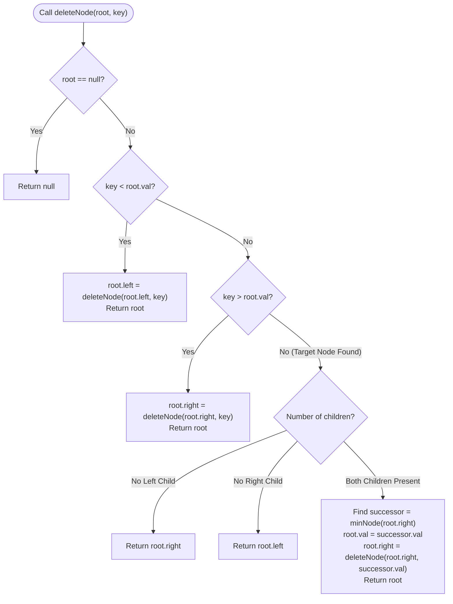

# Module 03: Binary Search Trees, Invariant Spaces & Node Mutation

A Binary Tree becomes a **Binary Search Tree (BST)** when an ordering invariant is imposed across every node: all elements in the left subtree must be strictly less than the root, and all elements in the right subtree must be strictly greater than the root. This structural discipline bridges the gap between fast $O(1)$ pointer insertions and logarithmic $O(\log N)$ binary search.

---

## 🏛️ 1. The BST Ordering Invariant

```text
╭─────────────────────────────────────────────────────────────────────────────────────────────╮
│                         THE BINARY SEARCH TREE INVARIANT                                    │
├─────────────────────────────────────────────────────────────────────────────────────────────┤
│                                                                                             │
│                         (Root: X)                                                           │
│                         /        \                                                          │
│        [All Nodes < X]            [All Nodes > X]                                           │
│                                                                                             │
│  The Local vs. Global Invariant Trap:                                                       │
│  Checking only immediate children (left < root < right) is INSUFFICIENT!                     │
│                                                                                             │
│  Invalid BST Counterexample:                                                                │
│             (5)                                                                             │
│            /   \                                                                            │
│          (3)   (8)                                                                          │
│               /                                                                             │
│             (4) <── 4 < 8 (Locally valid for 8), but 4 < 5 (Globally INVALID for root 5!)   │
│                                                                                             │
│  The Global Invariant: Range Propagation [minBound, maxBound] across every branch.          │
╰─────────────────────────────────────────────────────────────────────────────────────────────╯
```

---

## Problem 1: Validate BST & In-Order Successor in $O(H)$

### 1. Problem Statement & Operational Constraints

Given the `root` of a binary tree, determine if it is a valid **Binary Search Tree (BST)**.
Find the **in-order successor** of a given node in a BST in strictly **$O(H)$ time** and **$O(1)$ auxiliary space**.

- **Constraints**:
  - Number of nodes $N \in [1, 10^5]$.
  - $\text{Node.val} \in [-2^{31}, 2^{31} - 1]$ (values can equal `Integer.MIN_VALUE` and `Integer.MAX_VALUE`!).

---

### 2. The Thought Process: Range Propagation with 64-Bit Bounds

#### Overcoming the `Integer.MIN_VALUE` Boundary Trap
If we initialize our bounds with `Integer.MIN_VALUE` and `Integer.MAX_VALUE`, a valid tree containing a node with value `Integer.MAX_VALUE` will fail the strict inequality check ($\text{val} < \text{maxBound}$).
- **The Solution**: Use 64-bit `Long.MIN_VALUE` and `Long.MAX_VALUE` to ensure all 32-bit signed integers fall safely inside the open range:
  $$\text{minBound} < \text{node.val} < \text{maxBound}$$

#### In-Order Successor in $O(H)$ without Tree Traversal
- If node $P$ has a **right subtree**: Successor is simply the **leftmost node in the right subtree**.
- If node $P$ has **no right subtree**: Start from root and binary-search downwards:
  - If `curr.val > P.val`: `curr` is a candidate successor! Record `successor = curr`, and move left (`curr = curr.left`).
  - If `curr.val <= P.val`: `curr` is too small to be the successor; move right (`curr = curr.right`).
- **Cost**: Exactly $O(H)$ time and $O(1)$ space.

---

### 3. Production Implementation (Java 17/21)

```java
package com.dataship.trees.bst;

public final class ValidateAndSuccessorBST {

    public static class TreeNode {
        public int val;
        public TreeNode left;
        public TreeNode right;
        public TreeNode(int val) { this.val = val; }
    }

    private ValidateAndSuccessorBST() {}

    /**
     * Validates BST invariant using 64-bit range propagation in O(N) time and O(H) stack space.
     */
    public static boolean isValidBST(TreeNode root) {
        return validate(root, Long.MIN_VALUE, Long.MAX_VALUE);
    }

    private static boolean validate(TreeNode node, long minBound, long maxBound) {
        if (node == null) return true;

        // Global invariant check
        if (node.val <= minBound || node.val >= maxBound) {
            return false;
        }

        // Left child bounded by [minBound, node.val); Right child bounded by (node.val, maxBound]
        return validate(node.left, minBound, node.val) && 
               validate(node.right, node.val, maxBound);
    }

    /**
     * Finds the in-order successor of node p in O(H) time and O(1) space.
     */
    public static TreeNode inorderSuccessor(TreeNode root, TreeNode p) {
        TreeNode successor = null;
        TreeNode curr = root;

        while (curr != null) {
            if (curr.val > p.val) {
                successor = curr; // Candidate successor
                curr = curr.left;
            } else {
                curr = curr.right;
            }
        }

        return successor;
    }
}
```

---

## Problem 2: Delete Node in a Binary Search Tree

### 1. Problem Statement & Operational Constraints

Given a root node reference of a BST and a `key`, delete the node with the given key in the BST. Return the root node reference (possibly updated) of the BST.

- **Constraints**:
  - $N \in [0, 10^4]$.
  - Tree must preserve the BST invariant after deletion.
  - Required Time Complexity: strictly **$O(H)$**.

---

### 2. The Thought Process: The 3 Deletion Cases

```text
╭─────────────────────────────────────────────────────────────────────────────────────────────╮
│                         BST NODE DELETION SCENARIOS                                         │
├─────────────────────────────────────────────────────────────────────────────────────────────┤
│                                                                                             │
│ Case 1: Node is a Leaf (No Children):                                                       │
│         Delete node directly -> return null to parent.                                      │
│                                                                                             │
│ Case 2: Node has EXACTLY ONE Child:                                                         │
│         Bypass node -> return the non-null child directly to parent.                        │
│                                                                                             │
│ Case 3: Node has TWO Children:                                                              │
│         1. Locate in-order successor (smallest node in right subtree: right.left.left...).  │
│         2. Copy successor's value into current node.                                        │
│         3. Recursively delete successor from the right subtree (falls into Case 1 or 2!).  │
╰─────────────────────────────────────────────────────────────────────────────────────────────╯
```

---

### 3. Procedural Mermaid Flowchart ("How to Proceed")



---

### 4. Production Implementation (Java 17/21)

```java
package com.dataship.trees.bst;

public final class DeleteNodeBST {

    public static class TreeNode {
        public int val;
        public TreeNode left;
        public TreeNode right;
        public TreeNode(int val) { this.val = val; }
    }

    private DeleteNodeBST() {}

    public static TreeNode deleteNode(TreeNode root, int key) {
        if (root == null) {
            return null;
        }

        if (key < root.val) {
            root.left = deleteNode(root.left, key);
        } else if (key > root.val) {
            root.right = deleteNode(root.right, key);
        } else {
            // Target node found
            // Case 1 & 2: 0 or 1 child
            if (root.left == null) {
                return root.right;
            }
            if (root.right == null) {
                return root.left;
            }

            // Case 3: 2 children
            // Find in-order successor (minimum value in right subtree)
            TreeNode successor = findMin(root.right);
            root.val = successor.val;
            // Recursively delete the in-order successor from the right subtree
            root.right = deleteNode(root.right, successor.val);
        }

        return root;
    }

    private static TreeNode findMin(TreeNode node) {
        while (node.left != null) {
            node = node.left;
        }
        return node;
    }
}
```

---

## Problem 3: Recover Binary Search Tree (Two Swapped Nodes in $O(1)$ Space)

### 1. Problem Statement & Operational Constraints

You are given the `root` of a binary search tree (BST), where the values of **exactly two nodes** were swapped by mistake. Recover the tree without changing its structure.

- **Constraints**:
  - $N \in [2, 1000]$.
  - Auxiliary Space: strictly **$O(1)$ space** (excluding input tree).

---

### 2. The Thought Process: Inversion Counting via Morris Traversal

#### Identifying Inversions in In-Order Traversal
In a valid BST, In-Order Traversal produces a strictly increasing sequence:
$$[1, 2, 3, 4, 5, 6]$$
If two nodes are swapped, how does the sequence change?
- **Case 1 (Non-Adjacent Swap, e.g. 2 and 5)**:
  $$[1, \mathbf{5}, 3, 4, \mathbf{2}, 6]$$
  Notice **two inversion violations**:
  1. $5 > 3$: First swapped node is the larger element ($5$).
  2. $4 > 2$: Second swapped node is the smaller element ($2$).
- **Case 2 (Adjacent Swap, e.g. 2 and 3)**:
  $$[1, \mathbf{3}, \mathbf{2}, 4, 5, 6]$$
  Notice **only one inversion violation**:
  1. $3 > 2$: First node is $3$, Second node is $2$.
- By tracking `first`, `second`, and `prev` during **Morris In-Order Traversal**, we locate both nodes and swap their values in **strictly $O(1)$ auxiliary space**!

---

### 3. Production Implementation (Java 17/21)

```java
package com.dataship.trees.bst;

public final class RecoverBST {

    public static class TreeNode {
        public int val;
        public TreeNode left;
        public TreeNode right;
        public TreeNode(int val) { this.val = val; }
    }

    private RecoverBST() {}

    /**
     * Recovers swapped BST nodes in O(N) time and strictly O(1) auxiliary space using Morris Traversal.
     */
    public static void recoverTree(TreeNode root) {
        TreeNode first = null;
        TreeNode second = null;
        TreeNode prev = null;
        TreeNode curr = root;

        while (curr != null) {
            if (curr.left == null) {
                // In-order check
                if (prev != null && prev.val > curr.val) {
                    if (first == null) first = prev;
                    second = curr;
                }
                prev = curr;
                curr = curr.right;
            } else {
                TreeNode pred = curr.left;
                while (pred.right != null && pred.right != curr) {
                    pred = pred.right;
                }

                if (pred.right == null) {
                    pred.right = curr; // Establish thread
                    curr = curr.left;
                } else {
                    pred.right = null; // Dismantle thread
                    // In-order check
                    if (prev != null && prev.val > curr.val) {
                        if (first == null) first = prev;
                        second = curr;
                    }
                    prev = curr;
                    curr = curr.right;
                }
            }
        }

        // Swap the values of the two corrupted nodes
        if (first != null && second != null) {
            int temp = first.val;
            first.val = second.val;
            second.val = temp;
        }
    }
}
```

---

<table width="100%">
  <tr>
    <td width="33%" align="left">
      <a href="./02-tree-archetypes-and-path-metrics.md">
        <strong>← Previous Module</strong><br>
        02. Tree Archetypes & Metrics
      </a>
    </td>
    <td width="33%" align="center">
      <a href="../README.md">
        <strong>Home</strong><br>
        Java DSA Master Track
      </a>
    </td>
    <td width="33%" align="right">
      <a href="./04-self-balancing-trees-and-interval-structures.md">
        <strong>Next Module →</strong><br>
        04. Self-Balancing Trees & Intervals
      </a>
    </td>
  </tr>
</table>
