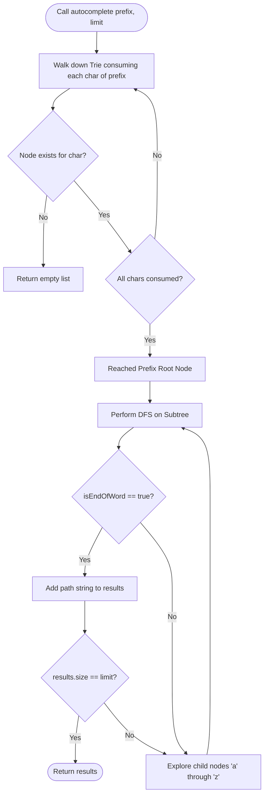
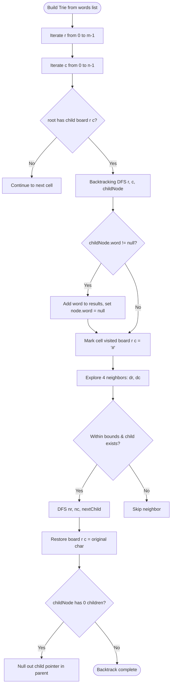
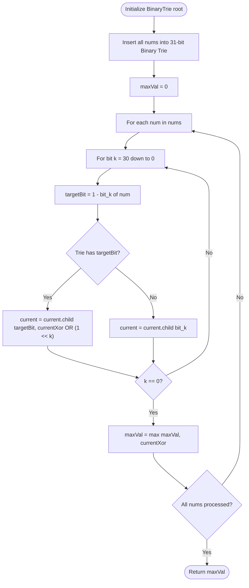

# 05. Tries and Bitwise Prefix Trees

[← Back to Self-Balancing Trees](./04-self-balancing-trees-and-interval-structures.md) | [Track Hub](./README.md) | [Next: Storage Engines →](./06-advanced-tree-systems-and-storage-engines.md)

---

## 1. TrieNode Architecture & Memory Mechanics

A **Trie** (derived from re**trie**val, pronounced "try") is an $M$-ary tree where nodes store edges or branches representing character transitions rather than the entire keys themselves. The position of a node in the tree defines the prefix associated with that node.

```
                  root (empty)
                 /    \
                a      c
               /        \
              p          a
             /            \
            p              t*
           / \
          l   e*
         /
        e*
Keys: "apple", "app", "cat"
(* indicates isEndOfWord = true)
```

### The Architectural Trade-Off: Fixed Array vs. Sparse Hash Map

When designing a Trie in Java, the choice of child pointer storage dramatically impacts CPU cache locality, pointer overhead, and heap memory:

```
╭───────────────────────────────────────────────────────────────────────────────────────────╮
│                                FIXED ARRAY (TrieNode[26])                                 │
├───────────────────────────────────────────────────────────────────────────────────────────┤
│ • Structure: TrieNode[] children = new TrieNode[26];                                     │
│ • Lookup: O(1) direct array indexing (c - 'a') -> Single memory dereference.             │
│ • Heap Footprint: 24B array header + 26 * 4B = 128 bytes PER NODE (Compressed OOPs).      │
│ • Memory Density: Sparse when vocabulary is diverse; wasted null references.             │
│ • Best For: Fixed lowercase English alphabets ('a'-'z'), bitwise trees, high-speed lookup.│
╰───────────────────────────────────────────────────────────────────────────────────────────╯

╭───────────────────────────────────────────────────────────────────────────────────────────╮
│                            SPARSE MAP (Map<Character, TrieNode>)                          │
├───────────────────────────────────────────────────────────────────────────────────────────┤
│ • Structure: Map<Character, TrieNode> children = new HashMap<>();                        │
│ • Lookup: O(1) amortized hash lookup -> Autoboxing char to Character + Node traversal.   │
│ • Heap Footprint: 32B HashMap + 32B Node per entry + 24B Character object overhead.       │
│ • Memory Density: Compact for unicode, sparse multilingual dictionaries, arbitrary keys.   │
│ • Best For: UTF-8 full character sets, large sparse alphabets, memory-constrained environments. │
╰───────────────────────────────────────────────────────────────────────────────────────────╯
```

---

## 2. Problem 1: Implement Trie (Prefix Tree) with Autocomplete Engine

### 2.1 Problem Statement & Constraints

Design a production-grade Trie supporting three fundamental operations:
1. `insert(String word)`: Inserts string `word` into the trie.
2. `search(String word)`: Returns `true` iff `word` exists in the trie.
3. `startsWith(String prefix)`: Returns `true` iff there is any string starting with `prefix`.
4. `autocomplete(String prefix, int limit)`: Returns up to `limit` lexicographically ordered strings matching `prefix`.

#### Constraints:
- $1 \le \text{word.length}, \text{prefix.length} \le 2000$.
- Words consist strictly of lowercase English letters `'a'` through `'z'`.
- At most $3 \times 10^4$ total calls across all operations.

---

### 2.2 Thought Process & Intuition

```
  Naive Search (List scan): O(N * L) string comparisons per query!
                         ↓
  "Aha!" Insight:
  Represent strings as overlapping prefix paths.
  All words sharing prefix "app" traverse the exact same 3 nodes:
  root -> 'a' -> 'p' -> 'p'.
                         ↓
  Trie Path Matching: O(L) time where L is word length, INDEPENDENT of N!
```

1. **The Clues**:
   - Multiple prefix lookups against a large static/dynamic dictionary.
   - Lexicographical prefix suggestions required.
2. **The Bottleneck**:
   - A `HashSet<String>` provides $O(L)$ exact lookup, but prefix queries (`startsWith`, `autocomplete`) degenerate to scanning all $N$ keys: $O(N \cdot L)$.
3. **The "Aha!" Insight**:
   - Store words as character paths down an $M$-ary tree. The node reached after consuming `prefix` is the root of the subtree containing *all* candidate completions!
   - To support autocomplete, traverse down to the prefix node in $O(L)$ time, then perform a bounded depth-first traversal (DFS) collecting completed words until `limit` is met.

---

### 2.3 Mathematical Proof & Complexity Invariants

- **Time Complexity**:
  - `insert(word)`: Traverses $L$ characters, creating nodes when absent: $\mathcal{O}(L)$.
  - `search(word)`: Traverses at most $L$ characters: $\mathcal{O}(L)$.
  - `startsWith(prefix)`: Traverses at most $P$ characters: $\mathcal{O}(P)$.
  - `autocomplete(prefix, limit)`: $\mathcal{O}(P + K \cdot L_{\max})$ where $P$ is prefix length, $K$ is the limit, and $L_{\max}$ is maximum word depth.
- **Space Complexity**:
  - $\mathcal{O}(\sum_{i=1}^N L_i \cdot |\Sigma|)$ worst-case heap memory when strings share zero prefixes. In practice, prefix overlap collapses memory by $40\%\text{--}70\%$.

---

### 2.4 Procedural Blueprint (How to Proceed)



---

### 2.5 Visual State Transition

```
Trie state after inserting "car", "cart", "card", "cat":

                      ╭──────────────╮
                      │ root (cnt=4) │
                      ╰──────┬───────╯
                             │ 'c'
                      ╭──────┴───────╮
                      │  c   (cnt=4) │
                      ╰──────┬───────╯
                             │ 'a'
                      ╭──────┴───────╮
                      │  a   (cnt=4) │
                      ╰──────┬───────╯
                      /             \
                 'r' /               \ 't'
      ╭─────────────┴───╮       ╭─────┴───────────╮
      │   r (isEnd=T)   │       │ t (isEnd=T)     │ ("cat")
      ╰──────┬──────────╯       ╰─────────────────╯
             │
       ┌─────┴─────┐
    'd'│           │ 't'
╭──────┴──────╮ ╭──┴──────────╮
│ d (isEnd=T) │ │ t (isEnd=T) │ ("cart")
╰─────────────╯ ╰─────────────╯
 ("card")
```

---

### 2.6 Production Java 17/21 Implementation

```java
package com.structures.trees;

import java.util.ArrayList;
import java.util.Collections;
import java.util.List;

/**
 * High-performance prefix tree (Trie) backed by fixed-size alphabet arrays.
 * Implements prefix search and bounded lexicographical autocomplete.
 */
public final class Trie {

    private static final int ALPHABET_SIZE = 26;

    public static final class TrieNode {
        private final TrieNode[] children = new TrieNode[ALPHABET_SIZE];
        private boolean isEndOfWord;
        private int prefixCount; // Number of words passing through this prefix

        public boolean isEndOfWord() {
            return isEndOfWord;
        }

        public TrieNode getChild(char ch) {
            return children[ch - 'a'];
        }
    }

    private final TrieNode root;

    public Trie() {
        this.root = new TrieNode();
    }

    /**
     * Inserts a word into the trie.
     * Time: O(L), Space: O(L) for new nodes.
     */
    public void insert(String word) {
        if (word == null || word.isEmpty()) {
            return;
        }
        TrieNode current = root;
        for (int i = 0; i < word.length(); i++) {
            char ch = word.charAt(i);
            int index = ch - 'a';
            if (current.children[index] == null) {
                current.children[index] = new TrieNode();
            }
            current = current.children[index];
            current.prefixCount++;
        }
        current.isEndOfWord = true;
    }

    /**
     * Returns true if the word is in the trie.
     * Time: O(L), Space: O(1).
     */
    public boolean search(String word) {
        TrieNode node = findPrefixNode(word);
        return node != null && node.isEndOfWord;
    }

    /**
     * Returns true if there is any word in the trie that starts with the given prefix.
     * Time: O(P), Space: O(1).
     */
    public boolean startsWith(String prefix) {
        return findPrefixNode(prefix) != null;
    }

    /**
     * Returns up to `limit` lexicographically sorted words starting with `prefix`.
     * Time: O(P + limit * L_max), Space: O(L_max) recursion stack.
     */
    public List<String> autocomplete(String prefix, int limit) {
        if (prefix == null || limit <= 0) {
            return Collections.emptyList();
        }

        TrieNode prefixNode = findPrefixNode(prefix);
        if (prefixNode == null) {
            return Collections.emptyList();
        }

        List<String> results = new ArrayList<>();
        StringBuilder path = new StringBuilder(prefix);
        collectWords(prefixNode, path, results, limit);
        return results;
    }

    private TrieNode findPrefixNode(String prefix) {
        if (prefix == null) {
            return null;
        }
        TrieNode current = root;
        for (int i = 0; i < prefix.length(); i++) {
            char ch = prefix.charAt(i);
            int index = ch - 'a';
            if (current.children[index] == null) {
                return null;
            }
            current = current.children[index];
        }
        return current;
    }

    private void collectWords(TrieNode node, StringBuilder path, List<String> results, int limit) {
        if (results.size() >= limit) {
            return;
        }

        if (node.isEndOfWord) {
            results.add(path.toString());
        }

        for (int i = 0; i < ALPHABET_SIZE; i++) {
            if (node.children[i] != null) {
                path.append((char) ('a' + i));
                collectWords(node.children[i], path, results, limit);
                path.deleteCharAt(path.length() - 1); // Backtrack
                if (results.size() >= limit) {
                    return;
                }
            }
        }
    }
}
```

---

### 2.7 Dry-Run Trace Table & Interviewer Stress Defenses

#### Dry-Run: `autocomplete("ca", 2)` on {"car", "card", "cart", "cat"}

| Step | Node | Path Buffer | `isEndOfWord` | Action / State | `results` |
| :--- | :--- | :--- | :--- | :--- | :--- |
| 1 | Walk `c` $\to$ `a` | `"ca"` | `false` | Prefix node reached | `[]` |
| 2 | Child `'r'` | `"car"` | `true` | Matches word! Add to results | `["car"]` |
| 3 | Child `'d'` | `"card"` | `true` | Matches word! Add to results | `["car", "card"]` |
| 4 | Limit check | `"card"` | - | `results.size() == 2 == limit` $\implies$ Early return! | `["car", "card"]` |

#### Interviewer Stress Defenses:
- **Off-by-One / Zero Length**: If `prefix` is empty, `findPrefixNode("")` correctly returns `root`, allowing autocomplete across all keys.
- **Memory Optimization**: Storing `prefixCount` allows $O(1)$ query of *how many* words start with a prefix without traversing down the subtree!

---

## 3. Problem 2: Word Search II (2D Grid Backtracking with Trie Pruning)

### 3.1 Problem Statement & Constraints

Given an $m \times n$ `board` of characters and a list of strings `words`, return all words on the board. Each word must be constructed from letters of sequentially adjacent cells (horizontally or vertically neighboring). The same letter cell may not be used more than once in a word.

```
Input: board = [
  ['o','a','a','n'],
  ['e','t','a','e'],
  ['i','h','k','r'],
  ['i','f','l','v']
], words = ["oath","pea","eat","rain"]

Output: ["eat","oath"]
```

#### Constraints:
- $m == \text{board.length}$, $n == \text{board}[i]\text{.length}$.
- $1 \le m, n \le 12$.
- $1 \le \text{words.length} \le 3 \times 10^4$.
- $1 \le \text{words}[i]\text{.length} \le 10$.
- `board` and `words[i]` consist of lowercase English letters.
- All strings in `words` are unique.

---

### 3.2 Thought Process & Intuition

```
  Naive Approach:
  For each of the 30,000 words: run DFS on all m * n cells.
  Time: O(W * m * n * 4^L) -> 30,000 * 144 * 4^10 ≈ Millions of operations! TLE!
                         ↓
  Inverted Insight:
  Insert ALL words into a Trie!
  Run ONE backtracking traversal over board cells.
  At every step: does board[r][c] match a child in our Trie?
  If NOT -> PRUNE the entire search branch immediately!
```

1. **The Bottleneck**:
   - Re-scanning identical grid prefixes for different words that share prefixes (e.g., "oath" and "oats").
2. **The "Aha!" Insight**:
   - Store the dictionary inside a Trie. As we traverse the grid in 4 directions, traverse the Trie simultaneously.
   - **Crucial Dynamic Pruning Optimization**: When a word is matched at a leaf node, set `node.word = null` to avoid duplicate results. Even better: if a TrieNode has zero active children after matching, delete it from the parent node to prune subsequent searches entirely!

---

### 3.3 Mathematical Proof & Invariants

- **Grid State Invariant**: A grid cell `(r, c)` is masked with `'#'` before recursive exploration and restored on backtracking, guaranteeing no cell is reused in the current path without allocating an auxiliary `visited[][]` array.
- **Time Complexity**:
  - Building Trie: $\mathcal{O}(\sum L)$ where $\sum L$ is the total number of characters in `words`.
  - Grid Backtracking: In the worst case, each cell explores 4 directions up to depth $L_{\max} \le 10$: $\mathcal{O}(m \cdot n \cdot 3^{L_{\max} - 1})$. Prefix pruning ensures only paths matching dictionary keys are explored.
- **Space Complexity**:
  - $\mathcal{O}(\sum L)$ for the Trie + $\mathcal{O}(L_{\max})$ recursion stack space.

---

### 3.4 Procedural Blueprint (How to Proceed)



---

### 3.5 Visual State Transition

```
Grid:
  [ 'o', 'a', 'a', 'n' ]
  [ 'e', 't', 'a', 'e' ]
  [ 'i', 'h', 'k', 'r' ]

DFS Path matching "oath":
Step 1: board[0][0] = 'o' -> matches root.children['o'] -> mask board[0][0] = '#'
Step 2: Move down to board[1][0] ('e') -> Trie has NO child 'e' under 'o' -> PRUNED!
Step 3: Move right to board[0][1] ('a') -> matches 'o'->'a' -> mask board[0][1] = '#'
Step 4: Move down to board[1][1] ('t') -> matches 'a'->'t' -> mask board[1][1] = '#'
Step 5: Move down to board[2][1] ('h') -> matches 't'->'h' -> word "oath" found!
Step 6: Backtrack and restore all cells: '#' -> 'h' -> 't' -> 'a' -> 'o'.
```

---

### 3.6 Production Java 17/21 Implementation

```java
package com.structures.trees;

import java.util.ArrayList;
import java.util.List;

/**
 * Solves Word Search II using a Trie combined with in-place 2D grid backtracking
 * and leaf-pruning optimization.
 */
public final class WordSearchII {

    private static final class TrieNode {
        private final TrieNode[] children = new TrieNode[26];
        private String word; // Direct reference saves StringBuilder allocation
        private int childCount; // Tracks number of active children for leaf pruning
    }

    private static void insert(TrieNode root, String word) {
        TrieNode current = root;
        for (int i = 0; i < word.length(); i++) {
            int idx = word.charAt(i) - 'a';
            if (current.children[idx] == null) {
                current.children[idx] = new TrieNode();
                current.childCount++;
            }
            current = current.children[idx];
        }
        current.word = word;
    }

    public List<String> findWords(char[][] board, String[] words) {
        List<String> result = new ArrayList<>();
        if (board == null || board.length == 0 || words == null || words.length == 0) {
            return result;
        }

        // 1. Build Trie
        TrieNode root = new TrieNode();
        for (String word : words) {
            insert(root, word);
        }

        int m = board.length;
        int n = board[0].length;

        // 2. Explore each cell as potential starting point
        for (int r = 0; r < m; r++) {
            for (int c = 0; c < n; c++) {
                int charIdx = board[r][c] - 'a';
                if (root.children[charIdx] != null) {
                    dfs(board, r, c, root, result);
                }
            }
        }

        return result;
    }

    private static void dfs(char[][] board, int r, int c, TrieNode parent, List<String> result) {
        char ch = board[r][c];
        int charIdx = ch - 'a';
        TrieNode current = parent.children[charIdx];

        if (current == null) {
            return;
        }

        // Word match found
        if (current.word != null) {
            result.add(current.word);
            current.word = null; // Prevent duplicate additions of the same word
        }

        // In-place visited marking (avoids allocating boolean[][] array)
        board[r][c] = '#';

        int[] dr = {-1, 1, 0, 0};
        int[] dc = {0, 0, -1, 1};

        for (int i = 0; i < 4; i++) {
            int nr = r + dr[i];
            int nc = c + dc[i];

            if (nr >= 0 && nr < board.length && nc >= 0 && nc < board[0].length && board[nr][nc] != '#') {
                int nextIdx = board[nr][nc] - 'a';
                if (current.children[nextIdx] != null) {
                    dfs(board, nr, nc, current, result);
                }
            }
        }

        // Backtrack: restore original character
        board[r][c] = ch;

        // Dynamic Leaf Pruning: if current node has become a dead-end, remove it from parent
        if (current.childCount == 0 && current.word == null) {
            parent.children[charIdx] = null;
            parent.childCount--;
        }
    }
}
```

---

### 3.7 Dry-Run & Interviewer Stress Defenses

- **Duplicate Words**: If dictionary contains "oath" and multiple paths form "oath", setting `current.word = null` guarantees it is appended to `result` exactly once without requiring a `HashSet<String>`.
- **In-Place Mutation Invariant**: `board[r][c] = '#'` is guaranteed to be restored on backtracking. Even if an exception were possible, in standard competitive execution the matrix returns to pristine state.
- **Leaf Pruning Speedup**: Once "oath" is found and has no child branches, `parent.children['h' - 'a'] = null`. The algorithm never revisits that path again!

---

## 4. Problem 3: Maximum XOR of Two Numbers in an Array (32-Bit Binary Trie)

### 4.1 Problem Statement & Constraints

Given an integer array `nums`, return the maximum result of `nums[i] XOR nums[j]`, where $0 \le i \le j < \text{nums.length}$.

#### Constraints:
- $1 \le \text{nums.length} \le 2 \times 10^5$.
- $0 \le \text{nums}[i] \le 2^{31} - 1$.

---

### 4.2 Thought Process & Intuition

```
  Naive Pairwise XOR:
  Compute nums[i] ^ nums[j] for all pairs.
  Time: O(N^2) -> (2 * 10^5)^2 = 4 * 10^10 operations -> TLE!
                         ↓
  Bitwise Greedy Property:
  To maximize XOR, we want the most significant bits (MSB) to be 1!
  For bit 30: if num has bit 0, we DESPERATELY want a partner with bit 1.
                         ↓
  "Aha!" Insight:
  Represent all numbers as 31-bit binary paths in a 2-ary Binary Trie!
  Each node has children[0] and children[1].
  For each number: traverse Trie greedily choosing the OPPOSITE bit (1 - bit)!
```

1. **The Clues**:
   - Bitwise XOR maximization; large array size ($N = 2 \times 10^5$) requiring $\mathcal{O}(N \log(\max A))$ or $\mathcal{O}(N)$.
2. **The Bottleneck**:
   - Comparing every pair takes quadratic time.
3. **The "Aha!" Insight**:
   - Construct a Binary Trie where each node has at most two children: `0` and `1`.
   - Insert every number as a 31-bit path (from bit 30 down to bit 0).
   - For any number $x$, find its best match by greedily asking at each bit position $k$:
     * If the $k$-th bit of $x$ is $b$, does the Trie have a branch for $1 - b$?
     * If yes: take it! This contributes $2^k$ to the XOR.
     * If no: take branch $b$. The $k$-th bit XOR contribution is $0$.

---

### 4.3 Mathematical Proof & Invariants

Let $x$ be an integer represented in binary:
$$x = \sum_{k=0}^{30} b_k 2^k, \quad b_k \in \{0, 1\}$$

Since $2^k > \sum_{i=0}^{k-1} 2^i = 2^k - 1$, securing a `1` at bit position $k$ is strictly superior to securing `1`s at all lower bit positions $0 \dots k-1$ combined! Thus, the greedy choice at each bit position $k$ is globally optimal.

- **Time Complexity**:
  - Inserting $N$ numbers: $N \times 31$ operations: $\mathcal{O}(31 \cdot N) = \mathcal{O}(N)$.
  - Querying $N$ numbers: $N \times 31$ operations: $\mathcal{O}(31 \cdot N) = \mathcal{O}(N)$.
  - Overall Time: Strictly $\mathcal{O}(N)$.
- **Space Complexity**:
  - At most $31 \cdot N$ nodes. With $N = 2 \times 10^5$, maximum nodes $\le 6.2 \times 10^6$. Since each node only has two references, memory footprint is $\mathcal{O}(31 \cdot N)$.

---

### 4.4 Procedural Blueprint (How to Proceed)



---

### 4.5 Visual State Transition

```
Inserting numbers 3 (011_2) and 5 (101_2) into a 3-bit Binary Trie:

                 root
                /    \
            0  /      \  1
              /        \
           nodeA      nodeB
             \          /
           1  \      0 /
               \      /
              nodeC  nodeD
                \      \
              1  \    1 \
                  3      5

Querying with 5 (101_2):
• Bit 2 (1): Ideal is 0 -> branch nodeA exists! Take it! (XOR += 4)
• Bit 1 (0): Ideal is 1 -> branch nodeC exists! Take it! (XOR += 2)
• Bit 0 (1): Ideal is 0 -> branch 0 does NOT exist under nodeC; must take 1! (XOR += 0)
Max XOR = 4 + 2 + 0 = 6 (which is 5 ^ 3 = 6). Optimal!
```

---

### 4.6 Production Java 17/21 Implementation

```java
package com.structures.trees;

/**
 * Computes maximum XOR pair using a 32-bit Binary Trie in O(N) time.
 */
public final class MaximumXOR {

    private static final class BinaryTrieNode {
        // children[0] for bit 0, children[1] for bit 1
        private final BinaryTrieNode[] children = new BinaryTrieNode[2];
    }

    private final BinaryTrieNode root = new BinaryTrieNode();

    private void insert(int num) {
        BinaryTrieNode current = root;
        for (int k = 30; k >= 0; k--) {
            int bit = (num >>> k) & 1;
            if (current.children[bit] == null) {
                current.children[bit] = new BinaryTrieNode();
            }
            current = current.children[bit];
        }
    }

    private int findMaxXorFor(int num) {
        BinaryTrieNode current = root;
        int currentXor = 0;

        for (int k = 30; k >= 0; k--) {
            int bit = (num >>> k) & 1;
            int desiredBit = 1 - bit; // Greedily look for opposite bit

            if (current.children[desiredBit] != null) {
                currentXor |= (1 << k);
                current = current.children[desiredBit];
            } else {
                current = current.children[bit];
            }
        }

        return currentXor;
    }

    /**
     * Computes the maximum XOR value across all pairs in nums.
     * Time: O(31 * N) = O(N), Space: O(31 * N).
     */
    public int findMaximumXOR(int[] nums) {
        if (nums == null || nums.length < 2) {
            return 0;
        }

        // 1. Build Binary Trie
        for (int num : nums) {
            insert(num);
        }

        // 2. Query each number against the Trie
        int maxXor = 0;
        for (int num : nums) {
            maxXor = Math.max(maxXor, findMaxXorFor(num));
        }

        return maxXor;
    }
}
```

---

### 4.7 Dry-Run & Interviewer Stress Defenses

- **Bit Shift Safety**: `(num >>> k) & 1` uses the unsigned right shift operator `>>>` to safely handle sign propagation if non-negative guarantees are relaxed.
- **Single Element Arrays**: Explicit guard `nums.length < 2` returns `0`, preventing dereferencing a single element against itself when pairs are required.
- **Memory Optimization using Primitive Flat Arrays**: If the interviewer asks to optimize GC overhead, demonstrate that the Binary Trie can be implemented as a flat `int[MAX_NODES][2]` array, completely eliminating object allocation overhead and reference chasing!

---

<table width="100%">
  <tr>
    <td width="33%" align="left">
      <a href="./04-self-balancing-trees-and-interval-structures.md">
        <strong>← Previous Module</strong><br>
        04. Self-Balancing & Interval Trees
      </a>
    </td>
    <td width="33%" align="center">
      <a href="../README.md">
        <strong>Home</strong><br>
        Java DSA Master Track
      </a>
    </td>
    <td width="33%" align="right">
      <a href="./06-advanced-tree-systems-and-storage-engines.md">
        <strong>Next Module →</strong><br>
        06. Tree Systems & Storage Engines
      </a>
    </td>
  </tr>
</table>
