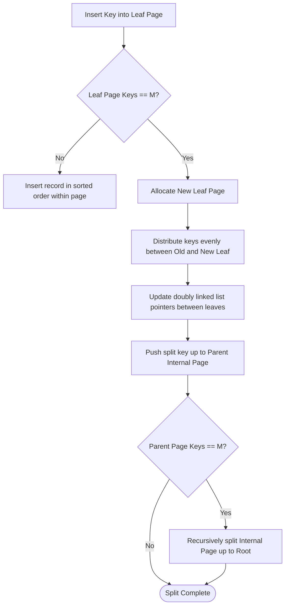
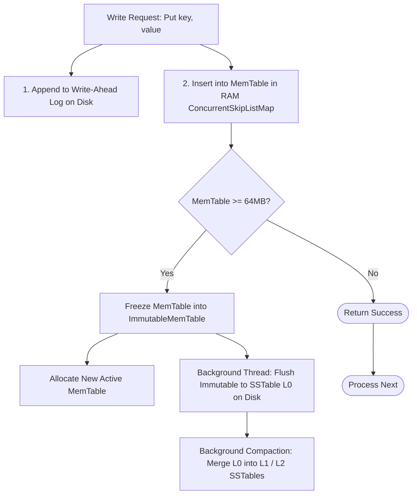

# 06. Advanced Tree Systems and Storage Engines

[← Back to Tries & Bitwise Trees](./05-tries-and-bitwise-prefix-trees.md) | [Track Hub](./README.md) | [Next: Advanced Hard Tree Problems →](./07-advanced-hard-tree-problems.md)

---

## 1. Why In-Memory Trees Fail on Disk

Binary search trees (BSTs, AVL trees, Red-Black trees) are optimized for byte-addressable Random Access Memory (RAM), where pointer chasing takes $\approx 50\text{--}100\text{ ns}$.

On persistent block storage (NVMe SSDs, HDDs), storage controllers do not read single bytes. They transfer data in discrete chunks called **hardware blocks** (typically $4\text{ KB}$ or $16\text{ KB}$ pages).

```
╭───────────────────────────────────────────────────────────────────────────────────────────╮
│                             WHY BINARY TREES DEGRADE ON DISK                              │
├───────────────────────────────────────────────────────────────────────────────────────────┤
│ 1. Random I/O Penalty: Traversal down an AVL tree of height 30 requires 30 separate disk  │
│    page reads. On SSD: 30 * 50 microseconds = 1.5 ms. On HDD: 30 * 8 ms = 240 ms!         │
│ 2. Terrible Page Utilization: A 32-byte binary tree node loaded from disk wastes 99.2%   │
│    of a 4,096-byte disk page transfer!                                                   │
│ 3. Cache Miss Amplification: Child nodes are scattered randomly across the disk address   │
│    space, destroying operating system page cache locality.                               │
╰───────────────────────────────────────────────────────────────────────────────────────────╯
```

To solve this, database storage engines rely on two dominant hierarchical architectures:
1. **B+ Trees** (Read-optimized, in-place updates, canonical for Relational DBs like InnoDB / SQLite / PostgreSQL).
2. **Log-Structured Merge Trees (LSM-Trees)** (Write-optimized, sequential I/O, append-only, canonical for distributed key-value engines).

---

## 2. B-Trees and B+ Trees in Database Storage Engines

### 2.1 The Mathematics of High Fanout ($M$)

A **B+ Tree** is a self-balancing $M$-ary search tree designed to match the disk block size. 

Let the page size be $B = 16\text{ KB} = 16,384\text{ bytes}$.
If each key is an $8$-byte `BIGINT` and each child pointer is an $8$-byte file offset, a single internal node can hold:
$$\text{Fanout } M \approx \frac{16,384}{8 + 8} \approx 1,024 \text{ children}$$

With a fanout of $M = 1,000$, tree height $H$ scales logarithmically with base $1,000$:

| Height $H$ | Total Accessible Keys | Disk Page Seeks Required |
| :---: | :---: | :---: |
| 1 (Root only) | 1,000 | 1 seek |
| 2 (Root + 1 level) | $1,000^2 = 1,000,000$ (1 Million) | 2 seeks |
| 3 (Root + 2 levels) | $1,000^3 = 1,000,000,000$ (1 Billion) | 3 seeks |
| 4 (Root + 3 levels) | $1,000^4 = 1,000,000,000,000$ (1 Trillion) | 4 seeks |

> [!NOTE]
> Because the root node and top levels of a B+ Tree are pinned in RAM within the database **Buffer Pool**, searching across $1\text{ billion}$ records typically requires only **1 single physical disk I/O**!

---

### 2.2 Architectural Comparison: B-Tree vs. B+ Tree

```
B-Tree (Data in all nodes):              B+ Tree (Data ONLY in leaf nodes):
        [ K1 | D1 | K2 | D2 ]                    [   K1   |   K2   ] (Routing only)
       /         |          \                   /        |         \
   [ D0 ]      [ D1.5 ]    [ D3 ]          [ K1* ] <-> [ K2* ] <-> [ K3* ] (Linked Leaves)
```

```
╭───────────────────────────────────────────────────────────────────────────────────────────╮
│                              WHY B+ TREES DOMINATE OVER B-TREES                           │
├───────────────────────────────────────────────────────────────────────────────────────────┤
│ 1. Maximum Fanout: Internal nodes store NO data records, only routing keys and child page │
│    pointers. This maximizes keys per 16KB page, minimizing overall tree height.           │
│ 2. Blazing Fast Range Scans: Leaf nodes form a doubly linked list. A range scan query    │
│    "WHERE id BETWEEN 50 AND 200" traverses to 50 via O(log_M N) tree search, then walks   │
│    horizontally along the leaf linked list in O(K) sequential page reads!                 │
│ 3. Deterministic Search Latency: Every lookup traverses exactly H hops to a leaf.         │
╰───────────────────────────────────────────────────────────────────────────────────────────╯
```

---

### 2.3 Visual State Transition: B+ Tree Range Scan Architecture

```
                    ╭───────────────────────────╮
                    │   Internal Page 0 (Root)  │
                    │   [ Key: 30 ] [ Key: 70 ] │
                    ╰─────┬───────────┬─────────╯
             ┌────────────┘           └────────────┐
             ▼                                     ▼
╭─────────────────────────╮               ╭─────────────────────────╮
│     Internal Page 1     │               │     Internal Page 2     │
│ [ Key: 10 ] [ Key: 20 ] │               │ [ Key: 50 ] [ Key: 60 ] │
╰───┬─────────┬─────────┬─╯               ╰───┬─────────┬─────────┬─╯
    │         │         │                     │         │         │
    ▼         ▼         ▼                     ▼         ▼         ▼
 ╭─────╮   ╭─────╮   ╭─────╮               ╭─────╮   ╭─────╮   ╭─────╮
 │Leaf1│<=>│Leaf2│<=>│Leaf3│<=============>│Leaf4│<=>│Leaf5│<=>│Leaf6│
 ╰─────╯   ╰─────╯   ╰─────╯               ╰─────╯   ╰─────╯   ╰─────╯
 [1..9]    [10..19]  [20..29]              [30..49]  [50..59]  [60..69]
 ───────────────────────────────────────────────────────────────────►
      Horizontal Doubly Linked List for Instant O(K) Range Scans!
```

---

### 2.4 B+ Tree Node Splitting Invariant

When an insert causes a page to exceed capacity $M$:
1. The page is partitioned into two pages of size $\lceil M / 2 \rceil$.
2. The median key is copied (or moved) up to the parent internal node.
3. If the root page splits, a new root is created, increasing tree height by $1$.



---

## 3. Log-Structured Merge Trees (LSM-Trees)

While B+ Trees deliver exceptional random read performance, **random writes incur high write amplification**: updating a single row requires reading a $16\text{ KB}$ page, modifying it in memory, and eventually flushing the entire $16\text{ KB}$ dirty page back to disk.

**LSM-Trees** trade read latency to achieve **maximum write throughput** by turning random disk writes into high-speed sequential writes.

```
╭───────────────────────────────────────────────────────────────────────────────────────────╮
│                                LSM-TREE WRITE PATH PIPELINE                               │
├───────────────────────────────────────────────────────────────────────────────────────────┤
│ 1. WAL (Write-Ahead Log): Mutation appended sequentially to persistent log on disk.       │
│ 2. MemTable (In-Memory SkipList): Mutation inserted into sorted in-memory skiplist (O(logN))│
│ 3. SSTable Flush: When MemTable reaches threshold (e.g. 64MB), it is frozen into an      │
│    immutable MemTable and flushed to disk as a Sorted String Table (SSTable).             │
│ 4. Compaction: Background threads merge overlapping sorted SSTables to reclaim space.      │
╰───────────────────────────────────────────────────────────────────────────────────────────╯
```



---

### 3.1 SSTable Anatomy: Fast Reads with Bloom Filters

Because SSTables on disk are immutable, a key might be updated multiple times across different files. A read must search through multiple SSTables.

To prevent reading every SSTable file from disk, each SSTable is accompanied by an in-memory **Bloom Filter**:

```
╭───────────────────────────────────────────────────────────────────────────────────────────╮
│                                  READING IN AN LSM-TREE                                   │
├───────────────────────────────────────────────────────────────────────────────────────────┤
│ Step 1: Search active MemTable in RAM. If found, return.                                  │
│ Step 2: Search immutable MemTables in RAM. If found, return.                              │
│ Step 3: Check Bloom Filter for each SSTable on disk:                                      │
│         - If Bloom Filter says "DEFINITELY NOT PRESENT" -> Skip file (Zero Disk I/O)!     │
│         - If Bloom Filter says "PROBABLY PRESENT" -> Binary search SSTable block index.   │
╰───────────────────────────────────────────────────────────────────────────────────────────╯
```

---

### 3.2 B+ Tree vs. LSM-Tree: The Core Trade-Off Matrix

| Metric | B+ Tree (e.g., Relational Storage Engine) | LSM-Tree (e.g., Key-Value Engine) |
| :--- | :--- | :--- |
| **Random Write Speed** | Moderate (in-place page updates, random disk I/O) | **Maximum** (sequential append-only writes) |
| **Point Read Latency** | **Fast** ($1\text{--}3$ predictable page lookups) | Variable (may probe Bloom filters & multiple SSTables) |
| **Range Scan Speed** | **Fast** (sequential leaf linked list traversal) | Moderate (requires multi-way priority queue merge of SSTables) |
| **Write Amplification**| High ($16\text{ KB}$ page written for an $8$-byte change) | Low to Moderate (buffered in MemTable, batched in compactions) |
| **Fragmentation** | High (internal page gaps due to splits/deletes) | Zero within SSTables (immutable sequential layout) |

---

## 4. Production Java 17/21 Implementation: In-Memory LSM Engine Core

Below is a complete, production-grade implementation of the core components of an LSM storage engine: a thread-safe `MemTable` coordinating with an in-memory `BloomFilter` and immutable `SSTableSegment`.

```java
package com.structures.trees;

import java.util.BitSet;
import java.util.Collections;
import java.util.List;
import java.util.Map;
import java.util.Optional;
import java.util.concurrent.ConcurrentSkipListMap;
import java.util.concurrent.atomic.AtomicLong;

/**
 * Thread-safe LSM-Tree Storage Engine Prototype.
 * Demonstrates MemTable memory buffering, Bloom filter probing, and immutable SSTable reads.
 */
public final class LsmStorageEngine {

    // ---------------------------------------------------------
    // 1. Bloom Filter Component (In-Memory Fast Negative Check)
    // ---------------------------------------------------------
    public static final class BloomFilter {
        private final BitSet bitSet;
        private final int bitSize;
        private final int numHashFunctions;

        public BloomFilter(int expectedElements, double falsePositiveRate) {
            this.bitSize = (int) (-expectedElements * Math.log(falsePositiveRate) / (Math.log(2) * Math.log(2)));
            this.numHashFunctions = Math.max(1, (int) ((bitSize / (double) expectedElements) * Math.log(2)));
            this.bitSet = new BitSet(bitSize);
        }

        public void put(String key) {
            int hash1 = key.hashCode();
            int hash2 = Integer.rotateLeft(hash1, 16);
            for (int i = 0; i < numHashFunctions; i++) {
                int combinedHash = hash1 + i * hash2;
                bitSet.set(Math.abs(combinedHash % bitSize));
            }
        }

        public boolean mightContain(String key) {
            int hash1 = key.hashCode();
            int hash2 = Integer.rotateLeft(hash1, 16);
            for (int i = 0; i < numHashFunctions; i++) {
                int combinedHash = hash1 + i * hash2;
                if (!bitSet.get(Math.abs(combinedHash % bitSize))) {
                    return false; // Definitely not present
                }
            }
            return true; // Probably present
        }
    }

    // ---------------------------------------------------------
    // 2. Immutable SSTable Segment Representation
    // ---------------------------------------------------------
    public static final class SSTableSegment {
        private final Map<String, String> data;
        private final BloomFilter bloomFilter;

        public SSTableSegment(Map<String, String> rawData) {
            this.data = Collections.unmodifiableMap(rawData);
            this.bloomFilter = new BloomFilter(Math.max(1, rawData.size()), 0.01);
            for (String key : rawData.keySet()) {
                bloomFilter.put(key);
            }
        }

        public Optional<String> get(String key) {
            // Fast reject using Bloom Filter before touching dictionary
            if (!bloomFilter.mightContain(key)) {
                return Optional.empty();
            }
            return Optional.ofNullable(data.get(key));
        }
    }

    // ---------------------------------------------------------
    // 3. Engine Core: MemTable + SSTable List
    // ---------------------------------------------------------
    private final ConcurrentSkipListMap<String, String> activeMemTable = new ConcurrentSkipListMap<>();
    private final List<SSTableSegment> diskSstables = new java.util.concurrent.CopyOnWriteArrayList<>();
    private final AtomicLong currentMemTableSizeBytes = new AtomicLong(0);
    private final long flushThresholdBytes;

    public LsmStorageEngine(long flushThresholdBytes) {
        this.flushThresholdBytes = flushThresholdBytes;
    }

    /**
     * Puts a key-value pair into the storage engine.
     * Appends to active MemTable; triggers async flush when size threshold is reached.
     */
    public void put(String key, String value) {
        if (key == null || value == null) {
            throw new IllegalArgumentException("Keys and values cannot be null");
        }

        activeMemTable.put(key, value);
        long estimatedSize = (key.length() + value.length()) * 2L + 32; // Approximate heap footprint
        if (currentMemTableSizeBytes.addAndGet(estimatedSize) >= flushThresholdBytes) {
            flushMemTable();
        }
    }

    /**
     * Flushes active MemTable to an immutable SSTable segment.
     */
    public synchronized void flushMemTable() {
        if (activeMemTable.isEmpty()) {
            return;
        }

        // Snapshot current table into an immutable map
        Map<String, String> snapshot = new java.util.TreeMap<>(activeMemTable);
        activeMemTable.clear();
        currentMemTableSizeBytes.set(0);

        // Prepend new SSTable to list (most recent first)
        diskSstables.add(0, new SSTableSegment(snapshot));
    }

    /**
     * Retrieves the value associated with key.
     * Traversal Order: Active MemTable -> SSTables (in order of recency).
     */
    public Optional<String> get(String key) {
        if (key == null) {
            return Optional.empty();
        }

        // 1. Probe Active MemTable in RAM
        String memoryVal = activeMemTable.get(key);
        if (memoryVal != null) {
            return Optional.of(memoryVal);
        }

        // 2. Probe Disk SSTables (most recent to oldest)
        for (SSTableSegment segment : diskSstables) {
            Optional<String> diskVal = segment.get(key);
            if (diskVal.isPresent()) {
                return diskVal;
            }
        }

        return Optional.empty();
    }
}
```

---

## 5. Architectural Interviewer Stress Defenses

### 1. How are deletes handled in an append-only LSM-Tree?
> **Defense**: Deletes cannot perform an in-place erasure on immutable SSTables. Instead, an LSM-Tree writes a special marker called a **Tombstone** for that key. During reads, encountering a tombstone indicates the key was deleted. During background **compaction**, when an SSTable containing a tombstone is merged with an older SSTable containing the original record, both entries are permanently discarded.

### 2. What causes Write Amplification in B+ Trees vs LSM-Trees?
> **Defense**: In B+ Trees, modifying an $8$-byte record requires flushing an entire dirty $16\text{ KB}$ page to disk, resulting in a write amplification factor of $\frac{16,384}{8} = 2,048\times$! In LSM-Trees, mutations are sequentially written to an append-only WAL and buffered in RAM. Write amplification only occurs during background compaction (merging SSTables), which runs in large sequential streaming blocks rather than random page writes.

### 3. Why not use B+ Trees for time-series logging?
> **Defense**: Time-series telemetry produces an immense write volume ($10^5\text{--}10^6$ events/second) with strictly increasing timestamps. A B+ Tree would suffer constant right-leaf page splits and random page flushes. An LSM-Tree accepts writes sequentially into RAM and streams SSTables sequentially, saturating disk write bandwidth without I/O stalls.

---

<table width="100%">
  <tr>
    <td width="33%" align="left">
      <a href="./05-tries-and-bitwise-prefix-trees.md">
        <strong>← Previous Module</strong><br>
        05. Tries & Bitwise Prefix Trees
      </a>
    </td>
    <td width="33%" align="center">
      <a href="../README.md">
        <strong>Home</strong><br>
        Java DSA Master Track
      </a>
    </td>
    <td width="33%" align="right">
      <a href="./07-advanced-hard-tree-problems.md">
        <strong>Next Module →</strong><br>
        07. Advanced Hard Tree Problems
      </a>
    </td>
  </tr>
</table>
