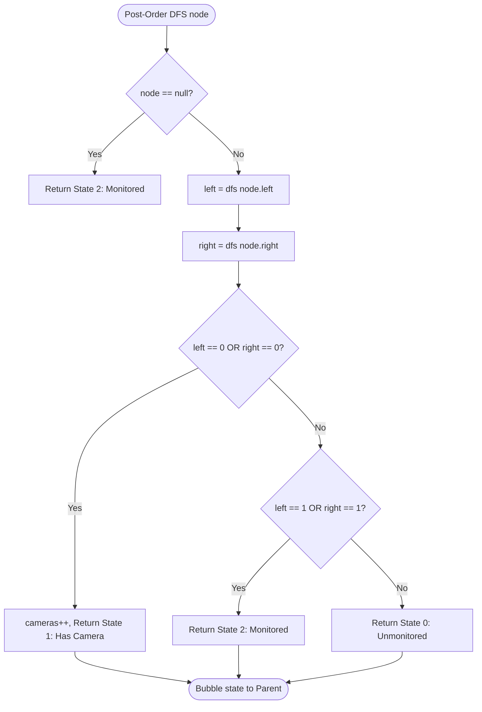
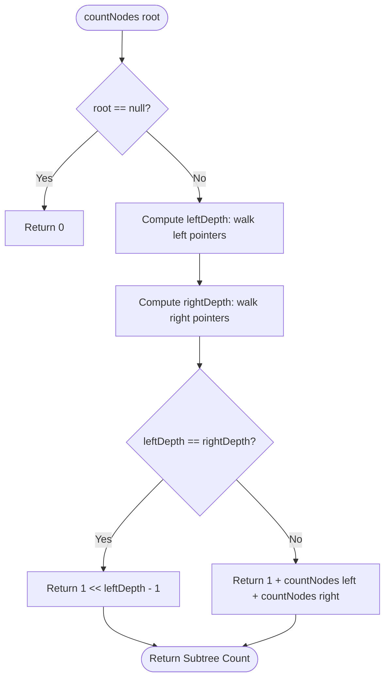
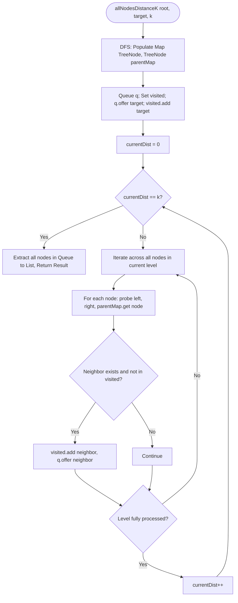

# 07. Advanced Hard-Tier Tree Problems

[← Back to Storage Engines](./06-advanced-tree-systems-and-storage-engines.md) | [Track Hub](./README.md) | [Java Track Home](../README.md)

---

## 1. Problem 1: Binary Tree Cameras (Greedy Tree State Machine)

### 1.1 Problem Statement & Constraints

Given the `root` of a binary tree, we install cameras on the tree nodes. Each camera at a node can monitor its parent, itself, and its immediate children. Return the **minimum number of cameras** needed to monitor all nodes of the tree.

```
Example 1:
        0
       /
     [0] (Camera)
     / \
    0   0
Output: 1 (Camera at node 2 covers root, node 2, and both leaves)

Example 2:
      [0] (Camera)
      /
     0
    /
  [0] (Camera)
  /
 0
Output: 2
```

#### Constraints:
- The number of nodes in the tree is in the range $[1, 1000]$.
- `Node.val == 0`.

---

### 1.2 Thought Process & Intuition

```
  Top-Down Placement: Ambiguous. Should root have a camera?
  If root gets camera, children are covered, but root's parent doesn't exist.
                         ↓
  Bottom-Up Greedy Invariant:
  Leaves outnumber internal nodes. Placing a camera on a LEAF only covers 2 nodes (leaf + parent).
  Placing a camera on a LEAF'S PARENT covers up to 4 nodes (parent, 2 children, grandparent)!
                         ↓
  "Aha!" Insight:
  NEVER place a camera on a leaf! Always defer camera placement to the PARENT!
  Define a 3-State Machine via Post-Order Traversal:
  • State 0: Node is UNMONITORED (needs camera coverage from parent).
  • State 1: Node HAS A CAMERA.
  • State 2: Node is MONITORED (covered by a child or self, needs nothing from parent).
```

1. **The Clues**:
   - Minimum vertex cover variant on a directed tree; greedy subtree choices propagate upwards.
2. **The Bottleneck**:
   - Dynamic programming with states `dp(node, has_camera, monitored)` requires $3 \times 3$ memoization table: $\mathcal{O}(N)$ with high constant factor.
3. **The "Aha!" Insight**:
   - Greedy bottom-up state machine is mathematically optimal:
     * Base case: `null` nodes are considered **Monitored (State 2)** so they don't demand cameras from leaves.
     * If *any* child is **Unmonitored (State 0)** $\implies$ current node **MUST place a camera (State 1)**.
     * If *any* child **Has a camera (State 1)** $\implies$ current node is **Monitored (State 2)**.
     * Otherwise (both children are State 2) $\implies$ current node remains **Unmonitored (State 0)**, delegating coverage to its parent!
     * Edge case: If the root is in State 0 after DFS, place 1 final camera at root.

---

### 1.3 Mathematical Proof & Invariants

**Theorem (Leaf Avoidance Optimality)**:
Let $L$ be a leaf node and $P$ be its parent. Any valid camera configuration containing a camera at $L$ can be transformed into another valid configuration of equal or smaller size where the camera is moved from $L$ to $P$.
- Moving the camera to $P$ still covers $L$, still covers $P$, and additionally covers $P$'s parent and $P$'s other child. Thus, the set of covered nodes is a superset of the coverage from $L$.
- Therefore, camera placement is strictly optimal when deferred to the parent node.

- **Time Complexity**: Every node visited exactly once in post-order: $\mathcal{O}(N)$.
- **Space Complexity**: Recursion call stack height: $\mathcal{O}(H)$, $\mathcal{O}(N)$ worst-case.

---

### 1.4 Procedural Blueprint (How to Proceed)



---

### 1.5 Visual State Transition

```
Tree State Machine Execution:

         Node 1 (?)                Final State: Root is State 0!
          /      \                 Must place camera at root!
      Node 2     Node 3
      /    \
   Node 4  Node 5 (Leaves)

1. Node 4 & Node 5 return State 0 (Unmonitored).
2. Node 2 observes children in State 0 -> PLACES CAMERA (State 1)! cameras = 1.
3. Node 3 is a leaf -> returns State 0.
4. Node 1 has children in State 1 (Node 2) and State 0 (Node 3) -> PLACES CAMERA (State 1)! cameras = 2.
Total Cameras = 2. Optimal!
```

---

### 1.6 Production Java 17/21 Implementation

```java
package com.structures.trees;

/**
 * Solves Binary Tree Cameras using a greedy 3-state bottom-up post-order state machine.
 */
public final class BinaryTreeCameras {

    public static final class TreeNode {
        public int val;
        public TreeNode left;
        public TreeNode right;

        public TreeNode(int val) {
            this.val = val;
        }
    }

    private enum State {
        UNMONITORED,   // 0: Needs camera coverage from parent
        HAS_CAMERA,    // 1: Camera placed here
        MONITORED      // 2: Covered by child or self; needs nothing from parent
    }

    private int cameraCount;

    public int minCameraCover(TreeNode root) {
        cameraCount = 0;
        // If root remains unmonitored after bottom-up bubbling, it must host a camera
        if (dfs(root) == State.UNMONITORED) {
            cameraCount++;
        }
        return cameraCount;
    }

    private State dfs(TreeNode node) {
        // Base case: null nodes are already safely monitored
        if (node == null) {
            return State.MONITORED;
        }

        State left = dfs(node.left);
        State right = dfs(node.right);

        // Case 1: If either child is unmonitored, current node MUST place a camera
        if (left == State.UNMONITORED || right == State.UNMONITORED) {
            cameraCount++;
            return State.HAS_CAMERA;
        }

        // Case 2: If either child has a camera, current node is monitored
        if (left == State.HAS_CAMERA || right == State.HAS_CAMERA) {
            return State.MONITORED;
        }

        // Case 3: Both children are monitored, so current node is unmonitored
        return State.UNMONITORED;
    }
}
```

---

### 1.7 Dry-Run & Interviewer Stress Defenses

#### Dry-Run: Single Node Tree `[0]`
1. `dfs(root)`: `left = dfs(null) = MONITORED`, `right = dfs(null) = MONITORED`.
2. Both children are `MONITORED` $\implies$ returns `UNMONITORED`.
3. In `minCameraCover`: returned state is `UNMONITORED` $\implies$ `cameraCount++` $\implies$ returns `1`. Correct!

#### Interviewer Stress Defenses:
- **Why does `null` return `MONITORED`?** If `null` returned `UNMONITORED`, leaves would be forced to install cameras, violating the leaf-avoidance optimality theorem. If `null` returned `HAS_CAMERA`, leaves would erroneously assume they are already covered.

---

## 2. Problem 2: Count Complete Tree Nodes in Sub-Linear Time ($O((\log N)^2)$)

### 2.1 Problem Statement & Constraints

Given the `root` of a **complete binary tree**, return the number of nodes in the tree.

In a complete binary tree, every level, except possibly the last, is completely filled, and all nodes in the last level are as far left as possible.

Design an algorithm that runs in less than $\mathcal{O}(N)$ time complexity.

#### Constraints:
- The number of nodes in the tree is in the range $[0, 5 \times 10^4]$.
- $0 \le \text{Node.val} \le 5 \times 10^4$.
- The tree is guaranteed to be **complete**.

---

### 2.2 Thought Process & Intuition

```
  Naive Solution:
  Standard traversal (BFS / DFS): visits all N nodes -> O(N) time.
  Doesn't exploit the "Complete Binary Tree" property!
                         ↓
  "Aha!" Insight:
  Measure the left-most depth (dL) and right-most depth (dR) of the tree:
  • If dL == dR: The tree is a PERFECT binary tree!
    Node count is instantly 2^dL - 1 (computed via bit shift (1 << dL) - 1 in O(log N))!
  • If dL != dR: Recurse on left and right subtrees!
    CRITICAL PROPERTY: One of the two subtrees is GUARANTEED to be perfect!
```

1. **The Clues**:
   - The tree is guaranteed complete; runtime requirement is strictly sub-linear ($o(N)$).
2. **The Bottleneck**:
   - Counting nodes one by one takes linear $\mathcal{O}(N)$ time.
3. **The "Aha!" Insight**:
   - By comparing the height of the left boundary and right boundary, we can prune an entire half of the tree at each step:
     * Left depth $d_L$: walk left pointers only.
     * Right depth $d_R$: walk right pointers only.
     * If $d_L == d_R$, the subtree is completely full $\implies \text{nodes} = 2^{d_L} - 1$.
     * Otherwise, recurse: $1 + \text{countNodes}(\text{left}) + \text{countNodes}(\text{right})$.

---

### 2.3 Mathematical Proof & Invariants

At each recursive level:
- One of the two subtrees (left or right) is guaranteed to be a perfect binary tree, whose size is evaluated in $\mathcal{O}(\text{depth}) = \mathcal{O}(\log N)$ without recursing.
- The other subtree is complete and recurses to the next level.
- Maximum recursion depth is $\mathcal{O}(\log N)$.
- At each level of depth, computing boundary heights takes $\mathcal{O}(\log N)$ pointer hops.
$$\text{Total Time Complexity} = \sum_{i=1}^{\log N} \mathcal{O}(\log N) = \mathcal{O}((\log N)^2)$$

For $N = 50,000$, $\log_2(50,000) \approx 16 \implies (\log N)^2 \approx 256$ operations, compared to $50,000$ in linear scan!

---

### 2.4 Procedural Blueprint (How to Proceed)



---

### 2.5 Visual State Transition

```
Subtree Decomposition:
             1 (dL=3, dR=2) -> Not equal!
           /   \
 (dL=2,dR=2)     3 (dL=2,dR=1)
      2        /
    /   \     6
   4     5
Subtree 2 is PERFECT! dL == dR == 2 -> Nodes = (1 << 2) - 1 = 3 nodes (instant)!
Subtree 3 is processed recursively.
Total Nodes = 1 + 3 + countNodes(3) = 6.
```

---

### 2.6 Production Java 17/21 Implementation

```java
package com.structures.trees;

/**
 * Counts nodes in a complete binary tree in O((log N)^2) sub-linear time.
 */
public final class CompleteTreeCounter {

    public static final class TreeNode {
        public int val;
        public TreeNode left;
        public TreeNode right;

        public TreeNode(int val) {
            this.val = val;
        }
    }

    /**
     * Computes node count in O((log N)^2) time and O(log N) stack space.
     */
    public int countNodes(TreeNode root) {
        if (root == null) {
            return 0;
        }

        int leftDepth = getLeftDepth(root);
        int rightDepth = getRightDepth(root);

        // If left depth equals right depth, the binary tree is perfect!
        if (leftDepth == rightDepth) {
            return (1 << leftDepth) - 1;
        }

        // Otherwise, recurse. One of the children is guaranteed to be perfect.
        return 1 + countNodes(root.left) + countNodes(root.right);
    }

    private int getLeftDepth(TreeNode node) {
        int depth = 0;
        while (node != null) {
            depth++;
            node = node.left;
        }
        return depth;
    }

    private int getRightDepth(TreeNode node) {
        int depth = 0;
        while (node != null) {
            depth++;
            node = node.right;
        }
        return depth;
    }
}
```

---

### 2.7 Dry-Run & Interviewer Stress Defenses

- **Bit Shift Overflow Defense**: For tree heights $H < 31$, `(1 << leftDepth) - 1` operates safely within signed 32-bit `int`. If $N \ge 2^{31} - 1$, use `(1L << leftDepth) - 1`.
- **Why is one child guaranteed perfect?** In a complete binary tree, missing nodes occur exclusively on the bottom level from right to left. Therefore, either the left subtree's bottom level is completely full (making it perfect), or the missing nodes have already impacted the left subtree, meaning the right subtree has not even reached that level and is completely perfect at height $H - 1$!

---

## 3. Problem 3: All Nodes Distance K in Binary Tree

### 3.1 Problem Statement & Constraints

Given the `root` of a binary tree, the value of a `target` node, and an integer `k`, return an array of the values of all nodes that have a distance `k` from the target node in any direction (child, parent, sibling).

```
Input: root = [3,5,1,6,2,0,8,null,null,7,4], target = 5, k = 2
Output: [7, 4, 1]
```

#### Constraints:
- The number of nodes in the tree is in the range $[1, 500]$.
- $0 \le \text{Node.val} \le 500$.
- All values `Node.val` are **unique**.
- `target` is guaranteed to exist in the tree.
- $0 \le k \le 1000$.

---

### 3.2 Thought Process & Intuition

```
  Traditional Tree DFS:
  Can only navigate DOWNWARDS to left and right children!
  Cannot navigate UPWARDS to parent or sideways to siblings!
                         ↓
  "Aha!" Insight:
  A tree is simply an undirected graph with N nodes and N - 1 edges!
  Step 1: Build a Parent Map (Node -> Parent) via Pre-order DFS.
  Step 2: Treat the target node as the epicenter of a Radial BFS.
  At each step, propagate outward across 3 edges: left child, right child, and parent!
  Maintain a visited set to avoid infinite cycles!
```

---

### 3.3 Mathematical Proof & Invariants

- **Graph Invariant**: Every undirected edge $(u, v)$ in a tree is traversed at most twice during BFS.
- **Time Complexity**:
  - DFS parent mapping: $\mathcal{O}(N)$.
  - Radial BFS up to distance $K$: visits at most $N$ nodes: $\mathcal{O}(N)$.
  - Overall Time: $\mathcal{O}(N)$.
- **Space Complexity**:
  - Parent pointer map: $\mathcal{O}(N)$.
  - BFS Queue & Visited Set: $\mathcal{O}(N)$.
  - Overall Space: $\mathcal{O}(N)$.

---

### 3.4 Procedural Blueprint (How to Proceed)



---

### 3.5 Visual State Transition

```
Radial Expansion from Target = 5:

           3 (Dist 1)
          / \
(Target) 5   1 (Dist 2)
        / \
(Dist 1)6   2 (Dist 1)
           / \
   (Dist 2)7  4 (Dist 2)

Level 0: [5]
Level 1: [6 (left), 2 (right), 3 (parent)]
Level 2: [7 (from 2), 4 (from 2), 1 (from 3)]
Distance k = 2 Nodes: [7, 4, 1].
```

---

### 3.6 Production Java 17/21 Implementation

```java
package com.structures.trees;

import java.util.ArrayDeque;
import java.util.ArrayList;
import java.util.Collections;
import java.util.HashMap;
import java.util.HashSet;
import java.util.List;
import java.util.Map;
import java.util.Queue;
import java.util.Set;

/**
 * Finds all nodes at radial distance K from a target node in an undirected binary tree.
 */
public final class DistanceKNodes {

    public static final class TreeNode {
        public int val;
        public TreeNode left;
        public TreeNode right;

        public TreeNode(int val) {
            this.val = val;
        }
    }

    public List<Integer> distanceK(TreeNode root, TreeNode target, int k) {
        if (root == null || target == null || k < 0) {
            return Collections.emptyList();
        }

        // 1. Map parent pointers for all nodes
        Map<TreeNode, TreeNode> parentMap = new HashMap<>();
        populateParents(root, null, parentMap);

        // 2. Radial BFS outward from target
        Queue<TreeNode> queue = new ArrayDeque<>();
        Set<TreeNode> visited = new HashSet<>();

        queue.offer(target);
        visited.add(target);
        int currentDistance = 0;

        while (!queue.isEmpty()) {
            if (currentDistance == k) {
                List<Integer> result = new ArrayList<>(queue.size());
                for (TreeNode node : queue) {
                    result.add(node.val);
                }
                return result;
            }

            int levelSize = queue.size();
            for (int i = 0; i < levelSize; i++) {
                TreeNode current = queue.poll();

                // Explore Left Child
                if (current.left != null && visited.add(current.left)) {
                    queue.offer(current.left);
                }

                // Explore Right Child
                if (current.right != null && visited.add(current.right)) {
                    queue.offer(current.right);
                }

                // Explore Parent
                TreeNode parent = parentMap.get(current);
                if (parent != null && visited.add(parent)) {
                    queue.offer(parent);
                }
            }
            currentDistance++;
        }

        return Collections.emptyList();
    }

    private void populateParents(TreeNode node, TreeNode parent, Map<TreeNode, TreeNode> parentMap) {
        if (node == null) {
            return;
        }
        if (parent != null) {
            parentMap.put(node, parent);
        }
        populateParents(node.left, node, parentMap);
        populateParents(node.right, node, parentMap);
    }
}
```

---

### 3.7 Dry-Run & Interviewer Stress Defenses

- **Target is Root**: When `target == root`, `parentMap.get(root) == null`, so BFS cleanly explores only downwards without null pointer exceptions.
- **$K = 0$**: The loop evaluates `currentDistance == k` at the top of the while loop, immediately returning `[target.val]`.
- **Memory Optimization**: If object identity is guaranteed unique, using `visited.add(node)` directly on `Set<TreeNode>` avoids wrapping node values into auxiliary boxing objects.

---

## 4. Problem 4: Euler Tour Technique / Tree Flattening for Segment Trees

### 4.1 Problem Statement & Architectural Motivation

In advanced distributed topology routing, network flow analysis, and competitive algorithms, trees undergo dynamic mutations:
1. **Subtree Update**: Add $+V$ to all nodes in the subtree rooted at node $U$.
2. **Subtree Query**: Compute the sum (or min/max) of all node values in the subtree rooted at node $U$.

In an arbitrary unbalanced tree, visiting every node in a subtree takes $\mathcal{O}(N)$ time per query. If there are $Q$ queries, total runtime is $\mathcal{O}(Q \cdot N)$, which is catastrophic for $N, Q = 10^5$.

---

### 4.2 The "Aha!" Insight: Euler Tour Flattening

```
  Arbitrary Subtree in 2D Space:
  Nodes are non-contiguous pointers scattered across heap memory.
                         ↓
  "Aha!" Insight:
  Perform a DFS traversal tracking discovery entry time [in[u]] and exit time [out[u]].
  Every single node in u's subtree is visited BETWEEN in[u] and out[u]!
                         ↓
  Contiguous 1D Interval:
  The entire subtree rooted at u maps to a continuous array segment:
  [ in[u], out[u] ]!
  Subtree update/query becomes a standard RANGE UPDATE / RANGE QUERY on a Segment Tree in O(log N)!
```

---

### 4.3 Visual State Transition: Tree Flattening

```
Tree Topology:
           1
         /   \
        2     3
       / \
      4   5

Euler Tour Entry / Exit Timestamps:
DFS Order: 1 -> 2 -> 4 (leaf) -> 5 (leaf) -> 3 (leaf)

Node 1: in = 1, out = 5 -> Subtree 1 covers interval [1, 5]
Node 2: in = 2, out = 4 -> Subtree 2 covers interval [2, 4]
Node 4: in = 3, out = 3 -> Subtree 4 covers interval [3, 3]
Node 5: in = 4, out = 4 -> Subtree 5 covers interval [4, 4]
Node 3: in = 5, out = 5 -> Subtree 3 covers interval [5, 5]

Flat Array Indices:
Index:   [ 1 ]   [ 2 ]   [ 3 ]   [ 4 ]   [ 5 ]
Node:      1       2       4       5       3
                   └───────────────┘
             Subtree 2 is contiguous: [2, 4]!
```

---

### 4.4 Production Java 17/21 Implementation

```java
package com.structures.trees;

import java.util.ArrayList;
import java.util.List;

/**
 * Implements the Euler Tour Technique (Tree Flattening) to support
 * O(log N) subtree updates and queries via a Fenwick / Segment Tree.
 */
public final class EulerTourSubtreeEngine {

    private final List<List<Integer>> adjacencyList;
    private final int[] inTime;
    private final int[] outTime;
    private final int[] flatArray;
    private int timer;

    // Binary Indexed Tree (Fenwick) for O(log N) Range Updates & Point Queries
    private final long[] bit;
    private final int n;

    public EulerTourSubtreeEngine(int n) {
        this.n = n;
        this.adjacencyList = new ArrayList<>(n + 1);
        for (int i = 0; i <= n; i++) {
            adjacencyList.add(new ArrayList<>());
        }
        this.inTime = new int[n + 1];
        this.outTime = new int[n + 1];
        this.flatArray = new int[n + 1];
        this.bit = new long[n + 2];
        this.timer = 0;
    }

    public void addUndirectedEdge(int u, int v) {
        adjacencyList.get(u).add(v);
        adjacencyList.get(v).add(u);
    }

    /**
     * Flattens the tree into 1D interval timestamps via DFS.
     * Time: O(N), Space: O(N) recursion depth.
     */
    public void buildEulerTour(int root) {
        timer = 0;
        dfs(root, 0);
    }

    private void dfs(int u, int parent) {
        timer++;
        inTime[u] = timer;
        flatArray[timer] = u;

        for (int v : adjacencyList.get(u)) {
            if (v != parent) {
                dfs(v, u);
            }
        }

        outTime[u] = timer;
    }

    /**
     * Adds value to all nodes in the subtree rooted at u in O(log N) time.
     * Maps to range update [inTime[u], outTime[u]].
     */
    public void updateSubtree(int u, long val) {
        int l = inTime[u];
        int r = outTime[u];
        // Standard Fenwick range update using difference array logic
        bitUpdate(l, val);
        bitUpdate(r + 1, -val);
    }

    /**
     * Queries the accumulated value of a specific node u in O(log N) time.
     */
    public long queryNode(int u) {
        return bitQuery(inTime[u]);
    }

    private void bitUpdate(int index, long val) {
        while (index <= n) {
            bit[index] += val;
            index += index & (-index);
        }
    }

    private long bitQuery(int index) {
        long sum = 0;
        while (index > 0) {
            sum += bit[index];
            index -= index & (-index);
        }
        return sum;
    }
}
```

---

### 4.5 Interviewer Stress Defenses: Subtree vs. Path Queries

#### Heavy-Light Decomposition (HLD) vs. Euler Tour:
- **Euler Tour**: Subtrees always map to a single contiguous 1D range $[ \text{in}[u], \text{out}[u] ]$. Ideal for subtree updates and queries ($\mathcal{O}(\log N)$).
- **Heavy-Light Decomposition (HLD)**: Used when queries are across **paths between two nodes** $(u, v)$ rather than entire subtrees. HLD partitions tree edges into "heavy" and "light" chains, guaranteeing that any path between $u$ and $v$ crosses at most $\mathcal{O}(\log N)$ contiguous segments on a segment tree, enabling path queries in $\mathcal{O}((\log N)^2)$.

---

<table width="100%">
  <tr>
    <td width="33%" align="left">
      <a href="./06-advanced-tree-systems-and-storage-engines.md">
        <strong>← Previous Module</strong><br>
        06. Tree Systems & Storage Engines
      </a>
    </td>
    <td width="33%" align="center">
      <a href="./README.md">
        <strong>Track Hub</strong><br>
        Trees & Hierarchies Track Hub
      </a>
    </td>
    <td width="33%" align="right">
      <a href="../README.md">
        <strong>Java Track Home →</strong><br>
        Java DSA Master Track
      </a>
    </td>
  </tr>
</table>
