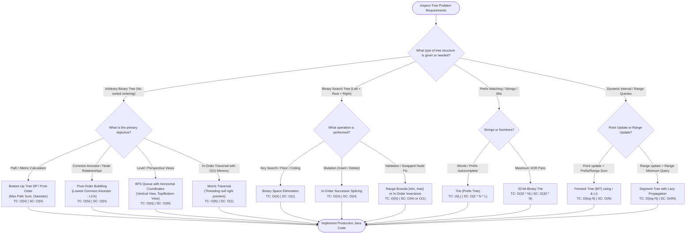

# Trees, Binary Search Trees & Hierarchies: Master Track

Welcome to **Phase 1 of the Non-Linear Data Structures Universe**. In linear structures (arrays, linked lists, stacks, queues), elements follow a strict 1-to-1 sequential trajectory. In **Trees**, data organizes **hierarchically** (1-to-Many), unlocking exponential reductions in search space ($O(N) \to O(\log N)$), prefix-based string retrieval in $O(L)$, dynamic range queries in $O(\log N)$, and database storage engines handling billions of disk records.

---

## 🏛️ 1. The Hierarchical Mental Model

```text
╭─────────────────────────────────────────────────────────────────────────────────────────────╮
│                         THE HIERARCHICAL TREE PARADIGM                                      │
├─────────────────────────────────────────────────────────────────────────────────────────────┤
│                                                                                             │
│                         [Root Node (Depth 0, Level 1)]                                      │
│                                  /         \                                                │
│                                 /           \                                               │
│                     [Left Subtree]         [Right Subtree]                                  │
│                        (Depth 1)              (Depth 1)                                     │
│                        /      \                   \                                         │
│                   [Leaf A]   [Leaf B]            [Leaf C]                                   │
│                   (Depth 2)  (Depth 2)           (Depth 2)                                  │
│                                                                                             │
│  Structural Properties:                                                                     │
│  • Exactly N nodes and N - 1 edges.                                                         │
│  • A unique, simple path exists between the root and every other node in the tree.          │
│  • Subtree Recursion: Every child node is itself the root of an independent subtree.        │
│                                                                                             │
╰─────────────────────────────────────────────────────────────────────────────────────────────╯
```

---

## 💻 2. JVM Heap Memory Architecture: The 32-Byte Node Reality

In high-performance systems, understanding the physical memory footprint of tree structures is vital:

```text
╭─────────────────────────────────────────────────────────────────────────────────────────────╮
│                         JVM BINARY TREE NODE MEMORY FOOTPRINT                               │
├─────────────────────────────────────────────────────────────────────────────────────────────┤
│                                                                                             │
│  TreeNode Object Layout (64-bit JVM with Compressed OOPs enabled):                          │
│  ┌──────────────────────────────────────────────────────────┬──────────────┐                │
│  │ Component                                                │ Size (Bytes) │                │
│  ├──────────────────────────────────────────────────────────┼──────────────┤                │
│  │ Mark Word (Locking status, GC age, hash code)            │ 8 bytes      │                │
│  │ Klass Word (Pointer to TreeNode.class metadata)          │ 4 bytes      │                │
│  │ int val (Primitive integer payload)                      │ 4 bytes      │                │
│  │ TreeNode left (Compressed 32-bit reference)              │ 4 bytes      │                │
│  │ TreeNode right (Compressed 32-bit reference)             │ 4 bytes      │                │
│  │ Padding (8-byte boundary alignment)                      │ 8 bytes      │                │
│  ├──────────────────────────────────────────────────────────┼──────────────┤                │
│  │ Total Memory per Node                                    │ 32 BYTES     │                │
│  └──────────────────────────────────────────────────────────┴──────────────┘                │
│                                                                                             │
│  Key Takeaway: Storing 1,000,000 integers in a primitive array takes 4 MB.                  │
│                Storing 1,000,000 integers in a Binary Tree consumes ~32 MB!                 │
│                (800% memory amplification + heap fragmentation + pointer chasing).          │
╰─────────────────────────────────────────────────────────────────────────────────────────────╯
```

---

## 🗺️ 3. Global Procedural Decision Flowchart

Use this procedural roadmap to diagnose and route any hierarchical or tree-based challenge:



---

## ⚡ 4. Algorithmic Complexity Reference Matrix

| Tree Family | Access / Search | Insertion | Deletion | Range Query | Auxiliary Space | Key Real-World Use Case |
| :--- | :--- | :--- | :--- | :--- | :--- | :--- |
| **Binary Tree** | $O(N)$ | $O(1)$ at leaf | $O(N)$ | $O(N)$ | $O(H)$ stack | Hierarchical DOM, ASTs, Expression trees |
| **Binary Search Tree** | $O(H) \to O(\log N)$ | $O(H)$ | $O(H)$ | $O(K + H)$ | $O(H)$ stack | Dynamic sorting, in-order predecessor/successor |
| **AVL Tree (Balanced)** | $O(\log N)$ | $O(\log N)$ | $O(\log N)$ | $O(K + \log N)$ | $O(N)$ nodes | Read-heavy in-memory lookups |
| **Red-Black Tree** | $O(\log N)$ | $O(\log N)$ | $O(\log N)$ | $O(K + \log N)$ | $O(N)$ nodes | Java `TreeMap` / `TreeSet`, C++ `std::map` |
| **Trie (Prefix Tree)** | $O(L)$ (word length) | $O(L)$ | $O(L)$ | $O(L + \text{matches})$| $O(\Sigma \cdot N \cdot L)$ | Autocomplete, dictionary search, IP routing |
| **Segment Tree** | $O(\log N)$ | $O(\log N)$ | — | $O(\log N)$ | $O(4N)$ flat array | Range minimum query, interval modifications |
| **Fenwick Tree (BIT)** | $O(\log N)$ | $O(\log N)$ | — | $O(\log N)$ | $O(N)$ flat array | Dynamic cumulative frequencies, inversion counting |
| **B-Tree / B+ Tree** | $O(\log_M N)$ | $O(\log_M N)$ | $O(\log_M N)$ | $O(K + \log_M N)$ | $O(N)$ disk blocks | Relational database storage engines (InnoDB, Postgres) |

---

## 📚 5. Track Curriculum

| Module | Core Topics & Algorithmic Focus | Problems Solved | Architectural & Mathematical Highlights |
| :--- | :--- | :--- | :--- |
| **[00. Problem Archetypes & Canonical Patterns](./00-tree-problem-archetypes-and-patterns.md)** | The 7 Universal Tree Archetypes, Traversal Array Invariants, Prefix Sum DFS | • Path Sum III ($O(N)$)<br>• Construct Tree from Preorder & Inorder<br>• Flatten Binary Tree to Linked List | • Call stack prefix sum backtracking<br>• Preorder root + Inorder left/right partitioning<br>• In-place Morris-style right threading |
| **[01. Tree Fundamentals & Traversal Paradigms](./01-tree-fundamentals-and-traversal-paradigms.md)** | JVM Heap Footprint, 4 Canonical Traversals, Morris Traversal, Tree Serialization | • Morris In-Order Traversal ($O(1)$ Space)<br>• Serialize & Deserialize Binary Tree | • Proof of $O(N)$ time for Morris threading<br>• Zero auxiliary stack or queue space<br>• BFS vs DFS preorder serialization |
| **[02. Tree Archetypes & Path Metrics](./02-tree-archetypes-and-path-metrics.md)** | Post-Order Dynamic Programming, Lowest Common Ancestor, 2D Coordinate Projection | • Lowest Common Ancestor (LCA)<br>• Binary Tree Maximum Path Sum<br>• Vertical Order & Tree Views | • Bottom-up post-order bubbling<br>• Turning path vs contributing single branch<br>• Coordinate $(r, c)$ horizontal grouping |
| **[03. Binary Search Trees & Ordered Space](./03-binary-search-trees-and-ordered-space.md)** | BST Ordering Invariants, In-Order Successor, Node Splicing, Inversion Detection | • Validate BST & In-Order Successor<br>• Delete Node in BST<br>• Recover Swapped BST | • Dynamic range propagation $[ \text{min}, \text{max} ]$<br>• In-order successor child splicing<br>• Detecting 1 vs 2 inversions via Morris |
| **[04. Self-Balancing Trees & Interval Structures](./04-self-balancing-trees-and-interval-structures.md)** | Balance Factor Invariants, AVL Tree Rotations, Segment Trees, Bitwise Fenwick Trees | • AVL Tree Rotations (LL, RR, LR, RL)<br>• Segment Tree with Lazy Propagation<br>• Binary Indexed Tree (Fenwick) | • Single and double tree rotations<br>• Lazy tag propagation for interval updates<br>• Bitwise Least Significant Bit (`i & (-i)`) |
| **[05. Tries & Bitwise Prefix Trees](./05-tries-and-bitwise-prefix-trees.md)** | TrieNode Architectures, Prefix Matching, Backtracking Pruning, Bitwise Tries | • Implement Trie (Prefix Tree)<br>• Word Search II (Boggle with Trie)<br>• Maximum XOR of Two Numbers | • Character trie traversal in $O(L)$<br>• Pruning matrix DFS branches via trie<br>• 32-bit greedy complement bit traversal |
| **[06. Advanced Tree Systems & Storage Engines](./06-advanced-tree-systems-and-storage-engines.md)** | Disk I/O Minimization, Page Alignments, B-Trees vs B+ Trees, LSM-Trees | • Database B-Tree Index Engine<br>• Log-Structured Merge Tree (LSM) | • High fanout $M = 1000$ reducing disk seeks<br>• Page alignment to OS $4\text{KB}/16\text{KB}$ blocks<br>• MemTable, WAL, SSTables & compaction |
| **[07. Advanced Hard-Tier Tree Problems](./07-advanced-hard-tree-problems.md)** | Greedy State Machines, Binary Search on Tree Depth, Radial BFS, Euler Tour | • Binary Tree Cameras<br>• Count Complete Nodes in $O((\log N)^2)$<br>• All Nodes Distance K<br>• Euler Tour for Segment Trees | • Greedy 3-state post-order optimization<br>• Sub-linear depth-bisection math<br>• Radial graph conversion<br>• Subtree interval flattening $[ \text{in}[u] \dots \text{out}[u] ]$ |

---

<table width="100%">
  <tr>
    <td width="33%" align="left">
      <a href="../stacks-and-queues/05-advanced-systems-stacks-queues.md">
        <strong>← Previous Track</strong><br>
        Stacks, Queues & Deques Mastery
      </a>
    </td>
    <td width="33%" align="center">
      <a href="../README.md">
        <strong>Home</strong><br>
        Java DSA Master Track
      </a>
    </td>
    <td width="33%" align="right">
      <a href="./00-tree-problem-archetypes-and-patterns.md">
        <strong>Next Module →</strong><br>
        00. Tree Problem Archetypes & Patterns
      </a>
    </td>
  </tr>
</table>
