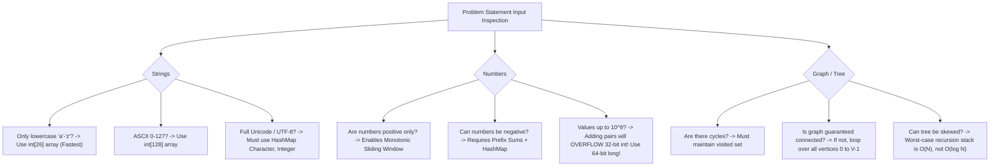

# 01. Problem Deconstruction, Constraint Triage & Complexity Budgeting

[← Back to Strategies Hub](./README.md) | [Track Hub](./README.md) | [Next: Data Structures Selection →](./02-master-data-structures-selection-and-trade-offs.md)

---

## 1. The $10^8$ Operations Rule & Complexity Budgeting

In modern technical interviews and automated evaluation environments (JVM, V8, GCC), a program is allotted roughly **$1.0\text{ to }2.0\text{ seconds}$** of execution time before triggering a Time Limit Exceeded (TLE) exception.

```
╭───────────────────────────────────────────────────────────────────────────────────────────╮
│                             THE GOLDEN RULE OF COMPUTING BUDGETS                          │
├───────────────────────────────────────────────────────────────────────────────────────────┤
│ • Execution Threshold: Standard modern runtimes execute ≈ 10^8 (100 Million) basic CPU    │
│   operations per second (comparisons, additions, bit shifts, array indexing).             │
│ • Safe Design Target: Design your algorithm to execute <= 10^7 to 5 * 10^7 operations.    │
│ • Reverse-Engineering Principle: The given value of N directly dictates the acceptable     │
│   worst-case Big-O time complexity BEFORE writing a single line of code!                  │
╰───────────────────────────────────────────────────────────────────────────────────────────╯
```

---

## 2. The Input Constraint Rosetta Stone

Use this universal translation matrix to deduce the required algorithm family directly from the problem's input size $N$:

| Input Size $N$ | Maximum Allowed Time Complexity | Candidate Algorithmic Families & Paradigms | Typical Problem Archetypes |
| :--- | :--- | :--- | :--- |
| **$N \le 10\text{--}12$** | $\mathcal{O}(N!)$ or $\mathcal{O}(N^2 \cdot 2^N)$ | Permutations, Traveling Salesperson, Brute-Force Backtracking | Generating all permutations, Hamiltonian path |
| **$N \le 20\text{--}25$** | $\mathcal{O}(2^N)$ or $\mathcal{O}(N \cdot 2^N)$ | Bitmask Dynamic Programming, Subsets Backtracking, Meet-in-the-Middle | Partition equal subset sum, Traveling Salesperson |
| **$N \le 100$** | $\mathcal{O}(N^4)$ or $\mathcal{O}(N^3)$ | 3D / 2D Dynamic Programming, Floyd-Warshall All-Pairs Shortest Path, Matrix Exponentiation | All-pairs shortest paths, interval DP (Burst Balloons) |
| **$N \le 1,000\text{--}2,000$** | $\mathcal{O}(N^2)$ or $\mathcal{O}(N^2 \log N)$ | Nested Two Pointers, 2D Grid DP, Bellman-Ford, All-Pairs Comparisons | 3-Sum, Longest Common Subsequence, Edit Distance |
| **$N \le 10^5\text{--}2 \times 10^5$** | $\mathcal{O}(N \log N)$ or $\mathcal{O}(N)$ | Sorting, Binary Search, Heaps, Two Pointers, Sliding Window, Monotonic Stack, DSU, Dijkstra, BFS/DFS, Segment Trees | Most algorithmic interview questions fall into this range! |
| **$N \le 10^6\text{--}10^7$** | $\mathcal{O}(N)$ or $\mathcal{O}(N \log(\log N))$ | Linear Scans, Counting Sort, Sieve of Eratosthenes, Prefix Sums, Kadane's | Prime generation, single-pass frequency counts |
| **$N \ge 10^9$ (or $N$ is unknown)** | $\mathcal{O}(\log N)$ or $\mathcal{O}(1)$ | Binary Search on Answer Space, Math & Number Theory, Bit Manipulation, Fast Modular Exponentiation | Finding square root, bitwise parity, GCD, Euclidean math |

---

## 3. Interactive Constraint Reverse-Engineering Drills

Put the Rosetta Stone into practice! Read the constraints and formulate your complexity budget before clicking:

<details>
<summary><strong>🔍 Drill 1: Array length N = 200,000. Elements up to 10^9. Find pairs with difference = K.</strong></summary>

> **Complexity Budgeting Breakdown**:
> 1. $N = 2 \times 10^5 \implies N^2 = 4 \times 10^{10} \gg 10^8 \implies$ **$\mathcal{O}(N^2)$ will catastrophically TLE!**
> 2. Acceptable Complexity: $\mathcal{O}(N)$ or $\mathcal{O}(N \log N)$.
> 3. Calculation: $200,000 \times \log_2(200,000) \approx 200,000 \times 18 \approx 3.6 \times 10^6$ operations $\ll 10^8$. Perfectly within budget!
> 4. **Optimal Approaches**:
>    - **Approach A**: Sort array in $\mathcal{O}(N \log N)$, then use Two Pointers in $\mathcal{O}(N)$.
>    - **Approach B**: Single pass with `HashSet<Long>` in $\mathcal{O}(N)$ average time.
</details>

<details>
<summary><strong>🔍 Drill 2: Number of cities N = 16. Distances between all cities given in matrix. Find shortest tour visiting all cities.</strong></summary>

> **Complexity Budgeting Breakdown**:
> 1. $N = 16$. Naive permutations: $N! = 16! \approx 2 \times 10^{13} \gg 10^8 \implies$ Factorial brute-force fails.
> 2. Target Complexity: $\mathcal{O}(2^N \cdot N^2)$.
> 3. Calculation: $2^{16} \times 16^2 = 65,536 \times 256 \approx 1.67 \times 10^7$ operations. This fits comfortably under the $10^8$ ceiling!
> 4. **Optimal Approach**:
>    - **Bitmask Dynamic Programming (Held-Karp Algorithm)**: `dp[mask][u]` where `mask` is a 16-bit integer representing visited cities and `u` is the current city.
</details>

<details>
<summary><strong>🔍 Drill 3: A conveyor belt has N = 100,000 packages. Ship within D = 50,000 days. Weights up to 500. Find minimum ship capacity.</strong></summary>

> **Complexity Budgeting Breakdown**:
> 1. $N = 10^5$, but we are searching for a **minimum value** within a continuous range: $[\max(\text{weights}), \sum \text{weights}]$.
> 2. The feasibility function `canShipInDays(capacity)` is monotonic: if capacity $C$ works, any capacity $> C$ also works!
> 3. Target Complexity: **Binary Search on Answer Space** $\implies \mathcal{O}(N \log(\sum W))$.
> 4. Calculation: Range $\le 5 \times 10^7 \implies \log_2(5 \times 10^7) \approx 26$ checks. $26 \times 100,000 = 2.6 \times 10^6$ operations $\ll 10^8$.
</details>

---

## 4. The "Hidden Invariants" Discovery Playbook

An **invariant** is a mathematical property that remains true throughout the execution of an algorithm. Finding the invariant unlocks the optimal algorithm:

```
╭───────────────────────────────────────────────────────────────────────────────────────────╮
│                                 THE 6 UNIVERSAL INVARIANTS                                │
├───────────────────────────────────────────────────────────────────────────────────────────┤
│ 1. Monotonicity: Property only grows or only shrinks -> Binary Search / Two Pointers.     │
│ 2. Conservation: Total sum or count is preserved -> Prefix Sums / Difference Arrays.      │
│ 3. Parity: Odd vs. Even state transitions -> Bipartite Graph / Nim Game Theory.           │
│ 4. Symmetry: Left side mirrors right side -> Palindrome Expand-Around-Center / Centroid.   │
│ 5. Pigeonhole Principle: N+1 items in N containers -> Cycle Detection / Duplicate finding.│
│ 6. Topological Dependency: Prerequisite ordering -> Kahn's in-degree queue (DAG).        │
╰───────────────────────────────────────────────────────────────────────────────────────────╯
```

### Invariant 1: Monotonicity (The Key to Sliding Window & Binary Search)

```
Non-Monotonic (Arbitrary integers with negatives):
Index:    0    1    2    3    4
Values:  [ 3,  -2,   5,  -1,   4 ]
Prefix:    3    1    6    5    9  <-- Jumps up and down! Monotonicity DESTROYED!
Result:   Cannot use Sliding Window! Must use Prefix Sum + Hash Map!

Monotonic (Strictly positive integers):
Index:    0    1    2    3    4
Values:  [ 3,   2,   5,   1,   4 ]
Prefix:    3    5   10   11   15  <-- Strictly increasing!
Result:   Expanding right pointer GUARANTEES sum increases.
          Shrinking left pointer GUARANTEES sum decreases.
          Optimal: Sliding Window in strictly O(N) time and O(1) space!
```

---

## 5. Input Format & Boundary Decoding Checklist

Before writing code, extract these hidden boundary constraints from the problem text:



---

## 6. Self-Diagnostic Exercise: Deconstruct an Unseen Problem

Read the following unseen problem statement and fill out the strategic scorecard:

> *"You are given an array `nums` of $N$ integers ($1 \le N \le 10^5$, $-10^4 \le \text{nums}[i] \le 10^4$) and an integer $K$. Return the maximum average value of any contiguous subarray of length greater than or equal to $K$."*

<details>
<summary><strong>🔍 Click to View the Completed Strategic Scorecard</strong></summary>

### The Master Scorecard:
1. **Input Bounds**: $N = 10^5$. Target complexity budget: $\mathcal{O}(N \log(\text{Range}))$ or $\mathcal{O}(N)$.
2. **Key Signals**:
   - "Contiguous subarray"
   - "Length $\ge K$" (variable length!)
   - "Maximum average" $\implies$ Searching for an optimal continuous floating-point value!
   - Negative numbers allowed ($-10^4 \le \text{nums}[i] \le 10^4$).
3. **The Breakthrough Invariant**:
   - Can we achieve an average of at least $X$?
   - If an average of $X$ is possible:
     $$\frac{\sum_{i=l}^r \text{nums}[i]}{r - l + 1} \ge X \iff \sum_{i=l}^r (\text{nums}[i] - X) \ge 0$$
   - This creates a **monotonic feasibility predicate**! If average $X$ is achievable, any average $< X$ is also achievable. If $X$ is impossible, any $> X$ is also impossible!
4. **Optimal Paradigm**:
   - **Binary Search on Answer Space** for candidate average $X \in [-10^4, 10^4]$.
   - Validation predicate in $\mathcal{O}(N)$ using prefix sums of $(\text{nums}[i] - X)$ tracking minimum prefix sum at least $K$ steps behind.
   - Total Runtime: $\mathcal{O}(N \log(\text{Precision})) = \mathcal{O}(N \cdot 50) \approx 5 \times 10^6$ operations $\ll 10^8$. Optimal!
</details>

---

<table width="100%">
  <tr>
    <td width="33%" align="left">
      <a href="./README.md">
        <strong>← Previous Module</strong><br>
        Master Strategies Hub
      </a>
    </td>
    <td width="33%" align="center">
      <a href="./README.md">
        <strong>Track Hub</strong><br>
        Strategies Navigation
      </a>
    </td>
    <td width="33%" align="right">
      <a href="./02-master-data-structures-selection-and-trade-offs.md">
        <strong>Next Module →</strong><br>
        02. Data Structures Selection & Trade-Offs
      </a>
    </td>
  </tr>
</table>
