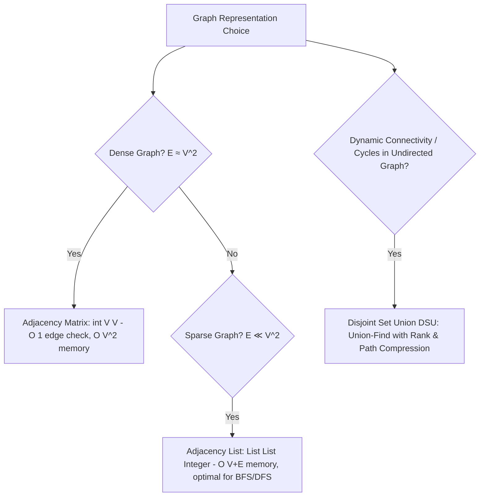

# 02. Master Data Structures Selection & Architectural Trade-Offs

[← Back to Constraint Triage](./01-problem-deconstruction-and-constraint-triage.md) | [Track Hub](./README.md) | [Next: Algorithmic Paradigms →](./03-master-algorithms-and-paradigms-catalog.md)

---

## 1. The Hardware & Memory Reality: Cache Lines vs. Pointer Chasing

Every data structure is fundamentally an agreement between **algorithmic efficiency** and **hardware physics**. The modern CPU memory hierarchy dictates runtime performance just as much as Big-O:

```
╭───────────────────────────────────────────────────────────────────────────────────────────╮
│                                THE CPU CACHE LINE DICTATE                                 │
├───────────────────────────────────────────────────────────────────────────────────────────┤
│ • Cache Line Size: CPUs fetch data in continuous 64-byte chunks (L1 Cache: ~1-2 ns).      │
│ • Contiguous Arrays: Iterating over int[] loads 16 integers per cache line fetch.         │
│ • Pointer-Chasing (Linked List, Trees, Graphs): Every node dereference (node.next) is a   │
│   gamble with main memory RAM (~50-100 ns latency), causing massive CPU pipeline stalls!  │
╰───────────────────────────────────────────────────────────────────────────────────────────╯
```

```
Contiguous Array (High Cache Locality):
[ 64-Byte CPU Cache Line Prefetch ] -> 16 sequential 4-byte integers in 1 Memory Cycle!
[  0  ][  1  ][  2  ][  3  ][  4  ][  5  ][  6  ][  7  ] ...

Pointer-Chasing Linked Nodes (Cache Stall Hazard):
[ Node A (Addr 0x1000) ] ──(stall 80ns)──> [ Node B (Addr 0x9800) ] ──(stall 80ns)──> [ Node C ]
```

---

## 2. Exhaustive Data Structures Taxonomy & Selection Matrix

| Data Structure | Access | Search | Insert | Delete | Space Overhead | Primary Use Cases & Triggers | Anti-Patterns (When NOT to use) |
| :--- | :---: | :---: | :---: | :---: | :---: | :--- | :--- |
| **1D / 2D Array** | $\mathcal{O}(1)$ | $\mathcal{O}(N)$ | $\mathcal{O}(N)$ | $\mathcal{O}(N)$ | Contiguous (Minimal) | Random indexing, fixed dimensions, sorting, two pointers, prefix sums | Frequent arbitrary insertions/deletions at middle |
| **Singly / Doubly Linked List** | $\mathcal{O}(N)$ | $\mathcal{O}(N)$ | $\mathcal{O}(1)$* | $\mathcal{O}(1)$* | 24B–32B per node | Constant-time insertion/splicing at head/tail; LRU/LFU cache nodes | Heavy random index access; cache-sensitive iterations |
| **Monotonic Stack** | $\mathcal{O}(1)$ | $\mathcal{O}(N)$ | $\mathcal{O}(1)$ | $\mathcal{O}(1)$ | $\mathcal{O}(N)$ | Next Greater/Smaller Element, Histogram area, Stock span | Finding elements other than the nearest boundary |
| **Monotonic Deque** | $\mathcal{O}(1)$ | $\mathcal{O}(N)$ | $\mathcal{O}(1)$ | $\mathcal{O}(1)$ | $\mathcal{O}(K)$ | Sliding Window Maximum / Minimum in $\mathcal{O}(1)$ amortized time | Unrestricted middle updates |
| **Binary Heap (Priority Queue)** | $\mathcal{O}(1)$ (peek) | $\mathcal{O}(N)$ | $\mathcal{O}(\log N)$ | $\mathcal{O}(\log N)$ | Flat array | Top-$K$ elements, Dijkstra, Huffman, running median (Two Heaps) | Finding or updating arbitrary elements (requires Indexed Priority Queue) |
| **Hash Table / Hash Set** | — | $\mathcal{O}(1)$ avg | $\mathcal{O}(1)$ avg | $\mathcal{O}(1)$ avg | $32\text{B}+$ per entry | $O(1)$ presence check, frequency counting, deduplication | Ordered traversals, range scans, prefix searches |
| **Binary Search Tree (Balanced)** | $\mathcal{O}(\log N)$ | $\mathcal{O}(\log N)$ | $\mathcal{O}(\log N)$ | $\mathcal{O}(\log N)$ | $32\text{B}$ per node | Range queries, dynamic rank queries, floor/ceiling search (`TreeMap`) | Static datasets (use sorted array + binary search instead) |
| **Segment Tree (with Lazy)** | — | $\mathcal{O}(\log N)$ | $\mathcal{O}(\log N)$ | — | $4N$ flat array | Dynamic Range Minimum/Sum Queries, interval range updates in $\mathcal{O}(\log N)$ | Static arrays without updates (use Sparse Table or Prefix Sums) |
| **Binary Indexed Tree (Fenwick)** | — | $\mathcal{O}(\log N)$ | $\mathcal{O}(\log N)$ | — | $N$ flat array | Dynamic cumulative prefix sums, dynamic inversion counting | Complex non-invertible range updates (use Segment Tree) |
| **Sparse Table** | $\mathcal{O}(1)$ | $\mathcal{O}(1)$ | — (Static) | — | $\mathcal{O}(N \log N)$ | Static Range Minimum/Maximum Queries in $\mathcal{O}(1)$ time | Any dataset requiring dynamic modifications |
| **Trie (Prefix Tree)** | — | $\mathcal{O}(L)$ | $\mathcal{O}(L)$ | $\mathcal{O}(L)$ | $\mathcal{O}(\Sigma \cdot N \cdot L)$ | Autocomplete, dictionary search, prefix matching, 32-bit max XOR pair | Very small dictionaries or diverse Unicode without common prefixes |
| **Disjoint Set Union (DSU)** | — | $\mathcal{O}(\alpha(N))$ | $\mathcal{O}(\alpha(N))$ | — | $2N$ flat array | Dynamic connectivity, cycle detection in undirected graphs, Kruskal's MST | Directed graphs (DSU cannot handle edge directionality) |
| **B+ Tree** | $\mathcal{O}(\log_M N)$ | $\mathcal{O}(\log_M N)$ | $\mathcal{O}(\log_M N)$ | $\mathcal{O}(\log_M N)$ | Block-aligned | Database storage engines (InnoDB/Postgres), disk-resident indexes | In-memory only structures (AVL/Red-Black is lighter) |
| **LSM-Tree** | Variable | $\mathcal{O}(\text{SSTs})$ | $\mathcal{O}(1)$ append | $\mathcal{O}(1)$ tombstone | Sequential files | Write-heavy key-value storage, time-series telemetry | Strict low-latency point reads without caching |
| **Bloom Filter** | — | $\mathcal{O}(K)$ | $\mathcal{O}(K)$ | — | Bitset | Fast negative existence check in RAM before hitting disk/database | Exact answers (Bloom filters allow false positives) |

*\*Insertion and deletion in linked lists are $\mathcal{O}(1)$ only when a pointer to the target node is already held.*

---

## 3. Detailed Data Structure Archetypes & Selection Rules

### 3.1 Linear Structures

```
╭───────────────────────────────────────────────────────────────────────────────────────────╮
│                               LINEAR STRUCTURE SELECTION RULES                            │
├───────────────────────────────────────────────────────────────────────────────────────────┤
│ • ArrayDeque vs. Stack/LinkedList: In Java, ALWAYS use ArrayDeque for Stacks, Queues,     │
│   and Deques. Stack is synchronized (legacy thread lock penalty). LinkedList incurs       │
│   32 bytes per node with terrible cache locality. ArrayDeque uses an unboxed circular     │
│   ring buffer with zero node allocations and optimal cache line prefetching!              │
│ • Monotonic Stack: When a problem asks for "first element to the left/right greater/smaller│
│   than current", a Monotonic Stack collapses quadratic O(N^2) searches to strictly O(N)!  │
│ • Two-Heap Architecture: When maintaining a dynamic running median or percentiles, balance │
│   a Max-Heap (lower 50%) and Min-Heap (upper 50%). Median is peeked in O(1) time!         │
╰───────────────────────────────────────────────────────────────────────────────────────────╯
```

---

### 3.2 Hierarchical & Interval Structures

```
╭───────────────────────────────────────────────────────────────────────────────────────────╮
│                             RANGE QUERY DECISION ENGINE                                   │
├───────────────────────────────────────────────────────────────────────────────────────────┤
│ Is the array STATIC (no updates)?                                                         │
│   ├── Need Range Sum? ───► Prefix Sum Array: O(1) Query, O(N) Build, O(1) Space.          │
│   └── Need Range Min/Max? ───► Sparse Table: O(1) Query, O(N log N) Build & Space.       │
│                                                                                           │
│ Is the array DYNAMIC (frequent updates)?                                                  │
│   ├── Point Updates + Range Sums? ───► Fenwick Tree (BIT): O(log N) Query & Update.       │
│   └── Range Updates + Range Min/Sum? ───► Segment Tree with Lazy Propagation: O(log N).   │
╰───────────────────────────────────────────────────────────────────────────────────────────╯
```

---

### 3.3 Graph Representations & Disjoint Sets



---

## 4. Interactive Data Structure Selection Drills

Read each real-world technical scenario, select your data structure, and click to reveal the architectural breakdown:

<details>
<summary><strong>🔍 Drill 1: "Design a leaderboard tracking the top 100 players in a real-time multiplayer game with 10 million active users"</strong></summary>

> **Optimal Data Structure**: **Min-Heap of capacity $K = 100$ OR Augmented Red-Black Tree**
> - **Why Min-Heap**:
>   - Keep a Min-Heap of size exactly $100$. The top element is the 100th player's score (the threshold).
>   - When a player scores $S$, compare with `minHeap.peek()` in $\mathcal{O}(1)$.
>   - If $S > \text{threshold}$, `minHeap.poll()` and `minHeap.offer(S)` in $\mathcal{O}(\log 100) \approx 7$ operations.
>   - Memory footprint is completely negligible ($\approx 100$ integers), completely insulating your backend from the 10 million user load!
</details>

<details>
<summary><strong>🔍 Drill 2: "Design a data structure supporting insert, delete, and getRandom in O(1) average time"</strong></summary>

> **Optimal Composite Structure**: **`ArrayList<T>` + `HashMap<T, Integer>`**
> - **The Structural Dilemma**:
>   - `HashMap` gives $O(1)$ insert and delete, but CANNOT select a uniform random element in $O(1)$ (hash buckets have gaps).
>   - `ArrayList` gives $O(1)$ random access (`arr.get(rand.nextInt(size))`), but deleting an element from the middle takes $O(N)$ shift time.
> - **The "Aha!" Synthesis**:
>   - Combine both! Store values in an `ArrayList`. Store `Map<Value, IndexInList>` in a `HashMap`.
>   - **$O(1)$ Deletion Trick**: When deleting $X$, look up its index from the map, swap $X$ with the **last element** of the array, pop the last element in $\mathcal{O}(1)$, and update the swapped element's index in the map!
</details>

<details>
<summary><strong>🔍 Drill 3: "A stream of integers arrives. At any time, return the shortest subarray whose sum is at least K. Array contains negative numbers."</strong></summary>

> **Optimal Data Structure**: **Monotonic Double-Ended Queue (Deque) over Prefix Sums**
> - **Why Sliding Window Fails**: Negative values destroy sum monotonicity.
> - **Why Monotonic Deque Wins**:
>   - Maintain prefix sums $P[i]$. For current index $j$, we want an index $i < j$ such that $P[j] - P[i] \ge K$ and $j - i$ is minimized.
>   - Keep a deque of candidate indices storing strictly increasing prefix sums.
>   - If $P[j] - P[\text{deque.peekFirst()}] \ge K$, we record the length and `deque.pollFirst()` because no future right boundary can form a shorter valid subarray with that left index!
>   - Maintain deque monotonicity: while $P[j] \le P[\text{deque.peekLast()}]$, pop back, because $j$ is both smaller in value and further to the right!
>   - Time: Strictly $\mathcal{O}(N)$ amortized.
</details>

<details>
<summary><strong>🔍 Drill 4: "Given a network of computers with bidirectional connections added one by one, quickly check if two computers are connected"</strong></summary>

> **Optimal Data Structure**: **Disjoint Set Union (DSU) with Path Compression & Union by Rank**
> - **Why BFS/DFS Fails**: Running BFS/DFS on every connection query takes $\mathcal{O}(V + E)$ per query! For $Q = 10^5$ queries, total time is $\mathcal{O}(Q \cdot (V + E)) \approx 10^{10} \implies$ Catastrophic TLE!
> - **Why DSU Dominates**:
>   - `union(u, v)` and `find(u)` execute in $\mathcal{O}(\alpha(N))$ nearly $\mathcal{O}(1)$ time using the inverse Ackermann function ($\alpha(N) \le 4$ for all practical universe sizes).
>   - Total Runtime for $10^5$ queries: $\approx 4 \times 10^5$ operations ($\approx 5\text{ ms}$).
</details>

---

<table width="100%">
  <tr>
    <td width="33%" align="left">
      <a href="./01-problem-deconstruction-and-constraint-triage.md">
        <strong>← Previous Module</strong><br>
        01. Constraint Triage & Complexity Budgeting
      </a>
    </td>
    <td width="33%" align="center">
      <a href="./README.md">
        <strong>Track Hub</strong><br>
        Strategies Navigation
      </a>
    </td>
    <td width="33%" align="right">
      <a href="./03-master-algorithms-and-paradigms-catalog.md">
        <strong>Next Module →</strong><br>
        03. Master Algorithmic Paradigms
      </a>
    </td>
  </tr>
</table>
