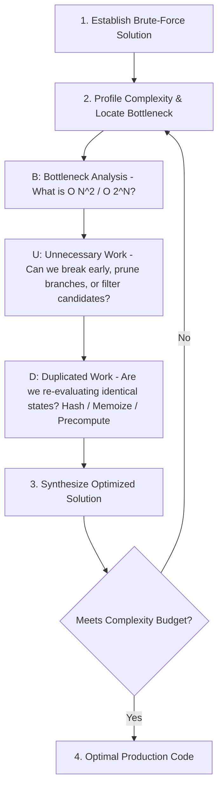

# 04. The BUD Optimization Framework: Systematic Performance Engineering

[← Back to Algorithmic Paradigms](./03-master-algorithms-and-paradigms-catalog.md) | [Track Hub](./README.md) | [Next: Space Optimization →](./05-space-optimization-and-in-place-techniques.md)

---

## 1. The BUD Optimization Paradigm

When faced with a brute-force or suboptimal algorithm, novice engineers randomly guess different approaches. Elite engineers perform **systematic diagnostic triage** using the **BUD Framework**:

```
╭───────────────────────────────────────────────────────────────────────────────────────────╮
│                                  THE B-U-D FRAMEWORK                                      │
├───────────────────────────────────────────────────────────────────────────────────────────┤
│ • B — Bottlenecks: Which specific phase or inner loop dominates overall execution time?   │
│ • U — Unnecessary Work: Are we performing operations that cannot contribute to the result?│
│ • D — Duplicated Work: Are we computing the exact same subproblem multiple times?         │
╰───────────────────────────────────────────────────────────────────────────────────────────╯
```



---

## 2. The 3 Diagnostic Pillars in Action

### 2.1 Bottlenecks: Finding the Asymptotic Anchor
A bottleneck is the single operation in your pipeline that prevents the algorithm from running faster.
- **Rule of Dominance**: If an algorithm has two steps, Step 1 taking $\mathcal{O}(N \log N)$ and Step 2 taking $\mathcal{O}(N^2)$, optimizing Step 1 to $\mathcal{O}(1)$ provides virtually **zero** benefit! You MUST attack the $\mathcal{O}(N^2)$ bottleneck!

### 2.2 Unnecessary Work: Pruning Dead Space
Unnecessary work occurs when code continues computing after the answer is already determined, or explores branches that cannot possibly yield valid answers:
- **Early Break**: In two-sum search, if `sum > target`, advancing left pointer further right is mathematically futile!
- **Branch-and-Bound Pruning**: In backtracking, if the current accumulated path weight already exceeds the best known minimum, terminate the branch immediately!

### 2.3 Duplicated Work: Caching & Precomputation
Duplicated work occurs when the same value or state is calculated repeatedly from scratch:
- **Repeated Range Sums**: Computing $\sum_{k=i}^j A[k]$ repeatedly inside nested loops takes $\mathcal{O}(N)$ per query $\implies$ Replace with **Prefix Sums** for $\mathcal{O}(1)$ retrieval!
- **Repeated Lookups**: Linear scan searching if $X$ exists takes $\mathcal{O}(N) \implies$ Pre-populate a **Hash Set** for $\mathcal{O}(1)$ lookups!

---

## 3. Case Studies: Evolving Solutions Step-by-Step

### Case Study 1: Subarray Sum Equals $K$ ($\mathcal{O}(N^3) \to \mathcal{O}(N^2) \to \mathcal{O}(N)$)

```
Level 1: Brute Force O(N^3)
Iterate all pairs (i, j). Inside, run a 3rd loop from i to j summing elements.
Bottleneck: The inner summing loop is DUPLICATED WORK!
                         ↓
Level 2: Prefix Sum Array O(N^2)
Compute prefix sums in O(N). Check all pairs in O(1): sum(i, j) = P[j] - P[i-1].
Bottleneck: Checking all N^2 pairs is UNNECESSARY WORK!
                         ↓
Level 3: Hash Map Inversion O(N)
We want: P[j] - P[i-1] = K  ===>  P[i-1] = P[j] - K
As we compute P[j], look up how many times (P[j] - K) occurred in a HashMap!
Strictly O(N) time and O(N) space!
```

---

## 4. Interactive "Spot-the-BUD" Challenges

Test your optimization instincts on real code! Identify the BUD flaw and click to reveal the diagnosis:

<details>
<summary><strong>🔍 Challenge 1: Spot the BUD in this 2-Sum Search</strong></summary>

```java
// Given a sorted array, find if two numbers sum to target:
public boolean hasPairWithSum(int[] arr, int target) {
    for (int i = 0; i < arr.length; i++) {
        for (int j = i + 1; j < arr.length; j++) {
            if (arr[i] + arr[j] == target) return true;
        }
    }
    return false;
}
```

> **The BUD Diagnosis**:
> - **The Flaw**: **Unnecessary Work**. The array is *already sorted*, but the code ignores this invariant and performs an exhaustive $\mathcal{O}(N^2)$ scan.
> - **The Fix**: Use **Two Pointers Converging** from both ends (`left = 0, right = n - 1`). If `sum < target`, increment `left`; if `sum > target`, decrement `right`.
> - **Complexity Evolution**: $\mathcal{O}(N^2) \to \mathcal{O}(N)$ time with strictly $\mathcal{O}(1)$ space!
</details>

<details>
<summary><strong>🔍 Challenge 2: Spot the BUD in this Matrix Search</strong></summary>

```java
// Search target in an M x N matrix where each row and column is sorted:
public boolean searchMatrix(int[][] matrix, int target) {
    int m = matrix.length, n = matrix[0].length;
    for (int r = 0; r < m; r++) {
        // Binary search each row individually: O(M log N)
        if (Arrays.binarySearch(matrix[r], target) >= 0) return true;
    }
    return false;
}
```

> **The BUD Diagnosis**:
> - **The Flaw**: **Bottleneck & Unnecessary Work**. Binary searching each row takes $\mathcal{O}(M \log N)$ and fails to exploit the simultaneous column sorting.
> - **The Fix**: **Saddleback Search (Top-Right / Bottom-Left Corner Traversal)**. Start at top-right corner `(r = 0, c = n - 1)`:
>   - If `matrix[r][c] == target` $\implies$ return `true`.
>   - If `matrix[r][c] > target` $\implies$ entire column `c` is too large $\implies$ `c--`.
>   - If `matrix[r][c] < target` $\implies$ entire row `r` is too small $\implies$ `r++`.
> - **Complexity Evolution**: $\mathcal{O}(M \log N) \to \mathcal{O}(M + N)$ linear time!
</details>

<details>
<summary><strong>🔍 Challenge 3: Spot the BUD in this Fibonacci Recursion</strong></summary>

```java
public int fib(int n) {
    if (n <= 1) return n;
    return fib(n - 1) + fib(n - 2);
}
```

> **The BUD Diagnosis**:
> - **The Flaw**: **Duplicated Work**. `fib(n-1)` and `fib(n-2)` both independently re-evaluate `fib(n-3)`, `fib(n-4)`, etc., causing an exponential $\mathcal{O}(2^N)$ explosion of redundant call frames.
> - **The Fix**: Memoization / Bottom-Up DP with rolling variables (`prev1`, `prev2`).
> - **Complexity Evolution**: $\mathcal{O}(2^N) \to \mathcal{O}(N)$ time and $\mathcal{O}(1)$ space!
</details>

---

<table width="100%">
  <tr>
    <td width="33%" align="left">
      <a href="./03-master-algorithms-and-paradigms-catalog.md">
        <strong>← Previous Module</strong><br>
        03. Master Algorithmic Paradigms
      </a>
    </td>
    <td width="33%" align="center">
      <a href="./README.md">
        <strong>Track Hub</strong><br>
        Strategies Navigation
      </a>
    </td>
    <td width="33%" align="right">
      <a href="./05-space-optimization-and-in-place-techniques.md">
        <strong>Next Module →</strong><br>
        05. Space Optimization & In-Place Techniques
      </a>
    </td>
  </tr>
</table>
