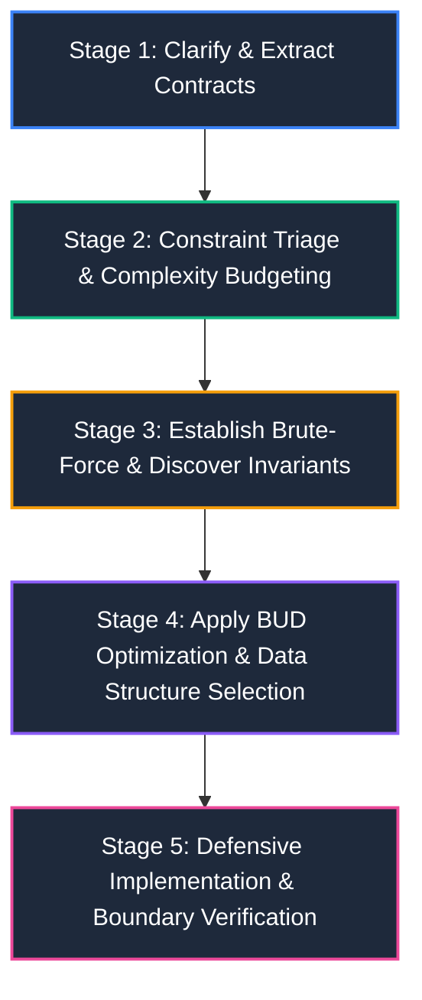
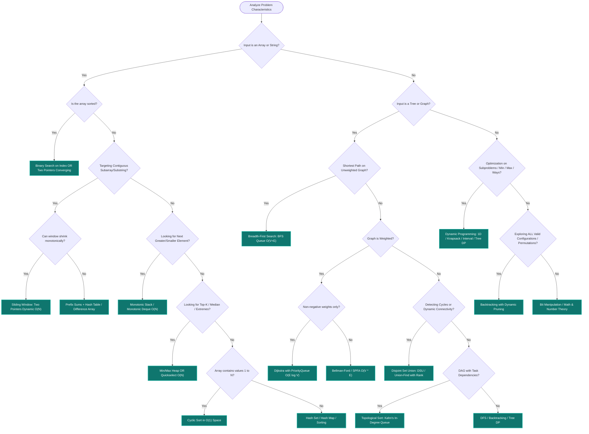

# 🧠 Master DSA Problem-Solving Strategies & Optimization Engine

[Java Track Home](../dsa-java/README.md) | [System Design Track](../system-design/README.md) | [Next: Constraint Triage →](./01-problem-deconstruction-and-constraint-triage.md)

---

## 🧭 Executive Overview: The Cognitive Architecture of Problem Solving

In high-stakes technical coding interviews and enterprise systems engineering, top-tier problem solving is **not** about memorizing 500 distinct problems. It is about possessing a systematic, repeatable **cognitive algorithm** that deconstructs any unseen problem into foundational patterns, extracts mathematical invariants, reverse-engineers time/space complexity budgets from input constraints, and applies targeted optimizations.

```
                      ╭────────────────────────────────────────╮
                      │      UNSEEN PROBLEM STATEMENT          │
                      ╰───────────────────┬────────────────────╯
                                          │
                        1. Deconstruct Constraints & Bounds
                                          │
                                          ▼
                      ╭────────────────────────────────────────╮
                      │  COMPLEXITY BUDGET (e.g., O(N log N))   │
                      ╰───────────────────┬────────────────────╯
                                          │
                        2. Identify Invariants & Trigger Clues
                                          │
                                          ▼
                      ╭────────────────────────────────────────╮
                      │    ALGORITHMIC PARADIGM & STRUCTURE    │
                      ╰───────────────────┬────────────────────╯
                                          │
                        3. Apply BUD Optimization (B-U-D)
                                          │
                                          ▼
                      ╭────────────────────────────────────────╮
                      │ OPTIMAL PRODUCTION CODE & DEFENSE      │
                      ╰────────────────────────────────────────╯
```

---

## 🔄 1. The 5-Stage Universal Problem-Solving Lifecycle

Every problem should be navigated using this rigorous, repeatable 5-stage protocol:



### 📋 Interactive Problem-Solving Checklist

Use this interactive checklist as your mental template during technical interviews:

- [ ] **Stage 1: Contract Clarification**
  - [ ] Are input values positive, negative, zero, or floating-point?
  - [ ] Can collections contain duplicates?
  - [ ] What should be returned for empty or invalid inputs?
  - [ ] Can we mutate the input in-place, or is it read-only?
- [ ] **Stage 2: Complexity Budgeting**
  - [ ] Reverse-engineer the maximum allowed runtime based on $N$ ($10^5 \implies \mathcal{O}(N \log N)$ or $\mathcal{O}(N)$).
  - [ ] Determine memory limits (e.g. $\mathcal{O}(1)$ auxiliary space vs $\mathcal{O}(N)$ hash table).
- [ ] **Stage 3: Brute-Force Baseline**
  - [ ] Articulate the simplest naive solution out loud (e.g., generate all $2^N$ subsets or $N^2$ pairs).
  - [ ] State its exact Time and Space complexity so both you and the interviewer have an explicit baseline.
- [ ] **Stage 4: BUD Optimization**
  - [ ] **B**ottlenecks: Which specific operation consumes the most runtime?
  - [ ] **U**nnecessary work: Can we break early or prune dead branches?
  - [ ] **D**uplicated work: Are we recomputing overlapping subproblems? (Cache / Memoize / Precompute).
- [ ] **Stage 5: Defensive Coding & Boundary Verification**
  - [ ] Guard against integer overflow (`low + (high - low) / 2`).
  - [ ] Trace boundary conditions: $N=0, N=1, N=2$, all identical values, negative inputs.

---

## ⚡ 2. The Global Interactive Decision Tree

Follow this branching decision tree to match any problem's signals directly to the optimal algorithmic paradigm and data structure:



---

## 🎯 3. Interactive Pattern Recognition Drill

Test your intuition! Read each interview scenario below, formulate your algorithmic choice, and click to reveal the optimal strategy:

<details>
<summary><strong>🔍 Scenario 1: "Find the smallest contiguous subarray whose sum is greater than or equal to S (all numbers positive)"</strong></summary>

> **Optimal Pattern**: **Sliding Window (Dynamic Two Pointers)**
> - **Trigger Clues**: "Contiguous subarray", "all numbers positive" (monotonicity invariant: expanding window strictly increases sum; shrinking window strictly decreases sum).
> - **Time Complexity**: $\mathcal{O}(N)$ since left and right pointers advance at most $N$ times.
> - **Space Complexity**: $\mathcal{O}(1)$ auxiliary space.
> - **Why Not Prefix Sum + Binary Search?**: Prefix Sum + Binary Search takes $\mathcal{O}(N \log N)$. Because all numbers are strictly positive, the monotonic sliding window guarantees $\mathcal{O}(N)$ linear time!
</details>

<details>
<summary><strong>🔍 Scenario 2: "Find the number of subarrays whose sum equals K (numbers can be negative or zero)"</strong></summary>

> **Optimal Pattern**: **Prefix Sums + Hash Map**
> - **Trigger Clues**: "Subarray sum equals $K$", **negative numbers allowed** (destroys the monotonicity required for sliding window!).
> - **The "Aha!" Mathematical Invariant**:
>   $$\text{Sum}(i, j) = \text{PrefixSum}[j] - \text{PrefixSum}[i-1] = K \implies \text{PrefixSum}[i-1] = \text{PrefixSum}[j] - K$$
> - **Time Complexity**: $\mathcal{O}(N)$ with a single pass storing prefix sum frequencies in a `HashMap<Long, Integer>`.
> - **Space Complexity**: $\mathcal{O}(N)$ auxiliary heap memory.
</details>

<details>
<summary><strong>🔍 Scenario 3: "Given N courses and prerequisites [u, v], determine the order in which all courses must be taken"</strong></summary>

> **Optimal Pattern**: **Topological Sort (Kahn's Algorithm with In-Degree Queue)**
> - **Trigger Clues**: Directed dependencies ("prerequisites", "ordering"), directed graph.
> - **Mechanism**: Compute in-degrees for all nodes; enqueue nodes with in-degree 0; decrement neighbor in-degrees as nodes are dequeued. If total processed nodes $< N$, a circular dependency (cycle) exists!
> - **Time Complexity**: $\mathcal{O}(V + E)$.
> - **Space Complexity**: $\mathcal{O}(V + E)$ for adjacency list and in-degree array.
</details>

<details>
<summary><strong>🔍 Scenario 4: "Find the maximum capacity among all paths from source to sink in a network"</strong></summary>

> **Optimal Pattern**: **Modified Dijkstra (Max-Heap) OR Binary Search on Answer Space + BFS**
> - **Trigger Clues**: "Minimax" or "Maximin" path optimization across a graph.
> - **Binary Search on Answer Space**:
>   - Range: $[ \min(\text{weight}), \max(\text{weight}) ]$.
>   - Feasibility predicate `isValid(C)`: Can we reach destination using only edges with capacity $\ge C$? (Validated via standard BFS in $\mathcal{O}(V + E)$).
>   - Total Runtime: $\mathcal{O}((V + E) \log(\max W))$.
</details>

---

## 📚 4. Track Curriculum & Master Roadmap

| Module | Core Topics & Focus | Interactive Elements | Strategic Highlights |
| :--- | :--- | :--- | :--- |
| **[01. Constraint Triage & Complexity Budgeting](./01-problem-deconstruction-and-constraint-triage.md)** | The Constraint Rosetta Stone, Complexity Budgeting ($O(1)$ to $O(N!)$), Invariant Extraction | • Interactive Constraint Reverse-Engineering Quiz<br>• Invariant Diagnostic Table | Deducing target algorithm directly from $N$ before writing code |
| **[02. Master Data Structures Selection & Trade-Offs](./02-master-data-structures-selection-and-trade-offs.md)** | Complete Taxonomy of ALL Data Structures (Linear, Trees, Heaps, Hash, Graphs, Tries, Disjoint Sets, Probabilistic) | • Self-Test Data Structure Selection Cards<br>• Cache Line Locality vs Pointer Chasing matrix | In-depth trade-off analysis across every data structure in computer science |
| **[03. Master Algorithms & Paradigms Catalog](./03-master-algorithms-and-paradigms-catalog.md)** | Complete Taxonomy of ALL Algorithmic Paradigms (Two Pointers, Binary Search, Graph, DP, Greedy, Backtracking, Bitwise, Strings, Math) | • Self-Test Pattern Matching Drills<br>• Algorithmic Trigger Clue Catalog | The exhaustive trigger guide mapping problem phrasing to algorithms |
| **[04. The BUD Optimization Framework](./04-the-bud-optimization-framework.md)** | Bottlenecks, Unnecessary Work, Duplicated Work ($O(N^3) \to O(N^2) \to O(N \log N) \to O(N) \to O(1)$) | • Interactive "Spot-the-BUD" Challenges<br>• Evolution Trace Tables | Systematic framework for taking brute-force solutions to optimal speed |
| **[05. Space Optimization & In-Place Techniques](./05-space-optimization-and-in-place-techniques.md)** | Downsizing Space: Rolling DP arrays, Bitmask compression, In-Place Array Math, Cyclic Sort, Morris | • Memory Compression Transformations<br>• In-Place State Math Visualizers | Eliminating heap allocations and reducing $O(N^2) \to O(N) \to O(1)$ space |
| **[06. Edge Cases & Boundary Defense Playbook](./06-edge-cases-and-boundary-defense-playbook.md)** | Universal Edge Cases: Overflow, Duplicates, Cycles, Disconnected Graphs, Degenerate Trees | • Interactive "What Breaks This Code?" Stress Drills<br>• Defensive Coding Checklist | Zero-defect implementation habits that prevent silent interview bugs |
| **[07. Live Technical Interview Execution & Communication](./07-live-interview-execution-and-communication.md)** | 45-Minute Interview Architecture, Thinking Out Loud, The 5-Step "I Am Stuck" Rescue Protocol | • Interactive Interviewer Curveball Simulator<br>• Verbal Communication Scripts | Mastering live interview pacing, whiteboarding, and stress management |

---

<table width="100%">
  <tr>
    <td width="33%" align="left">
      <a href="../dsa-java/README.md">
        <strong>← Previous Track</strong><br>
        Java DSA Master Track
      </a>
    </td>
    <td width="33%" align="center">
      <a href="../README.md">
        <strong>Home</strong><br>
        Repository Master Index
      </a>
    </td>
    <td width="33%" align="right">
      <a href="./01-problem-deconstruction-and-constraint-triage.md">
        <strong>Next Module →</strong><br>
        01. Constraint Triage & Complexity Budgeting
      </a>
    </td>
  </tr>
</table>
