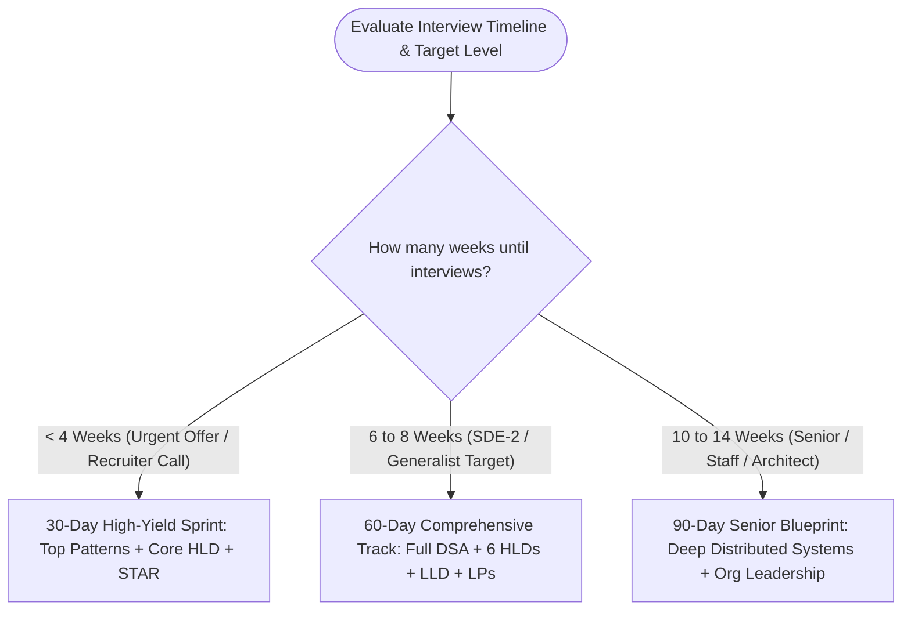

# 📅 Guided Study Roadmaps (30 / 60 / 90 Days)

[Java Track Home](../dsa-java/README.md) | [System Design Hub](../system-design/README.md) | [Behavioral Hub](../behavioral-and-leadership/README.md) | [Next: 30-Day FAANG Sprint →](./01-the-30-day-faang-sprint-roadmap.md)

---

## 🧭 Executive Overview: Strategic Time Allocation

Preparation without a structured curriculum leads to **burnout, rabbit holes, and asymmetric prep** (e.g. solving 400 LeetCode problems while failing System Design or Behavioral rounds).

These roadmaps provide **day-by-day, phase-by-phase execution blueprints** reverse-engineered from successful candidates who landed offers at Google, Meta, Amazon, Apple, Netflix, Uber, and Stripe.

```
╭───────────────────────────────────────────────────────────────────────────────────────────╮
│                               THE PREPARATION ALLOCATION LAW                              │
├────────────────────┬────────────────────┬────────────────────────┬────────────────────────┤
│ Target Level       │ Coding & Algorithms│ High-Level Design (HLD)│ Behavioral & Leadership│
├────────────────────┼────────────────────┼────────────────────────┼────────────────────────┤
│ SDE-1 / Junior     │ 70%                │ 15% (Basics/LLD)       │ 15%                    │
│ SDE-2 / Mid-Level  │ 50%                │ 30% (HLD & LLD)        │ 20%                    │
│ Senior (L5)        │ 35%                │ 40% (Distributed HLD)  │ 25%                    │
│ Staff / Lead (L6+) │ 20%                │ 45% (Scale & Tradeoffs)│ 35%                    │
╰────────────────────┴────────────────────┴────────────────────────┴────────────────────────╯
```



---

## 🗺️ Master Roadmap Catalog

| Roadmap | Ideal Candidate & Target Level | Time Commitment | Core Focus Areas | Direct Link |
| :--- | :--- | :--- | :--- | :--- |
| **01. The 30-Day FAANG Sprint** | Candidates with upcoming on-sites in 3–4 weeks (SDE-1 / SDE-2) | 20–25 hrs / week | Top 14 LeetCode patterns, high-yield HLD templates, STAR behavioral matrix | [01-the-30-day-faang-sprint-roadmap.md](./01-the-30-day-faang-sprint-roadmap.md) |
| **02. The 60-Day Comprehensive SDE-2 Track** | Engineers aiming for mid-level (L4 / SDE-2) promotions or FAANG transitions | 15–20 hrs / week | Full DSA curriculum, LLD machine coding, 7 HLD case studies, Amazon LPs | [02-the-60-day-comprehensive-sde2-backend-roadmap.md](./02-the-60-day-comprehensive-sde2-backend-roadmap.md) |
| **03. The 90-Day Senior & Staff Architect Blueprint** | Senior (L5) / Staff (L6) / Principal candidates targeting Tier-1 tech | 12–18 hrs / week | Complex distributed consistency, consensus (Raft/Paxos), multi-region HLD, executive influence | [03-the-90-day-senior-and-staff-architect-blueprint.md](./03-the-90-day-senior-and-staff-architect-blueprint.md) |

---

## ⚡ Recommended Daily Study Rhythm

For maximum retention and cognitive endurance, use the **Split-Block Method**:

```
╭───────────────────────────────────────────────────────────────────────────────────────────╮
│                              THE 2-HOUR DAILY STUDY SPLIT                                 │
├────────────────────┬───────────────────────────────────┬──────────────────────────────────┤
│ Block              │ Activity                          │ Focus Objective                  │
├────────────────────┼───────────────────────────────────┼──────────────────────────────────┤
│ Block 1 (50 min)   │ 1-2 Algorithm Pattern Problems    │ Solve without looking at solution│
│ Break (10 min)     │ Cognitive Reset                   │ Walk, hydrate, zero screens      │
│ Block 2 (40 min)   │ System Design (HLD/LLD)           │ Diagram architecture & trade-offs│
│ Block 3 (20 min)   │ Active Recall / Behavioral Story  │ Practice STAR story or flashcards│
╰────────────────────┴───────────────────────────────────┴──────────────────────────────────╯
```

---

<div align="center">

| [← Java Track Home](../dsa-java/README.md) | [Study Plans Hub](./README.md) | [Next: 30-Day FAANG Sprint →](./01-the-30-day-faang-sprint-roadmap.md) |
| :--- | :---: | ---: |

</div>
