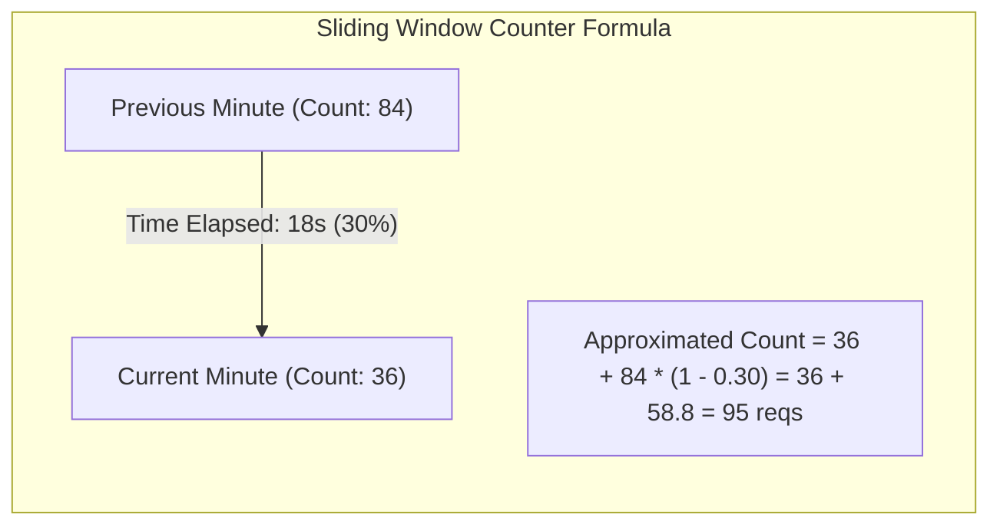
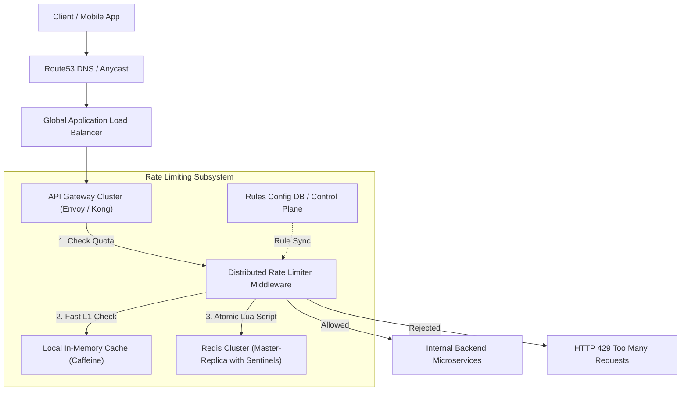

# 01. Design a Distributed Rate Limiter

[← Track Hub: HLD Case Studies](./README.md) | [Track Hub](./README.md) | [Next: Design a Global URL Shortener (TinyURL) →](./02-design-a-global-url-shortener-tinyurl.md)

---

## 1. Step 1: Requirements & Scope Clarification

A Rate Limiter controls the rate of traffic sent by a client or service, safeguarding backend infrastructure from Denial of Service (DoS) attacks, brute-force exploits, web scraping, and cascading service outages.

### Functional Requirements (FR)
1. **Configurable Rules:** Support rate limiting by Client IP, User ID, or API Key across different endpoints (e.g., `/api/v1/auth/login` allows 5 req/min, `/api/v1/search` allows 100 req/sec).
2. **HTTP 429 Response:** When a request exceeds threshold, reject with HTTP Status `429 Too Many Requests`.
3. **Informative Headers:** Return rate limit state in HTTP response headers:
   - `X-RateLimit-Limit`: Maximum requests permitted per window.
   - `X-RateLimit-Remaining`: Remaining allowed requests in current window.
   - `X-RateLimit-Reset`: Unix epoch seconds until quota refresh.

### Non-Functional Requirements (NFR)
1. **Ultra-Low Latency:** Must not introduce more than $2 - 5\text{ ms}$ of latency overhead to incoming requests.
2. **High Availability & Fault Tolerance:** If the rate limiter cluster fails or experiences network partitioning, requests should **fail-open** (allow requests through) rather than taking down the entire API gateway.
3. **Distributed Accuracy:** Accurate rate enforcement across thousands of horizontally scaled backend gateway nodes without race conditions.
4. **Memory Efficiency:** Minimal RAM footprint per user record.

---

## 2. Step 2: Back-of-the-Envelope Capacity Estimations

```
  Traffic Estimations:
  - Total Daily Requests: 1 Billion requests / day
  - Average QPS = 1,000,000,000 / 86,400 ≈ 11,600 QPS
  - Peak Traffic Multiplier = 2.5x
  - Peak QPS = 11,600 * 2.5 ≈ 29,000 QPS (~30,000 QPS)

  Memory Sizing:
  - Daily Active Users (DAU) / Distinct Tracked Keys = 20 Million keys
  - Data tracked per key (Sliding Window Counter):
    * Key String (e.g., "ratelimit:user_123456:search"): 32 bytes
    * Current Window Count (integer): 4 bytes
    * Previous Window Count (integer): 4 bytes
    * Window Timestamp: 8 bytes
    * Redis dict entry overhead: ~32 bytes
    * Total per key ≈ 80 bytes
  
  Total Working Memory = 20,000,000 * 80 bytes ≈ 1.6 GB of RAM
  
  Conclusion:
  1.6 GB fits comfortably in a single Redis instance.
  However, for High Availability and 30,000+ QPS throughput, we deploy a
  Redis Cluster with master-replica replication and read sharding.
```

---

## 3. Step 3: Core Rate Limiting Algorithms Deep-Dive

| Algorithm | Mechanism | Pros | Cons |
| :--- | :--- | :--- | :--- |
| **Token Bucket** | Tokens added at fixed rate $r$ up to capacity $b$. Each request consumes 1 token. | Allows bursts up to capacity $b$; memory-efficient ($2$ numbers: timestamp, token count). | Difficult to tune $r$ and $b$ across diverse traffic patterns. |
| **Leaky Bucket** | Requests enter a FIFO queue processed at constant rate $r$. Overflow requests dropped. | Smooths out bursty traffic into steady egress stream. | Bursts of legitimate requests suffer high latency in queue. |
| **Fixed Window** | Time sliced into discrete windows (e.g., 1 min). Counter resets at boundary. | Trivial implementation; minimal memory ($1$ integer). | **Boundary Burst Vulnerability:** $2\times$ quota can pass if traffic spikes across window edge. |
| **Sliding Window Log** | Stores timestamp of every request in sorted set (`ZSET`). Prunes logs older than $t - \text{window}$. | Mathematically $100\%$ accurate. | Extreme memory consumption: storing every timestamp consumes gigabytes. |
| **Sliding Window Counter** | Hybrid: $\text{Count} = \text{CurrWindow} + \text{PrevWindow} \times \left(1 - \frac{\text{elapsed}}{\text{window}}\right)$. | Smooths boundaries; minimal memory ($2$ integers); $< 0.1\%$ error rate. | **Recommended for production distributed systems.** |



---

## 4. Step 4: High-Level Architecture & End-to-End Data Flow



### Redis Atomic Lua Script (Sliding Window Counter)
To eliminate race conditions between reading and updating counters, execute this atomic script:

```lua
-- KEYS[1]: Current window key, KEYS[2]: Previous window key
-- ARGV[1]: Max limit, ARGV[2]: Window size (secs), ARGV[3]: Current timestamp (secs)
local curr_key = KEYS[1]
local prev_key = KEYS[2]
local limit = tonumber(ARGV[1])
local window_size = tonumber(ARGV[2])
local now = tonumber(ARGV[3])

local curr_count = tonumber(redis.call('get', curr_key) or "0")
local prev_count = tonumber(redis.call('get', prev_key) or "0")

local time_into_curr_window = now % window_size
local weight = (window_size - time_into_curr_window) / window_size
local estimated_count = curr_count + (prev_count * weight)

if estimated_count < limit then
    redis.call('incr', curr_key)
    redis.call('expire', curr_key, window_size * 2)
    return {1, limit - math.floor(estimated_count + 1)} -- Allowed, Remaining
else
    return {0, 0} -- Rejected
end
```

---

## 5. Step 5: Deep-Dive Bottlenecks & Failure Mode Mitigations

### 1. Eliminating the Central Redis Bottleneck (L1 Local Cache + L2 Redis)
At 100k+ QPS, querying Redis across the network for *every single request* introduces latency and network saturation.
- **Solution:** Hybrid Local Token Allocation.
- Each API Gateway instance requests a **batch lease of tokens** (e.g., 50 tokens) from Redis via a single atomic call.
- The Gateway serves subsequent requests locally from memory in $< 0.1\text{ ms}$.
- When local tokens dip below threshold, it asynchronously requests another batch lease.

### 2. Handling Redis Outages: Fail-Open vs. Fail-Closed
- **Rule of Thumb:** For DDoS defense on sensitive endpoints (`/auth/login`), **Fail-Closed** to prevent brute-forcing.
- For public browsing endpoints (`/feed`, `/search`), **Fail-Open** with local circuit breakers (`Resilience4j`) so an infrastructure hiccup in Redis does not trigger total API downtime.

### 3. Distributed Clock Synchronization & Drift
- Never use local server timestamps `System.currentTimeMillis()` because clock drift across servers can cause skew.
- Rely on the Redis server's internal clock via `redis.call('TIME')` to maintain a single monotonic time authority.

---

<div align="center">

| [← Track Hub: HLD Case Studies](./README.md) | [Track Hub: HLD Case Studies](./README.md) | [Next: Design a Global URL Shortener (TinyURL) →](./02-design-a-global-url-shortener-tinyurl.md) |
| :--- | :---: | ---: |

</div>
