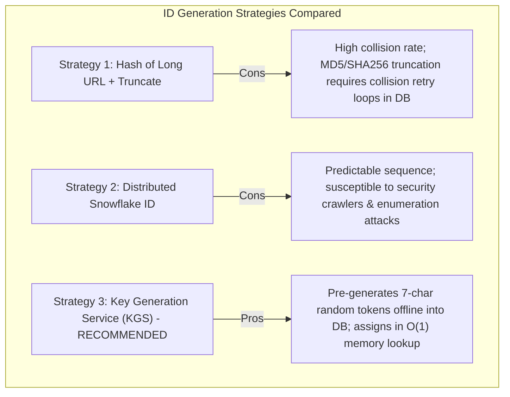
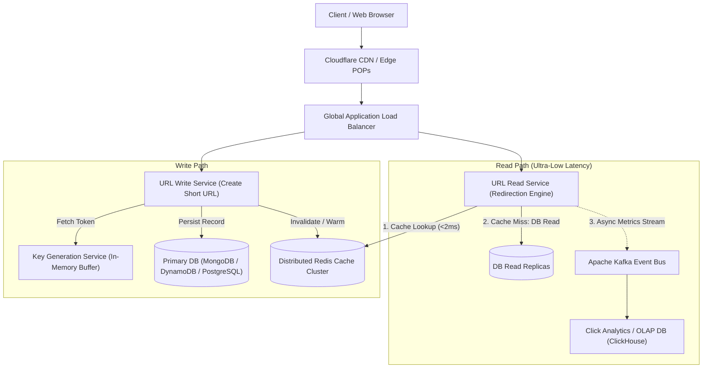

# 02. Design a Global URL Shortener (TinyURL)

[← Back to Distributed Rate Limiter](./01-design-a-distributed-rate-limiter.md) | [Track Hub](./README.md) | [Next: Design a Real-Time Chat System (WhatsApp) →](./03-design-a-real-time-chat-system-whatsapp-slack.md)

---

## 1. Step 1: Requirements & Scope Clarification

A URL shortening service generates compact, human-readable aliases for long URLs and provides high-throughput redirection to the original destination.

### Functional Requirements (FR)
1. **URL Shortening:** Given a long URL, return a unique short alias (e.g., `https://tiny.url/7bXq2aZ`).
2. **Redirection:** When a user visits the short URL, redirect them immediately to the original destination.
3. **Custom Aliases:** Users can optionally specify custom aliases (e.g., `https://tiny.url/my-custom-link`).
4. **TTL Expiration:** URLs can optionally specify an expiration timestamp. Expired URLs must return HTTP 404.

### Non-Functional Requirements (NFR)
1. **Ultra-Low Latency Redirection:** Read redirection must complete in $< 10 - 20\text{ ms}$.
2. **High Availability (99.99%):** Redirection downtime directly impacts customer traffic.
3. **Extreme Read-to-Write Ratio (100:1):** System must be optimized heavily for fast reads and caching.
4. **Unguessable Short Links:** Generated IDs must not follow sequential increments to prevent automated URL scraping.

---

## 2. Step 2: Back-of-the-Envelope Capacity Estimations

```
  Traffic Estimations:
  - Write Traffic (New URLs): 100 Million new URLs created / month
  - Writes per second = 100,000,000 / (30 days * 86,400s) ≈ 40 writes/sec
  - Read Traffic (Redirection): 100:1 Read-to-Write ratio
  - Reads per second = 40 * 100 = 4,000 reads/sec (Peak ~10,000 reads/sec)

  Storage Calculations (5-Year Horizon):
  - Total URLs stored in 5 years = 100 Million * 12 months * 5 years = 6 Billion URLs
  - Size per record:
    * short_key: 7 bytes
    * long_url: ~500 bytes (average)
    * created_at: 8 bytes
    * expires_at: 8 bytes
    * user_id: 16 bytes
    * Total per record ≈ 550 bytes (~0.5 KB)
  - 5-Year Total Storage = 6 Billion * 550 bytes ≈ 3.3 Terabytes (TB)

  Cache Memory Calculations (80/20 Pareto Rule):
  - Cache 20% of daily read requests in RAM (generating 80% of hits):
  - Daily read requests = 4,000 req/s * 86,400s ≈ 345 Million reads/day
  - Cache size = 345 Million * 0.20 * 500 bytes ≈ 34.5 GB of RAM
  - Easily served by a small 3-node Redis cluster!
```

---

## 3. Step 3: ID Generation & Base62 Encoding Deep-Dive

To represent **6 Billion URLs** compactly, we determine the optimal key length using alphanumeric characters `[0-9, a-z, A-Z]` (62 unique characters):

$$\begin{aligned}
62^6 &\approx 56.8 \text{ Billion combinations} \\
62^7 &\approx 3.52 \text{ Trillion combinations}
\end{aligned}$$

Using a **7-character Base62 string** provides over $3.5\text{ Trillion}$ distinct aliases, lasting centuries without collision!



### The Key Generation Service (KGS) Architecture
1. An offline background service continuously generates random 7-character strings and stores them in a `TokenDatabase` partitioned into `unused_tokens` and `used_tokens`.
2. When the URL Shortener service boots, it loads a contiguous batch of $10,000$ tokens into its local memory queue.
3. As write requests arrive, it assigns tokens in $\mathcal{O}(1)$ without touching any database!
4. If a server crashes, the unused tokens held in memory are simply abandoned (with $3.5\text{ Trillion}$ combinations, wasting a few thousand is negligible).

---

## 4. Step 4: High-Level Architecture & End-to-End Data Flow



### HTTP 301 vs. HTTP 302 Redirection Trade-off
- **HTTP 301 (Moved Permanently):** The browser caches the redirect mapping locally. Subsequent clicks bypass your servers entirely!
  - *Pro:* Drastically cuts server load.
  - *Con:* Cannot track click analytics or enforce real-time URL expiration/revocation.
- **HTTP 302 (Found / Temporary Redirect):** The browser contacts the URL shortener on every single click before redirecting.
  - *Pro:* Accurate real-time analytics, geo-tracking, and instant link deactivation.
  - *Con:* Higher server traffic.
  - **Industry Decision:** Use **HTTP 302** if analytics or revenue attribution is required; use **HTTP 301** for pure cost-saving redirection.

---

## 5. Step 5: Deep-Dive Storage Models & Partitioning

### Relational vs. NoSQL Schema Design
Since URL lookups are strictly key-value mappings without complex relational joins, **NoSQL (Amazon DynamoDB or MongoDB)** is optimal.

```sql
-- Relational / Document Schema
Table: url_mapping {
    short_key:   VARCHAR(7) PRIMARY KEY,  -- Partition Key
    long_url:    VARCHAR(2048) NOT NULL,
    user_id:     VARCHAR(36),
    created_at:  TIMESTAMP DEFAULT NOW(),
    expires_at:  TIMESTAMP NULL,
    INDEX idx_user_id (user_id)
}
```

### Database Sharding Strategy
- **Range-Based Partitioning:** (e.g. partition by first letter of `short_key`).
  - *Flaw:* Causes severe hot spots if letter frequencies are unbalanced.
- **Consistent Hashing by Short Key:**
  $$\text{Shard ID} = \text{hash}(\text{short\_key}) \pmod{\text{Total Shards}}$$
  - Distributes read and write load uniformly across database nodes.
  - Adding or removing database instances only requires moving $\frac{1}{N}$ keys.

---

<div align="center">

| [← Back to Distributed Rate Limiter](./01-design-a-distributed-rate-limiter.md) | [Track Hub: HLD Case Studies](./README.md) | [Next: Design a Real-Time Chat System (WhatsApp) →](./03-design-a-real-time-chat-system-whatsapp-slack.md) |
| :--- | :---: | ---: |

</div>
