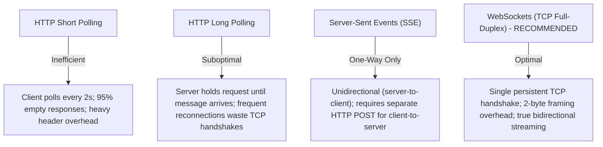
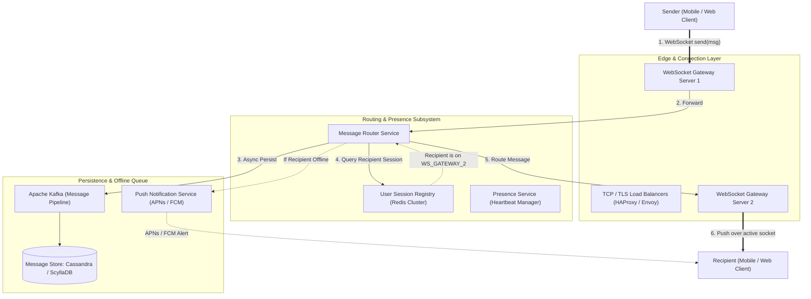

# 03. Design a Real-Time Distributed Chat System (WhatsApp / Slack)

[← Back to Global URL Shortener](./02-design-a-global-url-shortener-tinyurl.md) | [Track Hub](./README.md) | [Next: Design a Distributed Message Queue (Kafka Clone) →](./04-design-a-distributed-message-queue-kafka-clone.md)

---

## 1. Step 1: Requirements & Scope Clarification

A real-time chat system enables instant, bidirectional communication between millions of concurrent users with sub-second delivery, message status tracking, and offline message synchronization.

### Functional Requirements (FR)
1. **1-on-1 Messaging:** Real-time text transmission between two users.
2. **Group Chat:** Multi-user group conversations (up to 500 members).
3. **Delivery Receipts:** Three-state message tracking: `SENT`, `DELIVERED`, and `READ`.
4. **Presence Indicators:** Real-time Online / Offline status and "Last Seen" timestamps.
5. **Offline Storage & Sync:** Offline users receive missed messages automatically upon reconnecting.

### Non-Functional Requirements (NFR)
1. **Ultra-Low Latency:** Real-time message delivery in $< 100\text{ ms}$.
2. **Zero Message Loss (Durability):** Once acknowledged by the server, a message must never be lost.
3. **Strict Message Ordering:** Messages in a chat thread must render in exact chronological order across all participant devices.
4. **Extreme Scale & Concurrency:** Support 500 Million concurrent active connections and 1+ Million messages/second.

---

## 2. Step 2: Back-of-the-Envelope Capacity Estimations

```
  User & Message Traffic Math:
  - Daily Active Users (DAU): 1 Billion users
  - Average messages per user per day: 50 messages
  - Daily Message Volume = 1 Billion * 50 = 50 Billion messages / day
  - Average Message QPS = 50,000,000,000 / 86,400s ≈ 580,000 msg/sec
  - Peak Traffic Multiplier = 2.5x
  - Peak Message QPS = 580,000 * 2.5 ≈ 1,450,000 msg/sec (~1.5 Million QPS)

  Concurrent Connection Sizing:
  - Peak Concurrent Online Users = 500 Million users
  - WebSocket Connection Memory Footprint:
    * OS Socket buffer + JVM thread / Netty channel state ≈ 10 KB per connection
    * Total Connection RAM = 500 Million * 10 KB = 5 Terabytes (TB) of RAM
    * Server Sizing: A 64GB RAM gateway server handles ~50,000 open WebSocket connections.
    * Total Gateway Instances Needed = 500,000,000 / 50,000 ≈ 10,000 gateway servers.

  Storage Math (Text Messages Only):
  - Average text payload: 100 bytes (message text + metadata)
  - Daily Storage = 50 Billion * 100 bytes = 5 Terabytes / day
  - 5-Year Storage = 5 TB/day * 365 * 5 ≈ 9.1 Petabytes (PB)
  - Requires a distributed, horizontally partitionable LSM-Tree database (Cassandra / ScyllaDB).
```

---

## 3. Step 3: Network Protocols & Bidirectional Communication



---

## 4. Step 4: High-Level Architecture & End-to-End Data Flow



---

## 5. Step 5: Deep-Dive Engineering Challenges & Failure Modes

### 1. Monotonic Message Ordering in Distributed Systems
- **The Problem:** Client clocks cannot be trusted (clock drift, malicious manipulation). Server wall-clock timestamps can collide or step backward during NTP synchronization.
- **The Solution:** **Per-Chat Monotonic Sequence Generators**.
  - For each `chat_id`, maintain an atomic counter in Redis: `INCR chat:{chat_id}:sequence_id`.
  - The database primary key pairs `chat_id` with `sequence_id`.
  - When querying chat history, messages are deterministically sorted by `sequence_id` ascending, guaranteeing identical chronological ordering across all participants.

### 2. Database Schema: Why Apache Cassandra / ScyllaDB?
Relational databases collapse under 1.5M QPS write bursts. Cassandra utilizes an **LSM-Tree** (Log-Structured Merge-tree) architecture that performs sequential disk appends:

```sql
CREATE TABLE chat_messages (
    chat_id      UUID,
    message_id   TIMEUUID,          -- Encodes timestamp + monotonic sequence
    sender_id    UUID,
    content      TEXT,
    media_url    TEXT,
    status       TEXT,              -- SENT, DELIVERED, READ
    created_at   TIMESTAMP,
    PRIMARY KEY ((chat_id), message_id)
) WITH CLUSTERING ORDER BY (message_id DESC);
```
- **Partition Key (`chat_id`):** Collocates all messages of a conversation onto the exact same storage nodes.
- **Clustering Key (`message_id`):** Orders messages on disk chronologically, enabling sub-millisecond range reads for pagination (`LIMIT 50`).

### 3. Presence Service & Heartbeat Mechanics
- Maintaining active status for 500M users cannot rely on constant DB writes.
- **Heartbeat Protocol:** Client sends a lightweight ping every 30 seconds over the existing WebSocket connection.
- **In-Memory TTL:** The presence service writes to Redis: `SET presence:{userId} ONLINE EX 45`.
- If no ping arrives within 45 seconds, the key expires, automatically marking the user offline without background sweeps.

---

<div align="center">

| [← Back to Global URL Shortener](./02-design-a-global-url-shortener-tinyurl.md) | [Track Hub: HLD Case Studies](./README.md) | [Next: Design a Distributed Message Queue (Kafka Clone) →](./04-design-a-distributed-message-queue-kafka-clone.md) |
| :--- | :---: | ---: |

</div>
