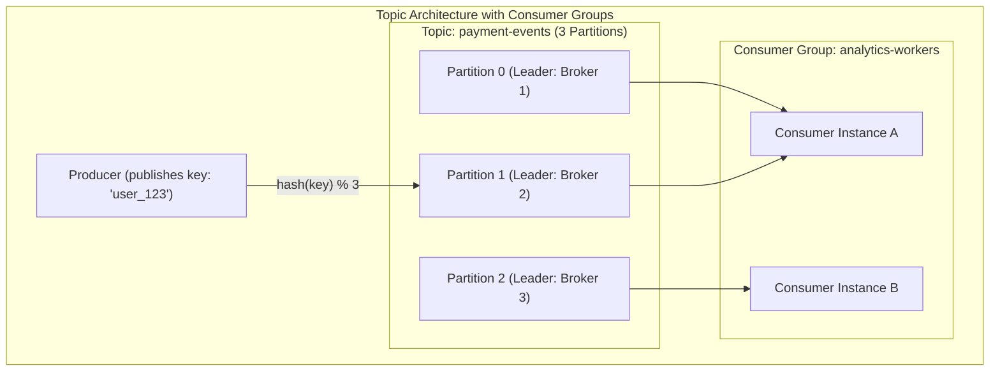
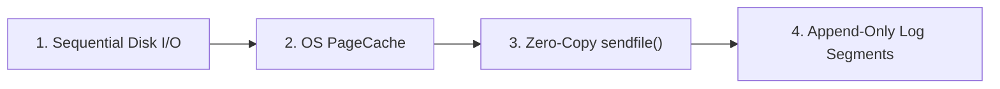
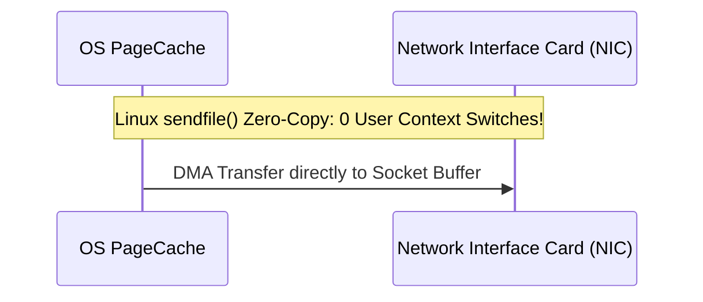
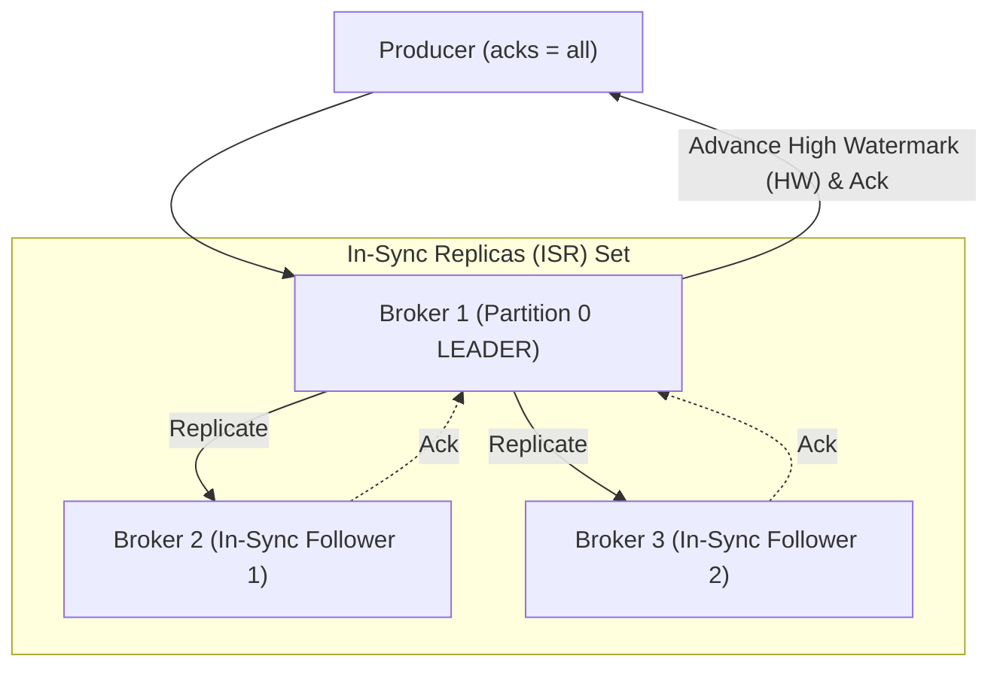

# 04. Design a Distributed Message Queue (Kafka Clone)

[← Back to Real-Time Chat System](./03-design-a-real-time-chat-system-whatsapp-slack.md) | [Track Hub](./README.md) | [Next: Design a Video Streaming Platform (YouTube) →](./05-design-a-video-streaming-platform-youtube-netflix.md)

---

## 1. Step 1: Requirements & Scope Clarification

A Distributed Message Queue provides scalable, decoupled, asynchronous communication between microservices, acting as a persistent event streaming backbone for modern distributed architectures.

### Functional Requirements (FR)
1. **Producer Publishing:** Producers can publish messages to specific named **Topics**.
2. **Consumer Groups:** Multiple consumer instances can form a **Consumer Group** to parallelize consumption across topic partitions.
3. **Offset-Based Replay:** Consumers track their read progress via offsets; consumers can rewind and replay historical messages.
4. **Message Retention:** Messages are preserved on disk for a configurable retention window (e.g., 7 days) regardless of whether they have been consumed.
5. **Partitioning:** Topics are split into multiple partitions for horizontal throughput scaling.

### Non-Functional Requirements (NFR)
1. **Massive Throughput:** Support 1+ Million messages/sec with sustained high write volume.
2. **Sub-10ms Latency:** Low-latency end-to-end event delivery.
3. **Strict Partition Ordering:** FIFO order strictly guaranteed within any single partition.
4. **Fault Tolerance & Durability:** Zero data loss upon broker hardware crashes via multi-replica consensus.

---

## 2. Step 2: Back-of-the-Envelope Capacity Estimations

```
  Throughput & Ingress Math:
  - Daily Ingress Volume = 10 Billion events / day
  - Average Event Size = 1 KB
  - Average Write QPS = 10,000,000,000 / 86,400s ≈ 115,000 msgs/sec
  - Peak Write QPS (3x multiplier) ≈ 350,000 msgs/sec
  - Peak Ingress Bandwidth = 350,000 * 1 KB ≈ 350 MB/sec (2.8 Gbps)

  Storage Calculations (7-Day Retention + 3x Replication):
  - Raw Storage per day = 10 Billion * 1 KB = 10 Terabytes / day
  - Replicated Storage per day (RF = 3) = 10 TB * 3 = 30 Terabytes / day
  - 7-Day Total Storage Footprint = 30 TB * 7 = 210 Terabytes (TB)

  Broker Sizing:
  - Using commodity enterprise storage nodes with 16 TB NVMe drives:
  - Total storage nodes needed = 210 TB / 16 TB ≈ 14 Broker Nodes.
```

---

## 3. Step 3: Core Concepts & Topic Anatomy



- **Partition Ownership Rule:** Within any consumer group, **each partition is consumed by exactly one consumer thread**. If you have 3 partitions and 5 consumers in a group, 2 consumers will sit idle!

---

## 4. Step 4: High-Performance Architecture: Why Kafka Outperforms Traditional Queues

Traditional message brokers (like RabbitMQ) manage active B-tree indices and destructively delete messages immediately upon consumer acknowledgment. This degrades performance to random disk I/O.
A high-throughput distributed log achieves orders-of-magnitude higher scale through **four mechanical engineering pillars**:



### 1. Sequential Disk I/O
Random disk I/O on HDDs or SSDs is bottlenecked by seek times (~100-200 ops/sec). Sequential disk writing operates at linear bus bandwidth speeds ($600+\text{ MB/s}$ on SATA/NVMe), comparable to random RAM access!

### 2. Linux Kernel PageCache (Zero JVM GC Overhead)
Instead of caching messages in JVM heap memory (which triggers massive Garbage Collection pause spikes), messages are written directly to OS PageCache. When consumers read recently published messages, they hit kernel memory without disk seek.

### 3. Linux Zero-Copy System Call (`sendfile`)
In traditional architectures, data travels across 4 context switches and 3 buffer copies:
$$\text{Disk} \to \text{OS PageCache} \to \text{JVM User Memory} \to \text{Socket Buffer} \to \text{NIC}$$

With Linux **Zero-Copy `sendfile()`**, data transfers directly from PageCache to the Network Interface Card (NIC) buffer via DMA (Direct Memory Access):



### 4. Segment Files and Sparse Indices
Each partition directory consists of immutable segment files (e.g. `0000000000.log`, sized at 1GB) paired with a **Sparse Memory-Mapped Index** (`.index`):
- To find offset $10,542$, the broker runs a binary search on the memory-mapped sparse index to locate the nearest physical byte offset, then scans sequentially.

---

## 5. Step 5: Replication, Consensus & Failure Recovery



### High Watermark (HW) vs. Log End Offset (LEO)
- **Log End Offset (LEO):** The offset of the last message written to the leader partition.
- **High Watermark (HW):** The offset of the last message replicated across **all** In-Sync Replicas (ISR).
- **Consumer Isolation Invariant:** Consumers are strictly restricted to reading messages up to the **High Watermark**. Uncommitted messages beyond the HW are never exposed, preventing dirty reads if the leader crashes before replication!

### Consensus: KRaft (Event-Driven Raft Metadata)
Modern distributed message queues eliminate external dependencies like Apache ZooKeeper. Using **KRaft**, metadata logs are stored directly as a specialized internal partition. A quorum of active controller brokers elects an active leader using the Raft consensus algorithm, reducing failover recovery from minutes to milliseconds.

---

<div align="center">

| [← Back to Real-Time Chat System](./03-design-a-real-time-chat-system-whatsapp-slack.md) | [Track Hub: HLD Case Studies](./README.md) | [Next: Design a Video Streaming Platform (YouTube) →](./05-design-a-video-streaming-platform-youtube-netflix.md) |
| :--- | :---: | ---: |

</div>
