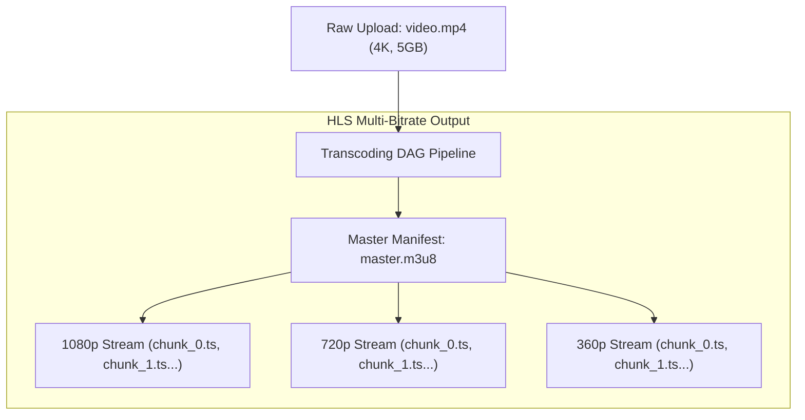
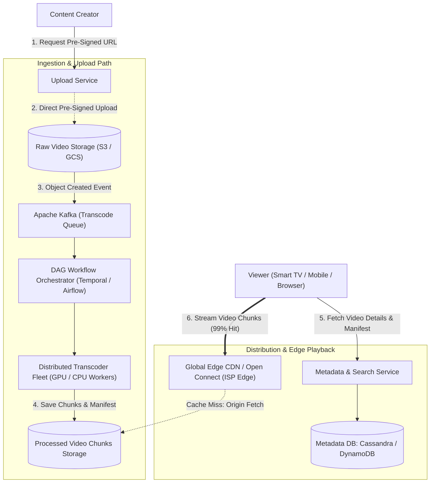

# 05. Design a Video Streaming Platform (YouTube / Netflix)

[← Back to Distributed Message Queue](./04-design-a-distributed-message-queue-kafka-clone.md) | [Track Hub](./README.md) | [Next: Design a Distributed Key-Value Store (Dynamo-Style) →](./06-design-a-distributed-key-value-store-dynamo-style.md)

---

## 1. Step 1: Requirements & Scope Clarification

A video streaming platform enables creators to upload high-definition video assets and serves personalized, adaptive video playback to hundreds of millions of concurrent global viewers with minimal buffering.

### Functional Requirements (FR)
1. **Video Ingestion & Upload:** Creators can upload raw video files in arbitrary formats (MP4, MKV, MOV).
2. **Asynchronous Transcoding:** Transcode raw videos into standard streaming codecs (H.264, VP9, AV1) across multiple resolutions (360p, 720p, 1080p, 4K).
3. **Adaptive Bitrate Streaming (ABR):** Client players smoothly adjust video resolution on-the-fly based on real-time network bandwidth fluctuations.
4. **Metadata & Search:** Viewers can browse video titles, descriptions, view counts, and search by keywords.

### Non-Functional Requirements (NFR)
1. **High Availability (99.99%):** Playback must never experience total system outages.
2. **Instant Playback (Sub-Second Startup):** Time to First Frame (TTFF) should be under $1\text{ second}$.
3. **Low Buffering Rate:** Re-buffering events during video playback must occur in $< 0.5\%$ of sessions.
4. **Cost & Bandwidth Efficiency:** Massive egress traffic ($100+\text{ Tbps}$) must be offloaded to Content Delivery Networks (CDNs) and ISP edge nodes.

---

## 2. Step 2: Back-of-the-Envelope Capacity Estimations

```
  Traffic & Egress Math:
  - Daily Active Users (DAU): 1 Billion users
  - Average viewing time per user: 30 minutes / day
  - Peak Concurrent Viewers: 50 Million simultaneous streams
  - Average Stream Bitrate (1080p/720p blend): 3.0 Mbps
  - Peak Egress Bandwidth = 50 Million * 3.0 Mbps = 150 Terabits/sec (150 Tbps)
  - Critical Insight: 150 Tbps is impossible to serve from central cloud datacenters;
    98%+ of bytes MUST be served from geographically distributed CDN Edge Caches!

  Upload & Ingestion Sizing:
  - Daily Upload Volume: 5 Million videos / day
  - Average raw video size: 300 MB
  - Daily Ingress Storage = 5 Million * 300 MB = 1.5 Petabytes / day
  - Transcoded Multi-Resolution Footprint (~4x raw due to 360p, 720p, 1080p, 4K variants):
    * 1.5 PB * 4 = 6 Petabytes / day
  - 5-Year Storage Footprint = 6 PB/day * 365 * 5 ≈ 11 Exabytes (EB)
  - Requires tiered cold storage: Hot videos on NVMe CDN edge; cold long-tail on S3 Glacier / HDD arrays.
```

---

## 3. Step 3: Adaptive Bitrate Streaming (ABR) Protocols

Traditional progressive MP4 downloads force the user to download a single fixed-resolution file over HTTP. If network bandwidth degrades, playback halts and buffers.
Modern platforms employ **Adaptive Bitrate Streaming (ABR)** via **HLS (HTTP Live Streaming)** or **MPEG-DASH**:



### How Client Players Adjust Resolution Dynamically:
1. Videos are sliced into small, independent **2 to 6-second video chunks** (`.ts` or `.m4s`).
2. The player downloads the master manifest (`.m3u8`), which lists all available bitrates and their chunk URLs.
3. Every 3 seconds, the client player measures its network download speed:
   - If bandwidth $\ge 6\text{ Mbps}$, it requests chunk $k+1$ at **1080p**.
   - If user enters an elevator and bandwidth drops to $800\text{ Kbps}$, it requests chunk $k+2$ at **360p**.
   - The user experiences zero interruption or buffering wheels!

---

## 4. Step 4: High-Level Architecture & End-to-End Workflows



### Direct-to-S3 Pre-Signed URL Ingestion
- Raw videos ($500\text{ MB} - 10\text{ GB}$) must **never** route through backend application servers.
- The creator's client requests a **Pre-Signed Upload URL** from the Upload Service.
- The client streams the video directly to cloud blob storage (S3/GCS) via multi-part upload, eliminating server network bottlenecks.

---

## 5. Step 5: Deep-Dive Transcoding & Content Delivery Optimization

### 1. The Distributed Transcoding DAG Pipeline
Transcoding a 2-hour 4K movie sequentially on a single server can take hours. Modern pipelines split work via a Directed Acyclic Graph (DAG):
1. **Video Splitting:** Slices the raw file at **GOP (Group of Pictures)** boundaries into 10-second segments.
2. **Parallel Encoding:** Hundreds of stateless Spot instances encode individual 10-second segments simultaneously in parallel.
3. **Manifest Synthesis:** When all chunks finish, an aggregator compiles the master playlist manifest (`master.m3u8`).
4. **Watermarking & Thumbnailing:** Asynchronous workers extract frame sprites and generate animated preview GIF thumbnails.

### 2. CDN Edge Topology & ISP Open Connect Appliances
To eliminate global transit costs and latency:
- **Edge POPs (Point of Presence):** Caches the top $10\%$ most popular trending videos in metropolitan edge datacenters within $10\text{ ms}$ of end users.
- **ISP Colocation (e.g. Netflix Open Connect):** Custom storage hardware appliances deployed physically *inside* internet service provider (ISP) datacenters. When a Comcast or Vodafone customer streams a video, bits travel through local ISP routing without crossing internet exchange points.

### 3. Real-Time View Count De-Duplication
- View counters receive millions of increments per minute. Direct database updates cause row lock contention.
- **Aggregation Pipeline:** Client pings an event endpoint after 30 seconds of playback $\to$ Kafka topic $\to$ Apache Flink streaming sliding window aggregator $\to$ Batch updates Redis counter every 10 seconds $\to$ Periodically flushed to primary metadata DB.

---

<div align="center">

| [← Back to Distributed Message Queue](./04-design-a-distributed-message-queue-kafka-clone.md) | [Track Hub: HLD Case Studies](./README.md) | [Next: Design a Distributed Key-Value Store (Dynamo-Style) →](./06-design-a-distributed-key-value-store-dynamo-style.md) |
| :--- | :---: | ---: |

</div>
