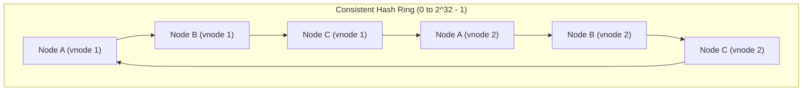
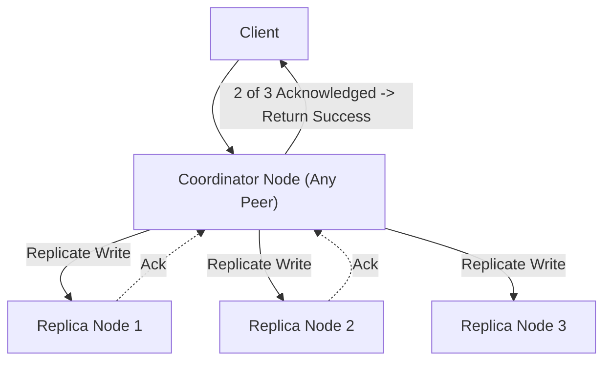
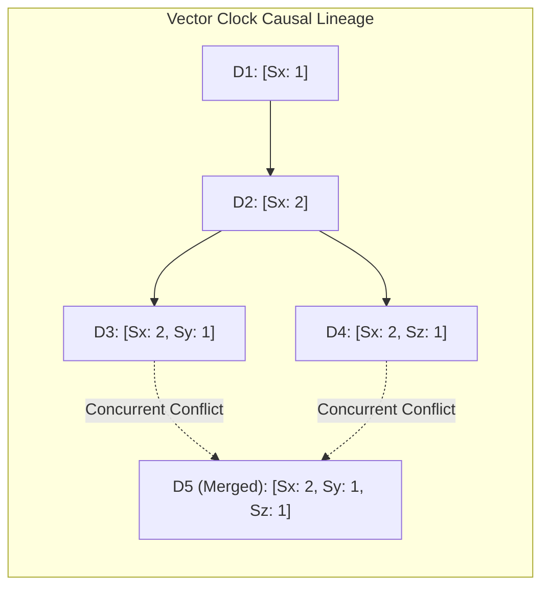

# 06. Design a Distributed Key-Value Store (Dynamo-Style)

[← Back to Video Streaming Platform](./05-design-a-video-streaming-platform-youtube-netflix.md) | [Track Hub](./README.md) | [Next: Real-Time Ride Hailing (Uber/Lyft) →](./07-design-a-real-time-ride-hailing-system-uber-lyft.md)

---

## 1. Step 1: Requirements & Scope Clarification

A Distributed Key-Value Store provides low-latency, horizontally scalable, highly available storage for unstructured or semi-structured data across hundreds of commodity server nodes without a single point of failure (SPOF).

### Functional Requirements (FR)
1. **Core Operations:**
   - `put(key, value)`: Atomically store or update a value associated with a key.
   - `get(key)`: Retrieve the value associated with a key.
2. **Tunable Consistency:** Clients can configure read and write consistency levels per operation ($N, R, W$).
3. **Multi-Data Center Support:** Seamless active-active cross-datacenter replication.

### Non-Functional Requirements (NFR)
1. **Always Writable (High Availability):** The system must accept writes even during node crashes and network partitions (AP in PACELC).
2. **Horizontal Scalability:** Nodes can be dynamically added or removed with zero downtime.
3. **Sub-10ms Latency:** Fast read and write operations at the 99th percentile ($p99$).
4. **Decentralized (Masterless Architecture):** All nodes are functionally identical peer coordinators; zero master bottlenecks.

---

## 2. Step 2: Back-of-the-Envelope Capacity Estimations

```
  Data Sizing:
  - Total Keys Stored: 10 Billion key-value pairs
  - Average Key Size = 64 bytes
  - Average Value Size = 1 KB
  - Raw Storage Footprint = 10 Billion * 1.064 KB ≈ 10.6 Terabytes (TB)
  - Replicated Storage (Replication Factor N = 3) = 10.6 TB * 3 ≈ 32 Terabytes (TB)

  Throughput Math:
  - Peak Write QPS: 100,000 writes / sec
  - Peak Read QPS: 500,000 reads / sec
  - Total Peak Operations = 600,000 ops / sec
  - Cluster Sizing: Commodity node sustains 15,000 ops/sec -> Cluster requires ~40 storage nodes.
```

---

## 3. Step 3: Consistent Hashing & Virtual Nodes (vnodes)

Traditional modulo hashing ($\text{node} = \text{hash}(\text{key}) \pmod N$) invalidates almost all cache keys whenever a node joins or leaves the cluster.
Dynamo utilizes **Consistent Hashing with Virtual Nodes**:



### Why Virtual Nodes (vnodes) are Mandatory:
1. **Hot Spot Prevention:** Without virtual nodes, random hash boundaries create uneven interval spans, causing some nodes to receive $3\times$ more data.
2. **Heterogeneous Hardware:** Powerful servers can be assigned 256 virtual nodes, while smaller servers are assigned 64 virtual nodes.
3. **Smooth Rebalancing:** When a new physical node joins, it acquires a small fraction of virtual token ranges from *every existing node*, parallelizing the data rebalancing network transfer across the entire cluster.

---

## 4. Step 4: Tunable Quorum Consistency ($N, R, W$)



### The Quorum Invariant Formula:
Let:
- $N$ = Replication Factor (Total replicas holding the key, typically $N = 3$).
- $W$ = Write Quorum (Number of replicas that must acknowledge a write before success).
- $R$ = Read Quorum (Number of replicas that must respond to a read query).

$$\mathbf{R + W > N \implies \text{Strong Consistency (Overlapping Quorum)}}$$

- By the **Pigeonhole Principle**, if $R + W > N$, the read quorum and write quorum are guaranteed to intersect by at least one node, ensuring the client always observes the most recent version!

| Configuration | Behavior & Trade-Off | Industry Use Case |
| :---: | :--- | :--- |
| **$W=1, R=N$** | Extremely fast writes; slow reads; weak write durability. | Logging & High-volume telemetry. |
| **$W=N, R=1$** | Fast reads ($1$ node lookup); slow writes (blocked by slowest node). | Read-heavy catalogs. |
| **$N=3, W=2, R=2$** | **Balanced Quorum:** Fast reads and writes, strong consistency, tolerates 1 node failure. | **Production Standard (Cassandra / DynamoDB).** |

---

## 5. Step 5: Versioning, Anti-Entropy & Fault Tolerance



### 1. Vector Clocks for Conflict Resolution
- In masterless systems, concurrent writes to different replicas can occur during network partitions.
- A **Vector Clock** is an array of pairs `(ServerId, Counter)`.
- If Version A dominates Version B across all counters, Version A is a direct descendant.
- If neither dominates, a **sibling conflict** exists. The system stores both siblings and defers conflict reconciliation to the client application (or resolves via Last-Write-Wins using Hybrid Logical Clocks).

### 2. Sloppy Quorum & Hinted Handoff
- If a primary replica node crashes during a write, the coordinator does not fail the request.
- It performs a **Sloppy Quorum**: writes to a temporary healthy peer node with a **"Hint"** attached in metadata.
- When the original node rejoins the cluster, the peer node streams the hinted data back, achieving **$100\%$ write availability** during transient outages.

### 3. Anti-Entropy via Merkle Trees
- To detect background data divergence between replicas without streaming gigabytes of data across the network, each node maintains a hierarchical **Merkle Tree** (hash tree) for its key ranges.
- Nodes exchange only the **root hashes** of their Merkle trees:
  - If root hashes match $\implies$ datasets are identical (0 bytes transferred).
  - If root hashes differ $\implies$ traverse child branches recursively; only the discordant key ranges are synchronized!

---

<div align="center">

| [← Back to Video Streaming Platform](./05-design-a-video-streaming-platform-youtube-netflix.md) | [Track Hub: HLD Case Studies](./README.md) | [Next: Real-Time Ride Hailing (Uber/Lyft) →](./07-design-a-real-time-ride-hailing-system-uber-lyft.md) |
| :--- | :---: | ---: |

</div>
