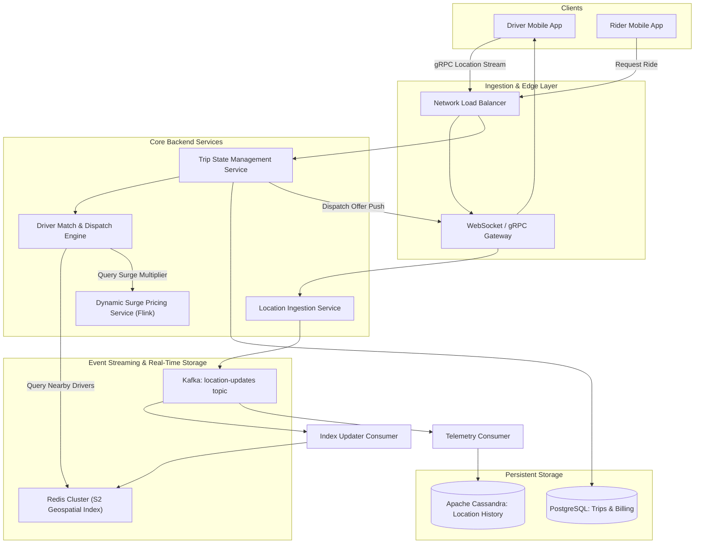
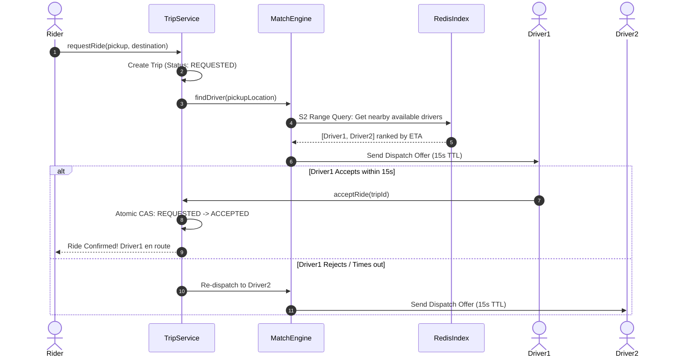

# 07. Design a Real-Time Ride-Hailing System (Uber / Lyft)

[← Back to Distributed KV Store](./06-design-a-distributed-key-value-store-dynamo-style.md) | [Track Hub](./README.md) | [Next: Cloud Storage & Sync Engine (Google Drive) →](./08-design-a-distributed-cloud-storage-and-sync-google-drive-dropbox.md)

---

## 1. Step 1: Requirements & Scope Clarification

A real-time ride-hailing platform dynamically matches riders with nearby available drivers, tracks moving vehicles on a global map, computes optimal routes with estimated time of arrival (ETA), and handles dynamic surge pricing based on local supply and demand.

### Functional Requirements (FR)
1. **Real-Time Driver Location Ingestion:** Active drivers broadcast their GPS location (latitude, longitude) every 4 seconds.
2. **Rider Demand & Nearby Vehicle Discovery:** Riders open their app and see up to 10 available drivers within a 3–5 km radius with real-time movement updates.
3. **Ride Request & Dispatch Matching:** A rider requests a ride; the matching engine identifies the optimal nearby driver (minimizing pickup ETA) and dispatches a trip offer.
4. **Trip Lifecycle State Machine:** Tracking trip transitions (`REQUESTED` $\to$ `ACCEPTED` $\to$ `ARRIVED` $\to$ `IN_TRIP` $\to$ `COMPLETED`).
5. **Dynamic Surge Pricing:** Real-time localized pricing multipliers based on geographic supply-vs-demand imbalances.

### Non-Functional Requirements (NFR)
1. **Ultra-Low Latency:** Driver location updates processed in $< 200\text{ ms}$; matching dispatched in $< 1\text{ s}$.
2. **High Availability:** 99.99% availability ($< 52\text{ minutes}$ downtime/year); location tracking must not stall.
3. **Strict Concurrency Safety:** A driver must never be double-assigned to two distinct riders simultaneously.
4. **Durability & Traceability:** Financial transactions and completed trip routes must be durably persisted for billing and audit compliance.

---

## 2. Step 2: Back-of-the-Envelope Capacity Estimations

```
  Active Scale:
  - Total Registered Riders: 100 Million
  - Daily Active Drivers (Peak): 1 Million concurrent drivers
  - Daily Active Trips: 20 Million rides / day
  
  Throughput Calculations:
  - Driver Location Broadcast: Every 4 seconds per active driver
  - Ingestion Write QPS = 1,000,000 drivers / 4 s = 250,000 location updates / sec
  - Peak Write QPS (2x buffer) = 500,000 QPS
  - Rider Search Read QPS = 50,000 searches / sec
  
  Bandwidth & Storage Math:
  - Location Payload = {driver_id: 8B, lat: 8B, lng: 8B, timestamp: 8B, status: 4B} ≈ 36 bytes (HTTP/gRPC envelope ≈ 100 bytes)
  - Ingestion Bandwidth = 500,000 QPS * 100 bytes ≈ 50 MB/sec (400 Mbps)
  - Daily Ingestion Volume = 250,000 updates/s * 36B * 86,400s ≈ 777 GB raw location data / day
  - Real-Time Geospatial Index Footprint (1M active drivers) ≈ 1M * 64B ≈ 64 MB (Fits entirely in L3/RAM!)
```

---

## 3. Step 3: Geospatial Indexing: Geohash vs. Google S2 vs. QuadTree

Relational databases with standard B-Tree indexes cannot efficiently query 2D geographic coordinates (`WHERE lat BETWEEN ... AND lng BETWEEN ...` requires a slow 2D index scan). We must map 2D spherical coordinates into a 1D indexable key.

```
╭───────────────────────────────────────────────────────────────────────────────────────────╮
│                            GEOSPATIAL INDEXING COMPARISON                                 │
├────────────────────┬──────────────────────┬──────────────────────┬────────────────────────┤
│ Technology         │ Spatial Model        │ Boundary Shape       │ Production Champion    │
├────────────────────┼──────────────────────┼──────────────────────┼────────────────────────┤
│ QuadTree           │ 2D Hierarchical Tree │ Dynamic Rectangles   │ In-memory custom tree  │
│ Geohash            │ Z-order Space Curve  │ Bounding Box Rects   │ Elastic / Redis GEO    │
│ Google S2 Geometry │ Hilbert Space Curve  │ Spherical Cells      │ Uber / Google Maps     │
╰────────────────────┴──────────────────────┴──────────────────────┴────────────────────────╯
```


### 3.1 Why Uber Uses Google S2 (Hilbert Curve) Over Geohash
- **Hilbert Curve Locality**: Points close to each other on the 2D surface remain adjacent in the 1D Hilbert index with far higher probability than Geohash's Z-order curve.
- **Uniform Cell Area**: S2 projects the Earth onto a cube with minimal distortion across poles and the equator.
- **Hierarchical Indexing**: A 64-bit integer represents cells from Earth level (Level 0) down to sub-centimeter accuracy (Level 30). Level 12–14 cells perfectly encapsulate ride pickup zones.

---

## 4. Step 4: High-Level End-to-End System Architecture



---

## 5. Step 5: Driver-Rider Matching Engine & Atomic Dispatch

To prevent race conditions where multiple drivers receive or accept the same trip simultaneously, dispatching uses **optimistic locking with atomic state transitions**:



### 5.1 Atomic Acceptance Lock in Redis
```lua
-- Atomic Driver Assignment Lua Script in Redis
local driverKey = "driver:" .. KEYS[1] .. ":status"
local tripKey = "trip:" .. KEYS[2] .. ":status"

local currentStatus = redis.call("GET", driverKey)
local tripStatus = redis.call("GET", tripKey)

if currentStatus == "AVAILABLE" and tripStatus == "REQUESTED" then
    redis.call("SET", driverKey, "ASSIGNED")
    redis.call("SET", tripKey, "ACCEPTED")
    return 1 -- Success
else
    return 0 -- Conflict / Already taken
end
```

---

## 6. Step 6: Dynamic Surge Pricing Architecture

Surge pricing balances real-time local supply and demand:
1. **Spatial Aggregation via S2 Cells**: Group incoming ride requests and active available drivers into **S2 Level 8/10 cells** (~2–5 km²).
2. **Streaming Windows (Apache Flink)**:
   - Compute sliding 5-minute ratio:
     $$\text{Surge Ratio} = \frac{\text{Demand (Riders requesting)}}{\text{Supply (Available Drivers in Cell)}}$$
   - If Ratio $\le 1.0 \implies \text{Multiplier } = 1.0\times$.
   - If Ratio $> 1.5 \implies \text{Multiplier } = 1.5\times$ to $3.0\times$.
3. **Anti-Gaming Guards**: Surge multipliers are smoothed across adjacent S2 cells using Gaussian spatial blurring to prevent drivers from lingering on cell borders.

---

## 7. Step 7: Deep Dives & Bottlenecks

### 7.1 Handling Network Disconnections Mid-Trip
- If driver app loses cellular connectivity, the mobile client buffers GPS breadcrumbs locally in SQLite.
- Upon reconnection, the driver app flushes the breadcrumb stream. The Trip Service detects the monotonic sequence, reconstructs the actual traveled route, and recalculates the final fare.

### 7.2 Minimizing Battery & Cellular Drain on Mobile Clients
- Adaptive polling: When the vehicle is stopped at a traffic light (speed $\approx 0$), transmission frequency reduces from 4 seconds to 10 seconds.
- Binary Protocol Buffers over HTTP/2 (gRPC) reduces mobile bandwidth consumption by 65% compared to JSON over HTTP/1.1.

---

<div align="center">

| [← Back to Distributed KV Store](./06-design-a-distributed-key-value-store-dynamo-style.md) | [Track Hub: HLD](./README.md) | [Next: Cloud Storage & Sync Engine (Google Drive) →](./08-design-a-distributed-cloud-storage-and-sync-google-drive-dropbox.md) |
| :--- | :---: | ---: |

</div>
