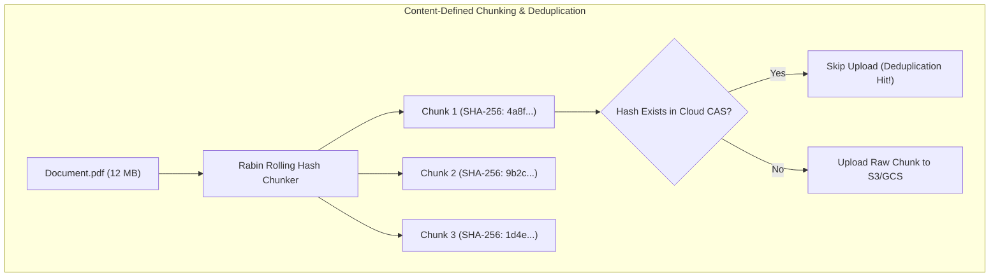
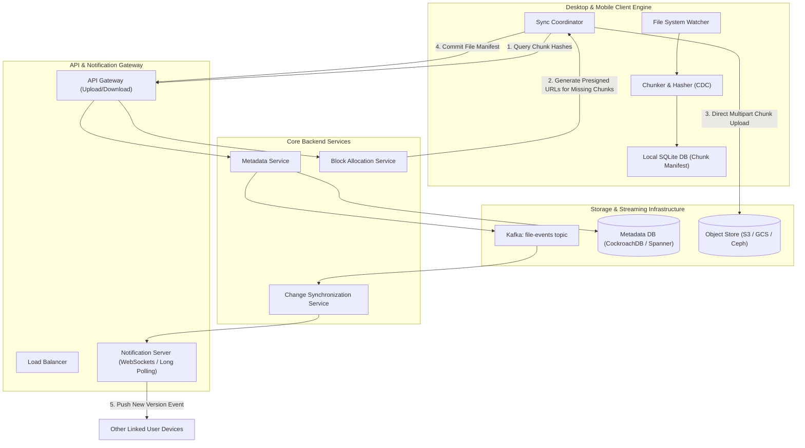

# 08. Design a Distributed Cloud Storage & Sync Engine (Google Drive / Dropbox)

[← Back to Ride-Hailing System](./07-design-a-real-time-ride-hailing-system-uber-lyft.md) | [Track Hub](./README.md) | [Next: E-Commerce Flash Sale & Inventory →](./09-design-an-ecommerce-flash-sale-and-inventory-system.md)

---

## 1. Step 1: Requirements & Scope Clarification

A distributed cloud storage and synchronization service allows users to store files securely in the cloud, synchronize modifications seamlessly across multiple devices (desktop, mobile, web), maintain file revision histories, and share documents with fine-grained access permissions.

### Functional Requirements (FR)
1. **File Upload & Download:** Users can upload and download files of arbitrary sizes (from 1 KB text files to 10 GB videos).
2. **Cross-Device File Synchronization:** Any edit made on one device must automatically synchronize to all other linked devices in near real-time ($< 3\text{ seconds}$).
3. **Differential Sync (Delta Transmission):** When a file is modified, only the changed blocks/chunks must be uploaded and downloaded, never the entire file.
4. **File Versioning & Revision History:** Users can inspect past versions and rollback up to 30 days.
5. **Offline Support & Conflict Resolution:** Users can modify files offline; conflicts must be detected and preserved without silent data loss.

### Non-Functional Requirements (NFR)
1. **Extreme Durability:** 99.999999999% (11 9's) durability—files must never be lost.
2. **Strong Consistency for Metadata:** Directory listings and file versions must be strictly consistent across devices.
3. **Bandwidth Optimization:** Global deduplication and compression to minimize mobile/desktop bandwidth.
4. **End-to-End Security:** Zero-knowledge client-side encryption option, AES-256 at rest, TLS 1.3 in transit.

---

## 2. Step 2: Back-of-the-Envelope Capacity Estimations

```
  User & Storage Scale:
  - Registered Users: 500 Million
  - Daily Active Users (DAU): 100 Million
  - Average Files per User: 200 files
  - Total Files Stored: 100 Billion files
  - Average File Size: 500 KB (Text/Docs) to 50 MB (Media) -> Weighted Average ≈ 2 MB
  - Total Raw Storage Volume = 100 Billion * 2 MB = 200 Petabytes (PB)
  - With 60% Deduplication Ratio -> Effective Storage Volume ≈ 80 PB
  
  Throughput & Bandwidth Math:
  - Daily File Modification / Upload Events = 50 Million files / day
  - Upload QPS = 50,000,000 / 86,400s ≈ 600 uploads / sec (Peak ≈ 1,500 QPS)
  - Daily Sync Notifications = 200 Million sync events / day
  - Ingress Bandwidth (average delta chunk = 512 KB):
    1,500 QPS * 512 KB ≈ 768 MB/sec (~6.1 Gbps network ingress)
```

---

## 3. Step 3: File Chunking & Content-Addressable Storage (CAS)

Uploading large monolithic files causes network retries on packet loss and wastes massive bandwidth on minor edits.

```
╭───────────────────────────────────────────────────────────────────────────────────────────╮
│                                  CHUNKING PARADIGMS                                       │
├────────────────────┬──────────────────────┬──────────────────────┬────────────────────────┤
│ Strategy           │ Splitting Rule       │ Minor Mid-File Edit  │ Production Champion    │
├────────────────────┼──────────────────────┼──────────────────────┼────────────────────────┤
│ Fixed-Size (4MB)   │ Strict 4MB offsets   │ Shifts all hashes    │ Simple, low CPU        │
│ Content-Defined    │ Rabin Fingerprint /  │ Only 1-2 chunks shift│ Dropbox, FastCDC,      │
│ Chunking (CDC)     │ Rolling Hash Window  │ Remaining hashes stay│ Git LFS, rsync         │
╰────────────────────┴──────────────────────┴──────────────────────┴────────────────────────╯
```



---

## 4. Step 4: High-Level End-to-End System Architecture



---

## 5. Step 5: Metadata Database Schema & Sharding

File hierarchies, permissions, and chunk manifests require **ACID transactions** to prevent orphan chunks or corrupted directory structures.

```sql
-- 1. Files & Directories Metadata Table
CREATE TABLE files (
    file_id UUID PRIMARY KEY,
    user_id UUID NOT NULL,
    parent_folder_id UUID REFERENCES files(file_id),
    file_name VARCHAR(255) NOT NULL,
    is_directory BOOLEAN NOT NULL DEFAULT FALSE,
    version_id BIGINT NOT NULL DEFAULT 1,
    size_bytes BIGINT NOT NULL,
    created_at TIMESTAMP WITH TIME ZONE DEFAULT NOW(),
    updated_at TIMESTAMP WITH TIME ZONE DEFAULT NOW(),
    CONSTRAINT uk_user_parent_name UNIQUE (user_id, parent_folder_id, file_name)
);

-- 2. Global Content-Addressable Chunks (Deduplicated across all users)
CREATE TABLE chunks (
    chunk_hash BYTEA PRIMARY KEY, -- SHA-256 (32 bytes)
    size_bytes INT NOT NULL,
    storage_path VARCHAR(512) NOT NULL,
    reference_count INT NOT NULL DEFAULT 1
);

-- 3. File Recipe / Manifest (Order of chunks assembling a file version)
CREATE TABLE file_chunks (
    file_id UUID NOT NULL,
    version_id BIGINT NOT NULL,
    chunk_order INT NOT NULL,
    chunk_hash BYTEA NOT NULL REFERENCES chunks(chunk_hash),
    PRIMARY KEY (file_id, version_id, chunk_order)
);
```

### 5.1 Database Sharding Strategy
- **Sharding Key**: `user_id`.
- All files, directory trees, and versions owned by a single user reside in the exact same physical database shard. Directory traversal (`ls`, `cd`, rename) executes within a single database partition with zero distributed joins.

---

## 6. Step 6: Differential Synchronization & Conflict Resolution

### 6.1 The Sync Sequence (Step-by-Step)
1. **Local Mutation**: User modifies a 100 MB file by editing 3 paragraphs.
2. **Chunk Re-computation**: The local client computes CDC chunks. 98 chunks yield identical SHA-256 hashes; only 2 chunks yield new hashes.
3. **Hash Pre-Flight**: Client queries `POST /chunks/check` sending the 2 new hashes.
4. **Presigned Upload**: Backend identifies 1 hash already exists globally in CAS (skip!); returns a presigned S3 upload URL for the remaining 1 chunk.
5. **Manifest Commit**: Client uploads the single 4MB chunk directly to S3, then commits the new version manifest to the Metadata Service.
6. **Fanout Push**: The Notification Service pushes the new manifest event to the user's other linked devices via active WebSocket connections.

### 6.2 Offline Conflict Resolution
If Device A and Device B both modify `document.docx` while offline:
- Device A reconnects first: Version increments from $V_1 \to V_2$. Commit succeeds.
- Device B reconnects later: Device B attempts to update from $V_1 \to V_2$. The database detects an optimistic concurrency violation:
  $$\text{WHERE file\_id} = \text{X AND version\_id} = 1 \implies 0 \text{ rows updated}$$
- **Resolution**: The backend accepts Device B's file but renames it to:
  `document (Device B's conflicted copy 2026-09-24).docx`
  Zero data is silently overwritten or lost.

---

## 7. Step 7: Deep Dives & Resilience

### 7.1 Resumable Multipart Chunk Uploads
For massive files, clients upload individual chunks in parallel over multiple TCP streams. If cellular connection drops at 90%, only the incomplete chunk is retried upon reconnection.

### 7.2 Zero-Knowledge Privacy Architecture
For privacy-focused enterprise tiers, chunk encryption is performed client-side using a key derived from the user's master passphrase via PBKDF2 / Argon2. The cloud provider only ever sees encrypted blobs and hashes; even if the physical object storage is compromised, files remain completely indecipherable.

---

<div align="center">

| [← Back to Ride-Hailing System](./07-design-a-real-time-ride-hailing-system-uber-lyft.md) | [Track Hub: HLD](./README.md) | [Next: E-Commerce Flash Sale & Inventory →](./09-design-an-ecommerce-flash-sale-and-inventory-system.md) |
| :--- | :---: | ---: |

</div>
