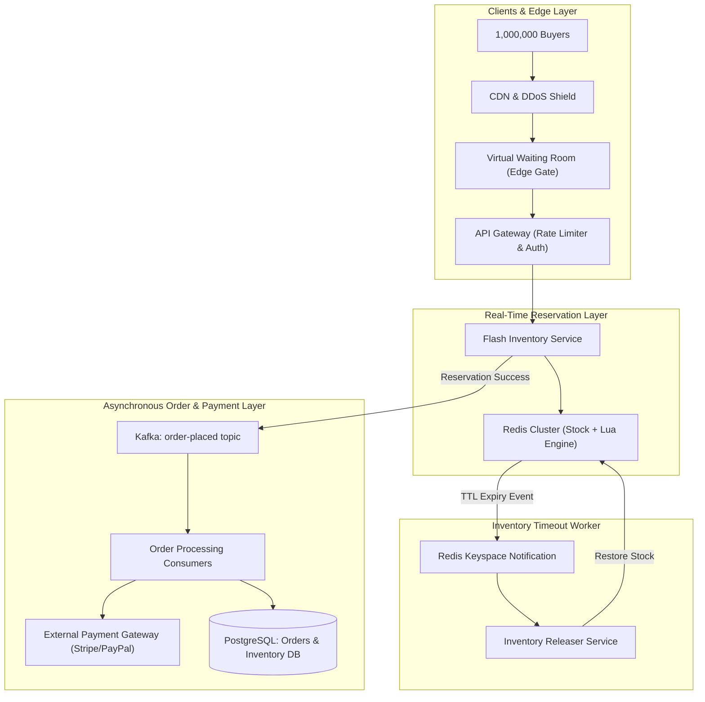
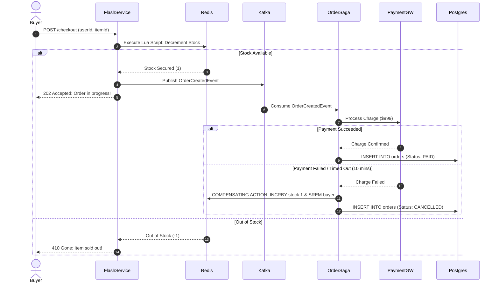

# 09. Design an E-Commerce Flash Sale & Inventory System

[← Back to Cloud Storage & Sync Engine](./08-design-a-distributed-cloud-storage-and-sync-google-drive-dropbox.md) | [Track Hub](./README.md) | [Next: Design a Distributed Web Crawler →](./10-design-a-distributed-web-crawler-google-search.md)

---

## 1. Step 1: Requirements & Scope Clarification

A flash sale system sells a severely constrained inventory (e.g., 1,000 flagship smartphones or concert tickets) to a massive surge of concurrent buyers (e.g., 1,000,000 active users) within seconds of sale opening.

### Functional Requirements (FR)
1. **Flash Sale Countdown & Catalog:** Users view product details and a live countdown to the sale start.
2. **Atomic Inventory Reservation:** Users click "Buy Now"; stock is decremented atomically without overselling.
3. **Timed Reservation Window:** Users have 10 minutes to complete payment; if unpaid, reserved inventory is automatically released back to the pool.
4. **Order Placement & Payment:** Secure credit card/wallet processing via payment gateways.
5. **Idempotent Order Creation:** Multiple rapid clicks or network retries must never result in duplicate orders or double billing.

### Non-Functional Requirements (NFR)
1. **Zero Overselling (Strict Consistency):** The system must **never** sell more items than physical stock (hard inventory invariant).
2. **Extreme Concurrency Resilience:** Absorb up to **1,000,000 QPS** at $T = 0$ without service degradation or database crashing.
3. **Sub-50ms Reservation Latency:** Immediate feedback to users on whether they secured an item.
4. **Graceful Degradation:** Once stock reaches 0, reject incoming traffic immediately at the edge without touching backend databases.

---

## 2. Step 2: Back-of-the-Envelope Capacity Estimations

```
  Inventory & Scale Metrics:
  - Total Available Stock: 1,000 units
  - Concurrent Waiting Users: 1,000,000 users
  - Peak Ingress QPS at T = 0: 1,000,000 requests / sec
  - Payment Completion Window: 10 minutes (600 seconds)
  
  Why Relational Databases Crash Under Flash Sales:
  - Standard SQL: UPDATE items SET stock = stock - 1 WHERE id = 1 AND stock > 0;
  - 1,000,000 concurrent threads competing for the exact same database row lock!
  - Row lock contention causes thread pool starvation, transaction rollbacks, connection
    timeouts, and CPU saturation at 100%. A relational database collapses at ~5,000 QPS.
  - Solution: In-memory atomic reservation (Redis Lua) + Asynchronous queue decoupling (Kafka).
```

---

## 3. Step 3: Multi-Tier Traffic Shaping & Edge Defense

```
+─────────────────────────────────────────────────────────────+
|               MULTI-TIER FLASH SALE TRAFFIC SHAPING         |
|                                                             |
|  1. Global CDN (Cloudflare / Fastly)                        |
|     - Caches static product HTML, CSS, images, and JS.      |
|     - Absorbs 95% of read bandwidth off origin servers.     |
|  ├───────────────────────────────────────────────────────┤  |
|  2. Virtual Waiting Room (Edge Token Bucket)                |
|     - Throttles ingress: grants cryptographically signed    |
|       checkout tokens to users in batches.                  |
|  ├───────────────────────────────────────────────────────┤  |
|  3. API Gateway Rate Limiting                               |
|     - Blocks bots, scrapers, and IP spam (1 req / 5s / user)|
|  ├───────────────────────────────────────────────────────┤  |
|  4. In-Memory Atomic Reservation (Redis Cluster)            |
|     - Single-threaded event loop processes 100k+ ops/sec    |
|     - Executes Lua script: checks stock, decrements in RAM. |
|  ├───────────────────────────────────────────────────────┤  |
|  5. Asynchronous Order Buffer (Kafka)                       |
|     - Smooths traffic to downstream relational DB at 2k QPS |
+─────────────────────────────────────────────────────────────+
```

---

## 4. Step 4: High-Level End-to-End System Architecture



---

## 5. Step 5: Atomic Inventory Decrement via Redis Lua Scripts

Because Redis executes Lua scripts in a **single-threaded, atomic event loop**, no two operations can interleave during execution. This guarantees zero race conditions and zero overselling.

```lua
-- Atomic Stock Reservation Lua Script in Redis
-- KEYS[1]: item_stock_key (e.g., "item:101:stock")
-- KEYS[2]: user_orders_set (e.g., "item:101:buyers")
-- ARGV[1]: user_id
-- ARGV[2]: quantity (e.g., 1)

local stock = tonumber(redis.call("GET", KEYS[1]))
if not stock or stock <= 0 then
    return -1 -- Error: Out of Stock
end

-- Prevent duplicate reservations by the same user
if redis.call("SISMEMBER", KEYS[2], ARGV[1]) == 1 then
    return -2 -- Error: User already reserved an item
end

local quantity = tonumber(ARGV[2])
if stock < quantity then
    return -3 -- Error: Insufficient stock
end

-- Decrement stock and record user reservation atomically
redis.call("DECRBY", KEYS[1], quantity)
redis.call("SADD", KEYS[2], ARGV[1])

return 1 -- Success: Stock successfully secured!
```

---

## 6. Step 6: Distributed Transaction: The Orchestrated Saga Pattern

Because stock reservation resides in Redis while payments and final orders reside in external systems and PostgreSQL, a distributed transaction is required. We deploy an **Orchestrated Saga** with compensating transactions:



---

## 7. Step 7: Zero-Defect Idempotency & Database Integrity

To guarantee that network retries or double clicks never duplicate an order or charge a customer twice:
1. **Client-Generated Idempotency Key**: Every checkout request generates a unique UUID `Idempotency-Key: e82d3...` in the HTTP header.
2. **Database Unique Constraint**:
   ```sql
   CREATE TABLE orders (
       order_id UUID PRIMARY KEY,
       idempotency_key VARCHAR(64) NOT NULL UNIQUE,
       user_id UUID NOT NULL,
       item_id UUID NOT NULL,
       amount_cents INT NOT NULL,
       status VARCHAR(32) NOT NULL,
       created_at TIMESTAMP WITH TIME ZONE DEFAULT NOW()
   );
   ```
3. If an identical `idempotency_key` is submitted, PostgreSQL throws a unique constraint violation (`23505`). The application catches the exception and returns the existing order details immediately without re-triggering payments.

---

## 8. Step 8: Deep Dives & Bottlenecks

### 8.1 Warm-Up & Cache Priming
Before the sale begins at 10:00:00 AM, the stock count (1,000) and product metadata are pre-warmed across all Redis master shards. Database connection pools and JVMs are pre-warmed to prevent cold-start JIT compilation latency.

### 8.2 Failure of the Redis Master Node
- Redis clusters utilize **Master-Replica with Sentinel / Raft consensus**.
- In the event of a master failure, replica promotion takes $< 2\text{ seconds}$. During failover, the API Gateway buffers incoming checkout attempts in local memory for up to 3 seconds before serving retries.

---

<div align="center">

| [← Back to Cloud Storage & Sync Engine](./08-design-a-distributed-cloud-storage-and-sync-google-drive-dropbox.md) | [Track Hub: HLD](./README.md) | [Next: Design a Distributed Web Crawler →](./10-design-a-distributed-web-crawler-google-search.md) |
| :--- | :---: | ---: |

</div>
