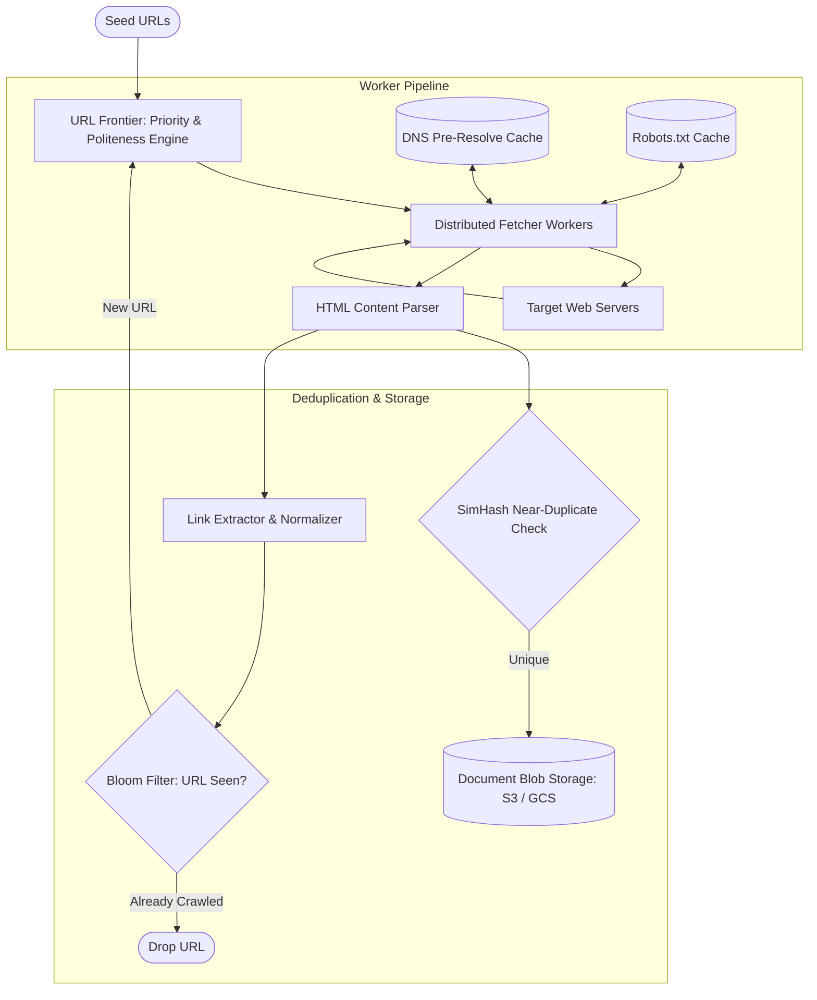
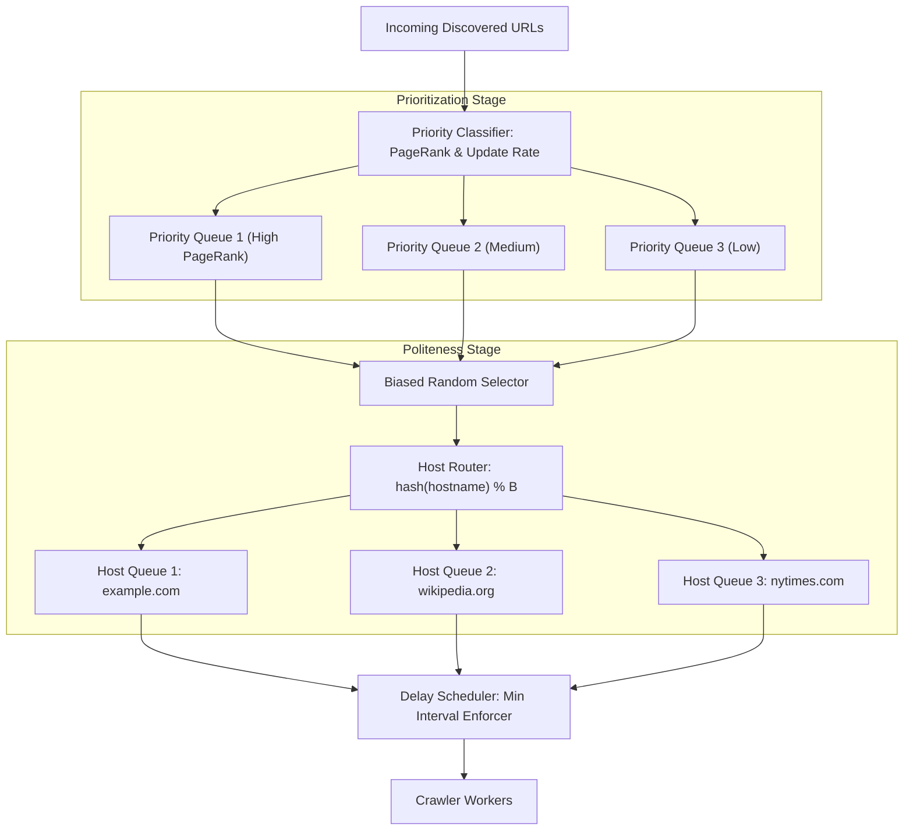

# 10. Design a Distributed Web Crawler (Google Search)

[← Back to Flash Sale & Inventory System](./09-design-an-ecommerce-flash-sale-and-inventory-system.md) | [Track Hub](./README.md) | [Next: Design a Distributed Metrics System →](./11-design-a-distributed-metrics-and-telemetry-system-datadog.md)

---

## 🏛️ 1. Requirements & System Scope

A distributed web crawler systematically browses the World Wide Web to fetch, parse, and store web documents for search engine indexing, link extraction, and web archiving.

### 1.1 Functional Requirements
1. **Scalable Crawling:** Discover and download billions of web pages starting from a designated seed list of URLs.
2. **Link Extraction & Frontier Management:** Parse downloaded HTML documents, extract hyperlinks, and schedule newly discovered URLs into the URL Frontier.
3. **Politeness Guarantees:** Strictly respect `robots.txt` specifications and never overload any target web host with concurrent requests (minimum inter-request delay per host).
4. **Duplicate Filtering:** Detect and discard previously crawled URLs and near-duplicate HTML content (mirror sites, canonical URLs).
5. **Extensibility:** Modular architecture capable of supporting diverse content types (HTML, PDF, Images, Video metadata).

### 1.2 Non-Functional Requirements
- **High Scalability:** Capable of crawling $1\text{ Billion}$ web pages per month (~400 pages/sec continuous, burstable to 1,500 pages/sec).
- **Fault Tolerance:** Distributed worker failures must not crash the crawl; URLs must be safely re-queued via dead-letter queues.
- **Robustness Against Traps:** Automatic detection of infinite spider traps (e.g. dynamic calendar links `/calendar/2026/09/25/...`).
- **Low DNS Latency:** Custom DNS pre-resolution caching to bypass external DNS resolver latency bottlenecks.

---

## 🔢 2. Capacity & Scale Estimations

```
╭───────────────────────────────────────────────────────────────────────────────────────────╮
│                              BACK-OF-THE-ENVELOPE SCALE MATH                              │
├───────────────────────────────┬───────────────────────────────┬───────────────────────────┤
│ Metric                        │ Raw Value                     │ Engineering Shorthand     │
├───────────────────────────────┼───────────────────────────────┼───────────────────────────┤
│ Crawl Target Volume           │ 1 Billion pages / month       │ ~400 pages / second       │
│ Peak Crawl Throughput         │ 3x Average                    │ ~1,200 pages / second     │
│ Average HTML Page Size        │ 100 KB                        │ 100 KB                    │
│ Network Ingress Bandwidth     │ 400 pages/s × 100 KB          │ 40 MB/s (320 Mbps)        │
│ Monthly Storage Accumulation  │ 1 Billion × 100 KB            │ 100 TB / month (1.2 PB/yr)│
│ URL Storage Footprint         │ 1 Billion × 100 bytes         │ 100 GB / month            │
│ Bloom Filter RAM for URLs     │ 10 Billion bits (1% FPR)      │ ~1.2 GB RAM (negligible)  │
╰───────────────────────────────┴───────────────────────────────┴───────────────────────────╯
```

---

## 🏗️ 3. High-Level Architecture



---

## ⚙️ 4. The URL Frontier: Politeness & Prioritization Architecture

The central engine of a production crawler is the **URL Frontier**. It resolves two conflicting requirements:
1. **Politeness:** Never hit the same domain (e.g. `example.com`) faster than its configured threshold (e.g., 1 request per 500ms).
2. **Prioritization:** Always crawl high-value, fast-updating pages (e.g., CNN, Wikipedia) before low-value spam domains.



### 4.1 Queue Mapping Algorithms
- **Priority Stage:** $F$ front-queues. A machine-learning classifier inspects domain authority, historical PageRank, and refresh cadence, routing URLs into priority bands.
- **Politeness Stage:** $B$ back-queues. All URLs for a given hostname are strictly routed to the **same back-queue** via `hash(hostname) % B`. A thread-safe `DelayScheduler` tracks the timestamp of the last fetch per host. A queue is only eligible to pop if $\text{currentTime} - \text{lastFetchTime} \ge \text{delay}$.

---

## 🔍 5. Deduplication: Bloom Filters & SimHash

### 5.1 URL Deduplication via Scalable Bloom Filters
Before an extracted URL is inserted into the Frontier, it must be verified against the global set of crawled URLs:
- Storing 5 Billion URLs in a hash set requires $\approx 500\text{ GB}$ of RAM.
- A **Bloom Filter** with $n = 5\times 10^9$, false positive probability $p = 0.01$ (1%), and $k = 7$ hash functions requires:
  $$m = -\frac{n \ln p}{(\ln 2)^2} \approx 4.8\times 10^{10}\text{ bits} \approx 6.0\text{ GB RAM}$$
- A 6 GB Bloom filter fits comfortably in a single Redis instance, providing sub-millisecond membership verification.

### 5.2 Content Deduplication via 64-bit SimHash
Many web pages have identical text with different URLs (affiliate tags, parameters, mirror sites). Traditional MD5/SHA256 hashes fail because a single space or timestamp changes the entire hash.

**SimHash (Locality-Sensitive Hashing):**
1. Tokenize document into features (words) and compute standard 64-bit hashes for each word.
2. Maintain a 64-dimensional vector $V$, initialized to zeroes.
3. For each word hash bit: if bit is $1$, add weight $w$; if $0$, subtract weight $w$.
4. Generate final 64-bit SimHash: if $V[i] > 0$, bit $i = 1$; else $0$.
5. If the **Hamming Distance** between two document SimHashes is $\le 3$, the documents are deemed near-duplicates.

---

## 🛡️ 6. Edge Cases & Resilience Mechanisms

| Failure Mode / Edge Case | System Impact | Architectural Mitigation |
| :--- | :--- | :--- |
| **Spider Traps / Infinite Loops** | Infinite URL generation (`/dir1/dir2/dir1/...`) fills frontier | Max path depth limit ($D \le 16$), URL string length limit ($\le 256$ chars), and repetition cycle detection via regex. |
| **Slow Server / Tarpits** | Malicious servers stream 1 byte every 10 seconds, hanging worker threads | Strict connection timeout (5s) and read timeout (10s); abort immediately if content exceeds $10\text{ MB}$. |
| **DNS Resolution Bottleneck** | DNS queries add 50–200ms per request, choking 400 QPS crawl | Dedicated in-memory DNS cache (e.g. CoreDNS / Unbound) pre-resolving IP blocks and refreshing asynchronously. |
| **Robots.txt Thrashing** | Fetching `robots.txt` before every URL creates 2x network traffic | In-memory Redis cache for parsed `robots.txt` rules with a 24-hour TTL; fallback to open if host unreachable. |

---

<div align="center">

| [← Back to Flash Sale & Inventory System](./09-design-an-ecommerce-flash-sale-and-inventory-system.md) | [Track Hub: HLD](./README.md) | [Next: Design a Distributed Metrics System →](./11-design-a-distributed-metrics-and-telemetry-system-datadog.md) |
| :--- | :---: | ---: |

</div>
