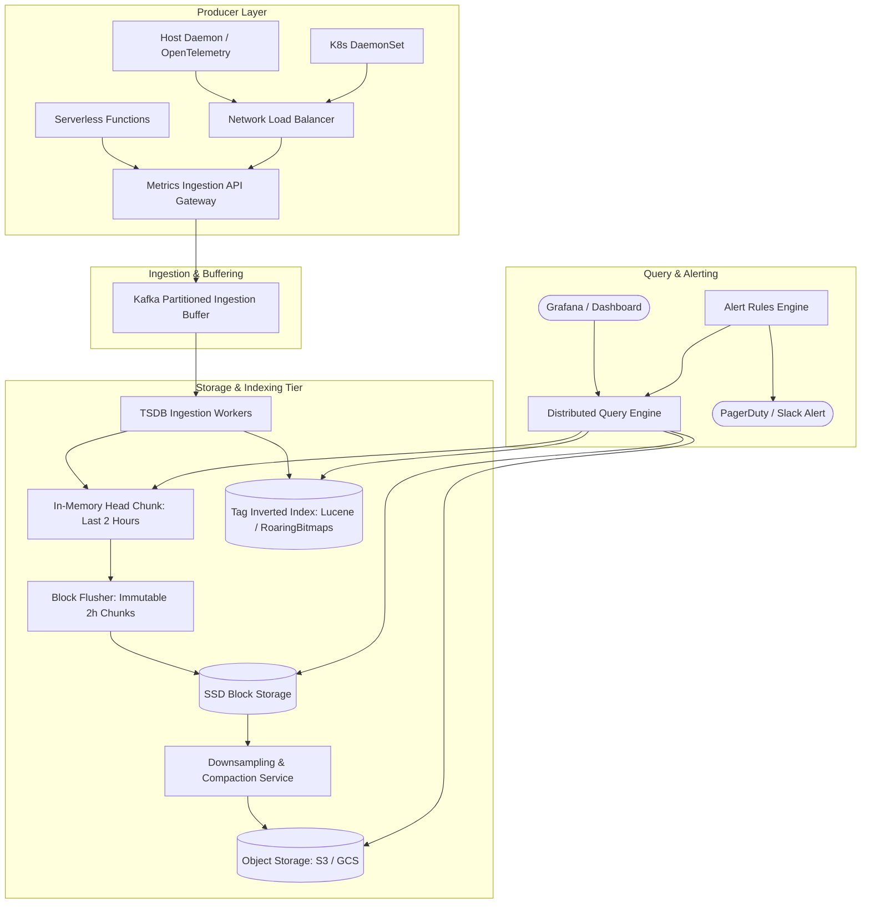
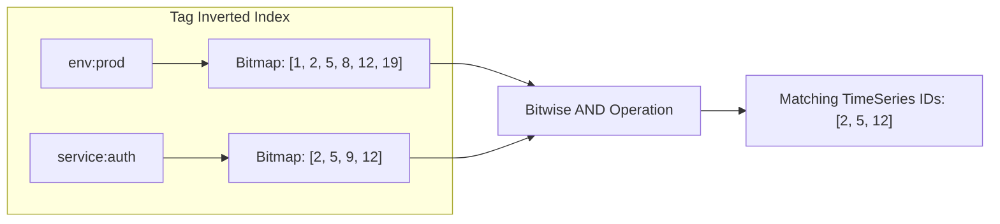

# 11. Design a Distributed Metrics & Telemetry System (Datadog / Prometheus)

[← Back to Distributed Web Crawler](./10-design-a-distributed-web-crawler-google-search.md) | [Track Hub](./README.md) | [Next: Design a Collaborative Document Editor →](./12-design-a-collaborative-real-time-document-editor-google-docs.md)

---

## 🏛️ 1. Requirements & System Scope

Enterprise distributed architectures rely on telemetry infrastructure to collect, store, and alert on system metrics (CPU, RAM, request latency, error rates, custom business counters) emitted across millions of containers and microservices.

### 1.1 Functional Requirements
1. **High-Throughput Ingestion:** Ingest time-series data points containing `(metric_name, timestamp, value, tags/labels)` from distributed agents.
2. **Metric Types:** Support Counters (monotonically increasing), Gauges (point-in-time values), and Histograms (latency distributions, p50/p95/p99 percentiles).
3. **Low-Latency Querying:** Provide fast dashboard rendering and metric querying across arbitrary label filters (e.g. `avg(cpu_usage){service="auth", env="prod"}`).
4. **Automated Alerting Engine:** Continuously evaluate threshold rules (e.g. `p99 latency > 500ms for 3 minutes`) and trigger webhooks/PagerDuty.
5. **Tiered Retention & Downsampling:** Retain raw 10-second data for 14 days, downsample to 1-minute rollups for 30 days, and 1-hour rollups for 1 year.

### 1.2 Non-Functional Requirements
- **Ultra-High Write Throughput:** Ingest $10\text{ Million}$ metric data points per second.
- **Query Latency SLA:** Dashboard read queries must return in $< 200\text{ms}$ for 99% of requests.
- **Extreme Compression:** Time-series data must be compressed by at least $10\times$ using specialized floating-point algorithms (Gorilla TSDB).
- **High Availability:** Ingestion pipeline must remain resilient during downstream storage compaction or network partitions.

---

## 🔢 2. Capacity & Scale Estimations

```
╭───────────────────────────────────────────────────────────────────────────────────────────╮
│                              BACK-OF-THE-ENVELOPE SCALE MATH                              │
├───────────────────────────────┬───────────────────────────────┬───────────────────────────┤
│ Metric                        │ Raw Value                     │ Engineering Shorthand     │
├───────────────────────────────┼───────────────────────────────┼───────────────────────────┤
│ Write Ingestion Rate          │ 10 Million points / second    │ 10M QPS                   │
│ Peak Write Ingestion (2x)     │ 20 Million points / second    │ 20M QPS                   │
│ Uncompressed Point Size       │ 40 bytes (Name + Time + Val)  │ 40 Bytes                  │
│ Uncompressed Daily Volume     │ 10M/s × 40B × 86,400s         │ ~34.5 TB / day            │
│ Gorilla TSDB Compression      │ ~10x to 12x reduction         │ ~1.37 bits/ts + ~1B/float │
│ Compressed Daily Storage      │ 34.5 TB / 10                  │ ~3.45 TB / day (1.2 PB/yr)│
│ Hot In-Memory Buffer (2 hrs)  │ 2 hours compressed data       │ ~288 GB RAM cluster       │
╰───────────────────────────────┴───────────────────────────────┴───────────────────────────╯
```

---

## 🏗️ 3. High-Level Architecture



---

## 🧬 4. Gorilla TSDB Compression Mechanics (Meta Gold Standard)

A raw telemetry data point contains an 8-byte Unix timestamp and an 8-byte IEEE 754 floating-point value (total 16 bytes). Gorilla compression reduces this to an average of **1.37 bytes per point**:

```
╭───────────────────────────────────────────────────────────────────────────────────────────╮
│                              THE GORILLA COMPRESSION ALGORITHMS                           │
├───────────────────────────────────────────────────────────────────────────────────────────┤
│ 1. Timestamp Delta-of-Delta:                                                              │
│    Most metrics arrive at regular intervals (e.g. exactly every 10 seconds).              │
│    D = (T_now - T_prev) -> If interval is constant, Delta-of-Delta (D - D_prev) = 0!      │
│    - If Delta-of-Delta is 0: Store a SINGLE bit: '0'.                                     │
│    - If between -63 and 64: Store '10' + 7 bits.                                          │
│    - If between -255 and 256: Store '110' + 9 bits.                                       │
│    - Otherwise: Store '1111' + 32 bits.                                                   │
│    RESULT: Over 96% of timestamps compress to 1 single bit!                               │
├───────────────────────────────────────────────────────────────────────────────────────────┤
│ 2. Floating-Point Value XOR Compression:                                                  │
│    Consecutive metric values rarely change drastically (e.g. CPU: 42.1% -> 42.2%).        │
│    Compute XOR between current float and previous float (curr ^ prev).                    │
│    - If XOR is 0 (identical value): Store a SINGLE bit: '0'.                              │
│    - If non-zero: Store '1', followed by control bits recording the number of leading and │
│      trailing zeroes, and store only the meaningful variable bits.                        │
│    RESULT: Average float compressed from 64 bits to ~8 bits!                              │
╰───────────────────────────────────────────────────────────────────────────────────────────╯
```

---

## 🔍 5. High-Cardinality Indexing: Roaring Bitmaps

A critical challenge in modern metrics systems is **High Cardinality** (millions of unique metric label combinations, such as `user_id`, `container_id`, `ip_address`).



- Each unique time-series stream is assigned an internal 32-bit `SeriesID`.
- An **Inverted Index** maps each `tag_key=tag_value` pair to a **Roaring Bitmap** containing the list of matching `SeriesID`s.
- Multi-tag queries (e.g. `service="auth" AND env="prod"`) evaluate via hardware-accelerated **Bitwise AND** instructions across Roaring Bitmaps in $< 5\text{ms}$.

---

## ⚖️ 6. Ingestion Paradigm: Pull (Prometheus) vs. Push (Datadog)

| Dimension | Pull Model (Prometheus) | Push Model (Datadog / Graphite) |
| :--- | :--- | :--- |
| **Architecture** | Central server scrapes `/metrics` HTTP endpoints on targets | Agents periodically POST metrics to central Ingestion Gateway |
| **Network Security** | Requires inbound firewall access into application pods | Outbound HTTPS only (easier for locked-down VPCs) |
| **Autoscaling & Ephemeral** | Struggles with short-lived jobs (serverless lambdas disappear before scrape) | Ideal for ephemeral, batch, and serverless architectures |
| **Overload Protection** | Server controls crawl rate; cannot be DoS'd by rogue agents | Central ingestion gateway must enforce rate limits and Kafka buffering |
| **Industry Usage** | Kubernetes cluster-internal monitoring | Multi-cloud, enterprise SaaS, and hybrid cloud infrastructures |

---

<div align="center">

| [← Back to Distributed Web Crawler](./10-design-a-distributed-web-crawler-google-search.md) | [Track Hub: HLD](./README.md) | [Next: Design a Collaborative Document Editor →](./12-design-a-collaborative-real-time-document-editor-google-docs.md) |
| :--- | :---: | ---: |

</div>
