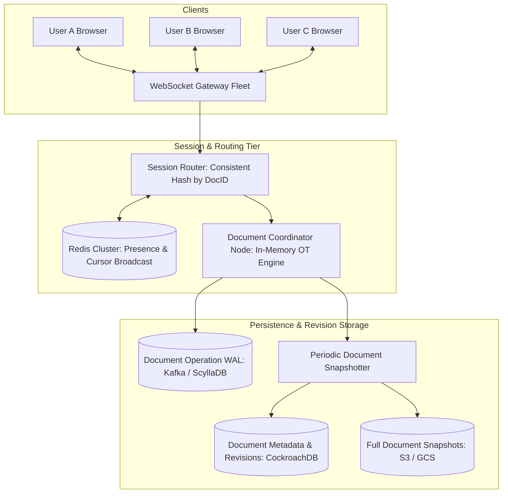
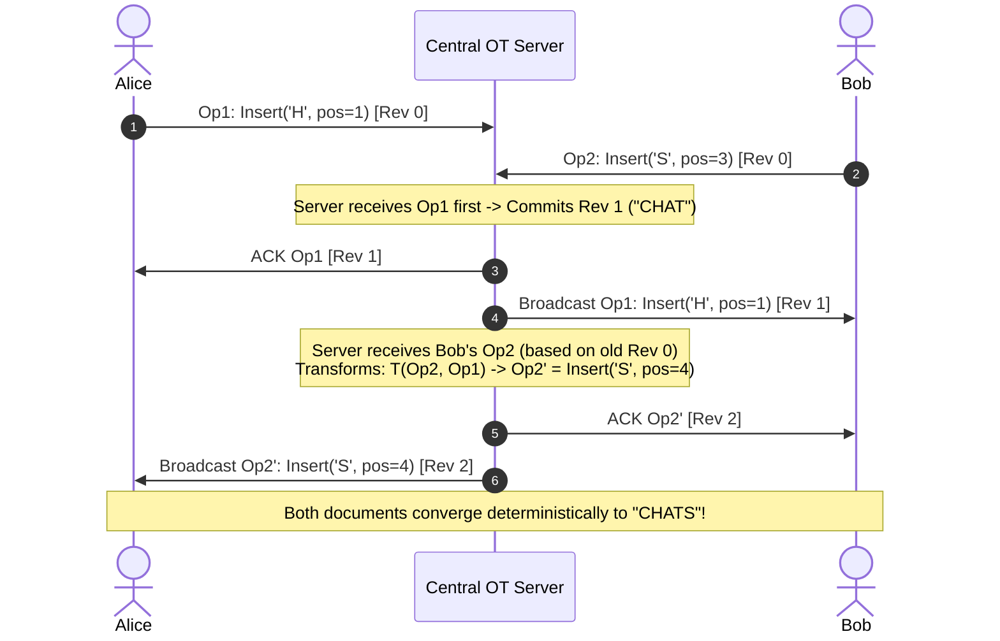

# 12. Design a Collaborative Real-Time Document Editor (Google Docs / Notion)

[← Back to Distributed Metrics System](./11-design-a-distributed-metrics-and-telemetry-system-datadog.md) | [Track Hub](./README.md) | [Next: Design a Proximity & Nearby Search Service →](./13-design-a-proximity-and-nearby-search-service-yelp-maps.md)

---

## 🏛️ 1. Requirements & System Scope

Collaborative real-time document editors allow multiple distributed users to simultaneously read, type, delete, and format text within the identical document, observing each other's edits with sub-100ms latency without race conditions or corrupted character states.

### 1.1 Functional Requirements
1. **Real-Time Concurrent Multi-User Editing:** Thousands of users can edit the same document concurrently with zero lost updates.
2. **Conflict Resolution:** Operations occurring simultaneously at the identical position must resolve deterministically across all client views.
3. **Cursor & Selection Presence:** Real-time visual broadcast of collaborators' cursor positions and text selections.
4. **Local Undo / Redo:** A user undoing an edit must revert only *their own* previous actions without reverting other users' concurrent edits.
5. **Offline Support & Reconnection Sync:** Edits made while disconnected must merge gracefully upon network reconnection.

### 1.2 Non-Functional Requirements
- **Sub-100ms Perceived Latency:** Local typing must be instantaneous (optimistic client updates) with remote updates reflected in $< 100\text{ms}$.
- **Strict Convergence:** All clients viewing document $D$ must eventually render the exact identical sequence of characters once all operations are applied.
- **High Concurrency:** Support up to 5,000 concurrent active editors on a single viral document.

---

## 🔢 2. Capacity & Scale Estimations

```
╭───────────────────────────────────────────────────────────────────────────────────────────╮
│                              BACK-OF-THE-ENVELOPE SCALE MATH                              │
├───────────────────────────────┬───────────────────────────────┬───────────────────────────┤
│ Metric                        │ Raw Value                     │ Engineering Shorthand     │
├───────────────────────────────┼───────────────────────────────┼───────────────────────────┤
│ Daily Active Users (DAU)      │ 50 Million DAU                │ 50M DAU                   │
│ Concurrent Active Editors     │ 5 Million concurrent users    │ 5M Connections            │
│ Keystroke Frequency           │ 3 keystrokes / sec per user   │ 3 ops / second            │
│ Ingestion Operation Rate      │ 5M users × 3 ops/sec          │ 15 Million ops / sec peak │
│ Operation Payload Size        │ 50 bytes (DocID, Op, Pos, Char│ 50 Bytes                  │
│ Ingress Bandwidth             │ 15M ops/s × 50 bytes          │ 750 MB/s (6 Gbps)         │
│ WebSocket Connection Memory   │ 5M connections × 10 KB        │ 50 GB RAM cluster         │
╰───────────────────────────────┴───────────────────────────────┴───────────────────────────╯
```

---

## 🏗️ 3. High-Level Architecture



---

## 🧬 4. Core Conflict Resolution: OT vs. CRDTs

The fundamental challenge of collaborative editing is **Non-Commutative Character Shifts**:
If the document currently reads `"CAT"`, and Alice inserts `'H'` at index 0 (producing `"CHAT"`), while Bob concurrently inserts `'S'` at index 3 (aiming for `"CATS"`), applying Bob's operation verbatim on Alice's client would insert `'S'` at index 3, producing `"CHAST"` (corrupted state).

```
╭───────────────────────────────────────────────────────────────────────────────────────────╮
│                        OPERATIONAL TRANSFORMATION (OT) vs. CRDTs                          │
├───────────────────────────────┬───────────────────────────────┬───────────────────────────┤
│ Dimension                     │ Operational Transformation    │ CRDTs (Conflict-Free Data)│
│                               │ (Used by: Google Docs)        │ (Used by: Figma, Notion)  │
├───────────────────────────────┼───────────────────────────────┼───────────────────────────┤
│ Topology                      │ Centralized (Server-mediated) │ Decentralized (P2P/Server)│
│ Operation Transformation      │ Shifts indices dynamically    │ Unique fractional IDs     │
│                               │ based on server revision logs │ (e.g. pos between 1 and 2)│
│ Memory Overhead               │ Zero extra memory per char    │ High (UUID + Vector Clock │
│                               │ (Plain text strings)          │ per character in memory)  │
│ Mathematical Complexity       │ High ($T(O_a, O_b)$ matrix)   │ Low (Mathematically       │
│                               │                               │ proven Commutative Monoid)│
│ Offline Editing Sync          │ Complex multi-op re-basing    │ Trivial automatic merge   │
╰───────────────────────────────┴───────────────────────────────┴───────────────────────────╯
```

### 4.1 Operational Transformation (OT) Algorithm Flow



---

## ⚡ 5. Collaborative Undo / Redo Architecture

In a single-user application, undo simply pops the previous operation from a stack. In collaborative editing, this destroys data:
- If Alice types `"ABC"`, Bob types `"XYZ"`, and Alice hits **Undo**, a naive stack pop would delete Bob's `"XYZ"`.

**The Selective Inversion Algorithm:**
1. Each client maintains an isolated **Private Undo Stack** containing only operations authored by that user.
2. When the user invokes **Undo**, pop the target operation $O_{\text{target}}$ and compute its inverse $O_{\text{inverse}}$ (e.g., `Insert('A', 5)` $\to$ `Delete(5)`).
3. **Critical Step:** The inverse operation must be transformed against **all intervening operations** (both remote operations from other users and local operations) executed since $O_{\text{target}}$ occurred.
4. The transformed inverse operation $O_{\text{inverse}}'$ is applied locally and transmitted to the server as a brand new forward edit.

---

## 🛡️ 6. Edge Cases & Resilience Mechanisms

| Failure Mode / Edge Case | System Impact | Architectural Mitigation |
| :--- | :--- | :--- |
| **Network Disconnection / Reconnection** | Client disconnected for 2 hours attempts to sync 500 local edits | Client buffers local edits. Upon reconnect, fetches all server ops since last known revision, runs batch OT re-base, and uploads transformed bundle. |
| **Viral Document (5,000 Concurrent Editors)** | WebSocket fan-out creates $5,000 \times 15\text{ ops/sec} = 75,000\text{ msgs/sec}$ bottleneck | Micro-batching: Buffer client keystrokes into 50ms intervals. Decouple typing sync (sent via low-latency binary WebSockets) from full text snapshots. |
| **Massive Paste Event (100,000 Chars)** | Giant payloads stall serialization threads | Client sends a chunked block insert pointer; server converts bulk paste into a composite chunk node in the rope data structure. |
| **Document Coordinator Crash** | In-memory OT state lost during failover | Document coordinator writes all transformed ops to an append-only Kafka commit log before client ACK. Standby coordinator recovers state in $< 500\text{ms}$. |

---

<div align="center">

| [← Back to Distributed Metrics System](./11-design-a-distributed-metrics-and-telemetry-system-datadog.md) | [Track Hub: HLD](./README.md) | [Next: Design a Proximity & Nearby Search Service →](./13-design-a-proximity-and-nearby-search-service-yelp-maps.md) |
| :--- | :---: | ---: |

</div>
