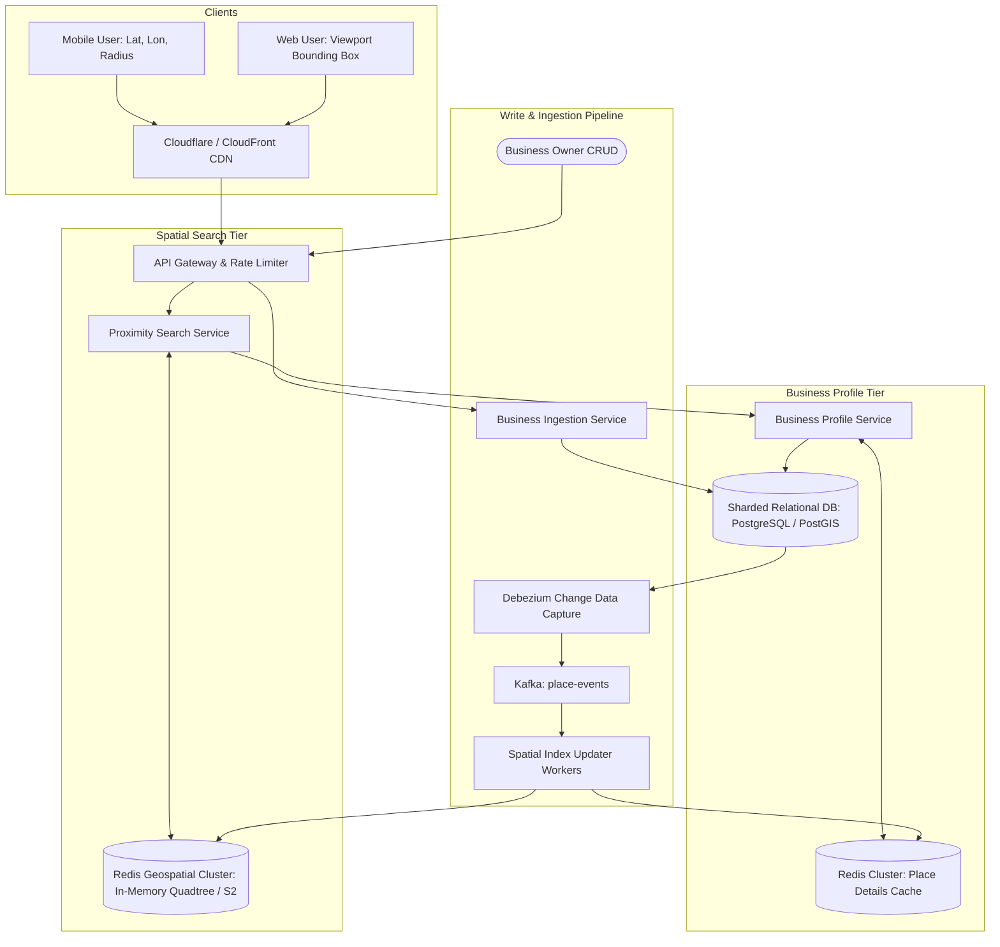
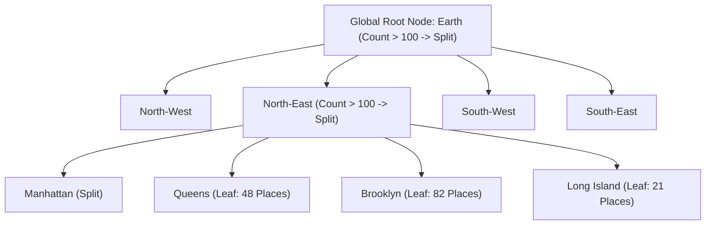

# 13. Design a Proximity & Nearby Search Service (Yelp / Google Maps)

[← Back to Collaborative Document Editor](./12-design-a-collaborative-real-time-document-editor-google-docs.md) | [Track Hub](./README.md) | [Next: Distributed Vector Database →](./14-design-a-distributed-vector-database-pinecone-milvus.md)

---

## 🏛️ 1. Requirements & System Scope

A proximity search service (Yelp, Google Places, TripAdvisor) enables users to discover nearby points of interest (restaurants, cafes, gas stations) given a geographic coordinate (latitude, longitude) and a search radius, sorted by distance, rating, or relevance.

### 1.1 Functional Requirements
1. **Nearby Place Discovery:** Search businesses within a given radius $R$ of coordinate $(\text{lat}, \text{lon})$ with sub-50ms latency.
2. **Filtering & Ranking:** Filter by category (e.g. `Italian`, `Coffee`), operating status (`Open Now`), and price; rank by distance or rating.
3. **Business Management (CRUD):** Business owners can add, update, or remove business profiles, operating hours, and locations.
4. **Interactive Map Exploration:** Support smooth viewport bounding-box queries as users pan and zoom on maps.

### 1.2 Non-Functional Requirements
- **High Read-to-Write Ratio:** Heavy read bias ($100:1$ to $500:1$ read vs. write ratio).
- **Sub-50ms p99 Query Latency:** Real-time mobile searches must execute instantaneously.
- **High Availability & Fault Tolerance:** Failure of a search node must not degrade search availability.
- **Adaptive Density:** Seamlessly handle extreme density variations (Manhattan with 50,000 businesses per $\text{km}^2$ vs. rural Montana with 1 business per $100\text{ km}^2$).

---

## 🔢 2. Capacity & Scale Estimations

```
╭───────────────────────────────────────────────────────────────────────────────────────────╮
│                              BACK-OF-THE-ENVELOPE SCALE MATH                              │
├───────────────────────────────┬───────────────────────────────┬───────────────────────────┤
│ Metric                        │ Raw Value                     │ Engineering Shorthand     │
├───────────────────────────────┼───────────────────────────────┼───────────────────────────┤
│ Global Business Volume        │ 200 Million places worldwide  │ 200M Places               │
│ Daily Search Queries          │ 500 Million searches / day    │ ~6,000 QPS average        │
│ Peak Search Traffic (2.5x)    │ 15,000 QPS peak               │ 15,000 QPS                │
│ Place Metadata Payload        │ 1 KB per business             │ 1 KB                      │
│ Total Metadata Storage        │ 200M × 1 KB                   │ 200 GB (Fits in RAM!)     │
│ Spatial Index Memory (Quadtree│ ~50 bytes per leaf entry      │ ~10 GB RAM cluster        │
╰───────────────────────────────┴───────────────────────────────┴───────────────────────────╯
```

---

## 🏗️ 3. High-Level Architecture



---

## 🗺️ 4. Geospatial Indexing: The 4 Industry Paradigms

Traditional SQL indexing on 2D coordinates fails at scale:
`SELECT * FROM places WHERE lat BETWEEN y1 AND y2 AND lon BETWEEN x1 AND x2` requires intersecting two independent 1D B-Tree indexes, scanning millions of row pointers.

```
╭───────────────────────────────────────────────────────────────────────────────────────────╮
│                              THE 4 SPATIAL INDEXING PARADIGMS                             │
├───────────────────┬───────────────────────────────────┬───────────────────────────────────┤
│ Index Paradigm    │ Core Data Structure               │ Strengths & Trade-offs            │
├───────────────────┼───────────────────────────────────┼───────────────────────────────────┤
│ 1. Geohashing     │ Base-32 String (Z-order curve)    │ Fast prefix search in KV stores.  │
│                   │ Interleaves lat/lon bitwise       │ Edge flaw: adjacent cells can     │
│                   │                                   │ have totally different prefixes!  │
├───────────────────┼───────────────────────────────────┼───────────────────────────────────┤
│ 2. Quadtree       │ Hierarchical 4-way 2D tree        │ Dynamically splits dense cities   │
│                   │ (NW, NE, SW, SE)                  │ into tiny cells; leaves rural     │
│                   │                                   │ areas large. Highly optimal in RAM│
├───────────────────┼───────────────────────────────────┼───────────────────────────────────┤
│ 3. Google S2      │ Hilbert Space-Filling Curve       │ Maps Earth surface onto projected │
│                   │ on 6 cube faces (64-bit cell IDs) │ cube. Superior mathematical       │
│                   │                                   │ preservation of 2D proximity.     │
├───────────────────┼───────────────────────────────────┼───────────────────────────────────┤
│ 4. Uber H3        │ Hexagonal Hierarchical Tesselation│ Every hexagon has exactly 6       │
│                   │ (7 hexagons per parent)           │ equidistant neighbors. Zero       │
│                   │                                   │ diagonal distortion (Best for ride│
│                   │                                   │ hailing & delivery radii).        │
╰───────────────────┴───────────────────────────────────┴───────────────────────────────────╯
```

---

## 🌲 5. In-Memory Quadtree Dynamic Partitioning

A **Quadtree** decomposes two-dimensional space by recursively subdividing regions into four equal quadrants whenever the population of a quadrant exceeds a maximum capacity (e.g. $K = 100$ places):



### 5.1 Search Traversal Algorithm
1. Start at the Root of the Quadtree.
2. Check if the query bounding box (centered at `user_lat, user_lon` with radius $R$) intersects the quadrant's boundary.
3. If it intersects:
   - If the quadrant is a **Leaf Node**, scan its place list, calculate exact Haversine distance, and append qualifying places to the candidate set.
   - If the quadrant is an **Internal Node**, recursively visit its 4 children.
4. Stop traversal when candidate set matches desired top-K results, and sort by distance/rating.

---

## 🛡️ 6. Edge Cases & Resilience Mechanisms

| Failure Mode / Edge Case | System Impact | Architectural Mitigation |
| :--- | :--- | :--- |
| **Geohash Boundary Edge Defect** | Two coffee shops 10 meters apart sit on opposite sides of a Geohash boundary | **8-Neighbor Expansion:** Always query the center geohash cell PLUS all 8 surrounding neighbor cells in parallel. |
| **Dense Hotspots (Times Square)** | Thousands of places within 100 meters | Hard limit leaf quadtree depth ($D_{\max} = 18$). Enforce database pagination and return top-20 nearest matches. |
| **Sparse Wilderness Query** | User searches in Sahara Desert; 5km radius yields 0 results | **Adaptive Radius Expansion:** If candidate count $< 5$, exponentially expand radius ($5\text{km} \to 15\text{km} \to 50\text{km}$) using parent quadtree nodes. |
| **Quadtree Server Crash** | In-memory spatial index wiped on node failure | Keep spatial index stateless. Nodes rebuild quadtrees from read-only S3 memory snapshots in $< 15\text{ seconds}$ on startup. |

---

<div align="center">

| [← Back to Collaborative Document Editor](./12-design-a-collaborative-real-time-document-editor-google-docs.md) | [Track Hub: HLD](./README.md) | [Next: Distributed Vector Database →](./14-design-a-distributed-vector-database-pinecone-milvus.md) |
| :--- | :---: | ---: |

</div>
