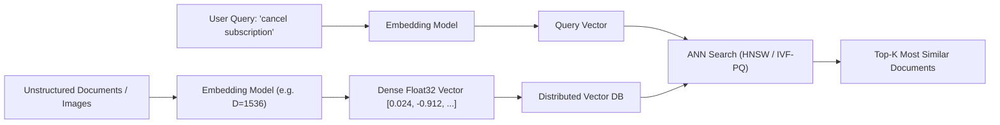
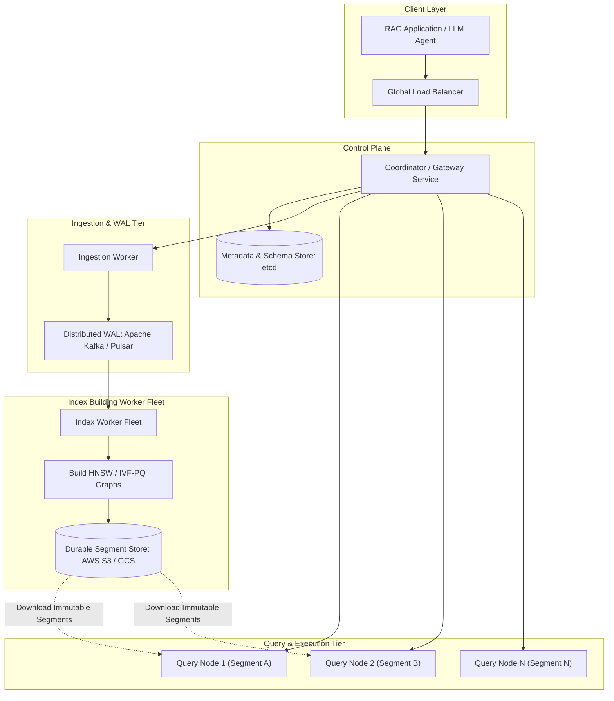
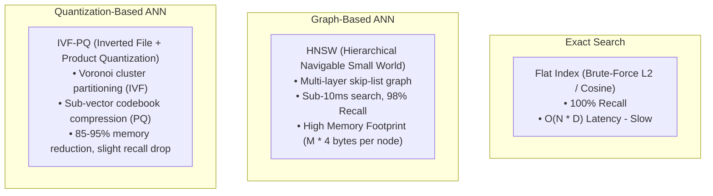

# 14. Design a Distributed Vector Database for AI/RAG (Pinecone / Milvus)

[← Back to Proximity & Nearby Search](./13-design-a-proximity-and-nearby-search-service-yelp-maps.md) | [Track Hub](./README.md) | [Next: Payment Gateway & Ledger →](./15-design-a-high-throughput-payment-gateway-and-ledger-stripe.md)

---

## 🏛️ 1. Requirements & System Scope

A distributed vector database is specialized storage engineered to ingest, index, and query billions of high-dimensional vector embeddings generated by machine learning models (e.g., OpenAI `text-embedding-3`, CLIP, BERT). It serves as the primary external memory for Retrieval-Augmented Generation (RAG), semantic search, recommendation engines, and anomaly detection.



### 1.1 Functional Requirements
1. **High-Dimensional Vector Ingestion:** Upsert vectors with dimensions $D \in [128, 3072]$ alongside arbitrary JSON metadata (e.g., `user_id`, `created_at`, `category`).
2. **Approximate Nearest Neighbor (ANN) Search:** Given a query vector $Q$ and target $K$, return the $K$ vectors having the highest similarity score (Cosine Similarity, Euclidean Distance $L2$, or Inner Product $IP$) in $< 20\text{ms}$.
3. **Hybrid Filtered Search:** Support single-stage filtered search combining vector similarity with scalar predicates (e.g., `category == 'finance' AND price < 50`).
4. **Dynamic CRUD & Real-Time Visibility:** Allow real-time mutations (inserts, updates, deletes) without requiring full offline index rebuilds.
5. **Collection & Multi-Tenancy Management:** Isolate collections or namespaces per tenant with strict quota enforcement.

### 1.2 Non-Functional Requirements
- **Low Query Latency:** Sub-20ms p99 search latency for Top-$K$ ($K=100$) over 100M+ vectors.
- **High Recall Rate:** Recall@100 $\ge 95\%$ compared to brute-force exact $k\text{-NN}$.
- **Horizontal Scalability:** Scale to 10+ billion vectors through automated sharding and segment management.
- **Memory Efficiency:** Exploit vector quantization (Product Quantization, Scalar Quantization) to slash RAM requirements by $75\text{--}90\%$.
- **High Availability & Durability:** 99.99% availability with write-ahead logging (WAL) backed by object storage.

---

## 🔢 2. Capacity & Scale Estimations

```
╭───────────────────────────────────────────────────────────────────────────────────────────╮
│                              BACK-OF-THE-ENVELOPE SCALE MATH                              │
├───────────────────────────────┬───────────────────────────────┬───────────────────────────┤
│ Metric                        │ Raw Value                     │ Engineering Shorthand     │
├───────────────────────────────┼───────────────────────────────┼───────────────────────────┤
│ Total Vectors Stored          │ 100 Million vectors           │ 100M Vectors              │
│ Vector Dimensions ($D$)       │ 1,536 float32 dimensions      │ 1,536 floats              │
│ Raw Vector Payload            │ 1,536 × 4 bytes               │ 6,144 bytes (~6 KB)       │
│ Raw Storage Required          │ 100M × 6 KB                   │ 600 GB raw vectors        │
│ HNSW Graph Overhead (M=32)    │ ~1.5x raw vector size         │ ~900 GB RAM required      │
│ Quantized Memory (IVF-PQ 8x)  │ 600 GB / 8                    │ ~75 GB RAM (Fits on 1 node)│
│ Search Query QPS              │ 5,000 queries / second peak   │ 5,000 QPS                 │
│ Ingestion Throughput          │ 10,000 upserts / second       │ 10,000 UPS                │
╰───────────────────────────────┴───────────────────────────────┴───────────────────────────╯
```

---

## 🏗️ 3. High-Level Architecture



### Component Breakdown
1. **Coordinator Service:** Authenticates requests, coordinates distributed queries, performs map-reduce scatter-gather over query nodes, and merges Top-$K$ candidate lists.
2. **Write-Ahead Log (WAL):** Sequences upsert mutations durably in Kafka/Pulsar to guarantee zero data loss upon crash.
3. **Query Nodes:** Hold memory-mapped immutable vector index segments (HNSW / IVF-PQ) in RAM; execute parallel similarity searches and scalar filtering.
4. **Index Workers:** Background microservices that consume raw vector batches from the WAL, assemble immutable segments, build spatial index graphs (HNSW), and flush them to object storage.
5. **Durable Segment Storage:** Cloud object storage (S3/GCS) holding finalized immutable column files and vector index segments.

---

## 🔬 4. Deep-Dive: ANN Indexing Algorithms



### 4.1 HNSW (Hierarchical Navigable Small World)
HNSW builds a multi-layer graph where upper layers contain sparse long-range highway edges (analogous to a skip list) and the bottom layer ($L_0$) contains a dense graph connecting nearest neighbors:
- **Search Process:** Search begins at the entry point of the top layer. The algorithm greedily routes to the neighbor closest to query vector $Q$. When a local minimum is reached, search drops to the next layer down. At layer $L_0$, beam search explores $efSearch$ candidates to return Top-$K$.
- **Complexity:** $O(\log N)$ search time.

### 4.2 IVF-PQ (Inverted File + Product Quantization)
1. **IVF (Inverted File):** Divides vector space into $C$ Voronoi cells using $k$-means clustering. A query vector only compares against vectors within the $nProbe$ closest centroids, skipping $>95\%$ of the database.
2. **PQ (Product Quantization):** Splits a $D=1536$ vector into $M=64$ sub-vectors of dimension $d^* = 24$. Each sub-vector is mapped to the nearest centroid index (1 byte) from a learned codebook. Reduces a 6 KB vector to 64 bytes!
3. **Asymmetric Distance Computation (ADC):** Computes distances between unquantized query vector and quantized database codes via fast lookup tables, maximizing speed.

---

## 🎯 5. Filtered Vector Search: Pre vs. Post vs. Single-Stage

| Filtering Strategy | Execution Workflow | Pros | Cons / Failure Modes |
| :--- | :--- | :--- | :--- |
| **Post-Filtering** | Run ANN search for $K \times M$ candidates $\to$ discard items failing metadata filter | Fast, uses unmodified vector index | **Recall Collapse:** If filter matches $< 1\%$ of data, all $K$ candidates may be discarded, returning 0 results. |
| **Pre-Filtering** | Query scalar DB for all matching IDs $\to$ run brute-force search over results | 100% accurate filtering | Slow when filter matches millions of IDs ($O(N_{\text{filtered}} \times D)$). |
| **Single-Stage Bitset Filtered ANN (Modern)** | Construct in-memory roaring bitset of qualifying document IDs $\to$ traverse HNSW graph, skipping non-matching nodes during graph traversal | Optimal performance; guaranteed $K$ results with zero recall collapse | Requires custom graph traversal engine aware of bitset masks. |

---

## 🛡️ 6. Edge Cases & Resilience Mechanisms

| Failure Mode / Edge Case | System Impact | Architectural Mitigation |
| :--- | :--- | :--- |
| **High Write Churn Stalls** | Adding vectors dynamically to an active HNSW graph corrupts search or causes GC pauses | **LSM-Tree Inspired Segments:** Buffer new writes into an in-memory mutable memtable. Periodically flush to immutable read-only segments and merge via background compaction. |
| **Memory Exhaustion (OOM)** | 500M vectors exceed cluster RAM | **DiskANN / Vamana Hybrid Index:** Store compressed PQ vectors and graph layouts directly on high-speed NVMe SSDs; load only the top-layer navigation graph into RAM. |
| **Curse of Dimensionality** | In high dimensions ($D > 1000$), distance to nearest neighbor approaches distance to farthest neighbor | Enforce dimension reduction (PCA / Autoencoders) or normalize vectors to unit length and use Cosine/Inner Product instead of raw Euclidean. |
| **Query Hotspots (Celebrity Embedding)** | Thousands of identical queries hit the same cluster node | Implement semantic query caching: cache query vector hashes in Redis with approximate vector distance threshold ($\tau \le 0.01$). |

---

<div align="center">

| [← Back to Proximity & Nearby Search](./13-design-a-proximity-and-nearby-search-service-yelp-maps.md) | [Track Hub: HLD](./README.md) | [Next: Payment Gateway & Ledger →](./15-design-a-high-throughput-payment-gateway-and-ledger-stripe.md) |
| :--- | :---: | ---: |

</div>
